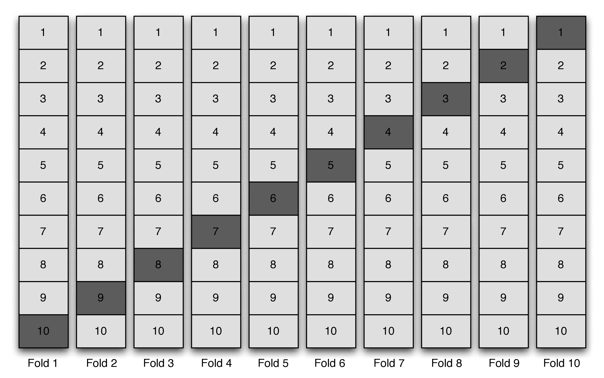
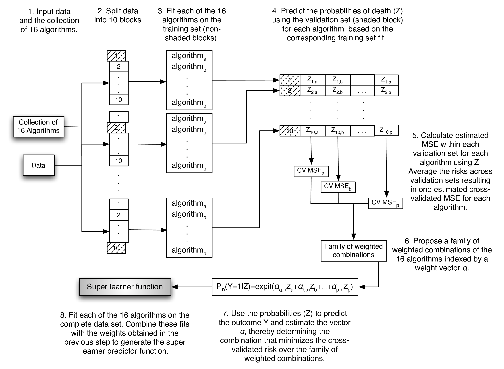
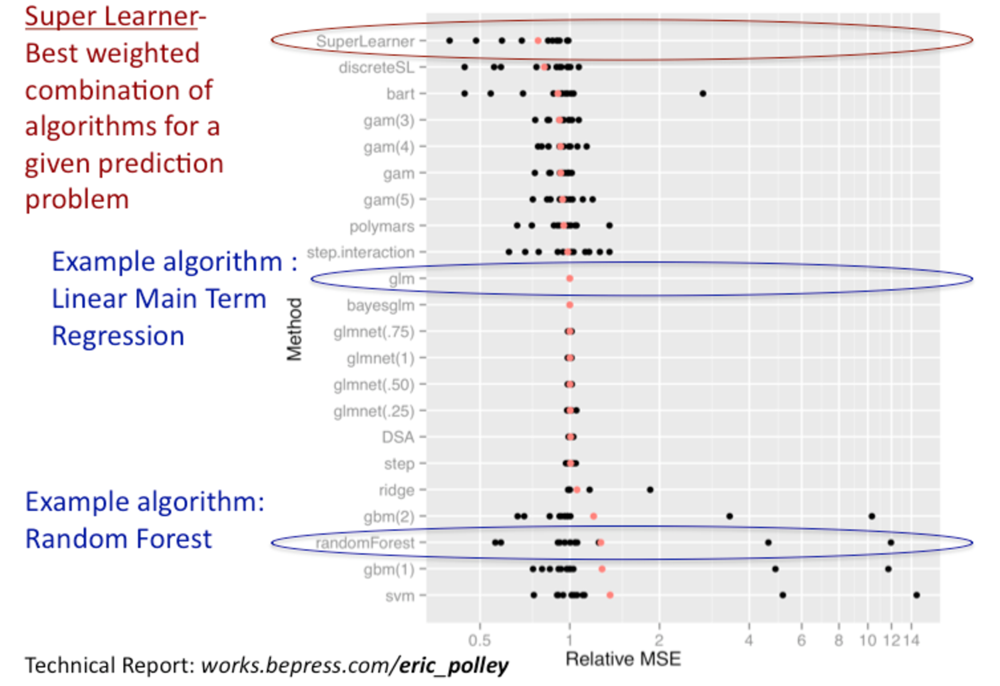

---
output:
  pdf_document: default
  html_document: default
---

# Super (Machine) Learning {#sl3}

_Rachael Phillips_

Based on the [`sl3` `R` package](https://github.com/tlverse/sl3) by _Jeremy
Coyle, Nima Hejazi, Ivana Malenica, Rachael Phillips, and Oleg Sofrygin_.

Updated: `r Sys.Date()`

## Learning Objectives{-}

By the end of this chapter you will be able to:

1. Select an objective function that (i) aligns with the intention of the 
   analysis and (ii) is optimized by the target parameter.
2. Assemble a diverse library of learners to be considered in the Super Learner 
   ensemble. In particular, you should be able to:
   
     a. Customize a learner by modifying it's tuning parameters.
     b. Create several different versions of the same learner at once by 
        specifying a grid of tuning parameters.
     c. Curate covariate screening pipelines in order to pass a screener's 
        output, a subset of covariates, as input for another learner that will 
        use the subset of covariates selected by the screener to model the data.
        
3. Specify the learner for ensembling (the metalearner) such that it corresponds 
   to your objective function. 
4. Fit the Super Learner ensemble with nested cross-validation to obtain an 
   estimate of the performance of the ensemble itself on out-of-sample data.
5. Obtain `sl3` variable importance metrics.
6. Interpret the fit for discrete and continuous Super Learners' from the 
   cross-validated risk table and the coefficients.
7. Justify the base library of machine learning algorithms and the ensembling 
   learner in terms of the prediction problem, statistical model $\M$, data 
   sparsity, and the dimensionality of the covariates. 
   
## Motivation {-}

- A common task in data analysis is prediction -- using the observed data (input 
  variables and outcomes) to learn a function that can map new input variables 
  into a predicted outcome.
  <!--
  Oftentimes, the scientific question of interest translates to a statistical
  question that requires (causal) effect estimation. Even in these scenarios,
  where prediction is not in the forefront, there are often prediction steps
  embedded in the procedure.
  --->
- For some data, algorithms that learn complex relationships between variables 
  are necessary to adequately model the data. For other data, main terms 
  regression models might fit the data quite well. 
- It is generally impossible to know a priori which algorithm will be the best 
  for a given data set and prediction problem. It's like picking the winner of 
  *The Great British Bake Off* at the start of the first week!
- The Super Learner solves this issue of algorithm selection by creating an
  ensemble of many algorithms, from the simplest (intercept-only) to most 
  complex (neural nets, tree-based methods, support vector machines, etc.).
- Super Learner works by using cross-validation in a manner that theoretically 
  (in large samples) guarantees the resulting fit will be as good as possible, 
  given the algorithms provided.

## Introduction

In [Chapter 1](#intro), we introduced the [_Roadmap for Targeted
Learning_](#roadmap) as a general template to translate real-world data
applications into formal statistical estimation problems. The first steps of
this roadmap define the *statistical estimation problem*, which establish

1. **The data \$O$ as a random variable, or equivalently, a realization of a** 
   **particular experiment/study, which has probability distribution $P_0$.** 
   This is written $O \sim P_0$, and $P_0$ is also commonly referred to as the 
   data-generating process (DGP) and also the data-generating distribution 
   (DGD). The data structure $O$ is comprised of variables, such as a 
   vector of covariates $W$, a treatment or exposure $A$, and an outcome $Y$, 
   $O=(W,A,Y) \sim P_0$. We often observe the random variable $O$ $n$ times, by 
   repeating the common experiment $n$ times. For example, $O_1,\ldots, O_n$ 
   random variables could be the result of a random sample of $n$ subjects from 
   a population, collecting baseline characteristics $W$, randomly assigning 
   treatment $A$, and then later measuring an outcome $Y$. 
2. **A statistical model $\M$ as a set of possible probability distributions** 
   **that could have given rise to the data.** It's essential for $\M$ to only 
   constrained by factual subject-matter knowledge in order to guarantee $P_0$ 
   resides in the statistical model, written $P_0 \in \M$. Continuing 
   the example from step 1, the following restrictions could be placed on the 
   statistical model: the $O_1, \ldots, O_n$ observations in the data are 
   independent and identically distributed (i.i.d.), the assignment of 
   treatment $A$ was random and not based on covariates $W$. 
3. **A translation of the scientific question of interest into a function of** 
   **$P_0$, the target statistical estimand $\Psi(P_0)$.** For example, we might 
   be interested in the average difference in mean outcomes under treatment 
   $A=1$ versus placebo $A=0$: 
   $\Psi(P_0)=E_{P_0}\Big[E_{P_0}(Y|A=1,W)−E_{P_0}(Y|A=0,W)\Big]$. Note 
   that, if the scientific question is causal, then it's translation will 
   produce a target *causal* estimand; another layer of translation, 
   identifiability, is required to express the target causal estimand as a 
   function of the observed data distribution $P_0$. See [causal target 
   parameters](#causal) for more information on causal quantities, causal models 
   and identifiability.

Once the statistical estimation problem has been established, then the estimator 
can be constructed. Estimators (also referred to as algorithms and learners) 
are functions that take as input the observed data, and return as output an 
estimate of $P_0$ or some feature of $P_0$ (such as a component of the target 
estimand). We will use the Super Learner (SL) algorithm to estimate a 
prediction function, and then we will use the SL estimator of the prediction 
function to predict outcomes from new input (e.g., covariate/predictor) data. 
Occasionally, the prediction function itself is the target estimand; more 
commonly, the prediction function is a component of a target estimand. 

Consider an example where we need to estimate the prediction function for 
$E_{P_0}(Y|A,W)$ (the conditional mean outcome, given treatment $A$ and 
baseline covariates $W$), so we can predict what the outcomes would have been 
under a hypothetical scenario where all subjects received treatment $A=1$. In
order for this estimator to output predictions that correspond to outcomes in 
a world where all subjects received treatment $A=1$, we would need to supply 
the estimator with input data that reflects it; specifically, the baseline 
covariate information $W$ would remain the same treatment as it is in the 
observed data, but the treatment $A$ would be set to 1 for all individuals, 
regardless of whether or not they actually received it. This learning paradigm 
corresponds to estimation of a component of the target statistical estimand 
mentioned in step 3 above, the $E_{P_0}(Y|A=1,W)$ component of $\Psi(P_0)$. 

There are various strategies that estimators can employ to model relationships 
from the observed data, and there is no "one fits all" algorithm in the realm
of real-world data science. However, the statistical performance of algorithms'
(e.g., mean squared error) can be used to compare them. Therefore, algorithm
selection should be driven criteria that have been (i) proven to optimize 
relevant statistical properties (e.g., provide theoretical guarantees) and (ii) 
shown to be reliable in practice (e.g., with complex real-world data). The SL 
is an algorithm that is equipped with such a standard, the cross-validation 
criterion, which ensures in large samples that the SL will perform atleast as 
well as the unknown best-performing candidate algorithm [@vdl2003unified; 
@vaart2006oracle; @vdl2007super]. Also, as an ensemble machine learning 
algorithm, SL leverages information learned from a variety of candidate 
algorithms by creating a weighted combination of 
them (i.e., metalearning). In summary, SL represents a practical approach for 
principled machine learning. It has been shown to be adaptive and robust, even 
in small samples [@polley2010super]. 


### Candidate Learners and Ensembling

The set of algorithms considering by the SL (also referred to as "library") 
should consist of those that align with what's known about the DGP and what is 
not known about the DGP. In other words, the learners in the library should 
be tailored to respect the statistical model $\mathcal{M}$, both in terms of 

1. the restrictions placed on $\mathcal{M}$, so the candidate algorithms 
   represent functions that align with the knowledge about the DGP, and 
2. the vastness of $\mathcal{M}$, so the library is able to adapt to a 
   diversity of possible forms for the DGP, which can be acheived by including 
   a variety of learning strategies (e.g., that range from parametric regression 
   models to multi-step algorithms involving screening covariates, 
   penalizations, optimizing tuning parameters, etc.)

#### Example: Respecting known bounds on the outcome
Suppose it is known that the outcome cannot take certain values, 
(e.g., the outcome is always a positive real number). The statistical model 
should be constrained to reflect these outcome bounds, and in order for the 
learners in the library to respect the statistical model, the learners should 
be constructed such that their predictions do not fall outside of the outcome 
bounds. For learners that allow link functions (e.g., generalized elastic-net 
regression models), different link functions can be chosen to match known 
outcome bounds. If a learner does not support link functions, or some other 
bounding criteria during model fitting, then there is a possibility that the 
learner will yield predictions that fall outside of known outcome bounds. In 
this scenario, the predictions that are not within known bounds could be 
truncated, which might be fine for learners that seldomly produce predictions 
that violate known outcome bounds. 

In general, the use of link function(s) is more sensible, since it formulates a 
model for the function that respects the statistical model, and then optimizes 
the fit in that model. The truncation option optimizes in a model that's too 
big, losing information, and then corrects ad hoc. However, it might be 
limiting to only include learners that support some desired link function 
(e.g., a library of several logistic regression models), since a diversity of 
possible DGPs might not be captured by this library. 

Recall that SL is a weighted combination of this library of candidate 
algorithms, and not all weighted combinations are created equally. In order to 
ensure that the SL has the same bounds on the predictions as the candidates in 
the library, SL's weighted combination should be a convex combination 
(i.e., weights are non-negative and sum to one). The most simple example of a 
convex combination would be the so-called "discrete SL" or 
"cross-validated selector", which uses a metalearner that assigns a weight of 
one to the *best* candidate algorithm in the library, and a weight of zero to 
all others (where *best* is described in step 4(a) in the [step-by-step 
overview](#sl3-theory) below). More flexible metalearners, 
like the default metalearner in `sl3`, are those that allow multiple algorithms 
to have nonzero weights and still enforce a convex combination. 

---
**Keep in mind**

The learners in the SL library and should be justified in terms of the prediction 
problem, statistical model $\M$, data sparsity (e.g., number of 
independent samples, number of events for rare binary outcomes), and the number 
of covariates. The metalearning strategy should be similarly justified.
---
  
### Fitting the Super Learner {#sl3-steps}

#### Cross-validation

- There are many different cross-validation schemes, which are designed to
  accommodate different study designs, data structures, and prediction
  problems. See [cross-validation](#causal) for more detail.

```{r cv_fig, fig.show="hold", echo = FALSE}

```
The figure above shows an example of $V$-fold cross-validation with $V=10$
folds, and this is the default cross-validation structure in the `sl3` `R` 
package. The darker boxes represent the so-called "validation data" and the 
lighter boxes represent the so-called "training data". The following details 
are important to notice: 

- Across all folds, there are $V$ (10) copies of the dataset. The only 
  difference between each copy is the coloring, which distinguishes the subset 
  of the data that's considered as the training data from the subset that's 
  considered as the validation data. 
- Within each fold 1/$V$ (1/10) of the data is the validation data.
- Across all folds, all of the data will be considered as validation data and 
  no observation will be included twice as validation data. Therefore, the 
  total number of validation data observations across all of the folds is 
  equal to the total number of observations in the data.

#### Step-by-step procedure with V-fold Cross-validation

1. Fit each learner (say there are $K$ learners) on the whole dataset. We refer
   to these learners that are trained on the whole dataset as "full-fit" 
   learners. 
2. Break up the data evenly into $V$ disjoint subsets. Separately, create 
   $V$ copies of the data. For each copy $v$, where $v=1,\ldots,V$, create the 
   $V$ folds by labelling the portion of the data that was included in subset 
   $v$ as the validation sample, and the labelling what's remaining of the data 
   as the training sample. 
3. For each fold $v$, $v=1,\ldots,V$, fit each learner (say there are $K$ 
   learners) on the training sample and predict the validation sample outcomes 
   by providing each fitted learner with the validation sample covariates as 
   input. Notice that each learner will be fit $V$ times. We refer to these 
   learners that are trained across the $V$ cross-validation folds as 
   "cross-validated fit" learners. 
4. Combine the validation sample predictions from all folds and all learners to 
   create the so-called $K$ column matrix of "cross-validated predictions". 
   This matrix is also commonly referred to as the $Z$ matrix. Notice that it 
   contains, for each learner, out-of-sample predictions for all of the 
   observations in the data. 
5. Train the metalearner (e.g., a non-negative least squares regression) on 
   data with predictors and outcomes being the $Z$ matrix and the observed data 
   outcomes, respectively. The metalearner --- just like any ordinary ML 
   algorithm --- estimates the parameters of it's model using the training data 
   and afterwards, the fitted model can be used to obtain predicted outcomes 
   from new input data. What's special about the metalearner is that it's 
   estimated model parameters (e.g., regression coefficients) correspond to 
   it's predictors, which are the variables in the $Z$ matrix, the $K$ learners' 
   predictions. Once the metalearner is fit, it can be used to obtain predicted 
   outcomes from new input data; that is, new $K$ learners predictions' can be 
   supplied to the fitted metalearner in order to obtain predicted outcomes.
6. The fitted metalearner and the full-fit learners define the weighted 
   combination of the $K$ learners, finalizing the Super Learner (SL) fit. To 
   obtain SL predictions the full-fit learners' predictions are first obtained 
   and then fed as input to the fitted metalearner; the metalearner's output 
   is the SL predictions. 

```{r cv_sl_alg, fig.show="hold", echo = FALSE}

```

<!--
Consider the scenario in which we have $n$ i.i.d. observations in the data. 
Also, let's say a total of $K$ learners are included the SL library. 

0. **Obtain candidate learner full-fits**. Fit each learner $k=1,\ldots,K$ on 
   the *whole* sample of $n$ observations to obtain $K$ learner "full-fits". 
   These $K$ full-fit learner predictions and the weights (also commonly referred to as 
   "coefficients"), which we derive in the following steps.
1. Create the validation data for the $V$ folds by breaking up the data evenly
   into $V$ disjoint subsets, such that no observation is contained in more 
   than one subset and each subset $v$ contains about the same number (roughly 
   $n/V$) observations.

    + If the data contain a rare binary outcome (or highly important binary 
      covariate, such as treatment/exposure), one should consider making the 
      prevalence of this binary outcome in the $V$ folds similar to the 
      prevalence that exists in the original data. This can be achieved 
      by populating the `strata_ids` argument in the `origami::make_folds()` 
      function with the vector of binary outcomes (or important binary 
      covariate). The returned list can then be passed as the `folds` argument 
      in the `sl3_Task`.
    + If the data contain clusters (e.g., repeated measures), then all 
      observations in the same cluster should be placed in the same fold. 
      This can be achieved by populating the `cluster_ids` argument in the 
      `origami::make_folds()` function with the vector of cluster identifiers. 
      The returned list can then be passed as the `folds` argument in the 
      `sl3_Task`.

2. For each fold $v$:

    a. Separate (i) from (ii):

        i. The data that was included in the disjoint subset for fold $v$ in step 
           1, which contains roughly $n/V$ total observations. We will refer to 
           this portion of the data as fold $v$'s "validation" data, and 
           $n_{\text{validation}}$ as the number of observations in the 
           validation data in the $v^{\text{th}}$ fold. 
          
        ii. The data that was *not* included in the disjoint subset for fold $v$ 
            in step 1, which contains $n - n_{\text{validation}}$ total 
            observations. We will refer to this portion of the data as fold 
            $v$'s "training" data, and $n_{\text{training}}$ as the number of 
            observations in the training data for the $v^{\text{th}}$ fold.
          
    b. Fit each of the $K$ learners on the training data (ii) to obtain $K$ 
       estimators of the prediction function. Here, each $k$ learner employs 
       their various strategies to map the training data, consisting of 
       $n_{\text{training}}$ records with input variables (covariates) and an 
       output variable (outcome), into a prediction function. 
    c. Use the $K$ trained learners created in the previous step to map the 
       validation data covariates, which represent a new set of input variables, 
       into predicted outcomes. This results in an 
       $n_{\text{validation}} \times K$ matrix of so-called 
       "cross-validated predictions". Since the $K$ estimators were not trained 
       using the validation data's outcomes, the predictions based on the 
       validation data's covariate information can be used as a fair means to 
       evaluate the performance of the $K$ estimators.

 3. Bind together the rows of all $V$ $n_{\text{validation}} \times K$ matrices 
    of cross-validated predictions, to obtain an $n \times K$ matrix of
    cross-validated predictions. This $n \times K$ matrix of cross-validated 
    predictions is often referred to as the "level-one" or "$Z$" 
    dataset or matrix.
 4. Construct the so-called "meta-level" dataset of $n$ observations by binding 
    the $n \times K$ matrix of cross-validated predictions $Z$ with the 
    $n \times 1$ vector of observed outcomes $Y$, $(Z_i, Y_i)$, $i=1,\ldots,n$. 
 5. Use the meta-level dataset created above as the training data to fit the 
    so-called "metalearner" $m$, an algorithm that estimates the ensemble 
    (weighted combination) of the $K$ candidate algorithms. A metalearner is 
    the same as any other algorithm -- it maps the training data, consisting of 
    both input and output variables, into a prediction function that can be used 
    to map (possibly new) input into a predicted outcome; also, the fitted 
    model parameters (such as linear regression coefficients) are estimates that 
    optimize some objective function (such as mean squared error). What's 
    special about the metalearner is that it learns from non-traditional input 
    variables, the $K$ learners predictions', so it's estimated parameters are 
    applied to that input. The metalearner's parameters are often referred to 
    as coefficients and sometimes as weights; a common the metalearner is a 
    regression model (like ), it's parameters are indeed  default metalearners 
    in the software are regression models, and are thus parameterized by regression 
    coefficients. We denote the metalearner's model parameters and 
    their estimates $\alpha$ and $\hat{\alpha}$, respectively. We denote the 
    metalearner as $m(Z|\hat{\alpha})$, a prediction function that can be used 
    to map input $Z$, which is (possibly new) $K$ learners predictions', into a 
    predicted outcome. 
    
    Some metalearners (like the cross-validated 
    selector) require the user to specify the objective function to optimize, 
    which can either be a loss function (where the expected loss will serve as 
    the risk) or a risk function (which will be calculated directly from the 
    meta-level dataset). Common across all 
    metalearners is that they will apply their objective function to their 
    training dataset (the meta-level dataset of cross-validated predicted 
    outcomes and observed outcomes) to estimate the so-called 
    "cross-validated risk" $R_{CV}$, and their learned weights vector 
    $\hat{\bm{alpha}}$ minimizes this; that is, 
    $\hat{\bm{alpha}} = \argmin_{\bm{\alpha}}R_{CV}(\bm{\alpha})$.
    What differs across the metalearners is how they estimate the optimal
    weights/coefficients vector $\hat{\bm{alpha}}$.We denote the metalearner as 
    $m(Z|\hat{\alpha})$, a prediction function that can be used to map input 
    $Z$, which is (possibly new) $K$ learners predictions', into a predicted 
    outcome. 

     a. *Discrete SL* (or *cross-validated selector*) metalearners first 
        calculate the cross-validated empirical risk for each learner 
        (it's derivation is described in (i) and (ii) below), then 
        they assign a weight of 1 to the single learner with lowest 
        cross-validated empirical risk and a weight of 0 to all other learners, 
        outputting a $1 \times K$ vector of learned weights
        $\hat{\bm{\alpha}}=(\hat{\alpha_1},\ldots,\hat{\alpha_K})$. The 
        discrete SL's predictions will be identical to one of the learner's 
        predictions, since the discrete SL allocates all of it's weight to one 
        single learner. As a simple example, say the learners are ridge, lasso, 
        and unpenalized linear regression, and the lasso had the lowest 
        cross-validated empirical risk. Here, the weighted combination would 
        look like 
        ${\text{SL}} = 0*{\text{ridge}} + 1*{\text{lasso}} + 0*{\text{linear}}$;
        for some subject $j$'s input variables (i.e., covariates/predictors), 
        the SL and lasso predicted outcome's for $j$ would be identical, 
        $\hat{y_{SL,j}}=\sum{k=1}^3\hat{\alpha_k}\times\hat{y_{k,j}}$.
        
        i. If a loss function is supplied, then the cross-validated empirical 
           risk for the $K$ learners is calculated by first deriving an 
           $n \times K$ matrix of losses: for each learner $k$ and subject 
           $i=1,\ldots,n$ (i.e., for each column and each row, respectively, of 
           the meta-level dataset of cross-validated predictions), the pairing 
           of the observed outcome $y_i$ and predicted outcome $z_{k,i}$ 
           is used to calculate the loss, such as the squared error loss 
           $(z_{k,i}-y_i)^2$. Next, the learner-specific (i.e., column-wise) 
           mean across the $n$ losses is calculated, resulting in a $1 \times K$ 
           vector of cross-validated empirical risks 
           (such as mean squared errors).
        ii. If a risk function is supplied instead of a loss function, then the 
            $1 \times K$ vector of learner-specific cross-validated empirical 
            risks is calculated by providing the risk function with the 
            $n \times 1$ observed outcomes and applying it at the learner-level 
            (i.e., column-wise) to the $n \times K$ meta-level dataset of 
            cross-validated predictions. An example risk function that may be 
            of interest when the goal of the SL is simply prediction is 
            1-predictiveness, where "predictiveness" could be a metric like 
            AUC (the area under the receiver operating characteristic curve). 
               
     b. Continuous SL (often what traditional "Super Learner" refers to) 
        metalearners learn which weights/coefficients $\alpha$ result in a 
        weighted combination whose cross-validated empirical risk is minimized. 
        Unlike the discrete SL, the continuous SL directly optimizes the weights. 
        Continuous SL metalearners are just regression models -- they learn 
        their best fit to the training data by optimizing the model's 
        coefficients, but for metalearner, the training data is special; 
        specifically, it is the $n \times K$ meta-level dataset of 
        cross-validated predicted outcomes and the $n \times 1$ vector of 
        observed outcomes. As an example, non-negative least-squares 
        (NNLS) regression is commonly used used as a metalearner because it's 
        optimization corresponds to minimizing the expected squared error 
        ($L_2$) loss function, a so-called "valid loss" for a couple of 
        commonly-estimated functions (more details on valid loss functions are 
        provided below, in the ["Theoretical foundations"](#sl3-theory) 
        subsection). Specifically, NNLS learns the weights $\hat{\bm{\alpha}}$ 
        optimizing $\argmin_{\bm{\alpha}}\norm{\bm{\alpha}\hat{\bm{Y}}-\bm{y}}$ 
        subject to $\bm{\alpha} \geq 0$, where $\norm{\dot}_2$ is the 
        $\ell_2$-norm, $\hat{\bm{Y}}$ is the $n \times K$ matrix of 
        cross-validated predicted outcomes, and $\bm{y}$ is the $n \times 1$ 
        vector of observed outcomes.
          
  5. The $K$ learner full-fits obtained in step 0 and the weights 
     vector obtained in step 4 define the SL. We can now obtain SL predictions 
     on new covariate data by combining of the learner's full-fit predictions' 
     on this new covariate data with the weights. 
-->
### Theoretical foundations {#sl3-theory}
This section is under construction. 

For more detail on Super Learner algorithm we refer the reader to 
@polley2010super and @vdl2007super. The optimality results for the 
cross-validation selector among a family of algorithms were established in 
@vdl2003unified and extended in @vaart2006oracle.

<!--
The so-called "oracle" results for the cross-validation selector among a 
collection of candidate estimators prove that cross-validation is 
asymptotically (i.e., as sample size goes to infinity) optimal for selection 
among estimators [@vdl2003unified; @vaart2006oracle]. These asymptotic results 
assume the following:

1. The number of observations in the validation sample (referred to as 
   $n_{\text{validation}}$ in the [step-by-step overview](#sl3-steps) above)
   converges to infinity as the sample size $n$ converges to infinity, thereby 
   making $V$ fold cross-validation an appropriate cross-validation choice when 
   $V$ is fixed or when $V$ converges to infinity slower than $n$ converges to 
   infinity.
2. As the sample size $n$ converges to infinity, the number of candidate 
   algorithms in the library is allowed to grows polynomially. That is, the number of 
   candidates can increase, so long as the rate that is increases is bounded by some polynomial function 
   of $n$.
3. The loss function is uniformly bounded and it's expectation is minimized at 
   the true prediction function under the DGP. 


- oracle better as library better
- use v-fold, keep training data large enough
- use valid loss
- for risk, the eIC of the risk (a means to express the risk as the loss, 
  which is indexed by candidate and the nuisance) has to be uniformly bounded 
  (see Ivan's dose response)
loss potentially not bounded:
- estimators -- when estimators are not in the parameter space, predictions fall 
  outside bounds/away from 0
- data -- if the outcome/covs are not bounded/trimmed


We use a *loss function* $L$ to assign a measure of performance to each learner 
$\psi_n$, and subsequently compare performance across the learners. More 
generally, $L$ maps every $\psi \in \R$
  to $L(\psi) : (O) \mapsto L(\psi)(O)$. We use the terms "learner",
  "algorithm", and "estimator" interchangeably.

    + It is important to recall that $\psi$ is an estimator of $\psi_0$, the
      unknown and true parameter value under $P_0$.
    + A *valid loss function* will have mean/expectation (i.e., risk) that is
      minimized at the true value of the parameter $\psi_0$. Thus, minimizing
      the expected loss will bring an estimator $\psi$ closer to the true
      $\psi_0$.
    + For example, say we observe a learning data set $O_i=(Y_i,X_i)$, of
      $i=1, \ldots, n$ independent and identically distributed observations,
      where $Y_i$ is a continuous outcome of interest, $X_i$ is a set of
      covariates. Also, let our objective be to estimate the function $\psi_0: X
      \mapsto \psi_0(X) = E_0(Y \mid X)$, which is the conditional mean outcome
      given covariates. This function can be expressed as the minimizer of the
      expected squared error loss: $\psi_0 = \text{argmin}_{\psi}
      E[L(O,\psi(X))]$, where $L(O, \psi(X)) = (Y - \psi(X))^2$.
    + We can estimate the loss by substituting the empirical distribution of
      the data $P_n$ for the true and unknown distribution of the observed data
      $P_0$.
    + Also, we can use the cross-validated risk to empirically determine the
      relative performance of an estimator (i.e., a candidate learner), and
      perhaps, how it's performance compares to other estimators.
    + Once we have tested different estimators on actual data, and looked at
      the performance (e.g., MSE of predictions across all learners), we can
      see which algorithm (or weighted combination) has the lowest risk, and
      thus is closest to the true $\psi_0$.

- The *cross-validated empirical risk* of an algorithm is defined as the
  empirical mean over a validation sample of the loss of the algorithm fitted on
  the training sample, averaged across the splits of the data.

    + The *discrete Super Learner*, or *cross-validation selector*, is the
      algorithm in the library that minimizes the cross-validated empirical
      risk.
    + The *continuous/ensemble Super Learner*, often referred to as
      *Super Learner* is a weighted average of the library of algorithm
      predictions, where the weights are chosen to minimize the cross-validated
      empirical risk of the library. This notion of weighted combinations was
      introduced in @wolpert1992stacked for neural networks and adapted for
      regressions in @breiman1996stacked. Restricting the weights to be positive
      and sum to one (i.e., a convex combination) has been shown to perform well
      in practice [@polley2010super; @vdl2007super].
      because it's 
      
      optimization strategy corresponds to minimizing the expected 
      squared error (or $L_2$) loss and the $L_2$ loss is so-called 
      "valid loss function" for frequently estimated functions, including the 
      conditional mean outcome, $E_{P_0}(Y|X)$ (where $X$ are predictors of 
      the outcome $Y$, such as treatment $A$ and baseline covariates $W$), 
      and the conditional probability of a binary outcome, $P_0(Y=1|X)$.
      The expected $L_2$ loss is minimized by both $E_{P_0}(Y|X)$ and 
      $P_0(Y=1|X)$, which is why it's considered valid for their estimation.
      
      Non-negativity constraints on the weights 
     have been shown to produce ensembles with lower prediction error 
     [@leblanc1996combining, @breiman1996stacked]. A convex combination of 
     the weights can be enforced by constraining the weights sum to one, in
     addition to 
--> 
<!--
The *oracle results* prove that, if the number of algorithms in the library are
polynomial in sample size, then the cross-validation selector (i.e., discrete
Super Learner) (1) is equivalent with the oracle selector asymptotically (based
on sample of size of training samples), or (2) achieves the parametric rate
(log $n/n$) for convergence with respect to the loss-based dissimilarity (risk)
between a candidate estimate $\psi$ and the true parameter value $\psi_0$.

### Super Learner for Prediction {-}

Below, we show the results of
such a study, comparing the fits of several different learners, including the
SL algorithms.

r cv_fig3, results="asis", echo = FALSE


For more detail on Super Learner we refer the reader to @vdl2007super and
@polley2010super. The optimality results for the cross-validation selector
among a family of algorithms were established in @vdl2003unified and extended
in @vaart2006oracle.
-->

## `sl3` "Microwave Dinner" Implementation {-}

We begin by illustrating the core functionality of the SL algorithm as
implemented in `sl3`.

The `sl3` implementation consists of the following steps:

0. Load the necessary libraries and data
1. Define the machine learning task
2. Make an SL by creating library of base learners and a metalearner
3. Train the SL on the machine learning task
4. Obtain predicted values

### WASH Benefits Study Example {-}

Using the WASH Benefits Bangladesh data, we are interested in predicting
weight-for-height z-score `whz` using the available covariate data. More
information on this dataset, and all other data that we will work with, are
described in [this chapter of the `tlverse`
handbook](ihttps://tlverse.org/tlverse-handbook/data.html). Let's begin!

### 0. Load the necessary libraries and data {-}

First, we will load the relevant `R` packages, set a seed, and load the data.

<!--
If you would like to use newer `sl3` functionality that is available in the
devel branch of the `sl3` GitHub repository, you need to install that version
of the package (i.e., `usethis::install_github(tlverse/sl3@devel)`), re-start
your `R` session, and then re-load the `sl3` package.
-->

```{r setup}
library(data.table)
library(dplyr)
library(readr)
library(ggplot2)
library(SuperLearner)
library(origami)
library(sl3)
library(knitr)
library(kableExtra)

# load data set and take a peek
washb_data <- fread(
  paste0(
    "https://raw.githubusercontent.com/tlverse/tlverse-data/master/",
    "wash-benefits/washb_data.csv"
  ),
  stringsAsFactors = TRUE
)
head(washb_data) %>%
  kable() %>%
  kableExtra:::kable_styling(fixed_thead = T) %>%
  scroll_box(width = "100%", height = "300px")
```

### 1. Define the machine learning task {-}

To define the machine learning `task` (predict weight-for-height Z-score
`whz` using the available covariate data), we need to create an `sl3_Task`
object.

The `sl3_Task` keeps track of the roles the variables play in the machine
learning problem, the data, and any metadata (e.g., observational-level
weights, IDs, offset).

Also, if we had missing outcomes, we would need to set `drop_missing_outcome =
TRUE` when we create the task. In the next analysis, with the [IST stroke trial
data](#ist), we do have a missing outcome. In the following chapter, we need to
estimate this missingness mechanism; which is the conditional probably that
the outcome is observed, given the history (i.e., variables that were measured
before the missingness). Estimating the missingness mechanism requires learning
a prediction function that outputs the predicted probability that a unit
is missing, given their history.

```{r task, warning=TRUE}
# specify the outcome and covariates
outcome <- "whz"
covars <- colnames(washb_data)[-which(names(washb_data) == outcome)]

# create the sl3 task
washb_task <- make_sl3_Task(
  data = washb_data,
  covariates = covars,
  outcome = outcome
)
```
*This warning is important.* The task just imputed missing covariates for us.
Specifically, for each covariate column with missing values, `sl3` uses the
median to impute missing continuous covariates, and the mode to impute binary
and categorical covariates.

Also, for each covariate column with missing values, `sl3` adds an additional
column indicating whether or not the value was imputed, which is particularly
handy when the missingness in the data might be informative.

Also, notice that we did not specify the number of folds, or the loss function
in the task. The default cross-validation scheme is V-fold, with $V=10$ number
of folds.

Let's visualize our `washb_task`:

```{r task-examine}
washb_task
```

We can't see when we print the task, but the default cross-validation fold
structure ($V$-fold cross-validation with $V$=10 folds) was created when we
defined the task.

```{r task-folds-examine}
length(washb_task$folds) # how many folds?

head(washb_task$folds[[1]]$training_set) # row indexes for fold 1 training
head(washb_task$folds[[1]]$validation_set) # row indexes for fold 1 validation

any(
  washb_task$folds[[1]]$training_set %in% washb_task$folds[[1]]$validation_set
)
```

Tip: If you type `washb_task$` and then press the tab  button (you will
need to press tab twice if you're not in RStudio), you can view all of the
active and public fields and methods that can be accessed from the `washb_task`
object.

### 2. Make a Super Learner {-}

Now that we have defined our machine learning problem with the `sl3_Task`, we
are ready to make the Super Learner (SL). This requires specification of

* A set of candidate machine learning algorithms, also commonly referred to as
  a library of learners. The set should include a diversity of algorithms
  that are believed to be consistent with the true data-generating distribution.
* A metalearner, to ensemble the base learners.

We might also incorporate

* Feature selection, to pass only a subset of the predictors to the algorithm.
* Hyperparameter specification, to tune base learners.

Learners have properties that indicate what features they support. We may use
`sl3_list_properties()` to get a list of all properties supported by at least
one learner.

```{r list-properties}
sl3_list_properties()
```
Since we have a continuous outcome, we may identify the learners that support
this outcome type with `sl3_list_learners()`.

```{r list-learners}
sl3_list_learners("continuous")
```

Now that we have an idea of some learners, we can construct them using the
`make_learner` function or the `new` method.

```{r baselearners}
# choose base learners
lrn_glm <- make_learner(Lrnr_glm)
lrn_mean <- Lrnr_mean$new()
```
We can customize learner hyperparameters to incorporate a diversity of different
settings. Documentation for the learners and their hyperparameters can be found
in the [`sl3` Learners
Reference](https://tlverse.org/sl3/reference/index.html#section-sl-learners).

```{r extra-lrnr-awesome}
lrn_lasso <- make_learner(Lrnr_glmnet) # alpha default is 1
lrn_ridge <- Lrnr_glmnet$new(alpha = 0)
lrn_enet.5 <- make_learner(Lrnr_glmnet, alpha = 0.5)

lrn_polspline <- Lrnr_polspline$new()

lrn_ranger100 <- make_learner(Lrnr_ranger, num.trees = 100)

lrn_hal_faster <- Lrnr_hal9001$new(max_degree = 2, reduce_basis = 0.05)

xgb_fast <- Lrnr_xgboost$new() # default with nrounds = 20 is pretty fast
xgb_50 <- Lrnr_xgboost$new(nrounds = 50)
```
We can use `Lrnr_define_interactions` to define interaction terms among
covariates. The interactions should be supplied as list of character vectors,
where each vector specifies an interaction. For example, we specify
interactions below between (1) `tr` (whether or not the subject received the
WASH intervention) and `elec` (whether or not the subject had electricity); and
between (2) `tr` and `hfiacat` (the subject's level of food security).

```{r interaction-learner}
interactions <- list(c("elec", "tr"), c("tr", "hfiacat"))
# main terms as well as the interactions above will be included
lrn_interaction <- make_learner(Lrnr_define_interactions, interactions)
```
What we just defined above is incomplete. In order to fit learners with these
interactions, we need to create a `Pipeline`. A `Pipeline` is a set of learners
to be fit sequentially, where the fit from one learner is used to define the
task for the next learner. We need to create a `Pipeline` with the interaction
defining learner and another learner that incorporate these terms when fitting
a model. Let's create a learner pipeline that will fit a linear model with the
combination of main terms and interactions terms, as specified in
`lrn_interaction`.

```{r interaction-pipe}
# we already instantiated a linear model learner, no need to do that again
lrn_glm_interaction <- make_learner(Pipeline, lrn_interaction, lrn_glm)
lrn_glm_interaction
```

We can also include learners from the `SuperLearner` `R` package.

```{r extra-lrnr-woah}
lrn_bayesglm <- Lrnr_pkg_SuperLearner$new("SL.bayesglm")
```

Here is a fun trick to create customized learners over a grid of parameters.

```{r extra-lrnr-mindblown-svm, eval = FALSE}
# I like to crock pot my SLs
grid_params <- list(
  cost = c(0.01, 0.1, 1, 10, 100, 1000),
  gamma = c(0.001, 0.01, 0.1, 1),
  kernel = c("polynomial", "radial", "sigmoid"),
  degree = c(1, 2, 3)
)
grid <- expand.grid(grid_params, KEEP.OUT.ATTRS = FALSE)
svm_learners <- apply(grid, MARGIN = 1, function(tuning_params) {
  do.call(Lrnr_svm$new, as.list(tuning_params))
})
```
```{r extra-lrnr-mindblown-xgboost}
grid_params <- list(
  max_depth = c(2, 4, 6),
  eta = c(0.001, 0.1, 0.3),
  nrounds = 100
)
grid <- expand.grid(grid_params, KEEP.OUT.ATTRS = FALSE)
grid

xgb_learners <- apply(grid, MARGIN = 1, function(tuning_params) {
  do.call(Lrnr_xgboost$new, as.list(tuning_params))
})
xgb_learners
```

Did you see `Lrnr_caret` when we called `sl3_list_learners(c("binomial"))`?  All
we need to specify to use this popular algorithm as a candidate in our SL is
the `algorithm` we want to tune, which is passed as `method` to `caret::train()`.

```{r carotene, eval = FALSE}
# Unlike xgboost, I have no idea how to tune a neural net or BART machine, so
# I let caret take the reins
lrnr_caret_nnet <- make_learner(Lrnr_caret, algorithm = "nnet")
lrnr_caret_bartMachine <- make_learner(Lrnr_caret,
  algorithm = "bartMachine",
  method = "boot", metric = "Accuracy",
  tuneLength = 10
)
```

In order to assemble the library of learners, we need to `Stack` them
together.

A `Stack` is a special learner and it has the same interface as all other
learners. What makes a stack special is that it combines multiple learners by
training them simultaneously, so that their predictions can be either combined
or compared.

```{r stack}
stack <- make_learner(
  Stack, lrn_glm, lrn_polspline, lrn_enet.5, lrn_ridge, lrn_lasso, xgb_50
)
stack
```

We can also stack the learners by first creating a vector, and then
instantiating the stack. I prefer this method, since it easily allows us to
modify the names of the learners.

```{r alt-stack}
# named vector of learners first
learners <- c(
  lrn_glm, lrn_polspline, lrn_enet.5, lrn_ridge, lrn_lasso, xgb_50
)
names(learners) <- c(
  "glm", "polspline", "enet.5", "ridge", "lasso", "xgboost50"
)
# next make the stack
stack <- make_learner(Stack, learners)
# now the names are pretty
stack
```

We're jumping ahead a bit, but let's check something out quickly. It's
straightforward, and just one more step, to set up this stack such that
all of the learners will train in a cross-validated manner.

```{r alt-stack-cv}
cv_stack <- Lrnr_cv$new(stack)
cv_stack
```

#### Screening Algorithms for Feature Selection {-}

We can optionally select a subset of available covariates and pass only
those variables to the modeling algorithm. The current set of learners that
can be used for prescreening covariates is included below.

- `Lrnr_screener_importance` selects `num_screen` (default = 5) covariates
  based on the variable importance ranking provided by the `learner`. Any
  learner with an importance method can be used in `Lrnr_screener_importance`;
  and this currently includes `Lrnr_ranger`, `Lrnr_randomForest`, and
  `Lrnr_xgboost`.
- `Lrnr_screener_coefs`, which provides screening of covariates based on the
  magnitude of their estimated coefficients in a (possibly regularized) GLM.
  The `threshold` (default = 1e-3) defines the minimum absolute size of the
  coefficients, and thus covariates, to be kept. Also, a `max_retain` argument
  can be optionally provided to restrict the number of selected covariates to be
  no more than `max_retain`.
- `Lrnr_screener_correlation` provides covariate screening procedures by
  running a test of correlation (Pearson default), and then selecting the (1)
  top ranked variables (default), or (2) the variables with a pvalue lower than
  some pre-specified threshold.
- `Lrnr_screener_augment` augments a set of screened covariates with additional
  covariates that should be included by default, even if the screener did not
  select them. An example of how to use this screener is included below.

Let's consider screening covariates based on their `randomForest` variable
importance ranking (ordered by mean decrease in accuracy). To select the top
5 most important covariates according to this ranking, we can combine
`Lrnr_screener_importance` with `Lrnr_ranger` (limiting the number of trees by
setting `ntree = 20`).

Hang on! Before you think it -- we will confess: Bob Ross and us both know that 
20 trees makes for a lonely forest, and we shouldn't consider it, but these are 
the sacrifices we make for this chapter to be built in time!

```{r screener}
miniforest <- Lrnr_ranger$new(
  num.trees = 20, write.forest = FALSE,
  importance = "impurity_corrected"
)

# learner must already be instantiated, we did this when we created miniforest
screen_rf <- Lrnr_screener_importance$new(learner = miniforest, num_screen = 5)
screen_rf

# which covariates are selected on the full data?
screen_rf$train(washb_task)
```

An example of how to format `Lrnr_screener_augment` is included below for
clarity.
```{r screener-augment}
keepme <- c("aged", "momage")
# screener must already be instantiated, we did this when we created screen_rf
screen_augment_rf <- Lrnr_screener_augment$new(
  screener = screen_rf, default_covariates = keepme
)
screen_augment_rf
```

Selecting covariates with non-zero lasso coefficients is quite common. Let's
construct `Lrnr_screener_coefs` screener that does just that, and test it
out.

```{r screener-coefs}
# we already instantiated a lasso learner above, no need to do it again
screen_lasso <- Lrnr_screener_coefs$new(learner = lrn_lasso, threshold = 0)
screen_lasso
```

To pipe only the selected covariates to the modeling algorithm, we need to
make a `Pipeline`, similar to the one we built for the regression model with
interaction terms.

```{r screener-pipe}
screen_rf_pipe <- make_learner(Pipeline, screen_rf, stack)
screen_lasso_pipe <- make_learner(Pipeline, screen_lasso, stack)
```
Now, these learners will be preceded by a screening step.

We also consider the original `stack`, to compare how the feature selection
methods perform in comparison to the methods without feature selection.

Analogous to what we have seen before, we have to stack the pipeline and
original `stack` together, so we may use them as base learners in our super
learner.

```{r screeners-stack}
# pretty names again
learners2 <- c(learners, screen_rf_pipe, screen_lasso_pipe)
names(learners2) <- c(names(learners), "randomforest_screen", "lasso_screen")

fancy_stack <- make_learner(Stack, learners2)
fancy_stack
```

We will use the [default
metalearner](https://tlverse.org/sl3/reference/default_metalearner.html),
which uses
[`Lrnr_solnp`](https://tlverse.org/sl3/reference/Lrnr_solnp.html) to
provide fitting procedures for a pairing of [loss
function](https://tlverse.org/sl3/reference/loss_functions.html) and
[metalearner
function](https://tlverse.org/sl3/reference/metalearners.html). This
default metalearner selects a loss and metalearner pairing based on the outcome
type. Note that any learner can be used as a metalearner.

Now that we have made a diverse stack of base learners, we are ready to make the
SL. The SL algorithm fits a metalearner on the validation set
predictions/losses across all folds.

```{r make-sl}
sl <- make_learner(Lrnr_sl, learners = fancy_stack)
```
We can also use `Lrnr_cv` to build a SL, cross-validate a stack of
learners to compare performance of the learners in the stack, or cross-validate
any single learner (see "Cross-validation" section of this [`sl3`
introductory tutorial](https://tlverse.org/sl3/articles/intro_sl3.html)).

Furthermore, we can [Define New `sl3`
Learners](https://tlverse.org/sl3/articles/custom_lrnrs.html) which can be used
in all the places you could otherwise use any other `sl3` learners, including
`Pipelines`, `Stacks`, and the SL.

Recall that the discrete SL, or cross-validated selector, is a metalearner that
assigns a weight of 1 to the learner with the lowest cross-validated empirical
risk, and weight of 0 to all other learners. This metalearner specification can
be invoked with `Lrnr_cv_selector`.

```{r make-sl-discrete}
discrete_sl_metalrn <- Lrnr_cv_selector$new()
discrete_sl <- Lrnr_sl$new(
  learners = fancy_stack,
  metalearner = discrete_sl_metalrn
)
```
<!--
In the plot below, we visualize the steps for executing the Super Learner in
the `tlverse/delayed` framework. For those like myself who are not particularly
keen on understanding the intricacies of `delayed`, let's focus on the main
point of this figure: we can see there are 10 realizations of the stack which
represent the 10 cross-validation folds and there is a separate hold-out
(top branch of the figure) that will not be used to fit the Super Learner.

```{r make-sl-plot, eval=FALSE}
dt_sl <- delayed_learner_train(sl, washb_task)
plot(dt_sl, color = FALSE, height = "400px", width = "90%")
```
--->

### 3. Train the Super Learner on the machine learning task {-}

The SL algorithm fits a metalearner on the validation-set predictions in a
cross-validated manner, thereby avoiding overfitting.

Now we are ready to `train` our SL on our `sl3_task` object, `washb_task`.

```{r sl}
set.seed(4197)
sl_fit <- sl$train(washb_task)
```

### 4. Obtain predicted values {-}

Now that we have fit the SL, we are ready to calculate the predicted outcome
for each subject.

```{r sl-predictions}
# we did it! now we have SL predictions
sl_preds <- sl_fit$predict()
head(sl_preds)
```
<!--
Below we visualize the observed versus predicted values.

For fun, we will also include the cross-validated predictions from most popular
learner on the block, main terms linear regression.


```{r, plot-predvobs-woohoo, eval=FALSE}

# df_plot <- data.frame(Observed = washb_data[["whz"]], Predicted = sl_preds,
#                        count = seq(1:nrow(washb_data))

# df_plot_melted <- melt(df_plot, id.vars = "count",
#                         measure.vars = c("Observed", "Predicted"))

# ggplot(df_plot_melted, aes(value, count, color = variable)) + geom_point()
```
-->

We can also obtain a summary of the results.

```{r, sl-summary}
sl_fit$cv_risk(loss_fun = loss_squared_error)
```

## Cross-validated Super Learner {-}

We can cross-validate the SL to see how well the SL performs on unseen data, and
obtain an estimate of the cross-validated risk of the SL.

This estimation procedure requires an outer/external layer of
cross-validation, also called nested cross-validation, which involves setting
aside a separate holdout sample that we don’t use to fit the SL. This external
cross-validation procedure may also incorporate 10 folds, which is the default
in `sl3`. However, we will incorporate 2 outer/external folds of
cross-validation for computational efficiency.

We also need to specify a loss function to evaluate SL. Documentation for the
available loss functions can be found in the [`sl3` Loss Function
Reference](https://tlverse.org/sl3/reference/loss_functions.html).

```{r CVsl}
washb_task_new <- make_sl3_Task(
  data = washb_data,
  covariates = covars,
  outcome = outcome,
  folds = origami::make_folds(washb_data, fold_fun = folds_vfold, V = 2)
)
CVsl <- CV_lrnr_sl(
  lrnr_sl = sl_fit, task = washb_task_new, loss_fun = loss_squared_error
)
CVsl %>%
  kable(digits = 4) %>%
  kableExtra:::kable_styling(fixed_thead = T) %>%
  scroll_box(width = "100%", height = "300px")
```
<!-- Explain summary!!!! -->

## Variable Importance Measures with `sl3` {-}

Variable importance can be interesting and informative. It can also be
contradictory and confusing. Nevertheless, we like it, and so do our
collaborators, so we created a variable importance function in `sl3`! The `sl3`
`importance` function returns a table with variables listed in decreasing order
of importance (i.e., most important on the first row).

The measure of importance in `sl3` is based on a risk ratio, or risk difference,
between the learner fit with a removed, or permuted, covariate and the learner
fit with the true covariate, across all covariates. In this manner, the larger
the risk difference, the more important the variable is in the prediction.

The intuition of this measure is that it calculates the risk (in terms of the
average loss in predictive accuracy) of losing one covariate, while keeping
everything else fixed, and compares it to the risk if the covariate was not
lost. If this risk ratio is one, or risk difference is zero, then losing that
covariate had no impact, and is thus not important by this measure. We do this
across all of the covariates. As stated above, we can remove the covariate and
refit the SL without it, or we just permute the covariate (faster)
and hope for the shuffling to distort any meaningful information that was
present in the covariate. This idea of permuting instead of removing saves a lot
of time, and is also incorporated in the `randomForest` variable importance
measures. However, the permutation approach is risky, so the importance function
default is to remove and refit.

Let's explore the `sl3` variable importance measurements for the `washb` data.

```{r varimp}
washb_varimp <- importance(sl_fit, loss = loss_squared_error, type = "permute")
washb_varimp %>%
  kable(digits = 4) %>%
  kableExtra:::kable_styling(fixed_thead = TRUE) %>%
  scroll_box(width = "100%", height = "300px")
```

```{r varimp-plot, out.width = "100%"}
# plot variable importance
importance_plot(
  washb_varimp,
  main = "sl3 Variable Importance for WASH Benefits Example Data"
)
```
<!-- Explain summary!!!! -->

## Exercises {#sl3-exercises}

### Predicting Myocardial Infarction with `sl3` {#sl3ex1}

Follow the steps below to predict myocardial infarction (`mi`) using the
available covariate data. We thank Prof. David Benkeser at Emory University for
making the this Cardiovascular Health Study (CHS) data accessible.

```{r ex-setup}
# load the data set
db_data <- url(
  paste0(
    "https://raw.githubusercontent.com/benkeser/sllecture/master/",
    "chspred.csv"
  )
)
chspred <- read_csv(file = db_data, col_names = TRUE)
```

Let's take a quick peek at the data:

```{r sl3_chspred_example_table, echo=FALSE}
if (knitr::is_latex_output()) {
  head(chspred) %>%
    kable(format = "latex")
} else if (knitr::is_html_output()) {
  head(chspred) %>%
    kable() %>%
    kable_styling(fixed_thead = TRUE) %>%
    scroll_box(width = "100%", height = "300px")
}
```

1. Create an `sl3` task, setting myocardial infarction `mi` as the outcome and
   using all available covariate data.
2. Make a library of seven relatively fast base learning algorithms (i.e., do
   not consider BART or HAL). Customize hyperparameters for one of your
   learners. Feel free to use learners from `sl3` or `SuperLearner`. You may
   use the same base learning library that is presented above.
3. Incorporate at least one pipeline with feature selection. Any screener and
   learner(s) can be used.
4. Fit the metalearning step with the default metalearner.
5. With the metalearner and base learners, make the Super Learner (SL) and
   train it on the task.
6. Print the SL fit results by adding `$cv_risk(loss_squared_error)` to your 
   fit object. The squared error loss is specified here, since that's what is 
   used by the default metalearner.
6. Cross-validate your SL fit to see how well it performs on unseen data. 
   Specify the `loss_squared_error` loss function to evaluate the SL as it's 
   the same loss that was used by the default metalearner. Print the result.
7. Use the `importance()` function to identify the "most important" predictor of
   myocardial infarction, according to `sl3` importance metrics. Print the 
   result.

<!--
## Super Learning of a Conditional Density

### Super learning of a conditional density

Suppose we want to construct a Super Learner of the conditional probability
distribution $g_0(a\mid W)=P_0(A=a\mid W)$, where $a\in {\cal A}$.
Let's denote the values of $a$ with $\{0,1,\ldots,K\}$. A valid loss function
for the conditional density is
\[
L(g)(O)=-\log g(A\mid W).\]
That is, $g_0=\arg\min_g P_0L(g)$, i.e., $g_0$ is the minimizer of the
expectation of the log-likelihood loss.

**Candidate estimators**

1. Candidate estimators based on multinomial logistic regression: To start
with, one can use existing parametric model based MLE and machine learning
algorithms in `R` that fit a multinomial regression. For example, parametric
model multinomial logistic regression is available in `R` so that one can
already build a rich library of such estimators based on  different candidate
parametric models. In addition, `polyclass()` is a multinomial logistic
regression machine learning algorithm in `R`.

2. Candidate estimators based on machine learning for multinomial logistic
regression: Secondly, one can use a machine learning algorithm such as
`polyclass()` in `R` that data adaptively fits a multinomial logistic
regression, which itself has tuning parameters, again generating a class of
candidate estimators.

3. Incorporating screening: Note that one can also marry any of these choices
with a screening algorithm, thereby creating more candidate estimators of
interest. The screening can be particularly important when there are many
variables.

4. Candidate estimators by fitting separate logistic regressions and using
post-normalization

* Code $A$ in terms of Bernoullis $B_k=I(A=k)$, $k=0,\ldots,K$.
* Construct an estimator $\bar{g}_{nk}$ of $\bar{g}_{0k}(W)\equiv P_0(B_k=1\mid
  W)$ using any of the logistic regression algorithms, for all $k=0,\ldots,K$.
* This implies an estimator
\[
g_n(a\mid W)=\frac{\bar{g}_{na}(W)}{\sum_{k=0}^K \bar{g}_{nk}(W)}.\]
* In other words, we simply normalize these separate logistic regression
estimators so that we obtain a valid conditional distribution.
* This generates an enormous amount of interesting algorithms, since we have
available the whole machine learning literature for binary outcome regression.

5. Candidate estimators by estimating the conditional "hazard" with pooled
logistic regression.
Note that
\[
g_0(a\mid W)=\lambda_0(a\mid W) S_0(a\mid W),\]
where \[
\lambda_0(a\mid W)=P_0(A=a\mid A\geq a,W),\]

and $S_0(a\mid W)=\prod_{s\leq a}(1-\lambda_0(s\mid W))$ is the conditional
survival function $P_0(A>a\mid W)$. So we have now parameterized the
conditional distribution of $A$, given $W$, by a conditional hazard
$\lambda_0(a\mid W)$: $g_0=g_{\lambda_0}$.

* We could now focus on constructing candidate estimators of
$\lambda_0(a\mid W)$, which implies candidate estimators of $g_0$.

* For every observation $A_i$, we can create $A_i+1$ rows of data
$(W,s,I(A_i=s))$, $s=0,\ldots,A_i$, $i=1,\ldots,n$. We now run a logistic
regression estimator based on the pooled data set, ignoring ID, where we
regress the binary outcome $I(A_i=s)$ on the covariates $(W,s)$.

* If one assumes a parametric model, then this is nothing else then using the
maximum likelihood estimator, demonstrating that ignoring the ID is not
inefficient.

* This defines now an estimator of $\lambda_0(s\mid W)=P_0(A=s\mid W,A\geq s)$
as a function of $(s,W)$.

* Different choices of logistic regression based estimators will define
different estimators.

* The pooling across $s$ is not very sensible if $A$ is not an ordered variable
If $A$ is categorical, we recommend to compute  a separate logistic regression
estimator of $\lambda_0(a\mid W)$ for each $a$ (i.e., stratify by $s$ in the
  above pooled data set).

* For non-categorical $A$, one could include both stratified (by level) as well
as pooled (across levels) based logistic regression estimators.


## Exercise 2 -- Estimating the Propensity Score with `sl3` {#sl3ex-pscore}

exercise where we can look at positivity and maybe modify target population,
address issues related to this

## Super Learning of an Optimal Individualized Treatment Rule

* Data $O=(W,A,Y)$, and nonparametric model \M potentially containing
assumptions on the conditional probability distribution of $A$ given $W$
$g_0(A\mid W)$.
* Target: Optimal treatment rule $\psi_0(W)=I(B_0(W)>0)$, where
$B_0(W)=E_0(Y\mid A=1,W)-E_0(Y\mid A=0,W)$, the conditional treatment effect.
* Possible loss function for $\psi_0$ is an IPCW-loss:
\[
L_{g_0}(\psi)=\frac{I(A=\psi(W))}{g(A\mid W)}Y.\]

Indeed, $\psi_0$ is the minimizer of $EL_{g_0}(\psi)$ over all rules $\psi$.
* Construct library of candidate estimators of $\psi_0=I(B_0>0)$. This can
include estimators based on plugging in an estimator of $B_0$.
* One could also include a candidate estimator $I(B_n>0)$ where $B_n$ is a
Super Learner of $B_0$, e.g. based on loss function
\[
L_{g_0}(B)=\big(\frac{2A-1}{/g(A\mid W)}Y-B(W)\big)^2\]
that directly targets $B_0=\arg\min_B P_0L_{g_0}(B)$. This loss function is
still a squared error loss but its minimized by the true $B_0$.
* Estimate $g_0$ if not known.
* Compute cross-validation selector:
\[
k_n=\arg\min_k E_{B_n}P_{n,B_n}^1 L_{\hat{g}(P_{n,B_n}^0)}
(\hat{\Psi}_k(P_{n,B_n}^0)).\]
where $B_n = \{0,1\}^n$ is used for a binary vector of $n$ defining sample
splits, where the validation sample is ${i:B_n(i) = 1}$ and ${i:B_n(i) = 0}$ is
the training sample. The empirical distribution $P_{n,B_n}^0$ corresponds to
the split $B_n$ of the training sample and the empirical distribution of the
validation sample is $P_{n,B_n}^1$.
* Super-learner of optimal rule $\psi_0$: $\hat{\Psi}_{k_n}(P_n)$.

## Exercise 3 -- Estimating the Blip {#sl3ex3}

-->

## Concluding Remarks

- Super Learner (SL) is a general approach that can be applied to a diversity of
  estimation and prediction problems which can be defined by a loss function.

- It would be straightforward to plug in the estimator returned by SL into the
  target parameter mapping.
    + For example, suppose we are after the average treatment effect (ATE) of a
      binary treatment intervention:
      $\Psi_0 = E_{0,W}[E_0(Y|A=1,W) - E_0(Y|A=0,W)]$.
    + We could use the SL that was trained on the original data (let's call
      this `sl_fit`) to predict the outcome for all subjects under each
      intervention. All we would need to do is take the average difference
      between the counterfactual outcomes under each intervention of interest.
    + Considering $\Psi_0$ above, we would first need two $n$-length vectors of
      predicted outcomes under each intervention. One vector would represent
      the predicted outcomes under an intervention that sets all subjects to
      receive $A=1$, $Y_i|A_i=1,W_i$ for all $i=1,\ldots,n$. The other vector
      would represent the predicted outcomes under an intervention that sets
      all subjects to receive $A=0$, $Y_i|A_i=0,W_i$ for all $i=1,\ldots,n$.
    + After obtaining these vectors of counterfactual predicted outcomes, all
      we would need to do is average and then take the difference in order to
      "plug-in" the SL estimator into the target parameter mapping.
    + In `sl3` and with our current ATE example, this could be achieved with
      `mean(sl_fit$predict(A1_task)) - mean(sl_fit$predict(A0_task))`;
      where `A1_task$data` would contain all 1's (or the level that pertains to
      receiving the treatment) for the treatment column in the data (keeping
      all else the same), and `A0_task$data` would contain all 0's (or the
      level that pertains to not receiving the treatment) for the treatment
      column in the data.
- It's a worthwhile exercise to obtain the predicted counterfactual outcomes
  and create these counterfactual `sl3` tasks. It's too biased; however, to
  plug the SL fit into the target parameter mapping, (e.g., calling the result
  of `mean(sl_fit$predict(A1_task)) - mean(sl_fit$predict(A0_task))` the
  estimated ATE. We would end up with an estimator for the ATE that was
  optimized for estimation of the prediction function, and not the ATE!
- At the end of the "analysis day", we want an estimator that is optimized for
  our target estimand of interest. We ultimately care about doing a good job
  estimating $\psi_0$. The SL is an essential step to help us get there. In
  fact, we will use the counterfactual predicted outcomes that were explained
  at length above. However, SL is not the end of the estimation procedure.
  Specifically, the Super Learner would not be an asymptotically linear
  estimator of the target estimand; and it is not an efficient substitution
  estimator. This begs the question, why is it so important for an estimator to
  possess these properties?

  + An asymptotically linear estimator converges to the estimand a
    $\frac{1}{\sqrt{n}}$ rate, thereby permitting formal statistical inference
    (i.e., confidence intervals and $p$-values) [ADD REF].
  + Substitution, or plug-in, estimators of the estimand are desirable because
    they respect both the local and global constraints of the statistical model
    (e.g., bounds), and have they have better finite-sample properties[ADD REF].
  + An efficient estimator is optimal in the sense that it has the lowest
    possible variance, and is thus the most precise. An estimator is efficient
    if and only if is asymptotically linear with influence curve equal to the
    canonical gradient [ADD REF].

      + The canonical gradient is a mathematical object that is specific to
        the target estimand, and it provides information on the level of
        difficulty of the estimation problem [ADD REF]. Various canonical 
        gradient are shown in the chapters that follow.
      + Practitioner's do not need to know how to calculate a canonical
        gradient in order to understand efficiency and use Targeted Maximum
        Likelihood Estimation (TMLE). Metaphorically, you do not need to be
        Yoda in order to be a Jedi.

- TMLE is a general strategy that succeeds in constructing efficient and
  asymptotically linear plug-in estimators.
- SL is fantastic for pure prediction, and for obtaining an initial
  estimate in the first step of TMLE, but we need the second step of TMLE to
  have the desirable statistical properties mentioned above.
- In the chapters that follow, we focus on the targeted maximum likelihood
  estimator and the targeted minimum loss-based estimator, both referred to as
  TMLE.

<!--
We could just plug-in the estimator returned by Super Learner; however, this is
problematic because the Super Learner estimators are trading off bias and
variance in an optimal way and as a result their bias is essentially the rate
of convergence of these algorithms, which is always slower than $1/\sqrt{n}$.
Therefore, if we plug-in the estimator returned by Super Learner into the
target parameter mapping, we would end up with an estimator which has the same
bias as what we plugged in, which is greater than $1/\sqrt{n}$. Thus, we end up
with an estimator which is not asymptotically normal, since it does not
converge to the estimand at $1/\sqrt{n}$ rate.

An asymptotically linear estimator has no meaningful bias ($ < 1/\sqrt{n}$),
and can be written as an empirical mean in first order of a function of the
data, the influence curve, plus some negligible remainder term. Once an
estimator is asymptotically linear with an influence curve it’s normally
distributed, so the standardized estimator converges to a normal distribution
with mean 0 and variance is the variance of the influence curve. Thus, it is
advantageous to construct asymptotically linear estimators since they permit
formal statistical inference. Among the class of regular asymptotically linear
estimators, there is an optimal estimator which is an efficient estimator, and
that’s the one with influence curve equal to the canonical gradient of the
path-wise derivative of the target parameter. The canonical gradient is the
direction of the path through the data distribution where the parameter is
steepest. An estimator is efficient if and only if is asymptotically linear
with influence curve equal to the canonical gradient. One can calculate the
canonical gradient with the statistical model and the statistical target
parameter.  Techniques for calculating the canonical gradient entail projecting
an initial gradient on the tangent space of the model at the particular
distribution in the model in which you want to calculate the canonical
gradient.

Now we know what it takes to construct an efficient estimator. Namely, we need
to construct an estimator which is asymptotically linear with influence curve
the canonical gradient. There are three general classes of estimators which
succeed in constructing asymptotically linear estimators: (1) the one-step
estimator, but it is not a plug-in estimator; (2) the targeted maximum
likelihood estimator, which is a Super Learner targeted towards the target
parameter and it is a plug-in estimator; and (3) estimating equation based
estimators, which use the canonical gradient but as an estimating function in
the target parameter. In the chapters that follow, we focus on the targeted
maximum likelihood estimator and the targeted minimum loss-based estimator,
both referred to as TMLE.
-->

## Appendix 

### Exercise 1 Solution {#sl3ex1-sol}

Here is a potential solution to the [`sl3` Exercise 1 -- Predicting Myocardial
Infarction with `sl3`](#sl3ex1).

```{r ex-key, eval=FALSE}
db_data <- url(
  "https://raw.githubusercontent.com/benkeser/sllecture/master/chspred.csv"
)
chspred <- read_csv(file = db_data, col_names = TRUE)

# make task
chspred_task <- make_sl3_Task(
  data = chspred,
  covariates = head(colnames(chspred), -1),
  outcome = "mi"
)

# make learners
glm_learner <- Lrnr_glm$new()
lasso_learner <- Lrnr_glmnet$new(alpha = 1)
ridge_learner <- Lrnr_glmnet$new(alpha = 0)
enet_learner <- Lrnr_glmnet$new(alpha = 0.5)
# curated_glm_learner uses formula = "mi ~ smoke + beta + waist"
curated_glm_learner <- Lrnr_glm_fast$new(covariates = c("smoke, beta, waist"))
mean_learner <- Lrnr_mean$new() # That is one mean learner!
glm_fast_learner <- Lrnr_glm_fast$new()
ranger_learner <- Lrnr_ranger$new()
svm_learner <- Lrnr_svm$new()
xgb_learner <- Lrnr_xgboost$new()

# screening
screen_cor <- make_learner(Lrnr_screener_correlation)
glm_pipeline <- make_learner(Pipeline, screen_cor, glm_learner)

# stack learners together
stack <- make_learner(
  Stack,
  glm_pipeline, glm_learner,
  lasso_learner, ridge_learner, enet_learner,
  curated_glm_learner, mean_learner, glm_fast_learner,
  ranger_learner, svm_learner, xgb_learner
)

# make and train SL
sl <- Lrnr_sl$new(
  learners = stack
)
sl_fit <- sl$train(chspred_task)
sl_fit$cv_risk(loss_squared_error)

CVsl <- CV_lrnr_sl(sl_fit, chspred_task, loss_squared_error)
CVsl

varimp <- importance(sl_fit)
importance_plot(varimp) 
```

### Exercise 2 Solution {#sl3ex2-sol}

Here is a potential solution to [`sl3` Exercise 2 -- Predicting Recurrent
Ischemic Stroke in an RCT with `sl3`](#sl3ex2).

```{r ex2-key, eval=FALSE}
library(ROCR) # for AUC calculation

ist_data <- paste0(
  "https://raw.githubusercontent.com/tlverse/",
  "tlverse-handbook/master/data/ist_sample.csv"
) %>% fread()

# stack
ist_task <- make_sl3_Task(
  data = ist_data,
  outcome = "DRSISC",
  covariates = colnames(ist_data)[-which(names(ist_data) == "DRSISC")],
  drop_missing_outcome = TRUE
)

# learner library
lrn_glm <- Lrnr_glm$new()
lrn_lasso <- Lrnr_glmnet$new(alpha = 1)
lrn_ridge <- Lrnr_glmnet$new(alpha = 0)
lrn_enet <- Lrnr_glmnet$new(alpha = 0.5)
lrn_mean <- Lrnr_mean$new()
lrn_ranger <- Lrnr_ranger$new()
lrn_svm <- Lrnr_svm$new()
# xgboost grid
grid_params <- list(
  max_depth = c(2, 5, 8),
  eta = c(0.01, 0.15, 0.3)
)
grid <- expand.grid(grid_params, KEEP.OUT.ATTRS = FALSE)
params_default <- list(nthread = getOption("sl.cores.learners", 1))
xgb_learners <- apply(grid, MARGIN = 1, function(params_tune) {
  do.call(Lrnr_xgboost$new, c(params_default, as.list(params_tune)))
})
learners <- unlist(list(
  xgb_learners, lrn_ridge, lrn_mean, lrn_lasso,
  lrn_glm, lrn_enet, lrn_ranger, lrn_svm
),
recursive = TRUE
)

# SL
sl <- Lrnr_sl$new(learners)
sl_fit <- sl$train(ist_task)

# AUC
preds <- sl_fit$predict()
obs <- c(na.omit(ist_data$DRSISC))
AUC <- performance(prediction(sl_preds, obs), measure = "auc")@y.values[[1]]
plot(performance(prediction(sl_preds, obs), "tpr", "fpr"))

# CVsl
ist_task_CVsl <- make_sl3_Task(
  data = ist_data,
  outcome = "DRSISC",
  covariates = colnames(ist_data)[-which(names(ist_data) == "DRSISC")],
  drop_missing_outcome = TRUE,
  folds = origami::make_folds(
    n = sum(!is.na(ist_data$DRSISC)),
    fold_fun = folds_vfold,
    V = 5
  )
)
CVsl <- CV_lrnr_sl(sl_fit, ist_task_CVsl, loss_loglik_binomial)
CVsl

# sl3 variable importance plot
ist_varimp <- importance(sl_fit, type = "permute")
ist_varimp %>%
  importance_plot(
    main = "Variable Importance for Predicting Recurrent Ischemic Stroke"
  )
```

<!--
### Exercise 3 Solution {#sl3ex3-sol}

Here's a potential solution to the [Exercise 3](#sl3ex3).

```{r ex3-key, eval=FALSE}
# TODO
```
-->