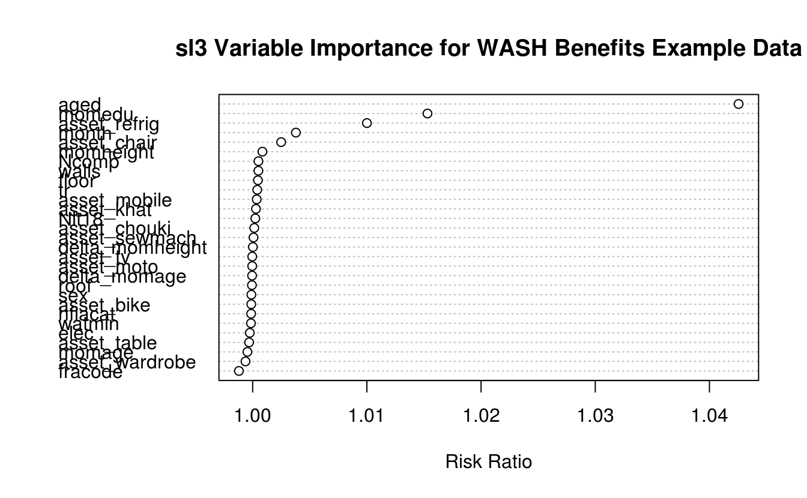

---
output:
  pdf_document: default
  html_document: default
---

# Super (Machine) Learning {#sl3}

_Rachael Phillips_

Based on the [`sl3` `R` package](https://github.com/tlverse/sl3) by _Jeremy
Coyle, Nima Hejazi, Ivana Malenica, Rachael Phillips, and Oleg Sofrygin_.

Updated: 2021-03-15

## Learning Objectives {-}

By the end of this chapter you will be able to:

1. Select a loss function that is appropriate for the functional parameter to
   be estimated.
2. Assemble an ensemble of learners based on the properties that identify what
   features they support.
3. Customize learner tuning parameters to incorporate a diversity of different
   settings.
4. Select a subset of available covariates and pass only those variables to the
   modeling algorithm.
5. Fit an ensemble with nested cross-validation to obtain an estimate of the
   performance of the ensemble itself.
6. Obtain `sl3` variable importance metrics.
7. Interpret the discrete and continuous Super Learner fits.
8. Rationalize the need to remove bias from the Super Learner to make an
   optimal bias-variance tradeoff for the parameter of interest.

## Motivation {-}

- A common task in data analysis is prediction -- using the observed data to
  learn a function, which can be used to map new input variables into a
  predicted outcome.
  <!--
  Oftentimes, the scientific question of interest translates to a statistical
  question that requires (causal) effect estimation. Even in these scenarios,
  where prediction is not in the forefront, there are often prediction steps
  embedded in the procedure.
  --->
- For some data, algorithms that can model a complex function are necessary to
  adequately model the data. For other data, a main terms regression model might
  fit the data quite well.
- The Super Learner (SL), an ensemble learner, solves this issue, by allowing a
  combination of algorithms from the simplest (intercept-only) to most complex
  (neural nets, random forests, SVM, etc).
- It works by using cross-validation in a manner which guarantees that the
  resulting fit will be as good as possible, given the learners provided.

## Introduction {-}

In [Chapter 1](#intro), we introduced the [_Roadmap for Targeted
Learning_](#roadmap) as a general template to translate real-world data
applications into formal statistical estimation problems. The first steps of
this roadmap define the *statistical estimation problem*, which establish

1. Data as a random variable, or equivalently, a realization of a particular
   experiment/study. We assume the observations in the data are independent and
   identically distributed.
2. A statistical model as the set of possible probability distributions that
   could have given rise to the observed data.
3. A translation of the scientific question, which is often causal, into a
   target estimand.

Note that if the estimand is causal, step 3 also requires establishing
identifiability of the estimand from the observed data, under possible
non-testable assumptions that may not necessarily be reasonable. Still, the
target quantity does have a valid statistical interpretation. See [causal target
parameters](#causal) for more detail on causal models and identifiability.

Now that we have defined the statistical estimation problem, we are ready to
construct the TMLE; an asymptotically linear and efficient substitution
estimator of this estimand. The first step in this estimation procedure is an
initial estimate of the data-generating distribution, or the relevant part of
this distribution that is needed to evaluate the target parameter. For this
initial estimation, we use the Super Learner (SL) [@vdl2007super].

The SL provides an important step in creating a robust estimator. It is a
loss-function-based tool that uses cross-validation to obtain the best
prediction of our target parameter, based on a weighted average of a library of
machine learning algorithms. The library of machine learning algorithms consists
of functions ("learners" in the `sl3` nomenclature) that we think might be
consistent with the true data-generating distribution. By "consistent with the
true data-generating distribution", we mean that the algorithms selected should
not violate subject-matter knowledge about the experiment that generated the
data. Also, the library should contain a diversity of algorithms that range from
parametric regression models to multi-step algorithms involving screening
covariates, penalizations, optimizing tuning parameters, etc.

The ensembling of the collection of algorithms with weights ("metalearning" in
the `sl3` nomenclature) has been shown to be adaptive and robust, even in small
samples [@polley2010super]. The SL is proven to be asymptotically as accurate as
the best possible prediction algorithm in the library [@vdl2003unified;
@vaart2006oracle].

### Step-by-step overview {-}

Consider the scenario in which we have $n$ independent and identically
distributed observations in the data, and our data structure is not a time
series. Also, let's say we have $k$ number of candidate learners/algorithms.

1. Create the validation data for all $V=v$ folds. Break up the data evenly
   into $V=v$ splits; such that no observation is contained more than one split,
   and the splits contain about the same number of observations (e.g., about
   $n/V$ observations in each split).

    + If a rare binary outcome (or highly important binary predictor, such as
      a treatment) is present in the data, we should consider making the
      prevalence of this binary outcome in the splits similar to the
      prevalence that exists in the data. We can achieve this by specifying,
      for the `strata_ids` argument in `origami::make_folds()`, the vector of
      binary outcomes (or important binary  covariate).
    + If we have repeated measures or cluster-level dependence in the data,
      then all observations within a subject/cluster should be placed in the
      same split.

2. For each fold $v$:

    a. Separate (i) from (ii):
    
      i. The data that was selected for fold $v$ in Step 1, which contains 
         roughly $n/V$ total observations. We will refer to this subset of the 
         data as the "validation" data, and it's also commonly referred to as 
         the "test" data. Let's call $n_{\text{validation}}$ as the number of 
         observations in then validation data, 
      ii. The data that was NOT selected for fold $v$ in Step 1, which contains
          roughly $n - n_{\text{validation}}$ total observations. We will refer 
          to this subset of the data as the "training", and 
          $n_{\text{training}}$ as the number of observations in the training 
          data. 
    b. Fit each of the $k$ learners on the training data (ii).
    c. Using each of the $k$ trained learners, predict the outcomes in the
       validation data (i). We can call these predictions
       "cross-validated predictions"; since they were obtained from the
       validation sample's covariate information, which was never seen while
       fitting these models. We end up with a $n_{validation} \times k$
       matrix of cross-validated predictions.

 3. Bind together the rows of all $v$ $n_{validation} \times k$ matrices of
    cross-validated predictions, to obtain an $n \times k$ matrix of
    cross-validated predictions. This matrix $n \times k$ matrix of 
    cross-validated predictions is often referred to as the
    "level-one" or "Z" matrix.
 4. Retain the observed outcome $Y$ for all of the $n$ observations, using
    them to measure the "loss" of each cross-validated prediction
    (e.g., ($Y − \hat{Y}^2$).
 5. For each $k$ column, take the (potentially weighted) mean across all of the
    $n$ losses, which we call the "cross-validated empirical risk". The 
    cross-validated empirical risk provides measure of performance, summarized 
    across all $n$, for each of the $k$ learners. The weights that could be 
    incorporated in the data, and used to calculate a weighted mean, serve to
    to up weight or down weight samples whose loss should be considered less or
    more important, respectively. 
 6. Establish the ensemble/combination of the $k$ learners by fitting the 
    so-called "metalearner". The ensemble is just a weighted combination of  
    the learners, so the weights here are just a $k$-dimensional vector. The 
    metalearner is a function that decides on the weights to be assigned to 
    each of the $k$ learners; taking as input the cross-validated empirical risk
    for all $k$ learners (a), or taking as input a loss function and the Z 
    matrix (b).

     a. The discrete SL (or cross-validated selector) employs a simple
        metalearner that takes as input the cross-validated empirical risk
        for all $k$ learners. This metalearner assigns weight of 1 to the 
        single learner with smallest cross-validated risk, and a weight of 0 to 
        all other learners. 
     b. The ensemble SL (often referred to as the "Super Learner") employs
        metalearners that take as input the Z matrix, and the loss function of
        interest (unless the loss is implied by the metalearning function 
        itself). These metalearners assign the weights such that the weighted 
        combination of Z matrix predictions is optimized to minimize 
        the cross-validated empirical risk. This often results in more than one 
        learner having positive weight. Aggressive metalearning (e.g.,
        assigning negative weight) can be problematic, leading to overfitting.

  6. Fit the learners (or only the learners with non-zero weight from Step 5) 
     on the entire sample of $n$ observations, and use the weights that were 
     obtained in Step 5 to get the SL fit. That's it! The SL fit is just all of 
     $k$ learner fits --- the weights don't come in to play until we obtain the 
     predictions from the SL; where the SL predictions are the weighted 
     combination of the $k$ learner predictions, as determined by the 
     metalearner. Notice that, we use this rigorous, optimal, and fair 
     procedure to derive the weights from the $n \times k$ Z matrix of 
     cross-validated predictions; but once we've done that, we capitalize on the 
     entire sample of observations, transitioning our focus to obtaining the 
     best fit possible of our $k$ learners.
  7. SL predictions, variable importance, and/or a cross-validated SL can be
     obtained from an SL fit (like most other learners). The cross-validated SL
     provides an estimate of the performance of the SL on unseen data, and
     incorporates a outer layer of cross-validation in order to cross-validate
     this entire procedure.

Below is a figure from [ADD REF] describing the same step-by-step procedure. 
This figure considers $k$=16 learners, and in the figure $p=k$; and the squared
error loss function, thus mean squared error (MSE) is the risk.
<embed src="img/misc/SLKaiserNew.pdf" width="80%" style="display: block; margin: auto;" type="application/pdf" />
<!-- ADD REFERENCE + CV-SL FIGURE AND REFERENCE -->

### Theoretical Foundations and Further Reading {-}

- Cross-validation is proven to be optimal for selection among estimators. This
  result was established through the oracle inequality for the cross-validation
  selector among a collection of candidate estimators [@vdl2003unified;
  @vaart2006oracle]. The only condition is that loss function is uniformly
  bounded, which is guaranteed in `sl3`.
- We use a *loss function* $L$ to assign a measure of performance to each
  learner $\psi$ when applied to the data $O$, and subsequently compare
  performance across the learners. More generally, $L$ maps every
  $\psi \in \mathbb{R}$ to $L(\psi) : (O) \mapsto L(\psi)(O)$. We use the terms
  "learner", "algorithm", and "estimator" interchangeably.

    + It is important to recall that $\psi$ is an estimator of $\psi_0$, the
      unknown and true parameter value under $P_0$.
    + A valid loss function will have mean/expectation (risk) that is minimized 
      at the true value of the parameter $\psi_0$. Thus, minimizing the expected
      loss will bring an estimator $\psi$ closer to the true $\psi_0$.
    + For example, say we observe a learning data set $O_i=(Y_i,X_i)$, of
      $i=1, \ldots, n$ independent and identically distributed observations,
      where $Y_i$ is a continuous outcome of interest, $X_i$ is a set of
      covariates. Also, let our objective be to estimate the function
      $\psi_0: X \mapsto \psi_0(X) = E_0(Y \mid X)$, which is the conditional
      mean outcome given covariates. This function can be expressed as the
      minimizer of the expected squared error loss: $\psi_0 =
      \text{argmin}_{\psi} E[L(O,\psi(X))]$, where $L(O,\psi(X)) = (Y −
      \psi(X))^2$.
    + We can estimate the loss by substituting the empirical distribution of
      the data $P_n$ for the true and unknown distribution of the observed data
      $P_0$.
    + Also, we can use the cross-validated risk to empirically determine the
      relative performance of an estimator (i.e., a candidate learner), and
      perhaps how it's performance compares to other estimators.
    + Once we have tested different estimators on actual data, and looked at
      the performance (e.g., MSE of predictions across all learners), we can
      see which algorithm (or weighted combination) has the lowest risk, and
      thus is closest to the true $\psi_0$.

- The *cross-validated empirical risk* of an algorithm is defined as the
  empirical mean over a validation sample of the loss of the algorithm fitted
  on the training sample, averaged across the splits of the data.
  
    + The *discrete Super Learner*, or *cross-validation selector*, is the 
      algorithm in the library that minimizes the cross-validated empirical 
      risk.
    + The *continuous/ensemble Super Learner*, often referred to as 
      *Super Learner* is a weighted average of the library of algorithm 
      predictions, where the weights are chosen to minimize the cross-validated 
      empirical risk of the library. This notion of weighted combinations 
      was introduced in @wolpert1992stacked for neural networks and adapted for 
      regressions in @breiman1996stacked. Restricting the weights to be 
      positive and sum to one (i.e., a convex combination) has been shown to 
      perform well in practice [@polley2010super; @vdl2007super].
      
<!--
The *oracle results* prove that, if the number of algorithms in the library are
polynomial in sample size, then the cross-validation selector (i.e., discrete
Super Learner) (1) is equivalent with the oracle selector asymptotically (based
on sample of size of training samples), or (2) achieves the parametric rate
(log $n/n$) for convergence with respect to the loss-based dissimilarity (risk)
between a candidate estimate $\psi$ and the true parameter value $\psi_0$.

### Super Learner for Prediction {-}

Below, we show the results of
such a study, comparing the fits of several different learners, including the
SL algorithms.

r cv_fig3, results="asis", echo = FALSE
knitr::include_graphics("img/misc/ericSL.pdf")

For more detail on Super Learner we refer the reader to @vdl2007super and
@polley2010super. The optimality results for the cross-validation selector
among a family of algorithms were established in @vdl2003unified and extended
in @vaart2006oracle.
-->

## `sl3` "Microwave Dinner" Implementation {-}

We begin by illustrating the core functionality of the SL algorithm as
implemented in `sl3`.

The `sl3` implementation consists of the following steps:

0. Load the necessary libraries and data.
1. Define the machine learning task.
2. Make an SL by creating library of base learners and a metalearner.
3. Train the SL on the machine learning task.
4. Obtain predicted values.

### WASH Benefits Study Example {-}

Using the WASH Benefits Bangladesh data, we are interested in predicting
weight-for-height z-score `whz` using the available covariate data. More
information on this dataset, and all other data that we will work with in this
handbook, is contained in [Chapter 3]{#data}. Let's begin!

### 0. Load the necessary libraries and data {-}

First, we will load the relevant `R` packages, set a seed, and load the data.

<!--
If you would like to use newer `sl3` functionality that is available in the
devel branch of the `sl3` GitHub repository, you need to install that version
of the package (i.e., `usethis::install_github(tlverse/sl3@devel)`), re-start
your `R` session, and then re-load the `sl3` package.
-->


```r
library(data.table)
library(dplyr)
library(readr)
library(ggplot2)
library(SuperLearner)
library(origami)
library(sl3)
library(knitr)
library(kableExtra)

# load data set and take a peek
washb_data <- fread(
  paste0(
    "https://raw.githubusercontent.com/tlverse/tlverse-data/master/",
    "wash-benefits/washb_data.csv"
  ),
  stringsAsFactors = TRUE
)
head(washb_data) %>%
  kable() %>%
  kable_styling(fixed_thead = TRUE) %>%
  scroll_box(width = "100%", height = "300px")
```

<div style="border: 1px solid #ddd; padding: 0px; overflow-y: scroll; height:300px; overflow-x: scroll; width:100%; "><table class="table" style="margin-left: auto; margin-right: auto;">
 <thead>
  <tr>
   <th style="text-align:right;position: sticky; top:0; background-color: #FFFFFF;position: sticky; top:0; background-color: #FFFFFF;"> whz </th>
   <th style="text-align:left;position: sticky; top:0; background-color: #FFFFFF;position: sticky; top:0; background-color: #FFFFFF;"> tr </th>
   <th style="text-align:left;position: sticky; top:0; background-color: #FFFFFF;position: sticky; top:0; background-color: #FFFFFF;"> fracode </th>
   <th style="text-align:right;position: sticky; top:0; background-color: #FFFFFF;position: sticky; top:0; background-color: #FFFFFF;"> month </th>
   <th style="text-align:right;position: sticky; top:0; background-color: #FFFFFF;position: sticky; top:0; background-color: #FFFFFF;"> aged </th>
   <th style="text-align:left;position: sticky; top:0; background-color: #FFFFFF;position: sticky; top:0; background-color: #FFFFFF;"> sex </th>
   <th style="text-align:right;position: sticky; top:0; background-color: #FFFFFF;position: sticky; top:0; background-color: #FFFFFF;"> momage </th>
   <th style="text-align:left;position: sticky; top:0; background-color: #FFFFFF;position: sticky; top:0; background-color: #FFFFFF;"> momedu </th>
   <th style="text-align:right;position: sticky; top:0; background-color: #FFFFFF;position: sticky; top:0; background-color: #FFFFFF;"> momheight </th>
   <th style="text-align:left;position: sticky; top:0; background-color: #FFFFFF;position: sticky; top:0; background-color: #FFFFFF;"> hfiacat </th>
   <th style="text-align:right;position: sticky; top:0; background-color: #FFFFFF;position: sticky; top:0; background-color: #FFFFFF;"> Nlt18 </th>
   <th style="text-align:right;position: sticky; top:0; background-color: #FFFFFF;position: sticky; top:0; background-color: #FFFFFF;"> Ncomp </th>
   <th style="text-align:right;position: sticky; top:0; background-color: #FFFFFF;position: sticky; top:0; background-color: #FFFFFF;"> watmin </th>
   <th style="text-align:right;position: sticky; top:0; background-color: #FFFFFF;position: sticky; top:0; background-color: #FFFFFF;"> elec </th>
   <th style="text-align:right;position: sticky; top:0; background-color: #FFFFFF;position: sticky; top:0; background-color: #FFFFFF;"> floor </th>
   <th style="text-align:right;position: sticky; top:0; background-color: #FFFFFF;position: sticky; top:0; background-color: #FFFFFF;"> walls </th>
   <th style="text-align:right;position: sticky; top:0; background-color: #FFFFFF;position: sticky; top:0; background-color: #FFFFFF;"> roof </th>
   <th style="text-align:right;position: sticky; top:0; background-color: #FFFFFF;position: sticky; top:0; background-color: #FFFFFF;"> asset_wardrobe </th>
   <th style="text-align:right;position: sticky; top:0; background-color: #FFFFFF;position: sticky; top:0; background-color: #FFFFFF;"> asset_table </th>
   <th style="text-align:right;position: sticky; top:0; background-color: #FFFFFF;position: sticky; top:0; background-color: #FFFFFF;"> asset_chair </th>
   <th style="text-align:right;position: sticky; top:0; background-color: #FFFFFF;position: sticky; top:0; background-color: #FFFFFF;"> asset_khat </th>
   <th style="text-align:right;position: sticky; top:0; background-color: #FFFFFF;position: sticky; top:0; background-color: #FFFFFF;"> asset_chouki </th>
   <th style="text-align:right;position: sticky; top:0; background-color: #FFFFFF;position: sticky; top:0; background-color: #FFFFFF;"> asset_tv </th>
   <th style="text-align:right;position: sticky; top:0; background-color: #FFFFFF;position: sticky; top:0; background-color: #FFFFFF;"> asset_refrig </th>
   <th style="text-align:right;position: sticky; top:0; background-color: #FFFFFF;position: sticky; top:0; background-color: #FFFFFF;"> asset_bike </th>
   <th style="text-align:right;position: sticky; top:0; background-color: #FFFFFF;position: sticky; top:0; background-color: #FFFFFF;"> asset_moto </th>
   <th style="text-align:right;position: sticky; top:0; background-color: #FFFFFF;position: sticky; top:0; background-color: #FFFFFF;"> asset_sewmach </th>
   <th style="text-align:right;position: sticky; top:0; background-color: #FFFFFF;position: sticky; top:0; background-color: #FFFFFF;"> asset_mobile </th>
  </tr>
 </thead>
<tbody>
  <tr>
   <td style="text-align:right;"> 0.00 </td>
   <td style="text-align:left;"> Control </td>
   <td style="text-align:left;"> N05265 </td>
   <td style="text-align:right;"> 9 </td>
   <td style="text-align:right;"> 268 </td>
   <td style="text-align:left;"> male </td>
   <td style="text-align:right;"> 30 </td>
   <td style="text-align:left;"> Primary (1-5y) </td>
   <td style="text-align:right;"> 146.40 </td>
   <td style="text-align:left;"> Food Secure </td>
   <td style="text-align:right;"> 3 </td>
   <td style="text-align:right;"> 11 </td>
   <td style="text-align:right;"> 0 </td>
   <td style="text-align:right;"> 1 </td>
   <td style="text-align:right;"> 0 </td>
   <td style="text-align:right;"> 1 </td>
   <td style="text-align:right;"> 1 </td>
   <td style="text-align:right;"> 0 </td>
   <td style="text-align:right;"> 1 </td>
   <td style="text-align:right;"> 1 </td>
   <td style="text-align:right;"> 1 </td>
   <td style="text-align:right;"> 0 </td>
   <td style="text-align:right;"> 1 </td>
   <td style="text-align:right;"> 0 </td>
   <td style="text-align:right;"> 0 </td>
   <td style="text-align:right;"> 0 </td>
   <td style="text-align:right;"> 0 </td>
   <td style="text-align:right;"> 1 </td>
  </tr>
  <tr>
   <td style="text-align:right;"> -1.16 </td>
   <td style="text-align:left;"> Control </td>
   <td style="text-align:left;"> N05265 </td>
   <td style="text-align:right;"> 9 </td>
   <td style="text-align:right;"> 286 </td>
   <td style="text-align:left;"> male </td>
   <td style="text-align:right;"> 25 </td>
   <td style="text-align:left;"> Primary (1-5y) </td>
   <td style="text-align:right;"> 148.75 </td>
   <td style="text-align:left;"> Moderately Food Insecure </td>
   <td style="text-align:right;"> 2 </td>
   <td style="text-align:right;"> 4 </td>
   <td style="text-align:right;"> 0 </td>
   <td style="text-align:right;"> 1 </td>
   <td style="text-align:right;"> 0 </td>
   <td style="text-align:right;"> 1 </td>
   <td style="text-align:right;"> 1 </td>
   <td style="text-align:right;"> 0 </td>
   <td style="text-align:right;"> 1 </td>
   <td style="text-align:right;"> 0 </td>
   <td style="text-align:right;"> 1 </td>
   <td style="text-align:right;"> 1 </td>
   <td style="text-align:right;"> 0 </td>
   <td style="text-align:right;"> 0 </td>
   <td style="text-align:right;"> 0 </td>
   <td style="text-align:right;"> 0 </td>
   <td style="text-align:right;"> 0 </td>
   <td style="text-align:right;"> 1 </td>
  </tr>
  <tr>
   <td style="text-align:right;"> -1.05 </td>
   <td style="text-align:left;"> Control </td>
   <td style="text-align:left;"> N08002 </td>
   <td style="text-align:right;"> 9 </td>
   <td style="text-align:right;"> 264 </td>
   <td style="text-align:left;"> male </td>
   <td style="text-align:right;"> 25 </td>
   <td style="text-align:left;"> Primary (1-5y) </td>
   <td style="text-align:right;"> 152.15 </td>
   <td style="text-align:left;"> Food Secure </td>
   <td style="text-align:right;"> 1 </td>
   <td style="text-align:right;"> 10 </td>
   <td style="text-align:right;"> 0 </td>
   <td style="text-align:right;"> 0 </td>
   <td style="text-align:right;"> 0 </td>
   <td style="text-align:right;"> 1 </td>
   <td style="text-align:right;"> 1 </td>
   <td style="text-align:right;"> 0 </td>
   <td style="text-align:right;"> 0 </td>
   <td style="text-align:right;"> 1 </td>
   <td style="text-align:right;"> 0 </td>
   <td style="text-align:right;"> 1 </td>
   <td style="text-align:right;"> 0 </td>
   <td style="text-align:right;"> 0 </td>
   <td style="text-align:right;"> 0 </td>
   <td style="text-align:right;"> 0 </td>
   <td style="text-align:right;"> 0 </td>
   <td style="text-align:right;"> 1 </td>
  </tr>
  <tr>
   <td style="text-align:right;"> -1.26 </td>
   <td style="text-align:left;"> Control </td>
   <td style="text-align:left;"> N08002 </td>
   <td style="text-align:right;"> 9 </td>
   <td style="text-align:right;"> 252 </td>
   <td style="text-align:left;"> female </td>
   <td style="text-align:right;"> 28 </td>
   <td style="text-align:left;"> Primary (1-5y) </td>
   <td style="text-align:right;"> 140.25 </td>
   <td style="text-align:left;"> Food Secure </td>
   <td style="text-align:right;"> 3 </td>
   <td style="text-align:right;"> 5 </td>
   <td style="text-align:right;"> 0 </td>
   <td style="text-align:right;"> 1 </td>
   <td style="text-align:right;"> 0 </td>
   <td style="text-align:right;"> 1 </td>
   <td style="text-align:right;"> 1 </td>
   <td style="text-align:right;"> 1 </td>
   <td style="text-align:right;"> 1 </td>
   <td style="text-align:right;"> 1 </td>
   <td style="text-align:right;"> 1 </td>
   <td style="text-align:right;"> 0 </td>
   <td style="text-align:right;"> 0 </td>
   <td style="text-align:right;"> 0 </td>
   <td style="text-align:right;"> 1 </td>
   <td style="text-align:right;"> 0 </td>
   <td style="text-align:right;"> 0 </td>
   <td style="text-align:right;"> 1 </td>
  </tr>
  <tr>
   <td style="text-align:right;"> -0.59 </td>
   <td style="text-align:left;"> Control </td>
   <td style="text-align:left;"> N06531 </td>
   <td style="text-align:right;"> 9 </td>
   <td style="text-align:right;"> 336 </td>
   <td style="text-align:left;"> female </td>
   <td style="text-align:right;"> 19 </td>
   <td style="text-align:left;"> Secondary (&gt;5y) </td>
   <td style="text-align:right;"> 150.95 </td>
   <td style="text-align:left;"> Food Secure </td>
   <td style="text-align:right;"> 2 </td>
   <td style="text-align:right;"> 7 </td>
   <td style="text-align:right;"> 0 </td>
   <td style="text-align:right;"> 1 </td>
   <td style="text-align:right;"> 0 </td>
   <td style="text-align:right;"> 1 </td>
   <td style="text-align:right;"> 1 </td>
   <td style="text-align:right;"> 1 </td>
   <td style="text-align:right;"> 1 </td>
   <td style="text-align:right;"> 1 </td>
   <td style="text-align:right;"> 1 </td>
   <td style="text-align:right;"> 1 </td>
   <td style="text-align:right;"> 0 </td>
   <td style="text-align:right;"> 0 </td>
   <td style="text-align:right;"> 0 </td>
   <td style="text-align:right;"> 0 </td>
   <td style="text-align:right;"> 0 </td>
   <td style="text-align:right;"> 1 </td>
  </tr>
  <tr>
   <td style="text-align:right;"> -0.51 </td>
   <td style="text-align:left;"> Control </td>
   <td style="text-align:left;"> N06531 </td>
   <td style="text-align:right;"> 9 </td>
   <td style="text-align:right;"> 304 </td>
   <td style="text-align:left;"> male </td>
   <td style="text-align:right;"> 20 </td>
   <td style="text-align:left;"> Secondary (&gt;5y) </td>
   <td style="text-align:right;"> 154.20 </td>
   <td style="text-align:left;"> Severely Food Insecure </td>
   <td style="text-align:right;"> 0 </td>
   <td style="text-align:right;"> 3 </td>
   <td style="text-align:right;"> 1 </td>
   <td style="text-align:right;"> 1 </td>
   <td style="text-align:right;"> 0 </td>
   <td style="text-align:right;"> 1 </td>
   <td style="text-align:right;"> 1 </td>
   <td style="text-align:right;"> 0 </td>
   <td style="text-align:right;"> 0 </td>
   <td style="text-align:right;"> 0 </td>
   <td style="text-align:right;"> 0 </td>
   <td style="text-align:right;"> 1 </td>
   <td style="text-align:right;"> 0 </td>
   <td style="text-align:right;"> 0 </td>
   <td style="text-align:right;"> 0 </td>
   <td style="text-align:right;"> 0 </td>
   <td style="text-align:right;"> 0 </td>
   <td style="text-align:right;"> 1 </td>
  </tr>
</tbody>
</table></div>

### 1. Define the machine learning task {-}

To define the machine learning **"task"** (predict weight-for-height Z-score
`whz` using the available covariate data), we need to create an `sl3_Task`
object.

The `sl3_Task` keeps track of the roles the variables play in the machine
learning problem, the data, and any metadata (e.g., observational-level
weights, IDs, offset).

Also, if we had missing outcomes, we would need to set `drop_missing_outcome =
TRUE` when we create the task. In the next analysis, with the [IST stroke trial
data](#ist), we do have a missing outcome. In the following chapter, we need to
estimate this "missingness mechanism"; which is the conditional probability that
the outcome is observed, given the history (i.e., variables that were measured
before the missingness). Estimating the missingness mechanism requires learning
a prediction function that outputs the predicted probability that a unit is
missing, given their history.


```r
# specify the outcome and covariates
outcome <- "whz"
covars <- colnames(washb_data)[-which(names(washb_data) == outcome)]

# create the sl3 task
washb_task <- make_sl3_Task(
  data = washb_data,
  covariates = covars,
  outcome = outcome
)
#> Warning in process_data(data, nodes, column_names = column_names, flag = flag, :
#> Missing covariate data detected: imputing covariates.
```
*This warning is important.* The task just imputed missing covariates for us.
Specifically, for each covariate column with missing values, `sl3` uses the
median to impute missing continuous covariates, and the mode to impute binary
and categorical covariates.

Also, for each covariate column with missing values, `sl3` adds an additional
column indicating whether or not the value was imputed, which is particularly
handy when the missingness in the data might be informative.

Also, notice that we did not specify the number of folds, or the loss function
in the task. The default cross-validation scheme is V-fold, with $V=10$ number
of folds.

Let's visualize our `washb_task`:


```r
washb_task
#> A sl3 Task with 4695 obs and these nodes:
#> $covariates
#>  [1] "tr"              "fracode"         "month"           "aged"           
#>  [5] "sex"             "momage"          "momedu"          "momheight"      
#>  [9] "hfiacat"         "Nlt18"           "Ncomp"           "watmin"         
#> [13] "elec"            "floor"           "walls"           "roof"           
#> [17] "asset_wardrobe"  "asset_table"     "asset_chair"     "asset_khat"     
#> [21] "asset_chouki"    "asset_tv"        "asset_refrig"    "asset_bike"     
#> [25] "asset_moto"      "asset_sewmach"   "asset_mobile"    "delta_momage"   
#> [29] "delta_momheight"
#> 
#> $outcome
#> [1] "whz"
#> 
#> $id
#> NULL
#> 
#> $weights
#> NULL
#> 
#> $offset
#> NULL
#> 
#> $time
#> NULL
```

We can't see when we print the task, but the default cross-validation fold
structure ($V$-fold cross-validation with $V$=10 folds) was created when we
defined the task.


```r
length(washb_task$folds) # how many folds?
#> [1] 10

head(washb_task$folds[[1]]$training_set) # row indexes for fold 1 training
#> [1] 1 2 3 4 5 6
head(washb_task$folds[[1]]$validation_set) # row indexes for fold 1 validation
#> [1] 12 21 29 41 43 53

any(
  washb_task$folds[[1]]$training_set %in%
    washb_task$folds[[1]]$validation_set
)
#> [1] FALSE
```

`R6` Tip: If you type `washb_task$` and then press the "tab"  button (you will
need to press "tab" twice if you're not in RStudio), you can view all of the
active and public fields and methods that can be accessed from the `washb_task`
object.

### 2. Make a Super Learner {-}

Now that we have defined our machine learning problem with the `sl3_Task`, we
are ready to **"make"** the Super Learner (SL). This requires specification of

* A set of candidate machine learning algorithms, also commonly referred to as
  a "library" of "learners". The set should include a diversity of algorithms
  that are believed to be consistent with the true data-generating
  distribution.
* A metalearner, to ensemble the base learners.

We might also incorporate

* Feature selection, to pass only a subset of the predictors to the algorithm.
* Hyperparameter specification, to tune base learners.

Learners have properties that indicate what features they support. We may use
`sl3_list_properties()` to get a list of all properties supported by at least
one learner.


```r
sl3_list_properties()
#>  [1] "binomial"      "categorical"   "continuous"    "cv"           
#>  [5] "density"       "h2o"           "ids"           "importance"   
#>  [9] "offset"        "preprocessing" "sampling"      "screener"     
#> [13] "timeseries"    "weights"       "wrapper"
```
Since we have a continuous outcome, we may identify the learners that support
this outcome type with `sl3_list_learners()`.


```r
sl3_list_learners("continuous")
#>  [1] "Lrnr_arima"                     "Lrnr_bartMachine"              
#>  [3] "Lrnr_bayesglm"                  "Lrnr_bilstm"                   
#>  [5] "Lrnr_bound"                     "Lrnr_caret"                    
#>  [7] "Lrnr_cv_selector"               "Lrnr_dbarts"                   
#>  [9] "Lrnr_earth"                     "Lrnr_expSmooth"                
#> [11] "Lrnr_gam"                       "Lrnr_gbm"                      
#> [13] "Lrnr_glm"                       "Lrnr_glm_fast"                 
#> [15] "Lrnr_glmnet"                    "Lrnr_grf"                      
#> [17] "Lrnr_gru_keras"                 "Lrnr_gts"                      
#> [19] "Lrnr_h2o_glm"                   "Lrnr_h2o_grid"                 
#> [21] "Lrnr_hal9001"                   "Lrnr_HarmonicReg"              
#> [23] "Lrnr_hts"                       "Lrnr_lstm"                     
#> [25] "Lrnr_lstm_keras"                "Lrnr_mean"                     
#> [27] "Lrnr_multiple_ts"               "Lrnr_nnet"                     
#> [29] "Lrnr_nnls"                      "Lrnr_optim"                    
#> [31] "Lrnr_pkg_SuperLearner"          "Lrnr_pkg_SuperLearner_method"  
#> [33] "Lrnr_pkg_SuperLearner_screener" "Lrnr_polspline"                
#> [35] "Lrnr_randomForest"              "Lrnr_ranger"                   
#> [37] "Lrnr_rpart"                     "Lrnr_rugarch"                  
#> [39] "Lrnr_screener_correlation"      "Lrnr_solnp"                    
#> [41] "Lrnr_stratified"                "Lrnr_svm"                      
#> [43] "Lrnr_tsDyn"                     "Lrnr_xgboost"
```

Now that we have an idea of some learners, we can construct them using the
`make_learner` function or the `new` method.


```r
# choose base learners
lrn_glm <- make_learner(Lrnr_glm)
lrn_mean <- Lrnr_mean$new()
```
We can customize learner hyperparameters to incorporate a diversity of
different settings. Documentation for the learners and their hyperparameters
can be found in the [`sl3` Learners
Reference](https://tlverse.org/sl3/reference/index.html#section-sl-learners).


```r
lrn_lasso <- make_learner(Lrnr_glmnet) # alpha default is 1
lrn_ridge <- Lrnr_glmnet$new(alpha = 0)
lrn_enet.5 <- make_learner(Lrnr_glmnet, alpha = 0.5)

lrn_polspline <- Lrnr_polspline$new()

lrn_ranger100 <- make_learner(Lrnr_ranger, num.trees = 100)

lrn_hal_faster <- Lrnr_hal9001$new(max_degree = 2, reduce_basis = 0.05)

xgb_fast <- Lrnr_xgboost$new() # default with nrounds = 20 is pretty fast
xgb_50 <- Lrnr_xgboost$new(nrounds = 50)
```
We can use `Lrnr_define_interactions` to define interaction terms among
covariates. The interactions should be supplied as list of character vectors,
where each vector specifies an interaction. For example, we specify
interactions below between (1) `tr` (whether or not the subject received the
WASH intervention) and `elec` (whether or not the subject had electricity); and
between (2) `tr` and `hfiacat` (the subject's level of food security).


```r
interactions <- list(c("elec", "tr"), c("tr", "hfiacat"))
# main terms as well as the interactions above will be included
lrn_interaction <- make_learner(Lrnr_define_interactions, interactions)
```
What we just defined above is incomplete. In order to fit learners with these
interactions, we need to create a `Pipeline`. A `Pipeline` is a set of learners
to be fit sequentially, where the fit from one learner is used to define the
task for the next learner. We need to create a `Pipeline` with the interaction
defining learner and another learner that incorporate these terms when fitting
a model. Let's create a learner pipeline that will fit a linear model with the
combination of main terms and interactions terms, as specified in
`lrn_interaction_main`.


```r
# we already instantiated a linear model learner above, no need to do it again
lrn_glm_interaction <- make_learner(Pipeline, lrn_interaction, lrn_glm)
lrn_glm_interaction
#> [1] "Lrnr_define_interactions_TRUE"
#> [1] "Lrnr_glm_TRUE"
```

We can also include learners from the `SuperLearner` `R` package.


```r
lrn_bayesglm <- Lrnr_pkg_SuperLearner$new("SL.bayesglm")
```

Here is a fun trick to create customized learners over a grid of parameters.


```r
# I like to crock pot my SLs
grid_params <- list(
  cost = c(0.01, 0.1, 1, 10, 100, 1000),
  gamma = c(0.001, 0.01, 0.1, 1),
  kernel = c("polynomial", "radial", "sigmoid"),
  degree = c(1, 2, 3)
)
grid <- expand.grid(grid_params, KEEP.OUT.ATTRS = FALSE)
svm_learners <- apply(grid, MARGIN = 1, function(tuning_params) {
  do.call(Lrnr_svm$new, as.list(tuning_params))
})
```

```r
grid_params <- list(
  max_depth = c(2, 4, 6),
  eta = c(0.001, 0.1, 0.3),
  nrounds = 100
)
grid <- expand.grid(grid_params, KEEP.OUT.ATTRS = FALSE)
grid
#>   max_depth   eta nrounds
#> 1         2 0.001     100
#> 2         4 0.001     100
#> 3         6 0.001     100
#> 4         2 0.100     100
#> 5         4 0.100     100
#> 6         6 0.100     100
#> 7         2 0.300     100
#> 8         4 0.300     100
#> 9         6 0.300     100

xgb_learners <- apply(grid, MARGIN = 1, function(tuning_params) {
  do.call(Lrnr_xgboost$new, as.list(tuning_params))
})
xgb_learners
#> [[1]]
#> [1] "Lrnr_xgboost_100_1_2_0.001"
#> 
#> [[2]]
#> [1] "Lrnr_xgboost_100_1_4_0.001"
#> 
#> [[3]]
#> [1] "Lrnr_xgboost_100_1_6_0.001"
#> 
#> [[4]]
#> [1] "Lrnr_xgboost_100_1_2_0.1"
#> 
#> [[5]]
#> [1] "Lrnr_xgboost_100_1_4_0.1"
#> 
#> [[6]]
#> [1] "Lrnr_xgboost_100_1_6_0.1"
#> 
#> [[7]]
#> [1] "Lrnr_xgboost_100_1_2_0.3"
#> 
#> [[8]]
#> [1] "Lrnr_xgboost_100_1_4_0.3"
#> 
#> [[9]]
#> [1] "Lrnr_xgboost_100_1_6_0.3"
```

Did you see `Lrnr_caret` when we called `sl3_list_learners(c("binomial"))`?
All we need to specify to use this popular algorithm as a candidate in our
SL is the `algorithm` we want to tune, which is passed as `method` to
`caret::train()`. The default method for parameter selection criterion with is
set to "CV" instead of the `caret::train()` default `boot`. The summary metric
used to select the optimal model is `RMSE` for continuous outcomes and
`Accuracy` for categorical and binomial outcomes.


```r
# Unlike xgboost, I have no idea how to tune a neural net or BART machine, so
# I let caret take the reins
lrnr_caret_nnet <- make_learner(Lrnr_caret, algorithm = "nnet")
lrnr_caret_bartMachine <- make_learner(Lrnr_caret,
  algorithm = "bartMachine",
  method = "boot", metric = "Accuracy",
  tuneLength = 10
)
```

In order to assemble the library of learners, we need to **"stack"** them
together.

A `Stack` is a special learner and it has the same interface as all other
learners. What makes a stack special is that it combines multiple learners by
training them simultaneously, so that their predictions can be either combined
or compared.


```r
stack <- make_learner(
  Stack, lrn_glm, lrn_polspline, lrn_enet.5, lrn_ridge, lrn_lasso, xgb_50
)
stack
#> [1] "Lrnr_glm_TRUE"                            
#> [2] "Lrnr_polspline_5"                         
#> [3] "Lrnr_glmnet_NULL_deviance_10_0.5_100_TRUE"
#> [4] "Lrnr_glmnet_NULL_deviance_10_0_100_TRUE"  
#> [5] "Lrnr_glmnet_NULL_deviance_10_1_100_TRUE"  
#> [6] "Lrnr_xgboost_50_1"
```

We can also stack the learners by first creating a vector, and then
instantiating the stack. I prefer this method, since it easily allows us to
modify the names of the learners.


```r
# named vector of learners first
learners <- c(lrn_glm, lrn_polspline, lrn_enet.5, lrn_ridge, lrn_lasso, xgb_50)
names(learners) <- c(
  "glm", "polspline", "enet.5", "ridge", "lasso", "xgboost50"
)
# next make the stack
stack <- make_learner(Stack, learners)
# now the names are pretty
stack
#> [1] "glm"       "polspline" "enet.5"    "ridge"     "lasso"     "xgboost50"
```

We're jumping ahead a bit, but let's check something out quickly. It's
straightforward, and just one more step, to set up this stack such that all of
the learners will train in a cross-validated manner.


```r
cv_stack <- Lrnr_cv$new(stack)
cv_stack
#> [1] "Lrnr_cv"
#> [1] "glm"       "polspline" "enet.5"    "ridge"     "lasso"     "xgboost50"
```

#### Screening Algorithms for Feature Selection {-}

We can optionally select a subset of available covariates and pass only those
variables to the modeling algorithm. The current set of learners that can be
used for prescreening covariates is included below.

- `Lrnr_screener_importance` selects `num_screen` (default = 5) covariates
  based on the variable importance ranking provided by the `learner`. Any
  learner with an "importance" method can be used in `Lrnr_screener_importance`;
  and this currently includes `Lrnr_ranger`, `Lrnr_randomForest`, and
  `Lrnr_xgboost`.
- `Lrnr_screener_coefs`, which provides screening of covariates based on the
  magnitude of their estimated coefficients in a (possibly regularized) GLM.
  The `threshold` (default = 1e-3) defines the minimum absolute size of the
  coefficients, and thus covariates, to be kept. Also, a `max_retain` argument
  can be optionally provided to restrict the number of selected covariates to
  be no more than `max_retain`.
- `Lrnr_screener_correlation` provides covariate screening procedures by
  running a test of correlation (Pearson default), and then selecting the (1)
  top ranked variables (default), or (2) the variables with a pvalue lower than
  some pre-specified threshold.
- `Lrnr_screener_augment` augments a set of screened covariates with additional
  covariates that should be included by default, even if the screener did not
  select them. An example of how to use this screener is included below.

Let's consider screening covariates based on their `randomForest` variable
importance ranking (ordered by mean decrease in accuracy). To select the top
5 most important covariates according to this ranking, we can combine
`Lrnr_screener_importance` with `Lrnr_ranger` (limiting the number of trees by
setting `ntree = 20`).

Hang on! Before you think it -- I will confess: Bob Ross and I both know that 20
trees makes for a lonely forest, and I shouldn't consider it, but these are the
sacrifices I have to make for this chapter to build in time!


```r
miniforest <- Lrnr_ranger$new(
  num.trees = 20, write.forest = FALSE,
  importance = "impurity_corrected"
)

# learner must already be instantiated, we did this when we created miniforest
screen_rf <- Lrnr_screener_importance$new(learner = miniforest, num_screen = 5)
screen_rf
#> [1] "Lrnr_screener_importance_5"

# which covariates are selected on the full data?
screen_rf$train(washb_task)
#> [1] "Lrnr_screener_importance_5"
#> $selected
#> [1] "aged"        "month"       "momedu"      "asset_tv"    "asset_chair"
```

An example of how to format `Lrnr_screener_augment` is included below for
clarity.

```r
keepme <- c("aged", "momage")
# screener must already be instantiated, we did this when we created screen_rf
screen_augment_rf <- Lrnr_screener_augment$new(
  screener = screen_rf, default_covariates = keepme
)
screen_augment_rf
#> [1] "Lrnr_screener_augment_c(\"aged\", \"momage\")"
```

Selecting covariates with non-zero lasso coefficients is quite common. Let's
construct `Lrnr_screener_coefs` screener that does just that, and test it out.


```r
# we already instantiated a lasso learner above, no need to do it again
screen_lasso <- Lrnr_screener_coefs$new(learner = lrn_lasso, threshold = 0)
screen_lasso
#> [1] "Lrnr_screener_coefs_0_NULL"
```

To **"pipe"** only the selected covariates to the modeling algorithm, we need to
make a `Pipeline`, similar to the one we built for the regression model with
interaction terms.


```r
screen_rf_pipe <- make_learner(Pipeline, screen_rf, stack)
screen_lasso_pipe <- make_learner(Pipeline, screen_lasso, stack)
```
Now, these learners with no internal screening will be preceded by a screening
step.

We also consider the original `stack`, to compare how the feature selection
methods perform in comparison to the methods without feature selection.

Analogous to what we have seen before, we have to stack the pipeline and
original `stack` together, so we may use them as base learners in our super
learner.


```r
# pretty names again
learners2 <- c(learners, screen_rf_pipe, screen_lasso_pipe)
names(learners2) <- c(names(learners), "randomforest_screen", "lasso_screen")

fancy_stack <- make_learner(Stack, learners2)
fancy_stack
#> [1] "glm"                 "polspline"           "enet.5"             
#> [4] "ridge"               "lasso"               "xgboost50"          
#> [7] "randomforest_screen" "lasso_screen"
```

We will use the [default
metalearner](https://tlverse.org/sl3/reference/default_metalearner.html), which
uses [`Lrnr_solnp()`](https://tlverse.org/sl3/reference/Lrnr_solnp.html) to
provide fitting procedures for a pairing of [loss
function](https://tlverse.org/sl3/reference/loss_functions.html) and
[metalearner function](https://tlverse.org/sl3/reference/metalearners.html).
This default metalearner selects a loss and metalearner pairing based on the
outcome type. Note that any learner can be used as a metalearner.

Now that we have made a diverse stack of base learners, we are ready to make
the SL. The SL algorithm fits a metalearner on the validation set
predictions/losses across all folds.


```r
sl <- make_learner(Lrnr_sl, learners = fancy_stack)
```
We can also use `Lrnr_cv` to build a SL, cross-validate a stack of
learners to compare performance of the learners in the stack, or cross-validate
any single learner (see "Cross-validation" section of this [`sl3`
introductory tutorial](https://tlverse.org/sl3/articles/intro_sl3.html)).

Furthermore, we can [Define New `sl3`
Learners](https://tlverse.org/sl3/articles/custom_lrnrs.html) which can be used
in all the places you could otherwise use any other `sl3` learners, including
`Pipelines`, `Stacks`, and the SL.

Recall that the discrete SL, or cross-validated selector, is a metalearner that
assigns a weight of 1 to the learner with the lowest cross-validated empirical
risk, and weight of 0 to all other learners. This metalearner specification can
be invoked with `Lrnr_cv_selector`.


```r
discrete_sl_metalrn <- Lrnr_cv_selector$new()
discrete_sl <- Lrnr_sl$new(
  learners = fancy_stack,
  metalearner = discrete_sl_metalrn
)
```
<!--
In the plot below, we visualize the steps for executing the Super Learner in
the `tlverse/delayed` framework. For those like myself who are not particularly
keen on understanding the intricacies of `delayed`, let's focus on the main
point of this figure: we can see there are 10 realizations of the stack which
represent the 10 cross-validation folds and there is a separate hold-out
(top branch of the figure) that will not be used to fit the Super Learner.


```r
dt_sl <- delayed_learner_train(sl, washb_task)
plot(dt_sl, color = FALSE, height = "400px", width = "90%")
```

```{=html}
<div id="htmlwidget-64e31bdf0964cb796022" style="width:90%;height:400px;" class="visNetwork html-widget"></div>
<script type="application/json" data-for="htmlwidget-64e31bdf0964cb796022">{"x":{"nodes":{"id":["4bcd201c-85b5-11eb-83d3-42010a1e003f","4bcd11a8-85b5-11eb-83d3-42010a1e003f","4bccd45e-85b5-11eb-83d3-42010a1e003f","4bccc66c-85b5-11eb-83d3-42010a1e003f","4b957018-85b5-11eb-83d3-42010a1e003f","4b956046-85b5-11eb-83d3-42010a1e003f","4b9290e6-85b5-11eb-83d3-42010a1e003f","4b92a360-85b5-11eb-83d3-42010a1e003f","4b92b3d2-85b5-11eb-83d3-42010a1e003f","4b92c480-85b5-11eb-83d3-42010a1e003f","4b92d466-85b5-11eb-83d3-42010a1e003f","4b92e438-85b5-11eb-83d3-42010a1e003f","4b941de4-85b5-11eb-83d3-42010a1e003f","4b94101a-85b5-11eb-83d3-42010a1e003f","4b92f716-85b5-11eb-83d3-42010a1e003f","4b93f3fa-85b5-11eb-83d3-42010a1e003f","4b930bd4-85b5-11eb-83d3-42010a1e003f","4b93e414-85b5-11eb-83d3-42010a1e003f","4b9339ce-85b5-11eb-83d3-42010a1e003f","4b931c28-85b5-11eb-83d3-42010a1e003f","4b9356e8-85b5-11eb-83d3-42010a1e003f","4b937402-85b5-11eb-83d3-42010a1e003f","4b9390fe-85b5-11eb-83d3-42010a1e003f","4b93b11a-85b5-11eb-83d3-42010a1e003f","4b93cf60-85b5-11eb-83d3-42010a1e003f","4b954e3a-85b5-11eb-83d3-42010a1e003f","4b95408e-85b5-11eb-83d3-42010a1e003f","4b9434d2-85b5-11eb-83d3-42010a1e003f","4b952572-85b5-11eb-83d3-42010a1e003f","4b944472-85b5-11eb-83d3-42010a1e003f","4b951668-85b5-11eb-83d3-42010a1e003f","4b94729e-85b5-11eb-83d3-42010a1e003f","4b94544e-85b5-11eb-83d3-42010a1e003f","4b948fd6-85b5-11eb-83d3-42010a1e003f","4b94ad04-85b5-11eb-83d3-42010a1e003f","4b94ca00-85b5-11eb-83d3-42010a1e003f","4b94e846-85b5-11eb-83d3-42010a1e003f","4b9505ba-85b5-11eb-83d3-42010a1e003f","4bccb640-85b5-11eb-83d3-42010a1e003f","4b9e28a2-85b5-11eb-83d3-42010a1e003f","4b9e1894-85b5-11eb-83d3-42010a1e003f","4b9a720c-85b5-11eb-83d3-42010a1e003f","4b9a888c-85b5-11eb-83d3-42010a1e003f","4b9a9ade-85b5-11eb-83d3-42010a1e003f","4b9aac2c-85b5-11eb-83d3-42010a1e003f","4b9abce4-85b5-11eb-83d3-42010a1e003f","4b9acde2-85b5-11eb-83d3-42010a1e003f","4b9cda88-85b5-11eb-83d3-42010a1e003f","4b9ccb9c-85b5-11eb-83d3-42010a1e003f","4b9bc3b4-85b5-11eb-83d3-42010a1e003f","4b9caf68-85b5-11eb-83d3-42010a1e003f","4b9bd12e-85b5-11eb-83d3-42010a1e003f","4b9ca072-85b5-11eb-83d3-42010a1e003f","4b9bfe88-85b5-11eb-83d3-42010a1e003f","4b9be100-85b5-11eb-83d3-42010a1e003f","4b9c1b8e-85b5-11eb-83d3-42010a1e003f","4b9c39de-85b5-11eb-83d3-42010a1e003f","4b9c573e-85b5-11eb-83d3-42010a1e003f","4b9c7458-85b5-11eb-83d3-42010a1e003f","4b9c9154-85b5-11eb-83d3-42010a1e003f","4b9e0700-85b5-11eb-83d3-42010a1e003f","4b9df850-85b5-11eb-83d3-42010a1e003f","4b9cf2f2-85b5-11eb-83d3-42010a1e003f","4b9dddb6-85b5-11eb-83d3-42010a1e003f","4b9cffae-85b5-11eb-83d3-42010a1e003f","4b9dce5c-85b5-11eb-83d3-42010a1e003f","4b9d2c72-85b5-11eb-83d3-42010a1e003f","4b9d0f62-85b5-11eb-83d3-42010a1e003f","4b9d4a54-85b5-11eb-83d3-42010a1e003f","4b9d685e-85b5-11eb-83d3-42010a1e003f","4b9d85d2-85b5-11eb-83d3-42010a1e003f","4b9da29c-85b5-11eb-83d3-42010a1e003f","4b9dbfd4-85b5-11eb-83d3-42010a1e003f","4bb060c6-85b5-11eb-83d3-42010a1e003f","4bb04fb4-85b5-11eb-83d3-42010a1e003f","4bad95f8-85b5-11eb-83d3-42010a1e003f","4bada8f4-85b5-11eb-83d3-42010a1e003f","4badb9fc-85b5-11eb-83d3-42010a1e003f","4badca00-85b5-11eb-83d3-42010a1e003f","4baddb44-85b5-11eb-83d3-42010a1e003f","4badebca-85b5-11eb-83d3-42010a1e003f","4baf0eba-85b5-11eb-83d3-42010a1e003f","4baf00d2-85b5-11eb-83d3-42010a1e003f","4badfe26-85b5-11eb-83d3-42010a1e003f","4baee6a6-85b5-11eb-83d3-42010a1e003f","4bae0ace-85b5-11eb-83d3-42010a1e003f","4baed7b0-85b5-11eb-83d3-42010a1e003f","4bae36fc-85b5-11eb-83d3-42010a1e003f","4bae19a6-85b5-11eb-83d3-42010a1e003f","4bae5452-85b5-11eb-83d3-42010a1e003f","4bae711c-85b5-11eb-83d3-42010a1e003f","4bae8f08-85b5-11eb-83d3-42010a1e003f","4baeac72-85b5-11eb-83d3-42010a1e003f","4baec964-85b5-11eb-83d3-42010a1e003f","4bb03754-85b5-11eb-83d3-42010a1e003f","4bb029c6-85b5-11eb-83d3-42010a1e003f","4baf2558-85b5-11eb-83d3-42010a1e003f","4bb00f0e-85b5-11eb-83d3-42010a1e003f","4baf32c8-85b5-11eb-83d3-42010a1e003f","4bb0004a-85b5-11eb-83d3-42010a1e003f","4baf5ee2-85b5-11eb-83d3-42010a1e003f","4baf41dc-85b5-11eb-83d3-42010a1e003f","4baf7bfc-85b5-11eb-83d3-42010a1e003f","4baf98f8-85b5-11eb-83d3-42010a1e003f","4bafb720-85b5-11eb-83d3-42010a1e003f","4bafd430-85b5-11eb-83d3-42010a1e003f","4baff12c-85b5-11eb-83d3-42010a1e003f","4bb4cbb6-85b5-11eb-83d3-42010a1e003f","4bb4bc52-85b5-11eb-83d3-42010a1e003f","4bb0fbee-85b5-11eb-83d3-42010a1e003f","4bb10d50-85b5-11eb-83d3-42010a1e003f","4bb11d90-85b5-11eb-83d3-42010a1e003f","4bb12d62-85b5-11eb-83d3-42010a1e003f","4bb13dca-85b5-11eb-83d3-42010a1e003f","4bb14db0-85b5-11eb-83d3-42010a1e003f","4bb37af4-85b5-11eb-83d3-42010a1e003f","4bb36d02-85b5-11eb-83d3-42010a1e003f","4bb1600c-85b5-11eb-83d3-42010a1e003f","4bb35150-85b5-11eb-83d3-42010a1e003f","4bb16caa-85b5-11eb-83d3-42010a1e003f","4bb34296-85b5-11eb-83d3-42010a1e003f","4bb19b94-85b5-11eb-83d3-42010a1e003f","4bb17b46-85b5-11eb-83d3-42010a1e003f","4bb1b98a-85b5-11eb-83d3-42010a1e003f","4bb1d744-85b5-11eb-83d3-42010a1e003f","4bb1f418-85b5-11eb-83d3-42010a1e003f","4bb3142e-85b5-11eb-83d3-42010a1e003f","4bb3336e-85b5-11eb-83d3-42010a1e003f","4bb4aa5a-85b5-11eb-83d3-42010a1e003f","4bb49cc2-85b5-11eb-83d3-42010a1e003f","4bb390b6-85b5-11eb-83d3-42010a1e003f","4bb480d4-85b5-11eb-83d3-42010a1e003f","4bb39d72-85b5-11eb-83d3-42010a1e003f","4bb4722e-85b5-11eb-83d3-42010a1e003f","4bb3cf7c-85b5-11eb-83d3-42010a1e003f","4bb3b154-85b5-11eb-83d3-42010a1e003f","4bb3ec6e-85b5-11eb-83d3-42010a1e003f","4bb40bb8-85b5-11eb-83d3-42010a1e003f","4bb42918-85b5-11eb-83d3-42010a1e003f","4bb44682-85b5-11eb-83d3-42010a1e003f","4bb463ba-85b5-11eb-83d3-42010a1e003f","4bb826bc-85b5-11eb-83d3-42010a1e003f","4bb816c2-85b5-11eb-83d3-42010a1e003f","4bb5640e-85b5-11eb-83d3-42010a1e003f","4bb57494-85b5-11eb-83d3-42010a1e003f","4bb5854c-85b5-11eb-83d3-42010a1e003f","4bb59564-85b5-11eb-83d3-42010a1e003f","4bb5a590-85b5-11eb-83d3-42010a1e003f","4bb5b54e-85b5-11eb-83d3-42010a1e003f","4bb6d9c4-85b5-11eb-83d3-42010a1e003f","4bb6cbaa-85b5-11eb-83d3-42010a1e003f","4bb5c7e6-85b5-11eb-83d3-42010a1e003f","4bb6b188-85b5-11eb-83d3-42010a1e003f","4bb5d574-85b5-11eb-83d3-42010a1e003f","4bb6a26a-85b5-11eb-83d3-42010a1e003f","4bb601b6-85b5-11eb-83d3-42010a1e003f","4bb5e44c-85b5-11eb-83d3-42010a1e003f","4bb61f02-85b5-11eb-83d3-42010a1e003f","4bb63bc2-85b5-11eb-83d3-42010a1e003f","4bb65882-85b5-11eb-83d3-42010a1e003f","4bb676c8-85b5-11eb-83d3-42010a1e003f","4bb6940a-85b5-11eb-83d3-42010a1e003f","4bb8042a-85b5-11eb-83d3-42010a1e003f","4bb7f692-85b5-11eb-83d3-42010a1e003f","4bb6ef5e-85b5-11eb-83d3-42010a1e003f","4bb7daf4-85b5-11eb-83d3-42010a1e003f","4bb6fc56-85b5-11eb-83d3-42010a1e003f","4bb7cc1c-85b5-11eb-83d3-42010a1e003f","4bb72992-85b5-11eb-83d3-42010a1e003f","4bb70c1e-85b5-11eb-83d3-42010a1e003f","4bb746de-85b5-11eb-83d3-42010a1e003f","4bb76420-85b5-11eb-83d3-42010a1e003f","4bb78194-85b5-11eb-83d3-42010a1e003f","4bb79f80-85b5-11eb-83d3-42010a1e003f","4bb7bcfe-85b5-11eb-83d3-42010a1e003f","4bbb9464-85b5-11eb-83d3-42010a1e003f","4bbb846a-85b5-11eb-83d3-42010a1e003f","4bb8c4aa-85b5-11eb-83d3-42010a1e003f","4bb8d814-85b5-11eb-83d3-42010a1e003f","4bb8e94e-85b5-11eb-83d3-42010a1e003f","4bb8fa56-85b5-11eb-83d3-42010a1e003f","4bb90ab4-85b5-11eb-83d3-42010a1e003f","4bb91ac2-85b5-11eb-83d3-42010a1e003f","4bba429e-85b5-11eb-83d3-42010a1e003f","4bba34fc-85b5-11eb-83d3-42010a1e003f","4bb92d28-85b5-11eb-83d3-42010a1e003f","4bba19cc-85b5-11eb-83d3-42010a1e003f","4bb939c6-85b5-11eb-83d3-42010a1e003f","4bba09aa-85b5-11eb-83d3-42010a1e003f","4bb965ae-85b5-11eb-83d3-42010a1e003f","4bb94934-85b5-11eb-83d3-42010a1e003f","4bb9848a-85b5-11eb-83d3-42010a1e003f","4bb9a208-85b5-11eb-83d3-42010a1e003f","4bb9bfa4-85b5-11eb-83d3-42010a1e003f","4bb9dcaa-85b5-11eb-83d3-42010a1e003f","4bb9fa6e-85b5-11eb-83d3-42010a1e003f","4bbb72d6-85b5-11eb-83d3-42010a1e003f","4bbb6462-85b5-11eb-83d3-42010a1e003f","4bba58b0-85b5-11eb-83d3-42010a1e003f","4bbb47b6-85b5-11eb-83d3-42010a1e003f","4bba6580-85b5-11eb-83d3-42010a1e003f","4bbb351e-85b5-11eb-83d3-42010a1e003f","4bba9104-85b5-11eb-83d3-42010a1e003f","4bba73c2-85b5-11eb-83d3-42010a1e003f","4bbaaf0e-85b5-11eb-83d3-42010a1e003f","4bbacca0-85b5-11eb-83d3-42010a1e003f","4bbaea1e-85b5-11eb-83d3-42010a1e003f","4bbb080a-85b5-11eb-83d3-42010a1e003f","4bbb265a-85b5-11eb-83d3-42010a1e003f","4bbefa64-85b5-11eb-83d3-42010a1e003f","4bbee9a2-85b5-11eb-83d3-42010a1e003f","4bbc2dac-85b5-11eb-83d3-42010a1e003f","4bbc3eaa-85b5-11eb-83d3-42010a1e003f","4bbc4e9a-85b5-11eb-83d3-42010a1e003f","4bbc5f2a-85b5-11eb-83d3-42010a1e003f","4bbc6f60-85b5-11eb-83d3-42010a1e003f","4bbc7f8c-85b5-11eb-83d3-42010a1e003f","4bbda542-85b5-11eb-83d3-42010a1e003f","4bbd978c-85b5-11eb-83d3-42010a1e003f","4bbc92b0-85b5-11eb-83d3-42010a1e003f","4bbd7c84-85b5-11eb-83d3-42010a1e003f","4bbc9f30-85b5-11eb-83d3-42010a1e003f","4bbd6da2-85b5-11eb-83d3-42010a1e003f","4bbccb7c-85b5-11eb-83d3-42010a1e003f","4bbcae62-85b5-11eb-83d3-42010a1e003f","4bbce864-85b5-11eb-83d3-42010a1e003f","4bbd05ec-85b5-11eb-83d3-42010a1e003f","4bbd24a0-85b5-11eb-83d3-42010a1e003f","4bbd41ba-85b5-11eb-83d3-42010a1e003f","4bbd5ea2-85b5-11eb-83d3-42010a1e003f","4bbed7fa-85b5-11eb-83d3-42010a1e003f","4bbec9ea-85b5-11eb-83d3-42010a1e003f","4bbdbd02-85b5-11eb-83d3-42010a1e003f","4bbeaf78-85b5-11eb-83d3-42010a1e003f","4bbdcb1c-85b5-11eb-83d3-42010a1e003f","4bbea050-85b5-11eb-83d3-42010a1e003f","4bbdf862-85b5-11eb-83d3-42010a1e003f","4bbddaee-85b5-11eb-83d3-42010a1e003f","4bbe1a86-85b5-11eb-83d3-42010a1e003f","4bbe3822-85b5-11eb-83d3-42010a1e003f","4bbe5514-85b5-11eb-83d3-42010a1e003f","4bbe73c8-85b5-11eb-83d3-42010a1e003f","4bbe911e-85b5-11eb-83d3-42010a1e003f","4bc25d30-85b5-11eb-83d3-42010a1e003f","4bc24d9a-85b5-11eb-83d3-42010a1e003f","4bbf96fe-85b5-11eb-83d3-42010a1e003f","4bbfa84c-85b5-11eb-83d3-42010a1e003f","4bbfb940-85b5-11eb-83d3-42010a1e003f","4bbfc912-85b5-11eb-83d3-42010a1e003f","4bbfd92a-85b5-11eb-83d3-42010a1e003f","4bbfe8fc-85b5-11eb-83d3-42010a1e003f","4bc112e0-85b5-11eb-83d3-42010a1e003f","4bc104e4-85b5-11eb-83d3-42010a1e003f","4bbffafe-85b5-11eb-83d3-42010a1e003f","4bc0eab8-85b5-11eb-83d3-42010a1e003f","4bc00846-85b5-11eb-83d3-42010a1e003f","4bc0db4a-85b5-11eb-83d3-42010a1e003f","4bc03546-85b5-11eb-83d3-42010a1e003f","4bc016d8-85b5-11eb-83d3-42010a1e003f","4bc0551c-85b5-11eb-83d3-42010a1e003f","4bc07380-85b5-11eb-83d3-42010a1e003f","4bc090a4-85b5-11eb-83d3-42010a1e003f","4bc0adf0-85b5-11eb-83d3-42010a1e003f","4bc0cc54-85b5-11eb-83d3-42010a1e003f","4bc23bf2-85b5-11eb-83d3-42010a1e003f","4bc22dec-85b5-11eb-83d3-42010a1e003f","4bc12820-85b5-11eb-83d3-42010a1e003f","4bc2130c-85b5-11eb-83d3-42010a1e003f","4bc134d2-85b5-11eb-83d3-42010a1e003f","4bc20448-85b5-11eb-83d3-42010a1e003f","4bc160ba-85b5-11eb-83d3-42010a1e003f","4bc143f0-85b5-11eb-83d3-42010a1e003f","4bc17f78-85b5-11eb-83d3-42010a1e003f","4bc19cf6-85b5-11eb-83d3-42010a1e003f","4bc1ba42-85b5-11eb-83d3-42010a1e003f","4bc1d7ac-85b5-11eb-83d3-42010a1e003f","4bc1f4c6-85b5-11eb-83d3-42010a1e003f","4bc5bd7c-85b5-11eb-83d3-42010a1e003f","4bc5ad82-85b5-11eb-83d3-42010a1e003f","4bc2f5a6-85b5-11eb-83d3-42010a1e003f","4bc30672-85b5-11eb-83d3-42010a1e003f","4bc31752-85b5-11eb-83d3-42010a1e003f","4bc3276a-85b5-11eb-83d3-42010a1e003f","4bc338b8-85b5-11eb-83d3-42010a1e003f","4bc34916-85b5-11eb-83d3-42010a1e003f","4bc46f3a-85b5-11eb-83d3-42010a1e003f","4bc4610c-85b5-11eb-83d3-42010a1e003f","4bc35b9a-85b5-11eb-83d3-42010a1e003f","4bc44654-85b5-11eb-83d3-42010a1e003f","4bc36842-85b5-11eb-83d3-42010a1e003f","4bc4370e-85b5-11eb-83d3-42010a1e003f","4bc39452-85b5-11eb-83d3-42010a1e003f","4bc376d4-85b5-11eb-83d3-42010a1e003f","4bc3b1c6-85b5-11eb-83d3-42010a1e003f","4bc3cee0-85b5-11eb-83d3-42010a1e003f","4bc3ed1c-85b5-11eb-83d3-42010a1e003f","4bc40ac2-85b5-11eb-83d3-42010a1e003f","4bc4285e-85b5-11eb-83d3-42010a1e003f","4bc59ad6-85b5-11eb-83d3-42010a1e003f","4bc58cc6-85b5-11eb-83d3-42010a1e003f","4bc4865a-85b5-11eb-83d3-42010a1e003f","4bc5718c-85b5-11eb-83d3-42010a1e003f","4bc4937a-85b5-11eb-83d3-42010a1e003f","4bc562b4-85b5-11eb-83d3-42010a1e003f","4bc4bf30-85b5-11eb-83d3-42010a1e003f","4bc4a202-85b5-11eb-83d3-42010a1e003f","4bc4dc54-85b5-11eb-83d3-42010a1e003f","4bc4f9d2-85b5-11eb-83d3-42010a1e003f","4bc517f0-85b5-11eb-83d3-42010a1e003f","4bc535aa-85b5-11eb-83d3-42010a1e003f","4bc552c4-85b5-11eb-83d3-42010a1e003f","4bc920ca-85b5-11eb-83d3-42010a1e003f","4bc91094-85b5-11eb-83d3-42010a1e003f","4bc65426-85b5-11eb-83d3-42010a1e003f","4bc664ca-85b5-11eb-83d3-42010a1e003f","4bc67500-85b5-11eb-83d3-42010a1e003f","4bc684aa-85b5-11eb-83d3-42010a1e003f","4bc694fe-85b5-11eb-83d3-42010a1e003f","4bc6a4d0-85b5-11eb-83d3-42010a1e003f","4bc7caea-85b5-11eb-83d3-42010a1e003f","4bc7bc94-85b5-11eb-83d3-42010a1e003f","4bc6b74a-85b5-11eb-83d3-42010a1e003f","4bc7a20e-85b5-11eb-83d3-42010a1e003f","4bc6c3de-85b5-11eb-83d3-42010a1e003f","4bc791ec-85b5-11eb-83d3-42010a1e003f","4bc6f0a2-85b5-11eb-83d3-42010a1e003f","4bc6d27a-85b5-11eb-83d3-42010a1e003f","4bc70e20-85b5-11eb-83d3-42010a1e003f","4bc72b3a-85b5-11eb-83d3-42010a1e003f","4bc747fa-85b5-11eb-83d3-42010a1e003f","4bc76532-85b5-11eb-83d3-42010a1e003f","4bc78350-85b5-11eb-83d3-42010a1e003f","4bc8fdca-85b5-11eb-83d3-42010a1e003f","4bc8ef2e-85b5-11eb-83d3-42010a1e003f","4bc7dfee-85b5-11eb-83d3-42010a1e003f","4bc8d30e-85b5-11eb-83d3-42010a1e003f","4bc7ecaa-85b5-11eb-83d3-42010a1e003f","4bc8c0ee-85b5-11eb-83d3-42010a1e003f","4bc81888-85b5-11eb-83d3-42010a1e003f","4bc7fb6e-85b5-11eb-83d3-42010a1e003f","4bc83642-85b5-11eb-83d3-42010a1e003f","4bc8538e-85b5-11eb-83d3-42010a1e003f","4bc8713e-85b5-11eb-83d3-42010a1e003f","4bc88f02-85b5-11eb-83d3-42010a1e003f","4bc8ab86-85b5-11eb-83d3-42010a1e003f","4bcca72c-85b5-11eb-83d3-42010a1e003f","4bcc93cc-85b5-11eb-83d3-42010a1e003f","4bc9bb02-85b5-11eb-83d3-42010a1e003f","4bc9cbce-85b5-11eb-83d3-42010a1e003f","4bc9dc5e-85b5-11eb-83d3-42010a1e003f","4bc9ed2a-85b5-11eb-83d3-42010a1e003f","4bc9feb4-85b5-11eb-83d3-42010a1e003f","4bca0f6c-85b5-11eb-83d3-42010a1e003f","4bcb42b0-85b5-11eb-83d3-42010a1e003f","4bcb3464-85b5-11eb-83d3-42010a1e003f","4bca222c-85b5-11eb-83d3-42010a1e003f","4bcb12a4-85b5-11eb-83d3-42010a1e003f","4bca2f06-85b5-11eb-83d3-42010a1e003f","4bcb0368-85b5-11eb-83d3-42010a1e003f","4bca5bd4-85b5-11eb-83d3-42010a1e003f","4bca3e24-85b5-11eb-83d3-42010a1e003f","4bca7a06-85b5-11eb-83d3-42010a1e003f","4bca98f6-85b5-11eb-83d3-42010a1e003f","4bcab7e6-85b5-11eb-83d3-42010a1e003f","4bcad672-85b5-11eb-83d3-42010a1e003f","4bcaf490-85b5-11eb-83d3-42010a1e003f","4bcc7356-85b5-11eb-83d3-42010a1e003f","4bcc6500-85b5-11eb-83d3-42010a1e003f","4bcb5818-85b5-11eb-83d3-42010a1e003f","4bcc4840-85b5-11eb-83d3-42010a1e003f","4bcb654c-85b5-11eb-83d3-42010a1e003f","4bcc3882-85b5-11eb-83d3-42010a1e003f","4bcb9116-85b5-11eb-83d3-42010a1e003f","4bcb73d4-85b5-11eb-83d3-42010a1e003f","4bcbb056-85b5-11eb-83d3-42010a1e003f","4bcbceb0-85b5-11eb-83d3-42010a1e003f","4bcbed32-85b5-11eb-83d3-42010a1e003f","4bcc0ae2-85b5-11eb-83d3-42010a1e003f","4bcc298c-85b5-11eb-83d3-42010a1e003f","4bcce340-85b5-11eb-83d3-42010a1e003f","4bcd00fa-85b5-11eb-83d3-42010a1e003f"],"label":["CV_","bundle","CV_Stack","bundle","Stack","bundle","Lrnr_glm_TRUE","Lrnr_polspline_5","Lrnr_glmnet_NULL_deviance_10_0.5_100_TRUE","Lrnr_glmnet_NULL_deviance_10_0_100_TRUE","Lrnr_glmnet_NULL_deviance_10_1_100_TRUE","Lrnr_xgboost_50_1","Pipeline(Lrnr_screener_importance_5->Stack)","bundle","Lrnr_screener_importance_5","Stack","chain","bundle","Lrnr_glm_TRUE","subset","Lrnr_polspline_5","Lrnr_glmnet_NULL_deviance_10_0.5_100_TRUE","Lrnr_glmnet_NULL_deviance_10_0_100_TRUE","Lrnr_glmnet_NULL_deviance_10_1_100_TRUE","Lrnr_xgboost_50_1","Pipeline(Lrnr_screener_coefs_0_NULL->Stack)","bundle","Lrnr_screener_coefs_0_NULL","Stack","chain","bundle","Lrnr_glm_TRUE","subset","Lrnr_polspline_5","Lrnr_glmnet_NULL_deviance_10_0.5_100_TRUE","Lrnr_glmnet_NULL_deviance_10_0_100_TRUE","Lrnr_glmnet_NULL_deviance_10_1_100_TRUE","Lrnr_xgboost_50_1","bundle","Stack","bundle","Lrnr_glm_TRUE","Lrnr_polspline_5","Lrnr_glmnet_NULL_deviance_10_0.5_100_TRUE","Lrnr_glmnet_NULL_deviance_10_0_100_TRUE","Lrnr_glmnet_NULL_deviance_10_1_100_TRUE","Lrnr_xgboost_50_1","Pipeline(Lrnr_screener_importance_5->Stack)","bundle","Lrnr_screener_importance_5","Stack","chain","bundle","Lrnr_glm_TRUE","subset","Lrnr_polspline_5","Lrnr_glmnet_NULL_deviance_10_0.5_100_TRUE","Lrnr_glmnet_NULL_deviance_10_0_100_TRUE","Lrnr_glmnet_NULL_deviance_10_1_100_TRUE","Lrnr_xgboost_50_1","Pipeline(Lrnr_screener_coefs_0_NULL->Stack)","bundle","Lrnr_screener_coefs_0_NULL","Stack","chain","bundle","Lrnr_glm_TRUE","subset","Lrnr_polspline_5","Lrnr_glmnet_NULL_deviance_10_0.5_100_TRUE","Lrnr_glmnet_NULL_deviance_10_0_100_TRUE","Lrnr_glmnet_NULL_deviance_10_1_100_TRUE","Lrnr_xgboost_50_1","Stack","bundle","Lrnr_glm_TRUE","Lrnr_polspline_5","Lrnr_glmnet_NULL_deviance_10_0.5_100_TRUE","Lrnr_glmnet_NULL_deviance_10_0_100_TRUE","Lrnr_glmnet_NULL_deviance_10_1_100_TRUE","Lrnr_xgboost_50_1","Pipeline(Lrnr_screener_importance_5->Stack)","bundle","Lrnr_screener_importance_5","Stack","chain","bundle","Lrnr_glm_TRUE","subset","Lrnr_polspline_5","Lrnr_glmnet_NULL_deviance_10_0.5_100_TRUE","Lrnr_glmnet_NULL_deviance_10_0_100_TRUE","Lrnr_glmnet_NULL_deviance_10_1_100_TRUE","Lrnr_xgboost_50_1","Pipeline(Lrnr_screener_coefs_0_NULL->Stack)","bundle","Lrnr_screener_coefs_0_NULL","Stack","chain","bundle","Lrnr_glm_TRUE","subset","Lrnr_polspline_5","Lrnr_glmnet_NULL_deviance_10_0.5_100_TRUE","Lrnr_glmnet_NULL_deviance_10_0_100_TRUE","Lrnr_glmnet_NULL_deviance_10_1_100_TRUE","Lrnr_xgboost_50_1","Stack","bundle","Lrnr_glm_TRUE","Lrnr_polspline_5","Lrnr_glmnet_NULL_deviance_10_0.5_100_TRUE","Lrnr_glmnet_NULL_deviance_10_0_100_TRUE","Lrnr_glmnet_NULL_deviance_10_1_100_TRUE","Lrnr_xgboost_50_1","Pipeline(Lrnr_screener_importance_5->Stack)","bundle","Lrnr_screener_importance_5","Stack","chain","bundle","Lrnr_glm_TRUE","subset","Lrnr_polspline_5","Lrnr_glmnet_NULL_deviance_10_0.5_100_TRUE","Lrnr_glmnet_NULL_deviance_10_0_100_TRUE","Lrnr_glmnet_NULL_deviance_10_1_100_TRUE","Lrnr_xgboost_50_1","Pipeline(Lrnr_screener_coefs_0_NULL->Stack)","bundle","Lrnr_screener_coefs_0_NULL","Stack","chain","bundle","Lrnr_glm_TRUE","subset","Lrnr_polspline_5","Lrnr_glmnet_NULL_deviance_10_0.5_100_TRUE","Lrnr_glmnet_NULL_deviance_10_0_100_TRUE","Lrnr_glmnet_NULL_deviance_10_1_100_TRUE","Lrnr_xgboost_50_1","Stack","bundle","Lrnr_glm_TRUE","Lrnr_polspline_5","Lrnr_glmnet_NULL_deviance_10_0.5_100_TRUE","Lrnr_glmnet_NULL_deviance_10_0_100_TRUE","Lrnr_glmnet_NULL_deviance_10_1_100_TRUE","Lrnr_xgboost_50_1","Pipeline(Lrnr_screener_importance_5->Stack)","bundle","Lrnr_screener_importance_5","Stack","chain","bundle","Lrnr_glm_TRUE","subset","Lrnr_polspline_5","Lrnr_glmnet_NULL_deviance_10_0.5_100_TRUE","Lrnr_glmnet_NULL_deviance_10_0_100_TRUE","Lrnr_glmnet_NULL_deviance_10_1_100_TRUE","Lrnr_xgboost_50_1","Pipeline(Lrnr_screener_coefs_0_NULL->Stack)","bundle","Lrnr_screener_coefs_0_NULL","Stack","chain","bundle","Lrnr_glm_TRUE","subset","Lrnr_polspline_5","Lrnr_glmnet_NULL_deviance_10_0.5_100_TRUE","Lrnr_glmnet_NULL_deviance_10_0_100_TRUE","Lrnr_glmnet_NULL_deviance_10_1_100_TRUE","Lrnr_xgboost_50_1","Stack","bundle","Lrnr_glm_TRUE","Lrnr_polspline_5","Lrnr_glmnet_NULL_deviance_10_0.5_100_TRUE","Lrnr_glmnet_NULL_deviance_10_0_100_TRUE","Lrnr_glmnet_NULL_deviance_10_1_100_TRUE","Lrnr_xgboost_50_1","Pipeline(Lrnr_screener_importance_5->Stack)","bundle","Lrnr_screener_importance_5","Stack","chain","bundle","Lrnr_glm_TRUE","subset","Lrnr_polspline_5","Lrnr_glmnet_NULL_deviance_10_0.5_100_TRUE","Lrnr_glmnet_NULL_deviance_10_0_100_TRUE","Lrnr_glmnet_NULL_deviance_10_1_100_TRUE","Lrnr_xgboost_50_1","Pipeline(Lrnr_screener_coefs_0_NULL->Stack)","bundle","Lrnr_screener_coefs_0_NULL","Stack","chain","bundle","Lrnr_glm_TRUE","subset","Lrnr_polspline_5","Lrnr_glmnet_NULL_deviance_10_0.5_100_TRUE","Lrnr_glmnet_NULL_deviance_10_0_100_TRUE","Lrnr_glmnet_NULL_deviance_10_1_100_TRUE","Lrnr_xgboost_50_1","Stack","bundle","Lrnr_glm_TRUE","Lrnr_polspline_5","Lrnr_glmnet_NULL_deviance_10_0.5_100_TRUE","Lrnr_glmnet_NULL_deviance_10_0_100_TRUE","Lrnr_glmnet_NULL_deviance_10_1_100_TRUE","Lrnr_xgboost_50_1","Pipeline(Lrnr_screener_importance_5->Stack)","bundle","Lrnr_screener_importance_5","Stack","chain","bundle","Lrnr_glm_TRUE","subset","Lrnr_polspline_5","Lrnr_glmnet_NULL_deviance_10_0.5_100_TRUE","Lrnr_glmnet_NULL_deviance_10_0_100_TRUE","Lrnr_glmnet_NULL_deviance_10_1_100_TRUE","Lrnr_xgboost_50_1","Pipeline(Lrnr_screener_coefs_0_NULL->Stack)","bundle","Lrnr_screener_coefs_0_NULL","Stack","chain","bundle","Lrnr_glm_TRUE","subset","Lrnr_polspline_5","Lrnr_glmnet_NULL_deviance_10_0.5_100_TRUE","Lrnr_glmnet_NULL_deviance_10_0_100_TRUE","Lrnr_glmnet_NULL_deviance_10_1_100_TRUE","Lrnr_xgboost_50_1","Stack","bundle","Lrnr_glm_TRUE","Lrnr_polspline_5","Lrnr_glmnet_NULL_deviance_10_0.5_100_TRUE","Lrnr_glmnet_NULL_deviance_10_0_100_TRUE","Lrnr_glmnet_NULL_deviance_10_1_100_TRUE","Lrnr_xgboost_50_1","Pipeline(Lrnr_screener_importance_5->Stack)","bundle","Lrnr_screener_importance_5","Stack","chain","bundle","Lrnr_glm_TRUE","subset","Lrnr_polspline_5","Lrnr_glmnet_NULL_deviance_10_0.5_100_TRUE","Lrnr_glmnet_NULL_deviance_10_0_100_TRUE","Lrnr_glmnet_NULL_deviance_10_1_100_TRUE","Lrnr_xgboost_50_1","Pipeline(Lrnr_screener_coefs_0_NULL->Stack)","bundle","Lrnr_screener_coefs_0_NULL","Stack","chain","bundle","Lrnr_glm_TRUE","subset","Lrnr_polspline_5","Lrnr_glmnet_NULL_deviance_10_0.5_100_TRUE","Lrnr_glmnet_NULL_deviance_10_0_100_TRUE","Lrnr_glmnet_NULL_deviance_10_1_100_TRUE","Lrnr_xgboost_50_1","Stack","bundle","Lrnr_glm_TRUE","Lrnr_polspline_5","Lrnr_glmnet_NULL_deviance_10_0.5_100_TRUE","Lrnr_glmnet_NULL_deviance_10_0_100_TRUE","Lrnr_glmnet_NULL_deviance_10_1_100_TRUE","Lrnr_xgboost_50_1","Pipeline(Lrnr_screener_importance_5->Stack)","bundle","Lrnr_screener_importance_5","Stack","chain","bundle","Lrnr_glm_TRUE","subset","Lrnr_polspline_5","Lrnr_glmnet_NULL_deviance_10_0.5_100_TRUE","Lrnr_glmnet_NULL_deviance_10_0_100_TRUE","Lrnr_glmnet_NULL_deviance_10_1_100_TRUE","Lrnr_xgboost_50_1","Pipeline(Lrnr_screener_coefs_0_NULL->Stack)","bundle","Lrnr_screener_coefs_0_NULL","Stack","chain","bundle","Lrnr_glm_TRUE","subset","Lrnr_polspline_5","Lrnr_glmnet_NULL_deviance_10_0.5_100_TRUE","Lrnr_glmnet_NULL_deviance_10_0_100_TRUE","Lrnr_glmnet_NULL_deviance_10_1_100_TRUE","Lrnr_xgboost_50_1","Stack","bundle","Lrnr_glm_TRUE","Lrnr_polspline_5","Lrnr_glmnet_NULL_deviance_10_0.5_100_TRUE","Lrnr_glmnet_NULL_deviance_10_0_100_TRUE","Lrnr_glmnet_NULL_deviance_10_1_100_TRUE","Lrnr_xgboost_50_1","Pipeline(Lrnr_screener_importance_5->Stack)","bundle","Lrnr_screener_importance_5","Stack","chain","bundle","Lrnr_glm_TRUE","subset","Lrnr_polspline_5","Lrnr_glmnet_NULL_deviance_10_0.5_100_TRUE","Lrnr_glmnet_NULL_deviance_10_0_100_TRUE","Lrnr_glmnet_NULL_deviance_10_1_100_TRUE","Lrnr_xgboost_50_1","Pipeline(Lrnr_screener_coefs_0_NULL->Stack)","bundle","Lrnr_screener_coefs_0_NULL","Stack","chain","bundle","Lrnr_glm_TRUE","subset","Lrnr_polspline_5","Lrnr_glmnet_NULL_deviance_10_0.5_100_TRUE","Lrnr_glmnet_NULL_deviance_10_0_100_TRUE","Lrnr_glmnet_NULL_deviance_10_1_100_TRUE","Lrnr_xgboost_50_1","Stack","bundle","Lrnr_glm_TRUE","Lrnr_polspline_5","Lrnr_glmnet_NULL_deviance_10_0.5_100_TRUE","Lrnr_glmnet_NULL_deviance_10_0_100_TRUE","Lrnr_glmnet_NULL_deviance_10_1_100_TRUE","Lrnr_xgboost_50_1","Pipeline(Lrnr_screener_importance_5->Stack)","bundle","Lrnr_screener_importance_5","Stack","chain","bundle","Lrnr_glm_TRUE","subset","Lrnr_polspline_5","Lrnr_glmnet_NULL_deviance_10_0.5_100_TRUE","Lrnr_glmnet_NULL_deviance_10_0_100_TRUE","Lrnr_glmnet_NULL_deviance_10_1_100_TRUE","Lrnr_xgboost_50_1","Pipeline(Lrnr_screener_coefs_0_NULL->Stack)","bundle","Lrnr_screener_coefs_0_NULL","Stack","chain","bundle","Lrnr_glm_TRUE","subset","Lrnr_polspline_5","Lrnr_glmnet_NULL_deviance_10_0.5_100_TRUE","Lrnr_glmnet_NULL_deviance_10_0_100_TRUE","Lrnr_glmnet_NULL_deviance_10_1_100_TRUE","Lrnr_xgboost_50_1","chain","Lrnr_solnp_TRUE_TRUE_FALSE_1e-05"],"level":[1,2,5,6,7,8,9,9,9,9,9,9,9,10,16,11,15,12,13,14,13,13,13,13,13,9,10,16,11,15,12,13,14,13,13,13,13,13,7,8,9,10,10,10,10,10,10,10,11,17,12,16,13,14,15,14,14,14,14,14,10,11,17,12,16,13,14,15,14,14,14,14,14,8,9,10,10,10,10,10,10,10,11,17,12,16,13,14,15,14,14,14,14,14,10,11,17,12,16,13,14,15,14,14,14,14,14,8,9,10,10,10,10,10,10,10,11,17,12,16,13,14,15,14,14,14,14,14,10,11,17,12,16,13,14,15,14,14,14,14,14,8,9,10,10,10,10,10,10,10,11,17,12,16,13,14,15,14,14,14,14,14,10,11,17,12,16,13,14,15,14,14,14,14,14,8,9,10,10,10,10,10,10,10,11,17,12,16,13,14,15,14,14,14,14,14,10,11,17,12,16,13,14,15,14,14,14,14,14,8,9,10,10,10,10,10,10,10,11,17,12,16,13,14,15,14,14,14,14,14,10,11,17,12,16,13,14,15,14,14,14,14,14,8,9,10,10,10,10,10,10,10,11,17,12,16,13,14,15,14,14,14,14,14,10,11,17,12,16,13,14,15,14,14,14,14,14,8,9,10,10,10,10,10,10,10,11,17,12,16,13,14,15,14,14,14,14,14,10,11,17,12,16,13,14,15,14,14,14,14,14,8,9,10,10,10,10,10,10,10,11,17,12,16,13,14,15,14,14,14,14,14,10,11,17,12,16,13,14,15,14,14,14,14,14,8,9,10,10,10,10,10,10,10,11,17,12,16,13,14,15,14,14,14,14,14,10,11,17,12,16,13,14,15,14,14,14,14,14,4,3],"sequential":[true,true,true,true,true,true,false,false,false,false,false,false,true,true,false,true,true,true,false,false,false,false,false,false,false,true,true,false,true,true,true,false,false,false,false,false,false,false,true,true,true,false,false,false,false,false,false,true,true,false,true,true,true,false,false,false,false,false,false,false,true,true,false,true,true,true,false,false,false,false,false,false,false,true,true,false,false,false,false,false,false,true,true,false,true,true,true,false,false,false,false,false,false,false,true,true,false,true,true,true,false,false,false,false,false,false,false,true,true,false,false,false,false,false,false,true,true,false,true,true,true,false,false,false,false,false,false,false,true,true,false,true,true,true,false,false,false,false,false,false,false,true,true,false,false,false,false,false,false,true,true,false,true,true,true,false,false,false,false,false,false,false,true,true,false,true,true,true,false,false,false,false,false,false,false,true,true,false,false,false,false,false,false,true,true,false,true,true,true,false,false,false,false,false,false,false,true,true,false,true,true,true,false,false,false,false,false,false,false,true,true,false,false,false,false,false,false,true,true,false,true,true,true,false,false,false,false,false,false,false,true,true,false,true,true,true,false,false,false,false,false,false,false,true,true,false,false,false,false,false,false,true,true,false,true,true,true,false,false,false,false,false,false,false,true,true,false,true,true,true,false,false,false,false,false,false,false,true,true,false,false,false,false,false,false,true,true,false,true,true,true,false,false,false,false,false,false,false,true,true,false,true,true,true,false,false,false,false,false,false,false,true,true,false,false,false,false,false,false,true,true,false,true,true,true,false,false,false,false,false,false,false,true,true,false,true,true,true,false,false,false,false,false,false,false,true,true,false,false,false,false,false,false,true,true,false,true,true,true,false,false,false,false,false,false,false,true,true,false,true,true,true,false,false,false,false,false,false,false,true,false],"state":["waiting","waiting","waiting","waiting","waiting","waiting","ready","ready","ready","ready","ready","ready","waiting","waiting","ready","waiting","waiting","waiting","waiting","waiting","waiting","waiting","waiting","waiting","waiting","waiting","waiting","ready","waiting","waiting","waiting","waiting","waiting","waiting","waiting","waiting","waiting","waiting","waiting","waiting","waiting","ready","ready","ready","ready","ready","ready","waiting","waiting","ready","waiting","waiting","waiting","waiting","waiting","waiting","waiting","waiting","waiting","waiting","waiting","waiting","ready","waiting","waiting","waiting","waiting","waiting","waiting","waiting","waiting","waiting","waiting","waiting","waiting","ready","ready","ready","ready","ready","ready","waiting","waiting","ready","waiting","waiting","waiting","waiting","waiting","waiting","waiting","waiting","waiting","waiting","waiting","waiting","ready","waiting","waiting","waiting","waiting","waiting","waiting","waiting","waiting","waiting","waiting","waiting","waiting","ready","ready","ready","ready","ready","ready","waiting","waiting","ready","waiting","waiting","waiting","waiting","waiting","waiting","waiting","waiting","waiting","waiting","waiting","waiting","ready","waiting","waiting","waiting","waiting","waiting","waiting","waiting","waiting","waiting","waiting","waiting","waiting","ready","ready","ready","ready","ready","ready","waiting","waiting","ready","waiting","waiting","waiting","waiting","waiting","waiting","waiting","waiting","waiting","waiting","waiting","waiting","ready","waiting","waiting","waiting","waiting","waiting","waiting","waiting","waiting","waiting","waiting","waiting","waiting","ready","ready","ready","ready","ready","ready","waiting","waiting","ready","waiting","waiting","waiting","waiting","waiting","waiting","waiting","waiting","waiting","waiting","waiting","waiting","ready","waiting","waiting","waiting","waiting","waiting","waiting","waiting","waiting","waiting","waiting","waiting","waiting","ready","ready","ready","ready","ready","ready","waiting","waiting","ready","waiting","waiting","waiting","waiting","waiting","waiting","waiting","waiting","waiting","waiting","waiting","waiting","ready","waiting","waiting","waiting","waiting","waiting","waiting","waiting","waiting","waiting","waiting","waiting","waiting","ready","ready","ready","ready","ready","ready","waiting","waiting","ready","waiting","waiting","waiting","waiting","waiting","waiting","waiting","waiting","waiting","waiting","waiting","waiting","ready","waiting","waiting","waiting","waiting","waiting","waiting","waiting","waiting","waiting","waiting","waiting","waiting","ready","ready","ready","ready","ready","ready","waiting","waiting","ready","waiting","waiting","waiting","waiting","waiting","waiting","waiting","waiting","waiting","waiting","waiting","waiting","ready","waiting","waiting","waiting","waiting","waiting","waiting","waiting","waiting","waiting","waiting","waiting","waiting","ready","ready","ready","ready","ready","ready","waiting","waiting","ready","waiting","waiting","waiting","waiting","waiting","waiting","waiting","waiting","waiting","waiting","waiting","waiting","ready","waiting","waiting","waiting","waiting","waiting","waiting","waiting","waiting","waiting","waiting","waiting","waiting","ready","ready","ready","ready","ready","ready","waiting","waiting","ready","waiting","waiting","waiting","waiting","waiting","waiting","waiting","waiting","waiting","waiting","waiting","waiting","ready","waiting","waiting","waiting","waiting","waiting","waiting","waiting","waiting","waiting","waiting","waiting","waiting"],"group":["none","none","none","none","none","none","none","none","none","none","none","none","none","none","none","none","none","none","none","none","none","none","none","none","none","none","none","none","none","none","none","none","none","none","none","none","none","none","none","none","none","none","none","none","none","none","none","none","none","none","none","none","none","none","none","none","none","none","none","none","none","none","none","none","none","none","none","none","none","none","none","none","none","none","none","none","none","none","none","none","none","none","none","none","none","none","none","none","none","none","none","none","none","none","none","none","none","none","none","none","none","none","none","none","none","none","none","none","none","none","none","none","none","none","none","none","none","none","none","none","none","none","none","none","none","none","none","none","none","none","none","none","none","none","none","none","none","none","none","none","none","none","none","none","none","none","none","none","none","none","none","none","none","none","none","none","none","none","none","none","none","none","none","none","none","none","none","none","none","none","none","none","none","none","none","none","none","none","none","none","none","none","none","none","none","none","none","none","none","none","none","none","none","none","none","none","none","none","none","none","none","none","none","none","none","none","none","none","none","none","none","none","none","none","none","none","none","none","none","none","none","none","none","none","none","none","none","none","none","none","none","none","none","none","none","none","none","none","none","none","none","none","none","none","none","none","none","none","none","none","none","none","none","none","none","none","none","none","none","none","none","none","none","none","none","none","none","none","none","none","none","none","none","none","none","none","none","none","none","none","none","none","none","none","none","none","none","none","none","none","none","none","none","none","none","none","none","none","none","none","none","none","none","none","none","none","none","none","none","none","none","none","none","none","none","none","none","none","none","none","none","none","none","none","none","none","none","none","none","none","none","none","none","none","none","none","none","none","none","none","none","none","none","none","none","none","none","none","none","none","none","none","none","none","none","none","none","none","none","none","none","none","none","none","none","none","none","none","none","none","none","none","none","none","none","none","none","none","none","none","none"]},"edges":{"from":["4b9290e6-85b5-11eb-83d3-42010a1e003f","4b92a360-85b5-11eb-83d3-42010a1e003f","4b92b3d2-85b5-11eb-83d3-42010a1e003f","4b92c480-85b5-11eb-83d3-42010a1e003f","4b92d466-85b5-11eb-83d3-42010a1e003f","4b92e438-85b5-11eb-83d3-42010a1e003f","4b92f716-85b5-11eb-83d3-42010a1e003f","4b92f716-85b5-11eb-83d3-42010a1e003f","4b930bd4-85b5-11eb-83d3-42010a1e003f","4b930bd4-85b5-11eb-83d3-42010a1e003f","4b931c28-85b5-11eb-83d3-42010a1e003f","4b9339ce-85b5-11eb-83d3-42010a1e003f","4b931c28-85b5-11eb-83d3-42010a1e003f","4b9356e8-85b5-11eb-83d3-42010a1e003f","4b931c28-85b5-11eb-83d3-42010a1e003f","4b937402-85b5-11eb-83d3-42010a1e003f","4b931c28-85b5-11eb-83d3-42010a1e003f","4b9390fe-85b5-11eb-83d3-42010a1e003f","4b931c28-85b5-11eb-83d3-42010a1e003f","4b93b11a-85b5-11eb-83d3-42010a1e003f","4b931c28-85b5-11eb-83d3-42010a1e003f","4b93cf60-85b5-11eb-83d3-42010a1e003f","4b93e414-85b5-11eb-83d3-42010a1e003f","4b93f3fa-85b5-11eb-83d3-42010a1e003f","4b94101a-85b5-11eb-83d3-42010a1e003f","4b941de4-85b5-11eb-83d3-42010a1e003f","4b9434d2-85b5-11eb-83d3-42010a1e003f","4b9434d2-85b5-11eb-83d3-42010a1e003f","4b944472-85b5-11eb-83d3-42010a1e003f","4b944472-85b5-11eb-83d3-42010a1e003f","4b94544e-85b5-11eb-83d3-42010a1e003f","4b94729e-85b5-11eb-83d3-42010a1e003f","4b94544e-85b5-11eb-83d3-42010a1e003f","4b948fd6-85b5-11eb-83d3-42010a1e003f","4b94544e-85b5-11eb-83d3-42010a1e003f","4b94ad04-85b5-11eb-83d3-42010a1e003f","4b94544e-85b5-11eb-83d3-42010a1e003f","4b94ca00-85b5-11eb-83d3-42010a1e003f","4b94544e-85b5-11eb-83d3-42010a1e003f","4b94e846-85b5-11eb-83d3-42010a1e003f","4b94544e-85b5-11eb-83d3-42010a1e003f","4b9505ba-85b5-11eb-83d3-42010a1e003f","4b951668-85b5-11eb-83d3-42010a1e003f","4b952572-85b5-11eb-83d3-42010a1e003f","4b95408e-85b5-11eb-83d3-42010a1e003f","4b954e3a-85b5-11eb-83d3-42010a1e003f","4b956046-85b5-11eb-83d3-42010a1e003f","4b957018-85b5-11eb-83d3-42010a1e003f","4b9a720c-85b5-11eb-83d3-42010a1e003f","4b9a888c-85b5-11eb-83d3-42010a1e003f","4b9a9ade-85b5-11eb-83d3-42010a1e003f","4b9aac2c-85b5-11eb-83d3-42010a1e003f","4b9abce4-85b5-11eb-83d3-42010a1e003f","4b9acde2-85b5-11eb-83d3-42010a1e003f","4b9bc3b4-85b5-11eb-83d3-42010a1e003f","4b9bc3b4-85b5-11eb-83d3-42010a1e003f","4b9bd12e-85b5-11eb-83d3-42010a1e003f","4b9bd12e-85b5-11eb-83d3-42010a1e003f","4b9be100-85b5-11eb-83d3-42010a1e003f","4b9bfe88-85b5-11eb-83d3-42010a1e003f","4b9be100-85b5-11eb-83d3-42010a1e003f","4b9c1b8e-85b5-11eb-83d3-42010a1e003f","4b9be100-85b5-11eb-83d3-42010a1e003f","4b9c39de-85b5-11eb-83d3-42010a1e003f","4b9be100-85b5-11eb-83d3-42010a1e003f","4b9c573e-85b5-11eb-83d3-42010a1e003f","4b9be100-85b5-11eb-83d3-42010a1e003f","4b9c7458-85b5-11eb-83d3-42010a1e003f","4b9be100-85b5-11eb-83d3-42010a1e003f","4b9c9154-85b5-11eb-83d3-42010a1e003f","4b9ca072-85b5-11eb-83d3-42010a1e003f","4b9caf68-85b5-11eb-83d3-42010a1e003f","4b9ccb9c-85b5-11eb-83d3-42010a1e003f","4b9cda88-85b5-11eb-83d3-42010a1e003f","4b9cf2f2-85b5-11eb-83d3-42010a1e003f","4b9cf2f2-85b5-11eb-83d3-42010a1e003f","4b9cffae-85b5-11eb-83d3-42010a1e003f","4b9cffae-85b5-11eb-83d3-42010a1e003f","4b9d0f62-85b5-11eb-83d3-42010a1e003f","4b9d2c72-85b5-11eb-83d3-42010a1e003f","4b9d0f62-85b5-11eb-83d3-42010a1e003f","4b9d4a54-85b5-11eb-83d3-42010a1e003f","4b9d0f62-85b5-11eb-83d3-42010a1e003f","4b9d685e-85b5-11eb-83d3-42010a1e003f","4b9d0f62-85b5-11eb-83d3-42010a1e003f","4b9d85d2-85b5-11eb-83d3-42010a1e003f","4b9d0f62-85b5-11eb-83d3-42010a1e003f","4b9da29c-85b5-11eb-83d3-42010a1e003f","4b9d0f62-85b5-11eb-83d3-42010a1e003f","4b9dbfd4-85b5-11eb-83d3-42010a1e003f","4b9dce5c-85b5-11eb-83d3-42010a1e003f","4b9dddb6-85b5-11eb-83d3-42010a1e003f","4b9df850-85b5-11eb-83d3-42010a1e003f","4b9e0700-85b5-11eb-83d3-42010a1e003f","4b9e1894-85b5-11eb-83d3-42010a1e003f","4b9e28a2-85b5-11eb-83d3-42010a1e003f","4bad95f8-85b5-11eb-83d3-42010a1e003f","4bada8f4-85b5-11eb-83d3-42010a1e003f","4badb9fc-85b5-11eb-83d3-42010a1e003f","4badca00-85b5-11eb-83d3-42010a1e003f","4baddb44-85b5-11eb-83d3-42010a1e003f","4badebca-85b5-11eb-83d3-42010a1e003f","4badfe26-85b5-11eb-83d3-42010a1e003f","4badfe26-85b5-11eb-83d3-42010a1e003f","4bae0ace-85b5-11eb-83d3-42010a1e003f","4bae0ace-85b5-11eb-83d3-42010a1e003f","4bae19a6-85b5-11eb-83d3-42010a1e003f","4bae36fc-85b5-11eb-83d3-42010a1e003f","4bae19a6-85b5-11eb-83d3-42010a1e003f","4bae5452-85b5-11eb-83d3-42010a1e003f","4bae19a6-85b5-11eb-83d3-42010a1e003f","4bae711c-85b5-11eb-83d3-42010a1e003f","4bae19a6-85b5-11eb-83d3-42010a1e003f","4bae8f08-85b5-11eb-83d3-42010a1e003f","4bae19a6-85b5-11eb-83d3-42010a1e003f","4baeac72-85b5-11eb-83d3-42010a1e003f","4bae19a6-85b5-11eb-83d3-42010a1e003f","4baec964-85b5-11eb-83d3-42010a1e003f","4baed7b0-85b5-11eb-83d3-42010a1e003f","4baee6a6-85b5-11eb-83d3-42010a1e003f","4baf00d2-85b5-11eb-83d3-42010a1e003f","4baf0eba-85b5-11eb-83d3-42010a1e003f","4baf2558-85b5-11eb-83d3-42010a1e003f","4baf2558-85b5-11eb-83d3-42010a1e003f","4baf32c8-85b5-11eb-83d3-42010a1e003f","4baf32c8-85b5-11eb-83d3-42010a1e003f","4baf41dc-85b5-11eb-83d3-42010a1e003f","4baf5ee2-85b5-11eb-83d3-42010a1e003f","4baf41dc-85b5-11eb-83d3-42010a1e003f","4baf7bfc-85b5-11eb-83d3-42010a1e003f","4baf41dc-85b5-11eb-83d3-42010a1e003f","4baf98f8-85b5-11eb-83d3-42010a1e003f","4baf41dc-85b5-11eb-83d3-42010a1e003f","4bafb720-85b5-11eb-83d3-42010a1e003f","4baf41dc-85b5-11eb-83d3-42010a1e003f","4bafd430-85b5-11eb-83d3-42010a1e003f","4baf41dc-85b5-11eb-83d3-42010a1e003f","4baff12c-85b5-11eb-83d3-42010a1e003f","4bb0004a-85b5-11eb-83d3-42010a1e003f","4bb00f0e-85b5-11eb-83d3-42010a1e003f","4bb029c6-85b5-11eb-83d3-42010a1e003f","4bb03754-85b5-11eb-83d3-42010a1e003f","4bb04fb4-85b5-11eb-83d3-42010a1e003f","4bb060c6-85b5-11eb-83d3-42010a1e003f","4bb0fbee-85b5-11eb-83d3-42010a1e003f","4bb10d50-85b5-11eb-83d3-42010a1e003f","4bb11d90-85b5-11eb-83d3-42010a1e003f","4bb12d62-85b5-11eb-83d3-42010a1e003f","4bb13dca-85b5-11eb-83d3-42010a1e003f","4bb14db0-85b5-11eb-83d3-42010a1e003f","4bb1600c-85b5-11eb-83d3-42010a1e003f","4bb1600c-85b5-11eb-83d3-42010a1e003f","4bb16caa-85b5-11eb-83d3-42010a1e003f","4bb16caa-85b5-11eb-83d3-42010a1e003f","4bb17b46-85b5-11eb-83d3-42010a1e003f","4bb19b94-85b5-11eb-83d3-42010a1e003f","4bb17b46-85b5-11eb-83d3-42010a1e003f","4bb1b98a-85b5-11eb-83d3-42010a1e003f","4bb17b46-85b5-11eb-83d3-42010a1e003f","4bb1d744-85b5-11eb-83d3-42010a1e003f","4bb17b46-85b5-11eb-83d3-42010a1e003f","4bb1f418-85b5-11eb-83d3-42010a1e003f","4bb17b46-85b5-11eb-83d3-42010a1e003f","4bb3142e-85b5-11eb-83d3-42010a1e003f","4bb17b46-85b5-11eb-83d3-42010a1e003f","4bb3336e-85b5-11eb-83d3-42010a1e003f","4bb34296-85b5-11eb-83d3-42010a1e003f","4bb35150-85b5-11eb-83d3-42010a1e003f","4bb36d02-85b5-11eb-83d3-42010a1e003f","4bb37af4-85b5-11eb-83d3-42010a1e003f","4bb390b6-85b5-11eb-83d3-42010a1e003f","4bb390b6-85b5-11eb-83d3-42010a1e003f","4bb39d72-85b5-11eb-83d3-42010a1e003f","4bb39d72-85b5-11eb-83d3-42010a1e003f","4bb3b154-85b5-11eb-83d3-42010a1e003f","4bb3cf7c-85b5-11eb-83d3-42010a1e003f","4bb3b154-85b5-11eb-83d3-42010a1e003f","4bb3ec6e-85b5-11eb-83d3-42010a1e003f","4bb3b154-85b5-11eb-83d3-42010a1e003f","4bb40bb8-85b5-11eb-83d3-42010a1e003f","4bb3b154-85b5-11eb-83d3-42010a1e003f","4bb42918-85b5-11eb-83d3-42010a1e003f","4bb3b154-85b5-11eb-83d3-42010a1e003f","4bb44682-85b5-11eb-83d3-42010a1e003f","4bb3b154-85b5-11eb-83d3-42010a1e003f","4bb463ba-85b5-11eb-83d3-42010a1e003f","4bb4722e-85b5-11eb-83d3-42010a1e003f","4bb480d4-85b5-11eb-83d3-42010a1e003f","4bb49cc2-85b5-11eb-83d3-42010a1e003f","4bb4aa5a-85b5-11eb-83d3-42010a1e003f","4bb4bc52-85b5-11eb-83d3-42010a1e003f","4bb4cbb6-85b5-11eb-83d3-42010a1e003f","4bb5640e-85b5-11eb-83d3-42010a1e003f","4bb57494-85b5-11eb-83d3-42010a1e003f","4bb5854c-85b5-11eb-83d3-42010a1e003f","4bb59564-85b5-11eb-83d3-42010a1e003f","4bb5a590-85b5-11eb-83d3-42010a1e003f","4bb5b54e-85b5-11eb-83d3-42010a1e003f","4bb5c7e6-85b5-11eb-83d3-42010a1e003f","4bb5c7e6-85b5-11eb-83d3-42010a1e003f","4bb5d574-85b5-11eb-83d3-42010a1e003f","4bb5d574-85b5-11eb-83d3-42010a1e003f","4bb5e44c-85b5-11eb-83d3-42010a1e003f","4bb601b6-85b5-11eb-83d3-42010a1e003f","4bb5e44c-85b5-11eb-83d3-42010a1e003f","4bb61f02-85b5-11eb-83d3-42010a1e003f","4bb5e44c-85b5-11eb-83d3-42010a1e003f","4bb63bc2-85b5-11eb-83d3-42010a1e003f","4bb5e44c-85b5-11eb-83d3-42010a1e003f","4bb65882-85b5-11eb-83d3-42010a1e003f","4bb5e44c-85b5-11eb-83d3-42010a1e003f","4bb676c8-85b5-11eb-83d3-42010a1e003f","4bb5e44c-85b5-11eb-83d3-42010a1e003f","4bb6940a-85b5-11eb-83d3-42010a1e003f","4bb6a26a-85b5-11eb-83d3-42010a1e003f","4bb6b188-85b5-11eb-83d3-42010a1e003f","4bb6cbaa-85b5-11eb-83d3-42010a1e003f","4bb6d9c4-85b5-11eb-83d3-42010a1e003f","4bb6ef5e-85b5-11eb-83d3-42010a1e003f","4bb6ef5e-85b5-11eb-83d3-42010a1e003f","4bb6fc56-85b5-11eb-83d3-42010a1e003f","4bb6fc56-85b5-11eb-83d3-42010a1e003f","4bb70c1e-85b5-11eb-83d3-42010a1e003f","4bb72992-85b5-11eb-83d3-42010a1e003f","4bb70c1e-85b5-11eb-83d3-42010a1e003f","4bb746de-85b5-11eb-83d3-42010a1e003f","4bb70c1e-85b5-11eb-83d3-42010a1e003f","4bb76420-85b5-11eb-83d3-42010a1e003f","4bb70c1e-85b5-11eb-83d3-42010a1e003f","4bb78194-85b5-11eb-83d3-42010a1e003f","4bb70c1e-85b5-11eb-83d3-42010a1e003f","4bb79f80-85b5-11eb-83d3-42010a1e003f","4bb70c1e-85b5-11eb-83d3-42010a1e003f","4bb7bcfe-85b5-11eb-83d3-42010a1e003f","4bb7cc1c-85b5-11eb-83d3-42010a1e003f","4bb7daf4-85b5-11eb-83d3-42010a1e003f","4bb7f692-85b5-11eb-83d3-42010a1e003f","4bb8042a-85b5-11eb-83d3-42010a1e003f","4bb816c2-85b5-11eb-83d3-42010a1e003f","4bb826bc-85b5-11eb-83d3-42010a1e003f","4bb8c4aa-85b5-11eb-83d3-42010a1e003f","4bb8d814-85b5-11eb-83d3-42010a1e003f","4bb8e94e-85b5-11eb-83d3-42010a1e003f","4bb8fa56-85b5-11eb-83d3-42010a1e003f","4bb90ab4-85b5-11eb-83d3-42010a1e003f","4bb91ac2-85b5-11eb-83d3-42010a1e003f","4bb92d28-85b5-11eb-83d3-42010a1e003f","4bb92d28-85b5-11eb-83d3-42010a1e003f","4bb939c6-85b5-11eb-83d3-42010a1e003f","4bb939c6-85b5-11eb-83d3-42010a1e003f","4bb94934-85b5-11eb-83d3-42010a1e003f","4bb965ae-85b5-11eb-83d3-42010a1e003f","4bb94934-85b5-11eb-83d3-42010a1e003f","4bb9848a-85b5-11eb-83d3-42010a1e003f","4bb94934-85b5-11eb-83d3-42010a1e003f","4bb9a208-85b5-11eb-83d3-42010a1e003f","4bb94934-85b5-11eb-83d3-42010a1e003f","4bb9bfa4-85b5-11eb-83d3-42010a1e003f","4bb94934-85b5-11eb-83d3-42010a1e003f","4bb9dcaa-85b5-11eb-83d3-42010a1e003f","4bb94934-85b5-11eb-83d3-42010a1e003f","4bb9fa6e-85b5-11eb-83d3-42010a1e003f","4bba09aa-85b5-11eb-83d3-42010a1e003f","4bba19cc-85b5-11eb-83d3-42010a1e003f","4bba34fc-85b5-11eb-83d3-42010a1e003f","4bba429e-85b5-11eb-83d3-42010a1e003f","4bba58b0-85b5-11eb-83d3-42010a1e003f","4bba58b0-85b5-11eb-83d3-42010a1e003f","4bba6580-85b5-11eb-83d3-42010a1e003f","4bba6580-85b5-11eb-83d3-42010a1e003f","4bba73c2-85b5-11eb-83d3-42010a1e003f","4bba9104-85b5-11eb-83d3-42010a1e003f","4bba73c2-85b5-11eb-83d3-42010a1e003f","4bbaaf0e-85b5-11eb-83d3-42010a1e003f","4bba73c2-85b5-11eb-83d3-42010a1e003f","4bbacca0-85b5-11eb-83d3-42010a1e003f","4bba73c2-85b5-11eb-83d3-42010a1e003f","4bbaea1e-85b5-11eb-83d3-42010a1e003f","4bba73c2-85b5-11eb-83d3-42010a1e003f","4bbb080a-85b5-11eb-83d3-42010a1e003f","4bba73c2-85b5-11eb-83d3-42010a1e003f","4bbb265a-85b5-11eb-83d3-42010a1e003f","4bbb351e-85b5-11eb-83d3-42010a1e003f","4bbb47b6-85b5-11eb-83d3-42010a1e003f","4bbb6462-85b5-11eb-83d3-42010a1e003f","4bbb72d6-85b5-11eb-83d3-42010a1e003f","4bbb846a-85b5-11eb-83d3-42010a1e003f","4bbb9464-85b5-11eb-83d3-42010a1e003f","4bbc2dac-85b5-11eb-83d3-42010a1e003f","4bbc3eaa-85b5-11eb-83d3-42010a1e003f","4bbc4e9a-85b5-11eb-83d3-42010a1e003f","4bbc5f2a-85b5-11eb-83d3-42010a1e003f","4bbc6f60-85b5-11eb-83d3-42010a1e003f","4bbc7f8c-85b5-11eb-83d3-42010a1e003f","4bbc92b0-85b5-11eb-83d3-42010a1e003f","4bbc92b0-85b5-11eb-83d3-42010a1e003f","4bbc9f30-85b5-11eb-83d3-42010a1e003f","4bbc9f30-85b5-11eb-83d3-42010a1e003f","4bbcae62-85b5-11eb-83d3-42010a1e003f","4bbccb7c-85b5-11eb-83d3-42010a1e003f","4bbcae62-85b5-11eb-83d3-42010a1e003f","4bbce864-85b5-11eb-83d3-42010a1e003f","4bbcae62-85b5-11eb-83d3-42010a1e003f","4bbd05ec-85b5-11eb-83d3-42010a1e003f","4bbcae62-85b5-11eb-83d3-42010a1e003f","4bbd24a0-85b5-11eb-83d3-42010a1e003f","4bbcae62-85b5-11eb-83d3-42010a1e003f","4bbd41ba-85b5-11eb-83d3-42010a1e003f","4bbcae62-85b5-11eb-83d3-42010a1e003f","4bbd5ea2-85b5-11eb-83d3-42010a1e003f","4bbd6da2-85b5-11eb-83d3-42010a1e003f","4bbd7c84-85b5-11eb-83d3-42010a1e003f","4bbd978c-85b5-11eb-83d3-42010a1e003f","4bbda542-85b5-11eb-83d3-42010a1e003f","4bbdbd02-85b5-11eb-83d3-42010a1e003f","4bbdbd02-85b5-11eb-83d3-42010a1e003f","4bbdcb1c-85b5-11eb-83d3-42010a1e003f","4bbdcb1c-85b5-11eb-83d3-42010a1e003f","4bbddaee-85b5-11eb-83d3-42010a1e003f","4bbdf862-85b5-11eb-83d3-42010a1e003f","4bbddaee-85b5-11eb-83d3-42010a1e003f","4bbe1a86-85b5-11eb-83d3-42010a1e003f","4bbddaee-85b5-11eb-83d3-42010a1e003f","4bbe3822-85b5-11eb-83d3-42010a1e003f","4bbddaee-85b5-11eb-83d3-42010a1e003f","4bbe5514-85b5-11eb-83d3-42010a1e003f","4bbddaee-85b5-11eb-83d3-42010a1e003f","4bbe73c8-85b5-11eb-83d3-42010a1e003f","4bbddaee-85b5-11eb-83d3-42010a1e003f","4bbe911e-85b5-11eb-83d3-42010a1e003f","4bbea050-85b5-11eb-83d3-42010a1e003f","4bbeaf78-85b5-11eb-83d3-42010a1e003f","4bbec9ea-85b5-11eb-83d3-42010a1e003f","4bbed7fa-85b5-11eb-83d3-42010a1e003f","4bbee9a2-85b5-11eb-83d3-42010a1e003f","4bbefa64-85b5-11eb-83d3-42010a1e003f","4bbf96fe-85b5-11eb-83d3-42010a1e003f","4bbfa84c-85b5-11eb-83d3-42010a1e003f","4bbfb940-85b5-11eb-83d3-42010a1e003f","4bbfc912-85b5-11eb-83d3-42010a1e003f","4bbfd92a-85b5-11eb-83d3-42010a1e003f","4bbfe8fc-85b5-11eb-83d3-42010a1e003f","4bbffafe-85b5-11eb-83d3-42010a1e003f","4bbffafe-85b5-11eb-83d3-42010a1e003f","4bc00846-85b5-11eb-83d3-42010a1e003f","4bc00846-85b5-11eb-83d3-42010a1e003f","4bc016d8-85b5-11eb-83d3-42010a1e003f","4bc03546-85b5-11eb-83d3-42010a1e003f","4bc016d8-85b5-11eb-83d3-42010a1e003f","4bc0551c-85b5-11eb-83d3-42010a1e003f","4bc016d8-85b5-11eb-83d3-42010a1e003f","4bc07380-85b5-11eb-83d3-42010a1e003f","4bc016d8-85b5-11eb-83d3-42010a1e003f","4bc090a4-85b5-11eb-83d3-42010a1e003f","4bc016d8-85b5-11eb-83d3-42010a1e003f","4bc0adf0-85b5-11eb-83d3-42010a1e003f","4bc016d8-85b5-11eb-83d3-42010a1e003f","4bc0cc54-85b5-11eb-83d3-42010a1e003f","4bc0db4a-85b5-11eb-83d3-42010a1e003f","4bc0eab8-85b5-11eb-83d3-42010a1e003f","4bc104e4-85b5-11eb-83d3-42010a1e003f","4bc112e0-85b5-11eb-83d3-42010a1e003f","4bc12820-85b5-11eb-83d3-42010a1e003f","4bc12820-85b5-11eb-83d3-42010a1e003f","4bc134d2-85b5-11eb-83d3-42010a1e003f","4bc134d2-85b5-11eb-83d3-42010a1e003f","4bc143f0-85b5-11eb-83d3-42010a1e003f","4bc160ba-85b5-11eb-83d3-42010a1e003f","4bc143f0-85b5-11eb-83d3-42010a1e003f","4bc17f78-85b5-11eb-83d3-42010a1e003f","4bc143f0-85b5-11eb-83d3-42010a1e003f","4bc19cf6-85b5-11eb-83d3-42010a1e003f","4bc143f0-85b5-11eb-83d3-42010a1e003f","4bc1ba42-85b5-11eb-83d3-42010a1e003f","4bc143f0-85b5-11eb-83d3-42010a1e003f","4bc1d7ac-85b5-11eb-83d3-42010a1e003f","4bc143f0-85b5-11eb-83d3-42010a1e003f","4bc1f4c6-85b5-11eb-83d3-42010a1e003f","4bc20448-85b5-11eb-83d3-42010a1e003f","4bc2130c-85b5-11eb-83d3-42010a1e003f","4bc22dec-85b5-11eb-83d3-42010a1e003f","4bc23bf2-85b5-11eb-83d3-42010a1e003f","4bc24d9a-85b5-11eb-83d3-42010a1e003f","4bc25d30-85b5-11eb-83d3-42010a1e003f","4bc2f5a6-85b5-11eb-83d3-42010a1e003f","4bc30672-85b5-11eb-83d3-42010a1e003f","4bc31752-85b5-11eb-83d3-42010a1e003f","4bc3276a-85b5-11eb-83d3-42010a1e003f","4bc338b8-85b5-11eb-83d3-42010a1e003f","4bc34916-85b5-11eb-83d3-42010a1e003f","4bc35b9a-85b5-11eb-83d3-42010a1e003f","4bc35b9a-85b5-11eb-83d3-42010a1e003f","4bc36842-85b5-11eb-83d3-42010a1e003f","4bc36842-85b5-11eb-83d3-42010a1e003f","4bc376d4-85b5-11eb-83d3-42010a1e003f","4bc39452-85b5-11eb-83d3-42010a1e003f","4bc376d4-85b5-11eb-83d3-42010a1e003f","4bc3b1c6-85b5-11eb-83d3-42010a1e003f","4bc376d4-85b5-11eb-83d3-42010a1e003f","4bc3cee0-85b5-11eb-83d3-42010a1e003f","4bc376d4-85b5-11eb-83d3-42010a1e003f","4bc3ed1c-85b5-11eb-83d3-42010a1e003f","4bc376d4-85b5-11eb-83d3-42010a1e003f","4bc40ac2-85b5-11eb-83d3-42010a1e003f","4bc376d4-85b5-11eb-83d3-42010a1e003f","4bc4285e-85b5-11eb-83d3-42010a1e003f","4bc4370e-85b5-11eb-83d3-42010a1e003f","4bc44654-85b5-11eb-83d3-42010a1e003f","4bc4610c-85b5-11eb-83d3-42010a1e003f","4bc46f3a-85b5-11eb-83d3-42010a1e003f","4bc4865a-85b5-11eb-83d3-42010a1e003f","4bc4865a-85b5-11eb-83d3-42010a1e003f","4bc4937a-85b5-11eb-83d3-42010a1e003f","4bc4937a-85b5-11eb-83d3-42010a1e003f","4bc4a202-85b5-11eb-83d3-42010a1e003f","4bc4bf30-85b5-11eb-83d3-42010a1e003f","4bc4a202-85b5-11eb-83d3-42010a1e003f","4bc4dc54-85b5-11eb-83d3-42010a1e003f","4bc4a202-85b5-11eb-83d3-42010a1e003f","4bc4f9d2-85b5-11eb-83d3-42010a1e003f","4bc4a202-85b5-11eb-83d3-42010a1e003f","4bc517f0-85b5-11eb-83d3-42010a1e003f","4bc4a202-85b5-11eb-83d3-42010a1e003f","4bc535aa-85b5-11eb-83d3-42010a1e003f","4bc4a202-85b5-11eb-83d3-42010a1e003f","4bc552c4-85b5-11eb-83d3-42010a1e003f","4bc562b4-85b5-11eb-83d3-42010a1e003f","4bc5718c-85b5-11eb-83d3-42010a1e003f","4bc58cc6-85b5-11eb-83d3-42010a1e003f","4bc59ad6-85b5-11eb-83d3-42010a1e003f","4bc5ad82-85b5-11eb-83d3-42010a1e003f","4bc5bd7c-85b5-11eb-83d3-42010a1e003f","4bc65426-85b5-11eb-83d3-42010a1e003f","4bc664ca-85b5-11eb-83d3-42010a1e003f","4bc67500-85b5-11eb-83d3-42010a1e003f","4bc684aa-85b5-11eb-83d3-42010a1e003f","4bc694fe-85b5-11eb-83d3-42010a1e003f","4bc6a4d0-85b5-11eb-83d3-42010a1e003f","4bc6b74a-85b5-11eb-83d3-42010a1e003f","4bc6b74a-85b5-11eb-83d3-42010a1e003f","4bc6c3de-85b5-11eb-83d3-42010a1e003f","4bc6c3de-85b5-11eb-83d3-42010a1e003f","4bc6d27a-85b5-11eb-83d3-42010a1e003f","4bc6f0a2-85b5-11eb-83d3-42010a1e003f","4bc6d27a-85b5-11eb-83d3-42010a1e003f","4bc70e20-85b5-11eb-83d3-42010a1e003f","4bc6d27a-85b5-11eb-83d3-42010a1e003f","4bc72b3a-85b5-11eb-83d3-42010a1e003f","4bc6d27a-85b5-11eb-83d3-42010a1e003f","4bc747fa-85b5-11eb-83d3-42010a1e003f","4bc6d27a-85b5-11eb-83d3-42010a1e003f","4bc76532-85b5-11eb-83d3-42010a1e003f","4bc6d27a-85b5-11eb-83d3-42010a1e003f","4bc78350-85b5-11eb-83d3-42010a1e003f","4bc791ec-85b5-11eb-83d3-42010a1e003f","4bc7a20e-85b5-11eb-83d3-42010a1e003f","4bc7bc94-85b5-11eb-83d3-42010a1e003f","4bc7caea-85b5-11eb-83d3-42010a1e003f","4bc7dfee-85b5-11eb-83d3-42010a1e003f","4bc7dfee-85b5-11eb-83d3-42010a1e003f","4bc7ecaa-85b5-11eb-83d3-42010a1e003f","4bc7ecaa-85b5-11eb-83d3-42010a1e003f","4bc7fb6e-85b5-11eb-83d3-42010a1e003f","4bc81888-85b5-11eb-83d3-42010a1e003f","4bc7fb6e-85b5-11eb-83d3-42010a1e003f","4bc83642-85b5-11eb-83d3-42010a1e003f","4bc7fb6e-85b5-11eb-83d3-42010a1e003f","4bc8538e-85b5-11eb-83d3-42010a1e003f","4bc7fb6e-85b5-11eb-83d3-42010a1e003f","4bc8713e-85b5-11eb-83d3-42010a1e003f","4bc7fb6e-85b5-11eb-83d3-42010a1e003f","4bc88f02-85b5-11eb-83d3-42010a1e003f","4bc7fb6e-85b5-11eb-83d3-42010a1e003f","4bc8ab86-85b5-11eb-83d3-42010a1e003f","4bc8c0ee-85b5-11eb-83d3-42010a1e003f","4bc8d30e-85b5-11eb-83d3-42010a1e003f","4bc8ef2e-85b5-11eb-83d3-42010a1e003f","4bc8fdca-85b5-11eb-83d3-42010a1e003f","4bc91094-85b5-11eb-83d3-42010a1e003f","4bc920ca-85b5-11eb-83d3-42010a1e003f","4bc9bb02-85b5-11eb-83d3-42010a1e003f","4bc9cbce-85b5-11eb-83d3-42010a1e003f","4bc9dc5e-85b5-11eb-83d3-42010a1e003f","4bc9ed2a-85b5-11eb-83d3-42010a1e003f","4bc9feb4-85b5-11eb-83d3-42010a1e003f","4bca0f6c-85b5-11eb-83d3-42010a1e003f","4bca222c-85b5-11eb-83d3-42010a1e003f","4bca222c-85b5-11eb-83d3-42010a1e003f","4bca2f06-85b5-11eb-83d3-42010a1e003f","4bca2f06-85b5-11eb-83d3-42010a1e003f","4bca3e24-85b5-11eb-83d3-42010a1e003f","4bca5bd4-85b5-11eb-83d3-42010a1e003f","4bca3e24-85b5-11eb-83d3-42010a1e003f","4bca7a06-85b5-11eb-83d3-42010a1e003f","4bca3e24-85b5-11eb-83d3-42010a1e003f","4bca98f6-85b5-11eb-83d3-42010a1e003f","4bca3e24-85b5-11eb-83d3-42010a1e003f","4bcab7e6-85b5-11eb-83d3-42010a1e003f","4bca3e24-85b5-11eb-83d3-42010a1e003f","4bcad672-85b5-11eb-83d3-42010a1e003f","4bca3e24-85b5-11eb-83d3-42010a1e003f","4bcaf490-85b5-11eb-83d3-42010a1e003f","4bcb0368-85b5-11eb-83d3-42010a1e003f","4bcb12a4-85b5-11eb-83d3-42010a1e003f","4bcb3464-85b5-11eb-83d3-42010a1e003f","4bcb42b0-85b5-11eb-83d3-42010a1e003f","4bcb5818-85b5-11eb-83d3-42010a1e003f","4bcb5818-85b5-11eb-83d3-42010a1e003f","4bcb654c-85b5-11eb-83d3-42010a1e003f","4bcb654c-85b5-11eb-83d3-42010a1e003f","4bcb73d4-85b5-11eb-83d3-42010a1e003f","4bcb9116-85b5-11eb-83d3-42010a1e003f","4bcb73d4-85b5-11eb-83d3-42010a1e003f","4bcbb056-85b5-11eb-83d3-42010a1e003f","4bcb73d4-85b5-11eb-83d3-42010a1e003f","4bcbceb0-85b5-11eb-83d3-42010a1e003f","4bcb73d4-85b5-11eb-83d3-42010a1e003f","4bcbed32-85b5-11eb-83d3-42010a1e003f","4bcb73d4-85b5-11eb-83d3-42010a1e003f","4bcc0ae2-85b5-11eb-83d3-42010a1e003f","4bcb73d4-85b5-11eb-83d3-42010a1e003f","4bcc298c-85b5-11eb-83d3-42010a1e003f","4bcc3882-85b5-11eb-83d3-42010a1e003f","4bcc4840-85b5-11eb-83d3-42010a1e003f","4bcc6500-85b5-11eb-83d3-42010a1e003f","4bcc7356-85b5-11eb-83d3-42010a1e003f","4bcc93cc-85b5-11eb-83d3-42010a1e003f","4bcca72c-85b5-11eb-83d3-42010a1e003f","4bccb640-85b5-11eb-83d3-42010a1e003f","4bccc66c-85b5-11eb-83d3-42010a1e003f","4bccd45e-85b5-11eb-83d3-42010a1e003f","4bccd45e-85b5-11eb-83d3-42010a1e003f","4bcce340-85b5-11eb-83d3-42010a1e003f","4bcce340-85b5-11eb-83d3-42010a1e003f","4bcd00fa-85b5-11eb-83d3-42010a1e003f","4bcd11a8-85b5-11eb-83d3-42010a1e003f"],"to":["4b956046-85b5-11eb-83d3-42010a1e003f","4b956046-85b5-11eb-83d3-42010a1e003f","4b956046-85b5-11eb-83d3-42010a1e003f","4b956046-85b5-11eb-83d3-42010a1e003f","4b956046-85b5-11eb-83d3-42010a1e003f","4b956046-85b5-11eb-83d3-42010a1e003f","4b94101a-85b5-11eb-83d3-42010a1e003f","4b930bd4-85b5-11eb-83d3-42010a1e003f","4b93f3fa-85b5-11eb-83d3-42010a1e003f","4b931c28-85b5-11eb-83d3-42010a1e003f","4b9339ce-85b5-11eb-83d3-42010a1e003f","4b93e414-85b5-11eb-83d3-42010a1e003f","4b9356e8-85b5-11eb-83d3-42010a1e003f","4b93e414-85b5-11eb-83d3-42010a1e003f","4b937402-85b5-11eb-83d3-42010a1e003f","4b93e414-85b5-11eb-83d3-42010a1e003f","4b9390fe-85b5-11eb-83d3-42010a1e003f","4b93e414-85b5-11eb-83d3-42010a1e003f","4b93b11a-85b5-11eb-83d3-42010a1e003f","4b93e414-85b5-11eb-83d3-42010a1e003f","4b93cf60-85b5-11eb-83d3-42010a1e003f","4b93e414-85b5-11eb-83d3-42010a1e003f","4b93f3fa-85b5-11eb-83d3-42010a1e003f","4b94101a-85b5-11eb-83d3-42010a1e003f","4b941de4-85b5-11eb-83d3-42010a1e003f","4b956046-85b5-11eb-83d3-42010a1e003f","4b95408e-85b5-11eb-83d3-42010a1e003f","4b944472-85b5-11eb-83d3-42010a1e003f","4b952572-85b5-11eb-83d3-42010a1e003f","4b94544e-85b5-11eb-83d3-42010a1e003f","4b94729e-85b5-11eb-83d3-42010a1e003f","4b951668-85b5-11eb-83d3-42010a1e003f","4b948fd6-85b5-11eb-83d3-42010a1e003f","4b951668-85b5-11eb-83d3-42010a1e003f","4b94ad04-85b5-11eb-83d3-42010a1e003f","4b951668-85b5-11eb-83d3-42010a1e003f","4b94ca00-85b5-11eb-83d3-42010a1e003f","4b951668-85b5-11eb-83d3-42010a1e003f","4b94e846-85b5-11eb-83d3-42010a1e003f","4b951668-85b5-11eb-83d3-42010a1e003f","4b9505ba-85b5-11eb-83d3-42010a1e003f","4b951668-85b5-11eb-83d3-42010a1e003f","4b952572-85b5-11eb-83d3-42010a1e003f","4b95408e-85b5-11eb-83d3-42010a1e003f","4b954e3a-85b5-11eb-83d3-42010a1e003f","4b956046-85b5-11eb-83d3-42010a1e003f","4b957018-85b5-11eb-83d3-42010a1e003f","4bccc66c-85b5-11eb-83d3-42010a1e003f","4b9e1894-85b5-11eb-83d3-42010a1e003f","4b9e1894-85b5-11eb-83d3-42010a1e003f","4b9e1894-85b5-11eb-83d3-42010a1e003f","4b9e1894-85b5-11eb-83d3-42010a1e003f","4b9e1894-85b5-11eb-83d3-42010a1e003f","4b9e1894-85b5-11eb-83d3-42010a1e003f","4b9ccb9c-85b5-11eb-83d3-42010a1e003f","4b9bd12e-85b5-11eb-83d3-42010a1e003f","4b9caf68-85b5-11eb-83d3-42010a1e003f","4b9be100-85b5-11eb-83d3-42010a1e003f","4b9bfe88-85b5-11eb-83d3-42010a1e003f","4b9ca072-85b5-11eb-83d3-42010a1e003f","4b9c1b8e-85b5-11eb-83d3-42010a1e003f","4b9ca072-85b5-11eb-83d3-42010a1e003f","4b9c39de-85b5-11eb-83d3-42010a1e003f","4b9ca072-85b5-11eb-83d3-42010a1e003f","4b9c573e-85b5-11eb-83d3-42010a1e003f","4b9ca072-85b5-11eb-83d3-42010a1e003f","4b9c7458-85b5-11eb-83d3-42010a1e003f","4b9ca072-85b5-11eb-83d3-42010a1e003f","4b9c9154-85b5-11eb-83d3-42010a1e003f","4b9ca072-85b5-11eb-83d3-42010a1e003f","4b9caf68-85b5-11eb-83d3-42010a1e003f","4b9ccb9c-85b5-11eb-83d3-42010a1e003f","4b9cda88-85b5-11eb-83d3-42010a1e003f","4b9e1894-85b5-11eb-83d3-42010a1e003f","4b9df850-85b5-11eb-83d3-42010a1e003f","4b9cffae-85b5-11eb-83d3-42010a1e003f","4b9dddb6-85b5-11eb-83d3-42010a1e003f","4b9d0f62-85b5-11eb-83d3-42010a1e003f","4b9d2c72-85b5-11eb-83d3-42010a1e003f","4b9dce5c-85b5-11eb-83d3-42010a1e003f","4b9d4a54-85b5-11eb-83d3-42010a1e003f","4b9dce5c-85b5-11eb-83d3-42010a1e003f","4b9d685e-85b5-11eb-83d3-42010a1e003f","4b9dce5c-85b5-11eb-83d3-42010a1e003f","4b9d85d2-85b5-11eb-83d3-42010a1e003f","4b9dce5c-85b5-11eb-83d3-42010a1e003f","4b9da29c-85b5-11eb-83d3-42010a1e003f","4b9dce5c-85b5-11eb-83d3-42010a1e003f","4b9dbfd4-85b5-11eb-83d3-42010a1e003f","4b9dce5c-85b5-11eb-83d3-42010a1e003f","4b9dddb6-85b5-11eb-83d3-42010a1e003f","4b9df850-85b5-11eb-83d3-42010a1e003f","4b9e0700-85b5-11eb-83d3-42010a1e003f","4b9e1894-85b5-11eb-83d3-42010a1e003f","4b9e28a2-85b5-11eb-83d3-42010a1e003f","4bccb640-85b5-11eb-83d3-42010a1e003f","4bb04fb4-85b5-11eb-83d3-42010a1e003f","4bb04fb4-85b5-11eb-83d3-42010a1e003f","4bb04fb4-85b5-11eb-83d3-42010a1e003f","4bb04fb4-85b5-11eb-83d3-42010a1e003f","4bb04fb4-85b5-11eb-83d3-42010a1e003f","4bb04fb4-85b5-11eb-83d3-42010a1e003f","4baf00d2-85b5-11eb-83d3-42010a1e003f","4bae0ace-85b5-11eb-83d3-42010a1e003f","4baee6a6-85b5-11eb-83d3-42010a1e003f","4bae19a6-85b5-11eb-83d3-42010a1e003f","4bae36fc-85b5-11eb-83d3-42010a1e003f","4baed7b0-85b5-11eb-83d3-42010a1e003f","4bae5452-85b5-11eb-83d3-42010a1e003f","4baed7b0-85b5-11eb-83d3-42010a1e003f","4bae711c-85b5-11eb-83d3-42010a1e003f","4baed7b0-85b5-11eb-83d3-42010a1e003f","4bae8f08-85b5-11eb-83d3-42010a1e003f","4baed7b0-85b5-11eb-83d3-42010a1e003f","4baeac72-85b5-11eb-83d3-42010a1e003f","4baed7b0-85b5-11eb-83d3-42010a1e003f","4baec964-85b5-11eb-83d3-42010a1e003f","4baed7b0-85b5-11eb-83d3-42010a1e003f","4baee6a6-85b5-11eb-83d3-42010a1e003f","4baf00d2-85b5-11eb-83d3-42010a1e003f","4baf0eba-85b5-11eb-83d3-42010a1e003f","4bb04fb4-85b5-11eb-83d3-42010a1e003f","4bb029c6-85b5-11eb-83d3-42010a1e003f","4baf32c8-85b5-11eb-83d3-42010a1e003f","4bb00f0e-85b5-11eb-83d3-42010a1e003f","4baf41dc-85b5-11eb-83d3-42010a1e003f","4baf5ee2-85b5-11eb-83d3-42010a1e003f","4bb0004a-85b5-11eb-83d3-42010a1e003f","4baf7bfc-85b5-11eb-83d3-42010a1e003f","4bb0004a-85b5-11eb-83d3-42010a1e003f","4baf98f8-85b5-11eb-83d3-42010a1e003f","4bb0004a-85b5-11eb-83d3-42010a1e003f","4bafb720-85b5-11eb-83d3-42010a1e003f","4bb0004a-85b5-11eb-83d3-42010a1e003f","4bafd430-85b5-11eb-83d3-42010a1e003f","4bb0004a-85b5-11eb-83d3-42010a1e003f","4baff12c-85b5-11eb-83d3-42010a1e003f","4bb0004a-85b5-11eb-83d3-42010a1e003f","4bb00f0e-85b5-11eb-83d3-42010a1e003f","4bb029c6-85b5-11eb-83d3-42010a1e003f","4bb03754-85b5-11eb-83d3-42010a1e003f","4bb04fb4-85b5-11eb-83d3-42010a1e003f","4bb060c6-85b5-11eb-83d3-42010a1e003f","4bccb640-85b5-11eb-83d3-42010a1e003f","4bb4bc52-85b5-11eb-83d3-42010a1e003f","4bb4bc52-85b5-11eb-83d3-42010a1e003f","4bb4bc52-85b5-11eb-83d3-42010a1e003f","4bb4bc52-85b5-11eb-83d3-42010a1e003f","4bb4bc52-85b5-11eb-83d3-42010a1e003f","4bb4bc52-85b5-11eb-83d3-42010a1e003f","4bb36d02-85b5-11eb-83d3-42010a1e003f","4bb16caa-85b5-11eb-83d3-42010a1e003f","4bb35150-85b5-11eb-83d3-42010a1e003f","4bb17b46-85b5-11eb-83d3-42010a1e003f","4bb19b94-85b5-11eb-83d3-42010a1e003f","4bb34296-85b5-11eb-83d3-42010a1e003f","4bb1b98a-85b5-11eb-83d3-42010a1e003f","4bb34296-85b5-11eb-83d3-42010a1e003f","4bb1d744-85b5-11eb-83d3-42010a1e003f","4bb34296-85b5-11eb-83d3-42010a1e003f","4bb1f418-85b5-11eb-83d3-42010a1e003f","4bb34296-85b5-11eb-83d3-42010a1e003f","4bb3142e-85b5-11eb-83d3-42010a1e003f","4bb34296-85b5-11eb-83d3-42010a1e003f","4bb3336e-85b5-11eb-83d3-42010a1e003f","4bb34296-85b5-11eb-83d3-42010a1e003f","4bb35150-85b5-11eb-83d3-42010a1e003f","4bb36d02-85b5-11eb-83d3-42010a1e003f","4bb37af4-85b5-11eb-83d3-42010a1e003f","4bb4bc52-85b5-11eb-83d3-42010a1e003f","4bb49cc2-85b5-11eb-83d3-42010a1e003f","4bb39d72-85b5-11eb-83d3-42010a1e003f","4bb480d4-85b5-11eb-83d3-42010a1e003f","4bb3b154-85b5-11eb-83d3-42010a1e003f","4bb3cf7c-85b5-11eb-83d3-42010a1e003f","4bb4722e-85b5-11eb-83d3-42010a1e003f","4bb3ec6e-85b5-11eb-83d3-42010a1e003f","4bb4722e-85b5-11eb-83d3-42010a1e003f","4bb40bb8-85b5-11eb-83d3-42010a1e003f","4bb4722e-85b5-11eb-83d3-42010a1e003f","4bb42918-85b5-11eb-83d3-42010a1e003f","4bb4722e-85b5-11eb-83d3-42010a1e003f","4bb44682-85b5-11eb-83d3-42010a1e003f","4bb4722e-85b5-11eb-83d3-42010a1e003f","4bb463ba-85b5-11eb-83d3-42010a1e003f","4bb4722e-85b5-11eb-83d3-42010a1e003f","4bb480d4-85b5-11eb-83d3-42010a1e003f","4bb49cc2-85b5-11eb-83d3-42010a1e003f","4bb4aa5a-85b5-11eb-83d3-42010a1e003f","4bb4bc52-85b5-11eb-83d3-42010a1e003f","4bb4cbb6-85b5-11eb-83d3-42010a1e003f","4bccb640-85b5-11eb-83d3-42010a1e003f","4bb816c2-85b5-11eb-83d3-42010a1e003f","4bb816c2-85b5-11eb-83d3-42010a1e003f","4bb816c2-85b5-11eb-83d3-42010a1e003f","4bb816c2-85b5-11eb-83d3-42010a1e003f","4bb816c2-85b5-11eb-83d3-42010a1e003f","4bb816c2-85b5-11eb-83d3-42010a1e003f","4bb6cbaa-85b5-11eb-83d3-42010a1e003f","4bb5d574-85b5-11eb-83d3-42010a1e003f","4bb6b188-85b5-11eb-83d3-42010a1e003f","4bb5e44c-85b5-11eb-83d3-42010a1e003f","4bb601b6-85b5-11eb-83d3-42010a1e003f","4bb6a26a-85b5-11eb-83d3-42010a1e003f","4bb61f02-85b5-11eb-83d3-42010a1e003f","4bb6a26a-85b5-11eb-83d3-42010a1e003f","4bb63bc2-85b5-11eb-83d3-42010a1e003f","4bb6a26a-85b5-11eb-83d3-42010a1e003f","4bb65882-85b5-11eb-83d3-42010a1e003f","4bb6a26a-85b5-11eb-83d3-42010a1e003f","4bb676c8-85b5-11eb-83d3-42010a1e003f","4bb6a26a-85b5-11eb-83d3-42010a1e003f","4bb6940a-85b5-11eb-83d3-42010a1e003f","4bb6a26a-85b5-11eb-83d3-42010a1e003f","4bb6b188-85b5-11eb-83d3-42010a1e003f","4bb6cbaa-85b5-11eb-83d3-42010a1e003f","4bb6d9c4-85b5-11eb-83d3-42010a1e003f","4bb816c2-85b5-11eb-83d3-42010a1e003f","4bb7f692-85b5-11eb-83d3-42010a1e003f","4bb6fc56-85b5-11eb-83d3-42010a1e003f","4bb7daf4-85b5-11eb-83d3-42010a1e003f","4bb70c1e-85b5-11eb-83d3-42010a1e003f","4bb72992-85b5-11eb-83d3-42010a1e003f","4bb7cc1c-85b5-11eb-83d3-42010a1e003f","4bb746de-85b5-11eb-83d3-42010a1e003f","4bb7cc1c-85b5-11eb-83d3-42010a1e003f","4bb76420-85b5-11eb-83d3-42010a1e003f","4bb7cc1c-85b5-11eb-83d3-42010a1e003f","4bb78194-85b5-11eb-83d3-42010a1e003f","4bb7cc1c-85b5-11eb-83d3-42010a1e003f","4bb79f80-85b5-11eb-83d3-42010a1e003f","4bb7cc1c-85b5-11eb-83d3-42010a1e003f","4bb7bcfe-85b5-11eb-83d3-42010a1e003f","4bb7cc1c-85b5-11eb-83d3-42010a1e003f","4bb7daf4-85b5-11eb-83d3-42010a1e003f","4bb7f692-85b5-11eb-83d3-42010a1e003f","4bb8042a-85b5-11eb-83d3-42010a1e003f","4bb816c2-85b5-11eb-83d3-42010a1e003f","4bb826bc-85b5-11eb-83d3-42010a1e003f","4bccb640-85b5-11eb-83d3-42010a1e003f","4bbb846a-85b5-11eb-83d3-42010a1e003f","4bbb846a-85b5-11eb-83d3-42010a1e003f","4bbb846a-85b5-11eb-83d3-42010a1e003f","4bbb846a-85b5-11eb-83d3-42010a1e003f","4bbb846a-85b5-11eb-83d3-42010a1e003f","4bbb846a-85b5-11eb-83d3-42010a1e003f","4bba34fc-85b5-11eb-83d3-42010a1e003f","4bb939c6-85b5-11eb-83d3-42010a1e003f","4bba19cc-85b5-11eb-83d3-42010a1e003f","4bb94934-85b5-11eb-83d3-42010a1e003f","4bb965ae-85b5-11eb-83d3-42010a1e003f","4bba09aa-85b5-11eb-83d3-42010a1e003f","4bb9848a-85b5-11eb-83d3-42010a1e003f","4bba09aa-85b5-11eb-83d3-42010a1e003f","4bb9a208-85b5-11eb-83d3-42010a1e003f","4bba09aa-85b5-11eb-83d3-42010a1e003f","4bb9bfa4-85b5-11eb-83d3-42010a1e003f","4bba09aa-85b5-11eb-83d3-42010a1e003f","4bb9dcaa-85b5-11eb-83d3-42010a1e003f","4bba09aa-85b5-11eb-83d3-42010a1e003f","4bb9fa6e-85b5-11eb-83d3-42010a1e003f","4bba09aa-85b5-11eb-83d3-42010a1e003f","4bba19cc-85b5-11eb-83d3-42010a1e003f","4bba34fc-85b5-11eb-83d3-42010a1e003f","4bba429e-85b5-11eb-83d3-42010a1e003f","4bbb846a-85b5-11eb-83d3-42010a1e003f","4bbb6462-85b5-11eb-83d3-42010a1e003f","4bba6580-85b5-11eb-83d3-42010a1e003f","4bbb47b6-85b5-11eb-83d3-42010a1e003f","4bba73c2-85b5-11eb-83d3-42010a1e003f","4bba9104-85b5-11eb-83d3-42010a1e003f","4bbb351e-85b5-11eb-83d3-42010a1e003f","4bbaaf0e-85b5-11eb-83d3-42010a1e003f","4bbb351e-85b5-11eb-83d3-42010a1e003f","4bbacca0-85b5-11eb-83d3-42010a1e003f","4bbb351e-85b5-11eb-83d3-42010a1e003f","4bbaea1e-85b5-11eb-83d3-42010a1e003f","4bbb351e-85b5-11eb-83d3-42010a1e003f","4bbb080a-85b5-11eb-83d3-42010a1e003f","4bbb351e-85b5-11eb-83d3-42010a1e003f","4bbb265a-85b5-11eb-83d3-42010a1e003f","4bbb351e-85b5-11eb-83d3-42010a1e003f","4bbb47b6-85b5-11eb-83d3-42010a1e003f","4bbb6462-85b5-11eb-83d3-42010a1e003f","4bbb72d6-85b5-11eb-83d3-42010a1e003f","4bbb846a-85b5-11eb-83d3-42010a1e003f","4bbb9464-85b5-11eb-83d3-42010a1e003f","4bccb640-85b5-11eb-83d3-42010a1e003f","4bbee9a2-85b5-11eb-83d3-42010a1e003f","4bbee9a2-85b5-11eb-83d3-42010a1e003f","4bbee9a2-85b5-11eb-83d3-42010a1e003f","4bbee9a2-85b5-11eb-83d3-42010a1e003f","4bbee9a2-85b5-11eb-83d3-42010a1e003f","4bbee9a2-85b5-11eb-83d3-42010a1e003f","4bbd978c-85b5-11eb-83d3-42010a1e003f","4bbc9f30-85b5-11eb-83d3-42010a1e003f","4bbd7c84-85b5-11eb-83d3-42010a1e003f","4bbcae62-85b5-11eb-83d3-42010a1e003f","4bbccb7c-85b5-11eb-83d3-42010a1e003f","4bbd6da2-85b5-11eb-83d3-42010a1e003f","4bbce864-85b5-11eb-83d3-42010a1e003f","4bbd6da2-85b5-11eb-83d3-42010a1e003f","4bbd05ec-85b5-11eb-83d3-42010a1e003f","4bbd6da2-85b5-11eb-83d3-42010a1e003f","4bbd24a0-85b5-11eb-83d3-42010a1e003f","4bbd6da2-85b5-11eb-83d3-42010a1e003f","4bbd41ba-85b5-11eb-83d3-42010a1e003f","4bbd6da2-85b5-11eb-83d3-42010a1e003f","4bbd5ea2-85b5-11eb-83d3-42010a1e003f","4bbd6da2-85b5-11eb-83d3-42010a1e003f","4bbd7c84-85b5-11eb-83d3-42010a1e003f","4bbd978c-85b5-11eb-83d3-42010a1e003f","4bbda542-85b5-11eb-83d3-42010a1e003f","4bbee9a2-85b5-11eb-83d3-42010a1e003f","4bbec9ea-85b5-11eb-83d3-42010a1e003f","4bbdcb1c-85b5-11eb-83d3-42010a1e003f","4bbeaf78-85b5-11eb-83d3-42010a1e003f","4bbddaee-85b5-11eb-83d3-42010a1e003f","4bbdf862-85b5-11eb-83d3-42010a1e003f","4bbea050-85b5-11eb-83d3-42010a1e003f","4bbe1a86-85b5-11eb-83d3-42010a1e003f","4bbea050-85b5-11eb-83d3-42010a1e003f","4bbe3822-85b5-11eb-83d3-42010a1e003f","4bbea050-85b5-11eb-83d3-42010a1e003f","4bbe5514-85b5-11eb-83d3-42010a1e003f","4bbea050-85b5-11eb-83d3-42010a1e003f","4bbe73c8-85b5-11eb-83d3-42010a1e003f","4bbea050-85b5-11eb-83d3-42010a1e003f","4bbe911e-85b5-11eb-83d3-42010a1e003f","4bbea050-85b5-11eb-83d3-42010a1e003f","4bbeaf78-85b5-11eb-83d3-42010a1e003f","4bbec9ea-85b5-11eb-83d3-42010a1e003f","4bbed7fa-85b5-11eb-83d3-42010a1e003f","4bbee9a2-85b5-11eb-83d3-42010a1e003f","4bbefa64-85b5-11eb-83d3-42010a1e003f","4bccb640-85b5-11eb-83d3-42010a1e003f","4bc24d9a-85b5-11eb-83d3-42010a1e003f","4bc24d9a-85b5-11eb-83d3-42010a1e003f","4bc24d9a-85b5-11eb-83d3-42010a1e003f","4bc24d9a-85b5-11eb-83d3-42010a1e003f","4bc24d9a-85b5-11eb-83d3-42010a1e003f","4bc24d9a-85b5-11eb-83d3-42010a1e003f","4bc104e4-85b5-11eb-83d3-42010a1e003f","4bc00846-85b5-11eb-83d3-42010a1e003f","4bc0eab8-85b5-11eb-83d3-42010a1e003f","4bc016d8-85b5-11eb-83d3-42010a1e003f","4bc03546-85b5-11eb-83d3-42010a1e003f","4bc0db4a-85b5-11eb-83d3-42010a1e003f","4bc0551c-85b5-11eb-83d3-42010a1e003f","4bc0db4a-85b5-11eb-83d3-42010a1e003f","4bc07380-85b5-11eb-83d3-42010a1e003f","4bc0db4a-85b5-11eb-83d3-42010a1e003f","4bc090a4-85b5-11eb-83d3-42010a1e003f","4bc0db4a-85b5-11eb-83d3-42010a1e003f","4bc0adf0-85b5-11eb-83d3-42010a1e003f","4bc0db4a-85b5-11eb-83d3-42010a1e003f","4bc0cc54-85b5-11eb-83d3-42010a1e003f","4bc0db4a-85b5-11eb-83d3-42010a1e003f","4bc0eab8-85b5-11eb-83d3-42010a1e003f","4bc104e4-85b5-11eb-83d3-42010a1e003f","4bc112e0-85b5-11eb-83d3-42010a1e003f","4bc24d9a-85b5-11eb-83d3-42010a1e003f","4bc22dec-85b5-11eb-83d3-42010a1e003f","4bc134d2-85b5-11eb-83d3-42010a1e003f","4bc2130c-85b5-11eb-83d3-42010a1e003f","4bc143f0-85b5-11eb-83d3-42010a1e003f","4bc160ba-85b5-11eb-83d3-42010a1e003f","4bc20448-85b5-11eb-83d3-42010a1e003f","4bc17f78-85b5-11eb-83d3-42010a1e003f","4bc20448-85b5-11eb-83d3-42010a1e003f","4bc19cf6-85b5-11eb-83d3-42010a1e003f","4bc20448-85b5-11eb-83d3-42010a1e003f","4bc1ba42-85b5-11eb-83d3-42010a1e003f","4bc20448-85b5-11eb-83d3-42010a1e003f","4bc1d7ac-85b5-11eb-83d3-42010a1e003f","4bc20448-85b5-11eb-83d3-42010a1e003f","4bc1f4c6-85b5-11eb-83d3-42010a1e003f","4bc20448-85b5-11eb-83d3-42010a1e003f","4bc2130c-85b5-11eb-83d3-42010a1e003f","4bc22dec-85b5-11eb-83d3-42010a1e003f","4bc23bf2-85b5-11eb-83d3-42010a1e003f","4bc24d9a-85b5-11eb-83d3-42010a1e003f","4bc25d30-85b5-11eb-83d3-42010a1e003f","4bccb640-85b5-11eb-83d3-42010a1e003f","4bc5ad82-85b5-11eb-83d3-42010a1e003f","4bc5ad82-85b5-11eb-83d3-42010a1e003f","4bc5ad82-85b5-11eb-83d3-42010a1e003f","4bc5ad82-85b5-11eb-83d3-42010a1e003f","4bc5ad82-85b5-11eb-83d3-42010a1e003f","4bc5ad82-85b5-11eb-83d3-42010a1e003f","4bc4610c-85b5-11eb-83d3-42010a1e003f","4bc36842-85b5-11eb-83d3-42010a1e003f","4bc44654-85b5-11eb-83d3-42010a1e003f","4bc376d4-85b5-11eb-83d3-42010a1e003f","4bc39452-85b5-11eb-83d3-42010a1e003f","4bc4370e-85b5-11eb-83d3-42010a1e003f","4bc3b1c6-85b5-11eb-83d3-42010a1e003f","4bc4370e-85b5-11eb-83d3-42010a1e003f","4bc3cee0-85b5-11eb-83d3-42010a1e003f","4bc4370e-85b5-11eb-83d3-42010a1e003f","4bc3ed1c-85b5-11eb-83d3-42010a1e003f","4bc4370e-85b5-11eb-83d3-42010a1e003f","4bc40ac2-85b5-11eb-83d3-42010a1e003f","4bc4370e-85b5-11eb-83d3-42010a1e003f","4bc4285e-85b5-11eb-83d3-42010a1e003f","4bc4370e-85b5-11eb-83d3-42010a1e003f","4bc44654-85b5-11eb-83d3-42010a1e003f","4bc4610c-85b5-11eb-83d3-42010a1e003f","4bc46f3a-85b5-11eb-83d3-42010a1e003f","4bc5ad82-85b5-11eb-83d3-42010a1e003f","4bc58cc6-85b5-11eb-83d3-42010a1e003f","4bc4937a-85b5-11eb-83d3-42010a1e003f","4bc5718c-85b5-11eb-83d3-42010a1e003f","4bc4a202-85b5-11eb-83d3-42010a1e003f","4bc4bf30-85b5-11eb-83d3-42010a1e003f","4bc562b4-85b5-11eb-83d3-42010a1e003f","4bc4dc54-85b5-11eb-83d3-42010a1e003f","4bc562b4-85b5-11eb-83d3-42010a1e003f","4bc4f9d2-85b5-11eb-83d3-42010a1e003f","4bc562b4-85b5-11eb-83d3-42010a1e003f","4bc517f0-85b5-11eb-83d3-42010a1e003f","4bc562b4-85b5-11eb-83d3-42010a1e003f","4bc535aa-85b5-11eb-83d3-42010a1e003f","4bc562b4-85b5-11eb-83d3-42010a1e003f","4bc552c4-85b5-11eb-83d3-42010a1e003f","4bc562b4-85b5-11eb-83d3-42010a1e003f","4bc5718c-85b5-11eb-83d3-42010a1e003f","4bc58cc6-85b5-11eb-83d3-42010a1e003f","4bc59ad6-85b5-11eb-83d3-42010a1e003f","4bc5ad82-85b5-11eb-83d3-42010a1e003f","4bc5bd7c-85b5-11eb-83d3-42010a1e003f","4bccb640-85b5-11eb-83d3-42010a1e003f","4bc91094-85b5-11eb-83d3-42010a1e003f","4bc91094-85b5-11eb-83d3-42010a1e003f","4bc91094-85b5-11eb-83d3-42010a1e003f","4bc91094-85b5-11eb-83d3-42010a1e003f","4bc91094-85b5-11eb-83d3-42010a1e003f","4bc91094-85b5-11eb-83d3-42010a1e003f","4bc7bc94-85b5-11eb-83d3-42010a1e003f","4bc6c3de-85b5-11eb-83d3-42010a1e003f","4bc7a20e-85b5-11eb-83d3-42010a1e003f","4bc6d27a-85b5-11eb-83d3-42010a1e003f","4bc6f0a2-85b5-11eb-83d3-42010a1e003f","4bc791ec-85b5-11eb-83d3-42010a1e003f","4bc70e20-85b5-11eb-83d3-42010a1e003f","4bc791ec-85b5-11eb-83d3-42010a1e003f","4bc72b3a-85b5-11eb-83d3-42010a1e003f","4bc791ec-85b5-11eb-83d3-42010a1e003f","4bc747fa-85b5-11eb-83d3-42010a1e003f","4bc791ec-85b5-11eb-83d3-42010a1e003f","4bc76532-85b5-11eb-83d3-42010a1e003f","4bc791ec-85b5-11eb-83d3-42010a1e003f","4bc78350-85b5-11eb-83d3-42010a1e003f","4bc791ec-85b5-11eb-83d3-42010a1e003f","4bc7a20e-85b5-11eb-83d3-42010a1e003f","4bc7bc94-85b5-11eb-83d3-42010a1e003f","4bc7caea-85b5-11eb-83d3-42010a1e003f","4bc91094-85b5-11eb-83d3-42010a1e003f","4bc8ef2e-85b5-11eb-83d3-42010a1e003f","4bc7ecaa-85b5-11eb-83d3-42010a1e003f","4bc8d30e-85b5-11eb-83d3-42010a1e003f","4bc7fb6e-85b5-11eb-83d3-42010a1e003f","4bc81888-85b5-11eb-83d3-42010a1e003f","4bc8c0ee-85b5-11eb-83d3-42010a1e003f","4bc83642-85b5-11eb-83d3-42010a1e003f","4bc8c0ee-85b5-11eb-83d3-42010a1e003f","4bc8538e-85b5-11eb-83d3-42010a1e003f","4bc8c0ee-85b5-11eb-83d3-42010a1e003f","4bc8713e-85b5-11eb-83d3-42010a1e003f","4bc8c0ee-85b5-11eb-83d3-42010a1e003f","4bc88f02-85b5-11eb-83d3-42010a1e003f","4bc8c0ee-85b5-11eb-83d3-42010a1e003f","4bc8ab86-85b5-11eb-83d3-42010a1e003f","4bc8c0ee-85b5-11eb-83d3-42010a1e003f","4bc8d30e-85b5-11eb-83d3-42010a1e003f","4bc8ef2e-85b5-11eb-83d3-42010a1e003f","4bc8fdca-85b5-11eb-83d3-42010a1e003f","4bc91094-85b5-11eb-83d3-42010a1e003f","4bc920ca-85b5-11eb-83d3-42010a1e003f","4bccb640-85b5-11eb-83d3-42010a1e003f","4bcc93cc-85b5-11eb-83d3-42010a1e003f","4bcc93cc-85b5-11eb-83d3-42010a1e003f","4bcc93cc-85b5-11eb-83d3-42010a1e003f","4bcc93cc-85b5-11eb-83d3-42010a1e003f","4bcc93cc-85b5-11eb-83d3-42010a1e003f","4bcc93cc-85b5-11eb-83d3-42010a1e003f","4bcb3464-85b5-11eb-83d3-42010a1e003f","4bca2f06-85b5-11eb-83d3-42010a1e003f","4bcb12a4-85b5-11eb-83d3-42010a1e003f","4bca3e24-85b5-11eb-83d3-42010a1e003f","4bca5bd4-85b5-11eb-83d3-42010a1e003f","4bcb0368-85b5-11eb-83d3-42010a1e003f","4bca7a06-85b5-11eb-83d3-42010a1e003f","4bcb0368-85b5-11eb-83d3-42010a1e003f","4bca98f6-85b5-11eb-83d3-42010a1e003f","4bcb0368-85b5-11eb-83d3-42010a1e003f","4bcab7e6-85b5-11eb-83d3-42010a1e003f","4bcb0368-85b5-11eb-83d3-42010a1e003f","4bcad672-85b5-11eb-83d3-42010a1e003f","4bcb0368-85b5-11eb-83d3-42010a1e003f","4bcaf490-85b5-11eb-83d3-42010a1e003f","4bcb0368-85b5-11eb-83d3-42010a1e003f","4bcb12a4-85b5-11eb-83d3-42010a1e003f","4bcb3464-85b5-11eb-83d3-42010a1e003f","4bcb42b0-85b5-11eb-83d3-42010a1e003f","4bcc93cc-85b5-11eb-83d3-42010a1e003f","4bcc6500-85b5-11eb-83d3-42010a1e003f","4bcb654c-85b5-11eb-83d3-42010a1e003f","4bcc4840-85b5-11eb-83d3-42010a1e003f","4bcb73d4-85b5-11eb-83d3-42010a1e003f","4bcb9116-85b5-11eb-83d3-42010a1e003f","4bcc3882-85b5-11eb-83d3-42010a1e003f","4bcbb056-85b5-11eb-83d3-42010a1e003f","4bcc3882-85b5-11eb-83d3-42010a1e003f","4bcbceb0-85b5-11eb-83d3-42010a1e003f","4bcc3882-85b5-11eb-83d3-42010a1e003f","4bcbed32-85b5-11eb-83d3-42010a1e003f","4bcc3882-85b5-11eb-83d3-42010a1e003f","4bcc0ae2-85b5-11eb-83d3-42010a1e003f","4bcc3882-85b5-11eb-83d3-42010a1e003f","4bcc298c-85b5-11eb-83d3-42010a1e003f","4bcc3882-85b5-11eb-83d3-42010a1e003f","4bcc4840-85b5-11eb-83d3-42010a1e003f","4bcc6500-85b5-11eb-83d3-42010a1e003f","4bcc7356-85b5-11eb-83d3-42010a1e003f","4bcc93cc-85b5-11eb-83d3-42010a1e003f","4bcca72c-85b5-11eb-83d3-42010a1e003f","4bccb640-85b5-11eb-83d3-42010a1e003f","4bccc66c-85b5-11eb-83d3-42010a1e003f","4bccd45e-85b5-11eb-83d3-42010a1e003f","4bcd11a8-85b5-11eb-83d3-42010a1e003f","4bcce340-85b5-11eb-83d3-42010a1e003f","4bcd11a8-85b5-11eb-83d3-42010a1e003f","4bcd00fa-85b5-11eb-83d3-42010a1e003f","4bcd11a8-85b5-11eb-83d3-42010a1e003f","4bcd201c-85b5-11eb-83d3-42010a1e003f"],"label":["","","","","","","","","","","","","","","","","","","","","","","","","","","","","","","","","","","","","","","","","","","","","","","","","","","","","","","","","","","","","","","","","","","","","","","","","","","","","","","","","","","","","","","","","","","","","","","","","","","","","","","","","","","","","","","","","","","","","","","","","","","","","","","","","","","","","","","","","","","","","","","","","","","","","","","","","","","","","","","","","","","","","","","","","","","","","","","","","","","","","","","","","","","","","","","","","","","","","","","","","","","","","","","","","","","","","","","","","","","","","","","","","","","","","","","","","","","","","","","","","","","","","","","","","","","","","","","","","","","","","","","","","","","","","","","","","","","","","","","","","","","","","","","","","","","","","","","","","","","","","","","","","","","","","","","","","","","","","","","","","","","","","","","","","","","","","","","","","","","","","","","","","","","","","","","","","","","","","","","","","","","","","","","","","","","","","","","","","","","","","","","","","","","","","","","","","","","","","","","","","","","","","","","","","","","","","","","","","","","","","","","","","","","","","","","","","","","","","","","","","","","","","","","","","","","","","","","","","","","","","","","","","","","","","","","","","","","","","","","","","","","","","","","","","","","","","","","","","","","","","","","","","","","","","","","","","","","","","","","","","","","","","","","","","","","","","","","",""]},"nodesToDataframe":true,"edgesToDataframe":true,"options":{"width":"100%","height":"100%","nodes":{"shape":"dot"},"manipulation":{"enabled":false},"edges":{"arrows":"to"},"layout":{"hierarchical":{"enabled":true,"levelSeparation":500,"nodeSpacing":200,"direction":"RL"}},"groups":{"useDefaultGroups":true,"none":{"color":{"border":"black","background":"white"}}}},"groups":["none"],"width":"90%","height":"400px","idselection":{"enabled":false},"byselection":{"enabled":false},"main":null,"submain":null,"footer":null,"background":"rgba(0, 0, 0, 0)"},"evals":[],"jsHooks":[]}</script>
```
--->

### 3. Train the Super Learner on the machine learning task {-}

The SL algorithm fits a metalearner on the validation-set predictions in a
cross-validated manner, thereby avoiding overfitting.

Now we are ready to **"train"** our SL on our `sl3_task` object, `washb_task`.


```r
set.seed(4197)
sl_fit <- sl$train(washb_task)
```

### 4. Obtain predicted values {-}

Now that we have fit the SL, we are ready to calculate the predicted outcome
for each subject.


```r
# we did it! now we have SL predictions
sl_preds <- sl_fit$predict()
head(sl_preds)
#> [1] -0.64698 -0.76514 -0.64312 -0.68991 -0.68068 -0.66422
```
<!--
Below we visualize the observed versus predicted values.

For fun, we will also include the cross-validated predictions from most popular
learner on the block, main terms linear regression.


```r

# df_plot <- data.frame(Observed = washb_data[["whz"]], Predicted = sl_preds,
#                        count = seq(1:nrow(washb_data))

# df_plot_melted <- melt(df_plot, id.vars = "count",
#                         measure.vars = c("Observed", "Predicted"))

# ggplot(df_plot_melted, aes(value, count, color = variable)) + geom_point()
```
-->

We can also obtain a summary of the results.


```r
sl_fit_summary <- sl_fit$print()
#> [1] "SuperLearner:"
#> List of 8
#>  $ glm                : chr "Lrnr_glm_TRUE"
#>  $ polspline          : chr "Lrnr_polspline_5"
#>  $ enet.5             : chr "Lrnr_glmnet_NULL_deviance_10_0.5_100_TRUE"
#>  $ ridge              : chr "Lrnr_glmnet_NULL_deviance_10_0_100_TRUE"
#>  $ lasso              : chr "Lrnr_glmnet_NULL_deviance_10_1_100_TRUE"
#>  $ xgboost50          : chr "Lrnr_xgboost_50_1"
#>  $ randomforest_screen: chr "Pipeline(Lrnr_screener_importance_5->Stack)"
#>  $ lasso_screen       : chr "Pipeline(Lrnr_screener_coefs_0_NULL->Stack)"
#> [1] "Lrnr_solnp_TRUE_TRUE_FALSE_1e-05"
#> $pars
#>  [1] 0.055565 0.055551 0.055558 0.055564 0.055558 0.055583 0.055556 0.055573
#>  [9] 0.055555 0.055555 0.055555 0.055546 0.055553 0.055553 0.055553 0.055552
#> [17] 0.055553 0.055516
#> 
#> $convergence
#> [1] 0
#> 
#> $values
#> [1] 1.01 1.01
#> 
#> $lagrange
#>            [,1]
#> [1,] -0.0050956
#> 
#> $hessian
#>       [,1] [,2] [,3] [,4] [,5] [,6] [,7] [,8] [,9] [,10] [,11] [,12] [,13]
#>  [1,]    1    0    0    0    0    0    0    0    0     0     0     0     0
#>  [2,]    0    1    0    0    0    0    0    0    0     0     0     0     0
#>  [3,]    0    0    1    0    0    0    0    0    0     0     0     0     0
#>  [4,]    0    0    0    1    0    0    0    0    0     0     0     0     0
#>  [5,]    0    0    0    0    1    0    0    0    0     0     0     0     0
#>  [6,]    0    0    0    0    0    1    0    0    0     0     0     0     0
#>  [7,]    0    0    0    0    0    0    1    0    0     0     0     0     0
#>  [8,]    0    0    0    0    0    0    0    1    0     0     0     0     0
#>  [9,]    0    0    0    0    0    0    0    0    1     0     0     0     0
#> [10,]    0    0    0    0    0    0    0    0    0     1     0     0     0
#> [11,]    0    0    0    0    0    0    0    0    0     0     1     0     0
#> [12,]    0    0    0    0    0    0    0    0    0     0     0     1     0
#> [13,]    0    0    0    0    0    0    0    0    0     0     0     0     1
#> [14,]    0    0    0    0    0    0    0    0    0     0     0     0     0
#> [15,]    0    0    0    0    0    0    0    0    0     0     0     0     0
#> [16,]    0    0    0    0    0    0    0    0    0     0     0     0     0
#> [17,]    0    0    0    0    0    0    0    0    0     0     0     0     0
#> [18,]    0    0    0    0    0    0    0    0    0     0     0     0     0
#>       [,14] [,15] [,16] [,17] [,18]
#>  [1,]     0     0     0     0     0
#>  [2,]     0     0     0     0     0
#>  [3,]     0     0     0     0     0
#>  [4,]     0     0     0     0     0
#>  [5,]     0     0     0     0     0
#>  [6,]     0     0     0     0     0
#>  [7,]     0     0     0     0     0
#>  [8,]     0     0     0     0     0
#>  [9,]     0     0     0     0     0
#> [10,]     0     0     0     0     0
#> [11,]     0     0     0     0     0
#> [12,]     0     0     0     0     0
#> [13,]     0     0     0     0     0
#> [14,]     1     0     0     0     0
#> [15,]     0     1     0     0     0
#> [16,]     0     0     1     0     0
#> [17,]     0     0     0     1     0
#> [18,]     0     0     0     0     1
#> 
#> $ineqx0
#> NULL
#> 
#> $nfuneval
#> [1] 23
#> 
#> $outer.iter
#> [1] 1
#> 
#> $elapsed
#> Time difference of 0.012195 secs
#> 
#> $vscale
#>  [1] 1.01001 0.00001 1.00000 1.00000 1.00000 1.00000 1.00000 1.00000 1.00000
#> [10] 1.00000 1.00000 1.00000 1.00000 1.00000 1.00000 1.00000 1.00000 1.00000
#> [19] 1.00000 1.00000
#> 
#> $coefficients
#>                           glm                     polspline 
#>                      0.055565                      0.055551 
#>                        enet.5                         ridge 
#>                      0.055558                      0.055564 
#>                         lasso                     xgboost50 
#>                      0.055558                      0.055583 
#>       randomforest_screen_glm randomforest_screen_polspline 
#>                      0.055556                      0.055573 
#>    randomforest_screen_enet.5     randomforest_screen_ridge 
#>                      0.055555                      0.055555 
#>     randomforest_screen_lasso randomforest_screen_xgboost50 
#>                      0.055555                      0.055546 
#>              lasso_screen_glm        lasso_screen_polspline 
#>                      0.055553                      0.055553 
#>           lasso_screen_enet.5            lasso_screen_ridge 
#>                      0.055553                      0.055552 
#>            lasso_screen_lasso        lasso_screen_xgboost50 
#>                      0.055553                      0.055516 
#> 
#> $training_offset
#> [1] FALSE
#> 
#> $name
#> [1] "solnp"
#> 
#> [1] "Cross-validated risk:"
#>                           learner coefficients   risk       se  fold_sd
#>  1:                           glm     0.055565 1.0202 0.023955 0.067500
#>  2:                     polspline     0.055551 1.0208 0.023577 0.067921
#>  3:                        enet.5     0.055558 1.0131 0.023598 0.065732
#>  4:                         ridge     0.055564 1.0153 0.023739 0.065299
#>  5:                         lasso     0.055558 1.0130 0.023592 0.065840
#>  6:                     xgboost50     0.055583 1.1136 0.025262 0.077580
#>  7:       randomforest_screen_glm     0.055556 1.0173 0.023830 0.069913
#>  8: randomforest_screen_polspline     0.055573 1.0135 0.023814 0.069240
#>  9:    randomforest_screen_enet.5     0.055555 1.0177 0.023842 0.070142
#> 10:     randomforest_screen_ridge     0.055555 1.0176 0.023855 0.069787
#> 11:     randomforest_screen_lasso     0.055555 1.0177 0.023840 0.070155
#> 12: randomforest_screen_xgboost50     0.055546 1.1277 0.026043 0.078673
#> 13:              lasso_screen_glm     0.055553 1.0164 0.023542 0.065018
#> 14:        lasso_screen_polspline     0.055553 1.0177 0.023520 0.065566
#> 15:           lasso_screen_enet.5     0.055553 1.0163 0.023544 0.065017
#> 16:            lasso_screen_ridge     0.055552 1.0166 0.023553 0.064869
#> 17:            lasso_screen_lasso     0.055553 1.0163 0.023544 0.065020
#> 18:        lasso_screen_xgboost50     0.055516 1.1256 0.025939 0.084270
#> 19:                  SuperLearner           NA 1.0100 0.023524 0.068184
#>     fold_min_risk fold_max_risk
#>  1:       0.89442        1.1200
#>  2:       0.89892        1.1255
#>  3:       0.88839        1.1058
#>  4:       0.88559        1.1063
#>  5:       0.88842        1.1060
#>  6:       0.96019        1.2337
#>  7:       0.88579        1.1119
#>  8:       0.89370        1.1190
#>  9:       0.88593        1.1137
#> 10:       0.88620        1.1128
#> 11:       0.88593        1.1136
#> 12:       1.00223        1.2465
#> 13:       0.90204        1.1156
#> 14:       0.89742        1.1162
#> 15:       0.90184        1.1154
#> 16:       0.90120        1.1146
#> 17:       0.90183        1.1154
#> 18:       0.96251        1.2327
#> 19:       0.88036        1.1041
```
From the table of the printed SL fit, we note that the SL had a mean risk of
1.01 and that
this ensemble weighted the `ranger` and `glmnet` learners highest while not
weighting the `mean` learner highly.

We can also see that the `glmnet` learner had the lowest cross-validated mean
risk, thus making it the cross-validated selector (or the _discrete_ SL). The
mean risk of the SL is calculated using all of the data, and not a separate
hold-out, so the SL's mean risk that is reported here is an underestimation.

## Cross-validated Super Learner {-}

We can cross-validate the SL to see how well the SL performs on unseen data,
and obtain an estimate of the cross-validated risk of the SL.

This estimation procedure requires an "outer/external" layer of
cross-validation, also called nested cross-validation, which involves setting
aside a separate holdout sample that we don’t use to fit the SL. This external
cross-validation procedure may also incorporate 10 folds, which is the default
in `sl3`. However, we will incorporate 2 outer/external folds of
cross-validation for computational efficiency.

We also need to specify a loss function to evaluate SL. Documentation for the
available loss functions can be found in the [`sl3` Loss
Function Reference](https://tlverse.org/sl3/reference/loss_functions.html).


```r
washb_task_new <- make_sl3_Task(
  data = washb_data,
  covariates = covars,
  outcome = outcome,
  folds = origami::make_folds(washb_data, fold_fun = folds_vfold, V = 2)
)
CVsl <- CV_lrnr_sl(
  lrnr_sl = sl_fit, task = washb_task_new, loss_fun = loss_squared_error
)
#> Error in xgboost::xgb.DMatrix(Xmat, label = Y) : 
#>   REAL() can only be applied to a 'numeric', not a 'logical'
#> Error in xgboost::xgb.DMatrix(Xmat, label = Y) : 
#>   REAL() can only be applied to a 'numeric', not a 'logical'
CVsl %>%
  kable(digits = 4) %>%
  kable_styling(fixed_thead = TRUE) %>%
  scroll_box(width = "100%", height = "300px")
```

<div style="border: 1px solid #ddd; padding: 0px; overflow-y: scroll; height:300px; overflow-x: scroll; width:100%; "><table class="table" style="margin-left: auto; margin-right: auto;">
 <thead>
  <tr>
   <th style="text-align:left;position: sticky; top:0; background-color: #FFFFFF;position: sticky; top:0; background-color: #FFFFFF;"> learner </th>
   <th style="text-align:right;position: sticky; top:0; background-color: #FFFFFF;position: sticky; top:0; background-color: #FFFFFF;"> coefficients </th>
   <th style="text-align:right;position: sticky; top:0; background-color: #FFFFFF;position: sticky; top:0; background-color: #FFFFFF;"> risk </th>
   <th style="text-align:right;position: sticky; top:0; background-color: #FFFFFF;position: sticky; top:0; background-color: #FFFFFF;"> se </th>
   <th style="text-align:right;position: sticky; top:0; background-color: #FFFFFF;position: sticky; top:0; background-color: #FFFFFF;"> fold_sd </th>
   <th style="text-align:right;position: sticky; top:0; background-color: #FFFFFF;position: sticky; top:0; background-color: #FFFFFF;"> fold_min_risk </th>
   <th style="text-align:right;position: sticky; top:0; background-color: #FFFFFF;position: sticky; top:0; background-color: #FFFFFF;"> fold_max_risk </th>
  </tr>
 </thead>
<tbody>
  <tr>
   <td style="text-align:left;"> glm </td>
   <td style="text-align:right;"> 0.0556 </td>
   <td style="text-align:right;"> 1.0494 </td>
   <td style="text-align:right;"> 0.0269 </td>
   <td style="text-align:right;"> 0.0797 </td>
   <td style="text-align:right;"> 0.9930 </td>
   <td style="text-align:right;"> 1.1058 </td>
  </tr>
  <tr>
   <td style="text-align:left;"> polspline </td>
   <td style="text-align:right;"> 0.0556 </td>
   <td style="text-align:right;"> 1.0173 </td>
   <td style="text-align:right;"> 0.0235 </td>
   <td style="text-align:right;"> 0.0684 </td>
   <td style="text-align:right;"> 0.9689 </td>
   <td style="text-align:right;"> 1.0656 </td>
  </tr>
  <tr>
   <td style="text-align:left;"> enet.5 </td>
   <td style="text-align:right;"> 0.0556 </td>
   <td style="text-align:right;"> 1.0239 </td>
   <td style="text-align:right;"> 0.0241 </td>
   <td style="text-align:right;"> 0.0719 </td>
   <td style="text-align:right;"> 0.9731 </td>
   <td style="text-align:right;"> 1.0748 </td>
  </tr>
  <tr>
   <td style="text-align:left;"> ridge </td>
   <td style="text-align:right;"> 0.0556 </td>
   <td style="text-align:right;"> 1.0271 </td>
   <td style="text-align:right;"> 0.0242 </td>
   <td style="text-align:right;"> 0.0680 </td>
   <td style="text-align:right;"> 0.9791 </td>
   <td style="text-align:right;"> 1.0752 </td>
  </tr>
  <tr>
   <td style="text-align:left;"> lasso </td>
   <td style="text-align:right;"> 0.0556 </td>
   <td style="text-align:right;"> 1.0243 </td>
   <td style="text-align:right;"> 0.0242 </td>
   <td style="text-align:right;"> 0.0724 </td>
   <td style="text-align:right;"> 0.9731 </td>
   <td style="text-align:right;"> 1.0755 </td>
  </tr>
  <tr>
   <td style="text-align:left;"> xgboost50 </td>
   <td style="text-align:right;"> 0.0556 </td>
   <td style="text-align:right;"> 1.1789 </td>
   <td style="text-align:right;"> 0.0267 </td>
   <td style="text-align:right;"> 0.0052 </td>
   <td style="text-align:right;"> 1.1752 </td>
   <td style="text-align:right;"> 1.1826 </td>
  </tr>
  <tr>
   <td style="text-align:left;"> randomforest_screen_glm </td>
   <td style="text-align:right;"> 0.0556 </td>
   <td style="text-align:right;"> 1.0324 </td>
   <td style="text-align:right;"> 0.0239 </td>
   <td style="text-align:right;"> 0.0594 </td>
   <td style="text-align:right;"> 0.9904 </td>
   <td style="text-align:right;"> 1.0744 </td>
  </tr>
  <tr>
   <td style="text-align:left;"> randomforest_screen_polspline </td>
   <td style="text-align:right;"> 0.0556 </td>
   <td style="text-align:right;"> 1.0259 </td>
   <td style="text-align:right;"> 0.0237 </td>
   <td style="text-align:right;"> 0.0772 </td>
   <td style="text-align:right;"> 0.9713 </td>
   <td style="text-align:right;"> 1.0805 </td>
  </tr>
  <tr>
   <td style="text-align:left;"> randomforest_screen_enet.5 </td>
   <td style="text-align:right;"> 0.0556 </td>
   <td style="text-align:right;"> 1.0284 </td>
   <td style="text-align:right;"> 0.0239 </td>
   <td style="text-align:right;"> 0.0651 </td>
   <td style="text-align:right;"> 0.9823 </td>
   <td style="text-align:right;"> 1.0745 </td>
  </tr>
  <tr>
   <td style="text-align:left;"> randomforest_screen_ridge </td>
   <td style="text-align:right;"> 0.0556 </td>
   <td style="text-align:right;"> 1.0310 </td>
   <td style="text-align:right;"> 0.0239 </td>
   <td style="text-align:right;"> 0.0611 </td>
   <td style="text-align:right;"> 0.9878 </td>
   <td style="text-align:right;"> 1.0743 </td>
  </tr>
  <tr>
   <td style="text-align:left;"> randomforest_screen_lasso </td>
   <td style="text-align:right;"> 0.0556 </td>
   <td style="text-align:right;"> 1.0284 </td>
   <td style="text-align:right;"> 0.0239 </td>
   <td style="text-align:right;"> 0.0651 </td>
   <td style="text-align:right;"> 0.9824 </td>
   <td style="text-align:right;"> 1.0745 </td>
  </tr>
  <tr>
   <td style="text-align:left;"> randomforest_screen_xgboost50 </td>
   <td style="text-align:right;"> 0.0555 </td>
   <td style="text-align:right;"> 1.1721 </td>
   <td style="text-align:right;"> 0.0269 </td>
   <td style="text-align:right;"> 0.0325 </td>
   <td style="text-align:right;"> 1.1491 </td>
   <td style="text-align:right;"> 1.1951 </td>
  </tr>
  <tr>
   <td style="text-align:left;"> lasso_screen_glm </td>
   <td style="text-align:right;"> 0.0556 </td>
   <td style="text-align:right;"> 1.0257 </td>
   <td style="text-align:right;"> 0.0238 </td>
   <td style="text-align:right;"> 0.0537 </td>
   <td style="text-align:right;"> 0.9877 </td>
   <td style="text-align:right;"> 1.0636 </td>
  </tr>
  <tr>
   <td style="text-align:left;"> lasso_screen_polspline </td>
   <td style="text-align:right;"> 0.0556 </td>
   <td style="text-align:right;"> 1.0267 </td>
   <td style="text-align:right;"> 0.0239 </td>
   <td style="text-align:right;"> 0.0551 </td>
   <td style="text-align:right;"> 0.9877 </td>
   <td style="text-align:right;"> 1.0656 </td>
  </tr>
  <tr>
   <td style="text-align:left;"> lasso_screen_enet.5 </td>
   <td style="text-align:right;"> 0.0556 </td>
   <td style="text-align:right;"> 1.0261 </td>
   <td style="text-align:right;"> 0.0238 </td>
   <td style="text-align:right;"> 0.0546 </td>
   <td style="text-align:right;"> 0.9875 </td>
   <td style="text-align:right;"> 1.0648 </td>
  </tr>
  <tr>
   <td style="text-align:left;"> lasso_screen_ridge </td>
   <td style="text-align:right;"> 0.0556 </td>
   <td style="text-align:right;"> 1.0255 </td>
   <td style="text-align:right;"> 0.0238 </td>
   <td style="text-align:right;"> 0.0544 </td>
   <td style="text-align:right;"> 0.9870 </td>
   <td style="text-align:right;"> 1.0640 </td>
  </tr>
  <tr>
   <td style="text-align:left;"> lasso_screen_lasso </td>
   <td style="text-align:right;"> 0.0556 </td>
   <td style="text-align:right;"> 1.0262 </td>
   <td style="text-align:right;"> 0.0238 </td>
   <td style="text-align:right;"> 0.0546 </td>
   <td style="text-align:right;"> 0.9875 </td>
   <td style="text-align:right;"> 1.0648 </td>
  </tr>
  <tr>
   <td style="text-align:left;"> lasso_screen_xgboost50 </td>
   <td style="text-align:right;"> 0.0555 </td>
   <td style="text-align:right;"> 1.1519 </td>
   <td style="text-align:right;"> 0.0258 </td>
   <td style="text-align:right;"> 0.0433 </td>
   <td style="text-align:right;"> 1.1213 </td>
   <td style="text-align:right;"> 1.1826 </td>
  </tr>
  <tr>
   <td style="text-align:left;"> SuperLearner </td>
   <td style="text-align:right;"> NA </td>
   <td style="text-align:right;"> 1.0208 </td>
   <td style="text-align:right;"> 0.0238 </td>
   <td style="text-align:right;"> 0.0639 </td>
   <td style="text-align:right;"> 0.9756 </td>
   <td style="text-align:right;"> 1.0659 </td>
  </tr>
</tbody>
</table></div>
<!-- Explain summary!!!! -->

## Variable Importance Measures with `sl3` {-}

Variable importance can be interesting and informative. It can also be
contradictory and confusing. Nevertheless, we like it, and so do our
collaborators, so we created a variable importance function in `sl3`! The `sl3`
`importance` function returns a table with variables listed in decreasing order
of importance (i.e., most important on the first row).

The measure of importance in `sl3` is based on a risk ratio, or risk
difference, between the learner fit with a removed, or permuted, covariate and
the learner fit with the true covariate, across all covariates. In this manner,
the larger the risk difference, the more important the variable is in the
prediction.

The intuition of this measure is that it calculates the risk (in terms of the
average loss in predictive accuracy) of losing one covariate, while keeping
everything else fixed, and compares it to the risk if the covariate was not
lost. If this risk ratio is one, or risk difference is zero, then losing that
covariate had no impact, and is thus not important by this measure. We do this
across all of the covariates. As stated above, we can remove the covariate and
refit the SL without it, or we just permute the covariate (faster, more risky)
and hope for the shuffling to distort any meaningful information that was
present in the covariate. This idea of permuting instead of removing saves a
lot of time, and is also incorporated in the `randomForest` variable importance
measures. However, the permutation approach is risky, so the importance
function default is to remove and refit.

Let's explore the `sl3` variable importance measurements for the `washb` data.


```r
washb_varimp <- importance(sl_fit, loss = loss_squared_error, type = "permute")
washb_varimp %>%
  kable(digits = 4) %>%
  kable_styling(fixed_thead = TRUE) %>%
  scroll_box(width = "100%", height = "300px")
```

<div style="border: 1px solid #ddd; padding: 0px; overflow-y: scroll; height:300px; overflow-x: scroll; width:100%; "><table class="table" style="margin-left: auto; margin-right: auto;">
 <thead>
  <tr>
   <th style="text-align:left;position: sticky; top:0; background-color: #FFFFFF;position: sticky; top:0; background-color: #FFFFFF;"> X </th>
   <th style="text-align:right;position: sticky; top:0; background-color: #FFFFFF;position: sticky; top:0; background-color: #FFFFFF;"> risk_ratio </th>
  </tr>
 </thead>
<tbody>
  <tr>
   <td style="text-align:left;"> aged </td>
   <td style="text-align:right;"> 1.0413 </td>
  </tr>
  <tr>
   <td style="text-align:left;"> momedu </td>
   <td style="text-align:right;"> 1.0139 </td>
  </tr>
  <tr>
   <td style="text-align:left;"> asset_refrig </td>
   <td style="text-align:right;"> 1.0083 </td>
  </tr>
  <tr>
   <td style="text-align:left;"> asset_chair </td>
   <td style="text-align:right;"> 1.0046 </td>
  </tr>
  <tr>
   <td style="text-align:left;"> month </td>
   <td style="text-align:right;"> 1.0032 </td>
  </tr>
  <tr>
   <td style="text-align:left;"> momheight </td>
   <td style="text-align:right;"> 1.0027 </td>
  </tr>
  <tr>
   <td style="text-align:left;"> elec </td>
   <td style="text-align:right;"> 1.0020 </td>
  </tr>
  <tr>
   <td style="text-align:left;"> tr </td>
   <td style="text-align:right;"> 1.0020 </td>
  </tr>
  <tr>
   <td style="text-align:left;"> Nlt18 </td>
   <td style="text-align:right;"> 1.0012 </td>
  </tr>
  <tr>
   <td style="text-align:left;"> momage </td>
   <td style="text-align:right;"> 1.0006 </td>
  </tr>
  <tr>
   <td style="text-align:left;"> asset_chouki </td>
   <td style="text-align:right;"> 1.0003 </td>
  </tr>
  <tr>
   <td style="text-align:left;"> asset_mobile </td>
   <td style="text-align:right;"> 1.0003 </td>
  </tr>
  <tr>
   <td style="text-align:left;"> floor </td>
   <td style="text-align:right;"> 1.0002 </td>
  </tr>
  <tr>
   <td style="text-align:left;"> delta_momheight </td>
   <td style="text-align:right;"> 1.0001 </td>
  </tr>
  <tr>
   <td style="text-align:left;"> asset_table </td>
   <td style="text-align:right;"> 1.0000 </td>
  </tr>
  <tr>
   <td style="text-align:left;"> Ncomp </td>
   <td style="text-align:right;"> 1.0000 </td>
  </tr>
  <tr>
   <td style="text-align:left;"> sex </td>
   <td style="text-align:right;"> 1.0000 </td>
  </tr>
  <tr>
   <td style="text-align:left;"> asset_moto </td>
   <td style="text-align:right;"> 1.0000 </td>
  </tr>
  <tr>
   <td style="text-align:left;"> watmin </td>
   <td style="text-align:right;"> 1.0000 </td>
  </tr>
  <tr>
   <td style="text-align:left;"> walls </td>
   <td style="text-align:right;"> 1.0000 </td>
  </tr>
  <tr>
   <td style="text-align:left;"> delta_momage </td>
   <td style="text-align:right;"> 1.0000 </td>
  </tr>
  <tr>
   <td style="text-align:left;"> roof </td>
   <td style="text-align:right;"> 0.9999 </td>
  </tr>
  <tr>
   <td style="text-align:left;"> asset_tv </td>
   <td style="text-align:right;"> 0.9999 </td>
  </tr>
  <tr>
   <td style="text-align:left;"> hfiacat </td>
   <td style="text-align:right;"> 0.9999 </td>
  </tr>
  <tr>
   <td style="text-align:left;"> fracode </td>
   <td style="text-align:right;"> 0.9998 </td>
  </tr>
  <tr>
   <td style="text-align:left;"> asset_wardrobe </td>
   <td style="text-align:right;"> 0.9998 </td>
  </tr>
  <tr>
   <td style="text-align:left;"> asset_bike </td>
   <td style="text-align:right;"> 0.9998 </td>
  </tr>
  <tr>
   <td style="text-align:left;"> asset_sewmach </td>
   <td style="text-align:right;"> 0.9998 </td>
  </tr>
  <tr>
   <td style="text-align:left;"> asset_khat </td>
   <td style="text-align:right;"> 0.9997 </td>
  </tr>
</tbody>
</table></div>


```r
# plot variable importance
importance_plot(
  washb_varimp,
  main = "sl3 Variable Importance for WASH Benefits Example Data"
)
```


<!-- Explain summary!!!! -->

## Exercises {#sl3-exercises}

### Predicting Myocardial Infarction with `sl3` {#sl3ex1}

Follow the steps below to predict myocardial infarction (`mi`) using the
available covariate data. We thank Prof. David Benkeser at Emory University for
making the this Cardiovascular Health Study (CHS) data accessible.


```r
# load the data set
db_data <- url(
  paste0(
    "https://raw.githubusercontent.com/benkeser/sllecture/master/",
    "chspred.csv"
  )
)
chspred <- read_csv(file = db_data, col_names = TRUE)

# take a quick peek
head(chspred) %>%
  kable(digits = 4) %>%
  kable_styling(fixed_thead = TRUE) %>%
  scroll_box(width = "100%", height = "300px")
```

<div style="border: 1px solid #ddd; padding: 0px; overflow-y: scroll; height:300px; overflow-x: scroll; width:100%; "><table class="table" style="margin-left: auto; margin-right: auto;">
 <thead>
  <tr>
   <th style="text-align:right;position: sticky; top:0; background-color: #FFFFFF;position: sticky; top:0; background-color: #FFFFFF;"> waist </th>
   <th style="text-align:right;position: sticky; top:0; background-color: #FFFFFF;position: sticky; top:0; background-color: #FFFFFF;"> alcoh </th>
   <th style="text-align:right;position: sticky; top:0; background-color: #FFFFFF;position: sticky; top:0; background-color: #FFFFFF;"> hdl </th>
   <th style="text-align:right;position: sticky; top:0; background-color: #FFFFFF;position: sticky; top:0; background-color: #FFFFFF;"> beta </th>
   <th style="text-align:right;position: sticky; top:0; background-color: #FFFFFF;position: sticky; top:0; background-color: #FFFFFF;"> smoke </th>
   <th style="text-align:right;position: sticky; top:0; background-color: #FFFFFF;position: sticky; top:0; background-color: #FFFFFF;"> ace </th>
   <th style="text-align:right;position: sticky; top:0; background-color: #FFFFFF;position: sticky; top:0; background-color: #FFFFFF;"> ldl </th>
   <th style="text-align:right;position: sticky; top:0; background-color: #FFFFFF;position: sticky; top:0; background-color: #FFFFFF;"> bmi </th>
   <th style="text-align:right;position: sticky; top:0; background-color: #FFFFFF;position: sticky; top:0; background-color: #FFFFFF;"> aspirin </th>
   <th style="text-align:right;position: sticky; top:0; background-color: #FFFFFF;position: sticky; top:0; background-color: #FFFFFF;"> gend </th>
   <th style="text-align:right;position: sticky; top:0; background-color: #FFFFFF;position: sticky; top:0; background-color: #FFFFFF;"> age </th>
   <th style="text-align:right;position: sticky; top:0; background-color: #FFFFFF;position: sticky; top:0; background-color: #FFFFFF;"> estrgn </th>
   <th style="text-align:right;position: sticky; top:0; background-color: #FFFFFF;position: sticky; top:0; background-color: #FFFFFF;"> glu </th>
   <th style="text-align:right;position: sticky; top:0; background-color: #FFFFFF;position: sticky; top:0; background-color: #FFFFFF;"> ins </th>
   <th style="text-align:right;position: sticky; top:0; background-color: #FFFFFF;position: sticky; top:0; background-color: #FFFFFF;"> cysgfr </th>
   <th style="text-align:right;position: sticky; top:0; background-color: #FFFFFF;position: sticky; top:0; background-color: #FFFFFF;"> dm </th>
   <th style="text-align:right;position: sticky; top:0; background-color: #FFFFFF;position: sticky; top:0; background-color: #FFFFFF;"> fetuina </th>
   <th style="text-align:right;position: sticky; top:0; background-color: #FFFFFF;position: sticky; top:0; background-color: #FFFFFF;"> whr </th>
   <th style="text-align:right;position: sticky; top:0; background-color: #FFFFFF;position: sticky; top:0; background-color: #FFFFFF;"> hsed </th>
   <th style="text-align:right;position: sticky; top:0; background-color: #FFFFFF;position: sticky; top:0; background-color: #FFFFFF;"> race </th>
   <th style="text-align:right;position: sticky; top:0; background-color: #FFFFFF;position: sticky; top:0; background-color: #FFFFFF;"> logcystat </th>
   <th style="text-align:right;position: sticky; top:0; background-color: #FFFFFF;position: sticky; top:0; background-color: #FFFFFF;"> logtrig </th>
   <th style="text-align:right;position: sticky; top:0; background-color: #FFFFFF;position: sticky; top:0; background-color: #FFFFFF;"> logcrp </th>
   <th style="text-align:right;position: sticky; top:0; background-color: #FFFFFF;position: sticky; top:0; background-color: #FFFFFF;"> logcre </th>
   <th style="text-align:right;position: sticky; top:0; background-color: #FFFFFF;position: sticky; top:0; background-color: #FFFFFF;"> health </th>
   <th style="text-align:right;position: sticky; top:0; background-color: #FFFFFF;position: sticky; top:0; background-color: #FFFFFF;"> logkcal </th>
   <th style="text-align:right;position: sticky; top:0; background-color: #FFFFFF;position: sticky; top:0; background-color: #FFFFFF;"> sysbp </th>
   <th style="text-align:right;position: sticky; top:0; background-color: #FFFFFF;position: sticky; top:0; background-color: #FFFFFF;"> mi </th>
  </tr>
 </thead>
<tbody>
  <tr>
   <td style="text-align:right;"> 110.164 </td>
   <td style="text-align:right;"> 0.0000 </td>
   <td style="text-align:right;"> 66.497 </td>
   <td style="text-align:right;"> 0 </td>
   <td style="text-align:right;"> 0 </td>
   <td style="text-align:right;"> 1 </td>
   <td style="text-align:right;"> 114.216 </td>
   <td style="text-align:right;"> 27.997 </td>
   <td style="text-align:right;"> 0 </td>
   <td style="text-align:right;"> 0 </td>
   <td style="text-align:right;"> 73.518 </td>
   <td style="text-align:right;"> 0 </td>
   <td style="text-align:right;"> 159.931 </td>
   <td style="text-align:right;"> 70.3343 </td>
   <td style="text-align:right;"> 75.008 </td>
   <td style="text-align:right;"> 1 </td>
   <td style="text-align:right;"> 0.1752 </td>
   <td style="text-align:right;"> 1.1690 </td>
   <td style="text-align:right;"> 1 </td>
   <td style="text-align:right;"> 1 </td>
   <td style="text-align:right;"> -0.3420 </td>
   <td style="text-align:right;"> 5.4063 </td>
   <td style="text-align:right;"> 2.0126 </td>
   <td style="text-align:right;"> -0.6739 </td>
   <td style="text-align:right;"> 0 </td>
   <td style="text-align:right;"> 4.3926 </td>
   <td style="text-align:right;"> 177.135 </td>
   <td style="text-align:right;"> 0 </td>
  </tr>
  <tr>
   <td style="text-align:right;"> 89.976 </td>
   <td style="text-align:right;"> 0.0000 </td>
   <td style="text-align:right;"> 50.065 </td>
   <td style="text-align:right;"> 0 </td>
   <td style="text-align:right;"> 0 </td>
   <td style="text-align:right;"> 0 </td>
   <td style="text-align:right;"> 103.777 </td>
   <td style="text-align:right;"> 20.893 </td>
   <td style="text-align:right;"> 0 </td>
   <td style="text-align:right;"> 0 </td>
   <td style="text-align:right;"> 61.772 </td>
   <td style="text-align:right;"> 0 </td>
   <td style="text-align:right;"> 153.389 </td>
   <td style="text-align:right;"> 33.9695 </td>
   <td style="text-align:right;"> 82.743 </td>
   <td style="text-align:right;"> 1 </td>
   <td style="text-align:right;"> 0.5717 </td>
   <td style="text-align:right;"> 0.9011 </td>
   <td style="text-align:right;"> 0 </td>
   <td style="text-align:right;"> 0 </td>
   <td style="text-align:right;"> -0.0847 </td>
   <td style="text-align:right;"> 4.8592 </td>
   <td style="text-align:right;"> 3.2933 </td>
   <td style="text-align:right;"> -0.5551 </td>
   <td style="text-align:right;"> 1 </td>
   <td style="text-align:right;"> 6.2071 </td>
   <td style="text-align:right;"> 136.374 </td>
   <td style="text-align:right;"> 0 </td>
  </tr>
  <tr>
   <td style="text-align:right;"> 106.194 </td>
   <td style="text-align:right;"> 8.4174 </td>
   <td style="text-align:right;"> 40.506 </td>
   <td style="text-align:right;"> 0 </td>
   <td style="text-align:right;"> 0 </td>
   <td style="text-align:right;"> 0 </td>
   <td style="text-align:right;"> 165.716 </td>
   <td style="text-align:right;"> 28.455 </td>
   <td style="text-align:right;"> 1 </td>
   <td style="text-align:right;"> 1 </td>
   <td style="text-align:right;"> 72.931 </td>
   <td style="text-align:right;"> 0 </td>
   <td style="text-align:right;"> 121.715 </td>
   <td style="text-align:right;"> -17.3017 </td>
   <td style="text-align:right;"> 74.699 </td>
   <td style="text-align:right;"> 0 </td>
   <td style="text-align:right;"> 0.3517 </td>
   <td style="text-align:right;"> 1.1797 </td>
   <td style="text-align:right;"> 0 </td>
   <td style="text-align:right;"> 1 </td>
   <td style="text-align:right;"> -0.4451 </td>
   <td style="text-align:right;"> 4.5088 </td>
   <td style="text-align:right;"> 0.3013 </td>
   <td style="text-align:right;"> -0.0115 </td>
   <td style="text-align:right;"> 0 </td>
   <td style="text-align:right;"> 6.7320 </td>
   <td style="text-align:right;"> 135.199 </td>
   <td style="text-align:right;"> 0 </td>
  </tr>
  <tr>
   <td style="text-align:right;"> 90.057 </td>
   <td style="text-align:right;"> 0.0000 </td>
   <td style="text-align:right;"> 36.175 </td>
   <td style="text-align:right;"> 0 </td>
   <td style="text-align:right;"> 0 </td>
   <td style="text-align:right;"> 0 </td>
   <td style="text-align:right;"> 45.203 </td>
   <td style="text-align:right;"> 23.961 </td>
   <td style="text-align:right;"> 0 </td>
   <td style="text-align:right;"> 0 </td>
   <td style="text-align:right;"> 79.119 </td>
   <td style="text-align:right;"> 0 </td>
   <td style="text-align:right;"> 53.969 </td>
   <td style="text-align:right;"> 11.7315 </td>
   <td style="text-align:right;"> 95.782 </td>
   <td style="text-align:right;"> 0 </td>
   <td style="text-align:right;"> 0.5439 </td>
   <td style="text-align:right;"> 1.1360 </td>
   <td style="text-align:right;"> 0 </td>
   <td style="text-align:right;"> 0 </td>
   <td style="text-align:right;"> -0.4807 </td>
   <td style="text-align:right;"> 5.1832 </td>
   <td style="text-align:right;"> 3.0243 </td>
   <td style="text-align:right;"> -0.5751 </td>
   <td style="text-align:right;"> 1 </td>
   <td style="text-align:right;"> 7.3972 </td>
   <td style="text-align:right;"> 139.018 </td>
   <td style="text-align:right;"> 0 </td>
  </tr>
  <tr>
   <td style="text-align:right;"> 78.614 </td>
   <td style="text-align:right;"> 2.9790 </td>
   <td style="text-align:right;"> 71.064 </td>
   <td style="text-align:right;"> 0 </td>
   <td style="text-align:right;"> 1 </td>
   <td style="text-align:right;"> 0 </td>
   <td style="text-align:right;"> 131.312 </td>
   <td style="text-align:right;"> 10.966 </td>
   <td style="text-align:right;"> 0 </td>
   <td style="text-align:right;"> 1 </td>
   <td style="text-align:right;"> 69.018 </td>
   <td style="text-align:right;"> 0 </td>
   <td style="text-align:right;"> 94.315 </td>
   <td style="text-align:right;"> 9.7112 </td>
   <td style="text-align:right;"> 72.711 </td>
   <td style="text-align:right;"> 0 </td>
   <td style="text-align:right;"> 0.4916 </td>
   <td style="text-align:right;"> 1.1028 </td>
   <td style="text-align:right;"> 1 </td>
   <td style="text-align:right;"> 0 </td>
   <td style="text-align:right;"> 0.3121 </td>
   <td style="text-align:right;"> 4.2190 </td>
   <td style="text-align:right;"> -0.7057 </td>
   <td style="text-align:right;"> 0.0053 </td>
   <td style="text-align:right;"> 1 </td>
   <td style="text-align:right;"> 8.2779 </td>
   <td style="text-align:right;"> 88.047 </td>
   <td style="text-align:right;"> 0 </td>
  </tr>
  <tr>
   <td style="text-align:right;"> 91.659 </td>
   <td style="text-align:right;"> 0.0000 </td>
   <td style="text-align:right;"> 59.496 </td>
   <td style="text-align:right;"> 0 </td>
   <td style="text-align:right;"> 0 </td>
   <td style="text-align:right;"> 0 </td>
   <td style="text-align:right;"> 171.187 </td>
   <td style="text-align:right;"> 29.132 </td>
   <td style="text-align:right;"> 0 </td>
   <td style="text-align:right;"> 1 </td>
   <td style="text-align:right;"> 81.835 </td>
   <td style="text-align:right;"> 0 </td>
   <td style="text-align:right;"> 212.907 </td>
   <td style="text-align:right;"> -28.2269 </td>
   <td style="text-align:right;"> 69.218 </td>
   <td style="text-align:right;"> 1 </td>
   <td style="text-align:right;"> 0.4621 </td>
   <td style="text-align:right;"> 0.9529 </td>
   <td style="text-align:right;"> 1 </td>
   <td style="text-align:right;"> 0 </td>
   <td style="text-align:right;"> -0.2872 </td>
   <td style="text-align:right;"> 5.1773 </td>
   <td style="text-align:right;"> 0.9705 </td>
   <td style="text-align:right;"> 0.2127 </td>
   <td style="text-align:right;"> 1 </td>
   <td style="text-align:right;"> 5.9942 </td>
   <td style="text-align:right;"> 69.594 </td>
   <td style="text-align:right;"> 0 </td>
  </tr>
</tbody>
</table></div>

1. Create an `sl3` task, setting myocardial infarction `mi` as the outcome and
   using all available covariate data.
2. Make a library of seven relatively fast base learning algorithms (i.e., do
   not consider BART or HAL). Customize hyperparameters for one of your
   learners. Feel free to use learners from `sl3` or `SuperLearner`. You may
   use the same base learning library that is presented above.
3. Incorporate at least one pipeline with feature selection. Any screener and
   learner(s) can be used.
4. Fit the metalearning step with the default metalearner.
5. With the metalearner and base learners, make the Super Learner (SL) and
   train it on the task.
6. Print your SL fit by calling `print()` with `$`.
7. Cross-validate your SL fit to see how well it performs on unseen
   data. Specify a valid loss function to evaluate the SL.
8. Use the `importance()` function to identify the "most important" predictor of
   myocardial infarction, according to `sl3` importance metrics.

### Predicting Recurrent Ischemic Stroke in an RCT with `sl3` {#sl3ex2}

For this exercise, we will work with a random sample of 5,000 patients who
participated in the International Stroke Trial (IST). This data is described in
[Chapter 3.2 of the `tlverse`
handbook](https://tlverse.org/tlverse-handbook/data.html#ist).

1. Train a SL to predict recurrent stroke `DRSISC` with the available covariate
   data (the 25 other variables). Of course, you can consider feature selection
   in the machine learning algorithms. In this data, the outcome is
   occasionally missing, so be sure to specify `drop_missing_outcome = TRUE`
   when defining the task.
2. Use the SL-based predictions to calculate the area under the ROC curve
   (AUC).
3. Calculate the cross-validated AUC to evaluate the performance of the
   SL on unseen data.
4. Which covariates are the most predictive of 14-day recurrent stroke,
   according to `sl3` variable importance measures?


```r
ist_data <- paste0(
  "https://raw.githubusercontent.com/tlverse/",
  "tlverse-handbook/master/data/ist_sample.csv"
) %>% fread()

# number 3 help
ist_task_CVsl <- make_sl3_Task(
  data = ist_data,
  outcome = "DRSISC",
  covariates = colnames(ist_data)[-which(names(ist_data) == "DRSISC")],
  drop_missing_outcome = TRUE,
  folds = origami::make_folds(
    n = sum(!is.na(ist_data$DRSISC)),
    fold_fun = folds_vfold,
    V = 5
  )
)
```

<!--
## Super Learning of a Conditional Density

### Super learning of a conditional density

Suppose we want to construct a Super Learner of the conditional probability
distribution $g_0(a\mid W)=P_0(A=a\mid W)$, where $a\in {\cal A}$.
Let's denote the values of $a$ with $\{0,1,\ldots,K\}$. A valid loss function
for the conditional density is
\[
L(g)(O)=-\log g(A\mid W).\]
That is, $g_0=\arg\min_g P_0L(g)$, i.e., $g_0$ is the minimizer of the
expectation of the log-likelihood loss.

**Candidate estimators**

1. Candidate estimators based on multinomial logistic regression: To start
with, one can use existing parametric model based MLE and machine learning
algorithms in `R` that fit a multinomial regression. For example, parametric
model multinomial logistic regression is available in `R` so that one can
already build a rich library of such estimators based on  different candidate
parametric models. In addition, `polyclass()` is a multinomial logistic
regression machine learning algorithm in `R`.

2. Candidate estimators based on machine learning for multinomial logistic
regression: Secondly, one can use a machine learning algorithm such as
`polyclass()` in `R` that data adaptively fits a multinomial logistic
regression, which itself has tuning parameters, again generating a class of
candidate estimators.

3. Incorporating screening: Note that one can also marry any of these choices
with a screening algorithm, thereby creating more candidate estimators of
interest. The screening can be particularly important when there are many
variables.

4. Candidate estimators by fitting separate logistic regressions and using
post-normalization

* Code $A$ in terms of Bernoullis $B_k=I(A=k)$, $k=0,\ldots,K$.
* Construct an estimator $\bar{g}_{nk}$ of $\bar{g}_{0k}(W)\equiv P_0(B_k=1\mid
  W)$ using any of the logistic regression algorithms, for all $k=0,\ldots,K$.
* This implies an estimator
\[
g_n(a\mid W)=\frac{\bar{g}_{na}(W)}{\sum_{k=0}^K \bar{g}_{nk}(W)}.\]
* In other words, we simply normalize these separate logistic regression
estimators so that we obtain a valid conditional distribution.
* This generates an enormous amount of interesting algorithms, since we have
available the whole machine learning literature for binary outcome regression.

5. Candidate estimators by estimating the conditional "hazard" with pooled
logistic regression.
Note that
\[
g_0(a\mid W)=\lambda_0(a\mid W) S_0(a\mid W),\]
where \[
\lambda_0(a\mid W)=P_0(A=a\mid A\geq a,W),\]

and $S_0(a\mid W)=\prod_{s\leq a}(1-\lambda_0(s\mid W))$ is the conditional
survival function $P_0(A>a\mid W)$. So we have now parameterized the
conditional distribution of $A$, given $W$, by a conditional hazard
$\lambda_0(a\mid W)$: $g_0=g_{\lambda_0}$.

* We could now focus on constructing candidate estimators of
$\lambda_0(a\mid W)$, which implies candidate estimators of $g_0$.

* For every observation $A_i$, we can create $A_i+1$ rows of data
$(W,s,I(A_i=s))$, $s=0,\ldots,A_i$, $i=1,\ldots,n$. We now run a logistic
regression estimator based on the pooled data set, ignoring ID, where we
regress the binary outcome $I(A_i=s)$ on the covariates $(W,s)$.

* If one assumes a parametric model, then this is nothing else then using the
maximum likelihood estimator, demonstrating that ignoring the ID is not
inefficient.

* This defines now an estimator of $\lambda_0(s\mid W)=P_0(A=s\mid W,A\geq s)$
as a function of $(s,W)$.

* Different choices of logistic regression based estimators will define
different estimators.

* The pooling across $s$ is not very sensible if $A$ is not an ordered variable
If $A$ is categorical, we recommend to compute  a separate logistic regression
estimator of $\lambda_0(a\mid W)$ for each $a$ (i.e., stratify by $s$ in the
  above pooled data set).

* For non-categorical $A$, one could include both stratified (by level) as well
as pooled (across levels) based logistic regression estimators.


## Exercise 2 -- Estimating the Propensity Score with `sl3` {#sl3ex-pscore}

exercise where we can look at positivity and maybe modify target population,
address issues related to this

## Super Learning of an Optimal Individualized Treatment Rule

* Data $O=(W,A,Y)$, and nonparametric model \mathcal{M} potentially containing
assumptions on the conditional probability distribution of $A$ given $W$
$g_0(A\mid W)$.
* Target: Optimal treatment rule $\psi_0(W)=I(B_0(W)>0)$, where
$B_0(W)=E_0(Y\mid A=1,W)-E_0(Y\mid A=0,W)$, the conditional treatment effect.
* Possible loss function for $\psi_0$ is an IPCW-loss:
\[
L_{g_0}(\psi)=\frac{I(A=\psi(W))}{g(A\mid W)}Y.\]

Indeed, $\psi_0$ is the minimizer of $EL_{g_0}(\psi)$ over all rules $\psi$.
* Construct library of candidate estimators of $\psi_0=I(B_0>0)$. This can
include estimators based on plugging in an estimator of $B_0$.
* One could also include a candidate estimator $I(B_n>0)$ where $B_n$ is a
Super Learner of $B_0$, e.g. based on loss function
\[
L_{g_0}(B)=\big(\frac{2A-1}{/g(A\mid W)}Y-B(W)\big)^2\]
that directly targets $B_0=\arg\min_B P_0L_{g_0}(B)$. This loss function is
still a squared error loss but its minimized by the true $B_0$.
* Estimate $g_0$ if not known.
* Compute cross-validation selector:
\[
k_n=\arg\min_k E_{B_n}P_{n,B_n}^1 L_{\hat{g}(P_{n,B_n}^0)}
(\hat{\Psi}_k(P_{n,B_n}^0)).\]
where $B_n = \{0,1\}^n$ is used for a binary vector of $n$ defining sample
splits, where the validation sample is ${i:B_n(i) = 1}$ and ${i:B_n(i) = 0}$ is
the training sample. The empirical distribution $P_{n,B_n}^0$ corresponds to
the split $B_n$ of the training sample and the empirical distribution of the
validation sample is $P_{n,B_n}^1$.
* Super-learner of optimal rule $\psi_0$: $\hat{\Psi}_{k_n}(P_n)$.

## Exercise 3 -- Estimating the Blip {#sl3ex3}

-->

## Concluding Remarks

- Super Learner (SL) is a general approach that can be applied to a diversity of
  estimation and prediction problems which can be defined by a loss function.

- It would be straightforward to plug in the estimator returned by SL into the
  target parameter mapping.
    + For example, suppose we are after the average treatment effect (ATE) of a
      binary treatment intervention:
      $\Psi_0 = E_{0,W}[E_0(Y|A=1,W) - E_0(Y|A=0,W)]$.
    + We could use the SL that was trained on the original data (let's call
      this `sl_fit`) to predict the outcome for all subjects under each
      intervention. All we would need to do is take the average difference
      between the counterfactual outcomes under each intervention of interest.
    + Considering $\Psi_0$ above, we would first need two $n$-length vectors of
      predicted outcomes under each intervention. One vector would represent
      the predicted outcomes under an intervention that sets all subjects to
      receive $A=1$, $Y_i|A_i=1,W_i$ for all $i=1,\ldots,n$. The other vector
      would represent the predicted outcomes under an intervention that sets
      all subjects to receive $A=0$, $Y_i|A_i=0,W_i$ for all $i=1,\ldots,n$.
    + After obtaining these vectors of counterfactual predicted outcomes, all
      we would need to do is average and then take the difference in order to
      "plug-in" the SL estimator into the target parameter mapping.
    + In `sl3` and with our current ATE example, this could be achieved with
      `mean(sl_fit$predict(A1_task)) - mean(sl_fit$predict(A0_task))`;
      where `A1_task$data` would contain all 1's (or the level that pertains to
      receiving the treatment) for the treatment column in the data (keeping
      all else the same), and `A0_task$data` would contain all 0's (or the
      level that pertains to not receiving the treatment) for the treatment
      column in the data.
- It's a worthwhile exercise to obtain the predicted counterfactual outcomes
  and create these counterfactual `sl3` tasks. It's too biased; however, to
  plug the SL fit into the target parameter mapping, (e.g., calling the result
  of `mean(sl_fit$predict(A1_task)) - mean(sl_fit$predict(A0_task))` the
  estimated ATE. We would end up with an estimator for the ATE that was
  optimized for estimation of the prediction function, and not the ATE!
- At the end of the "analysis day", we want an estimator that is optimized for
  our target estimand of interest. We ultimately care about doing a good job
  estimating $\psi_0$. The SL is an essential step to help us get there. In
  fact, we will use the counterfactual predicted outcomes that were explained
  at length above. However, SL is not the end of the estimation procedure.
  Specifically, the Super Learner would not be an asymptotically linear
  estimator of the target estimand; and it is not an efficient substitution
  estimator. This begs the question, why is it so important for an estimator to
  possess these properties?

  + An asymptotically linear estimator converges to the estimand a
    $\frac{1}{\sqrt{n}}$ rate, thereby permitting formal statistical inference
    (i.e., confidence intervals and $p$-values).
  + Substitution, or plug-in, estimators of the estimand are desirable because
    they respect both the local and global constraints of the statistical model
    (e.g., bounds), and have they have better finite-sample properties.
  + An efficient estimator is optimal in the sense that it has the lowest
    possible variance, and is thus the most precise. An estimator is efficient
    if and only if is asymptotically linear with influence curve equal to the
    canonical gradient.

      + The canonical gradient is a mathematical object that is specific to
        the target estimand, and it provides information on the level of
        difficulty of the estimation problem. Various canonical gradient are
        shown in the chapters that follow.
      + Practitioner's do not need to know how to calculate a canonical
        gradient in order to understand efficiency and use Targeted Maximum
        Likelihood Estimation (TMLE). Metaphorically, you do not need to be
        Yoda in order to be a Jedi.

- TMLE is a general strategy that succeeds in constructing efficient and
  asymptotically linear plug-in estimators.
- SL is fantastic for pure prediction, and for obtaining an initial
  estimate in the first step of TMLE, but we need the second step of TMLE to
  have the desirable statistical properties mentioned above.
- In the chapters that follow, we focus on the targeted maximum likelihood
  estimator and the targeted minimum loss-based estimator, both referred to as
  TMLE.

<!--
We could just plug-in the estimator returned by Super Learner; however, this is
problematic because the Super Learner estimators are trading off bias and
variance in an optimal way and as a result their bias is essentially the rate
of convergence of these algorithms, which is always slower than $1/\sqrt{n}$.
Therefore, if we plug-in the estimator returned by Super Learner into the
target parameter mapping, we would end up with an estimator which has the same
bias as what we plugged in, which is greater than $1/\sqrt{n}$. Thus, we end up
with an estimator which is not asymptotically normal, since it does not
converge to the estimand at $1/\sqrt{n}$ rate.

An asymptotically linear estimator has no meaningful bias ($ < 1/\sqrt{n}$),
and can be written as an empirical mean in first order of a function of the
data, the influence curve, plus some negligible remainder term. Once an
estimator is asymptotically linear with an influence curve it’s normally
distributed, so the standardized estimator converges to a normal distribution
with mean 0 and variance is the variance of the influence curve. Thus, it is
advantageous to construct asymptotically linear estimators since they permit
formal statistical inference. Among the class of regular asymptotically linear
estimators, there is an optimal estimator which is an efficient estimator, and
that’s the one with influence curve equal to the canonical gradient of the
path-wise derivative of the target parameter. The canonical gradient is the
direction of the path through the data distribution where the parameter is
steepest. An estimator is efficient if and only if is asymptotically linear
with influence curve equal to the canonical gradient. One can calculate the
canonical gradient with the statistical model and the statistical target
parameter.  Techniques for calculating the canonical gradient entail projecting
an initial gradient on the tangent space of the model at the particular
distribution in the model in which you want to calculate the canonical
gradient.

Now we know what it takes to construct an efficient estimator. Namely, we need
to construct an estimator which is asymptotically linear with influence curve
the canonical gradient. There are three general classes of estimators which
succeed in constructing asymptotically linear estimators: (1) the one-step
estimator, but it is not a plug-in estimator; (2) the targeted maximum
likelihood estimator, which is a Super Learner targeted towards the target
parameter and it is a plug-in estimator; and (3) estimating equation based
estimators, which use the canonical gradient but as an estimating function in
the target parameter. In the chapters that follow, we focus on the targeted
maximum likelihood estimator and the targeted minimum loss-based estimator,
both referred to as TMLE.
-->

## Appendix {-}

### Exercise 1 Solution {#sl3ex1-sol}

Here is a potential solution to the [`sl3` Exercise 1 -- Predicting Myocardial
Infarction with `sl3`](#sl3ex1).


```r
db_data <- url(
  "https://raw.githubusercontent.com/benkeser/sllecture/master/chspred.csv"
)
chspred <- read_csv(file = db_data, col_names = TRUE)

# make task
chspred_task <- make_sl3_Task(
  data = chspred,
  covariates = head(colnames(chspred), -1),
  outcome = "mi"
)

# make learners
glm_learner <- Lrnr_glm$new()
lasso_learner <- Lrnr_glmnet$new(alpha = 1)
ridge_learner <- Lrnr_glmnet$new(alpha = 0)
enet_learner <- Lrnr_glmnet$new(alpha = 0.5)
# curated_glm_learner uses formula = "mi ~ smoke + beta + waist"
curated_glm_learner <- Lrnr_glm_fast$new(covariates = c("smoke, beta, waist"))
mean_learner <- Lrnr_mean$new() # That is one mean learner!
glm_fast_learner <- Lrnr_glm_fast$new()
ranger_learner <- Lrnr_ranger$new()
svm_learner <- Lrnr_svm$new()
xgb_learner <- Lrnr_xgboost$new()

# screening
screen_cor <- make_learner(Lrnr_screener_correlation)
glm_pipeline <- make_learner(Pipeline, screen_cor, glm_learner)

# stack learners together
stack <- make_learner(
  Stack,
  glm_pipeline, glm_learner,
  lasso_learner, ridge_learner, enet_learner,
  curated_glm_learner, mean_learner, glm_fast_learner,
  ranger_learner, svm_learner, xgb_learner
)

# make and train SL
sl <- Lrnr_sl$new(
  learners = stack
)
sl_fit <- sl$train(chspred_task)
sl_fit$print()

CVsl <- CV_lrnr_sl(sl_fit, chspred_task, loss_loglik_binomial)
CVsl

varimp <- importance(sl_fit, type = "permute")
varimp %>%
  importance_plot(
    main = "sl3 Variable Importance for Myocardial Infarction Prediction"
  )
```

### Exercise 2 Solution {#sl3ex2-sol}

Here is a potential solution to [`sl3` Exercise 2 -- Predicting Recurrent
Ischemic Stroke in an RCT with `sl3`](#sl3ex2).


```r
library(ROCR) # for AUC calculation

ist_data <- paste0(
  "https://raw.githubusercontent.com/tlverse/",
  "tlverse-handbook/master/data/ist_sample.csv"
) %>% fread()

# stack
ist_task <- make_sl3_Task(
  data = ist_data,
  outcome = "DRSISC",
  covariates = colnames(ist_data)[-which(names(ist_data) == "DRSISC")],
  drop_missing_outcome = TRUE
)

# learner library
lrn_glm <- Lrnr_glm$new()
lrn_lasso <- Lrnr_glmnet$new(alpha = 1)
lrn_ridge <- Lrnr_glmnet$new(alpha = 0)
lrn_enet <- Lrnr_glmnet$new(alpha = 0.5)
lrn_mean <- Lrnr_mean$new()
lrn_ranger <- Lrnr_ranger$new()
lrn_svm <- Lrnr_svm$new()
# xgboost grid
grid_params <- list(
  max_depth = c(2, 5, 8),
  eta = c(0.01, 0.15, 0.3)
)
grid <- expand.grid(grid_params, KEEP.OUT.ATTRS = FALSE)
params_default <- list(nthread = getOption("sl.cores.learners", 1))
xgb_learners <- apply(grid, MARGIN = 1, function(params_tune) {
  do.call(Lrnr_xgboost$new, c(params_default, as.list(params_tune)))
})
learners <- unlist(list(
  xgb_learners, lrn_ridge, lrn_mean, lrn_lasso,
  lrn_glm, lrn_enet, lrn_ranger, lrn_svm
),
recursive = TRUE
)

# SL
sl <- Lrnr_sl$new(learners)
sl_fit <- sl$train(ist_task)

# AUC
preds <- sl_fit$predict()
obs <- c(na.omit(ist_data$DRSISC))
AUC <- performance(prediction(sl_preds, obs), measure = "auc")@y.values[[1]]
plot(performance(prediction(sl_preds, obs), "tpr", "fpr"))

# CVsl
ist_task_CVsl <- make_sl3_Task(
  data = ist_data,
  outcome = "DRSISC",
  covariates = colnames(ist_data)[-which(names(ist_data) == "DRSISC")],
  drop_missing_outcome = TRUE,
  folds = origami::make_folds(
    n = sum(!is.na(ist_data$DRSISC)),
    fold_fun = folds_vfold,
    V = 5
  )
)
CVsl <- CV_lrnr_sl(sl_fit, ist_task_CVsl, loss_loglik_binomial)
CVsl

# sl3 variable importance plot
ist_varimp <- importance(sl_fit, type = "permute")
ist_varimp %>%
  importance_plot(
    main = "Variable Importance for Predicting Recurrent Ischemic Stroke"
  )
```

<!--
### Exercise 3 Solution {#sl3ex3-sol}

Here's a potential solution to the [Exercise 3](#sl3ex3).


```r
# TODO
```
-->
