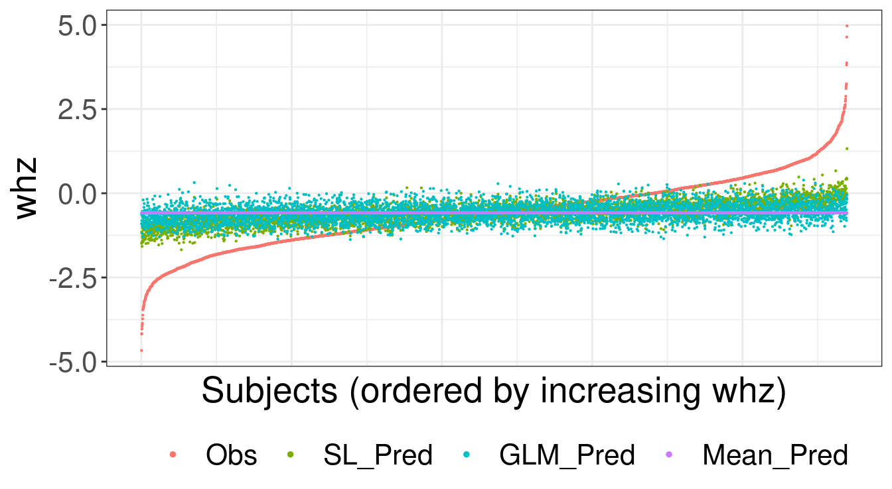

---
output:
  pdf_document: default
  html_document: default
---

# Super Learning {#sl3}

_Rachael Phillips_

Based on the [`sl3` `R` package](https://github.com/tlverse/sl3) by _Jeremy
Coyle, Nima Hejazi, Ivana Malenica, Rachael Phillips, and Oleg Sofrygin_.

Updated: 2022-06-26

### Learning Objectives {-}

By the end of this chapter you will be able to:

1. Select a performance metric that is optimized by the true prediction
   function and aligns with the intended use of the analysis in the real world.
2. Assemble a diverse set ("library") of learners to be considered in the super
   learner. In particular, you should be able to:

     a. Customize a learner by modifying its tuning parameters.
     b. Create variations of the same base learner with different tuning
        parameter specifications.
     c. Couple screener(s) with learner(s) to create learners that consider as
        covariates a reduced, screener-selected subset of them.

3. Specify a meta-learner that optimizes the objective function of interest.
4. Justify the library and the meta-learner in terms of the prediction problem
   at hand, intended use of the analysis in the real world, statistical model,
   sample size, number of covariates, and outcome prevalence for discrete
   outcomes.
5. Interpret the fit for a super learner from the table of cross-validated risk
   estimates and the super learner coefficients.


## Introduction

A common task in data analysis is prediction, or using the observed data to
learn a function that takes as input data on covariates/predictors and outputs a
predicted value. Occasionally, the scientific question of interest lends itself
to causal effect estimation. Even in these scenarios, where prediction is not in
the forefront, prediction tasks are embedded in the procedure. For instance, in
targeted minimum loss-based estimation (TMLE), predictive modeling is necessary
for estimating outcome regressions and propensity scores.

There are various strategies that can be employed to model relationships from
data, which we refer to interchangeably as "estimators", "algorithms", and
"learners". For some data algorithms that can pick up on complex relationships
in the data are necessary to adequately model it, and for other data parametric
regression learners might fit the data reasonably well. It is generally
impossible to know in advance which approach will be the best for a given data
set and prediction problem.

The Super Learner (SL) solves the issue of selecting an algorithm, as it can
consider many of them, from the simplest parametric regressions to the most
complex machine learning algorithms (e.g., neural nets, support vector machines,
etc). Additionally, it is proven to perform as well as possible in large
samples, given the learners specified [@vdl2007super]. The SL represents an
entirely pre-specified, data-adaptive, and theoretically grounded approach for
predictive modeling. It has been shown to be adaptive and robust in a variety of
applications, and in even in very small samples. Detailed descriptions outlining
the SL procedure are widely available [@polley2010super; @naimi2018stacked].
Practical considerations for specifying the SL, including how to specify a rich
and diverse library of learners, choose a performance metric for the SL, and
specify a cross-validation (CV) scheme, are described in a pre-print article
[@rvp2022super]. Here, we focus on introducing `sl3`, the standard `tlverse`
software package for SL.

<!--
Add more about sl3: how it's different from SuperLearner, supported features,
GitHub, filing issues, support, documentation, etc.
-->

## Recipe for Fitting a Super Learner with `sl3`

In this section, the core functionality for fitting any SL with `sl3` is
illustrated. In the sections that follow, additional `sl3` functionality is
presented.

Fitting any SL with `sl3` consists of the following three steps:

1. Define the prediction task with `make_sl3_Task`.
2. Instantiate the SL with `Lrnr_sl`.
3. Fit the SL to the task with `train`.

#### Running example with WASH Benefits dataset {-}

We will use the WASH Benefits Bangladesh study as an example to guide this 
overview of `sl3`. In this study, say we are interested in predicting the child development outcome, weight-for-height z-score, from covariates/predictors, 
including socio-economic status variables, gestational age, and maternal 
features. More information on this dataset is described in the ["Meet 
the Data"](https://tlverse.org/tlverse-handbook/data.html#wash) chapter of the 
`tlverse` handbook. 

#### Preliminaries {-}

First, we need to load the data and relevant packages into the R session.

##### Load the data {-}


We will use the `fread` function in the `data.table` R package to load the 
WASH Benefits example dataset:


```r
library(data.table)
washb_data <- fread(
  paste0(
    "https://raw.githubusercontent.com/tlverse/tlverse-data/master/",
    "wash-benefits/washb_data.csv"
  ),
  stringsAsFactors = TRUE
)
```

Next, we will take a peek at the first few rows of our dataset:


```r
head(washb_data)
```
<div style="border: 1px solid #ddd; padding: 0px; overflow-y: scroll; height:300px; overflow-x: scroll; width:100%; "><table class="table" style="margin-left: auto; margin-right: auto;">
 <thead>
  <tr>
   <th style="text-align:right;position: sticky; top:0; background-color: #FFFFFF;position: sticky; top:0; background-color: #FFFFFF;"> whz </th>
   <th style="text-align:left;position: sticky; top:0; background-color: #FFFFFF;position: sticky; top:0; background-color: #FFFFFF;"> tr </th>
   <th style="text-align:left;position: sticky; top:0; background-color: #FFFFFF;position: sticky; top:0; background-color: #FFFFFF;"> fracode </th>
   <th style="text-align:right;position: sticky; top:0; background-color: #FFFFFF;position: sticky; top:0; background-color: #FFFFFF;"> month </th>
   <th style="text-align:right;position: sticky; top:0; background-color: #FFFFFF;position: sticky; top:0; background-color: #FFFFFF;"> aged </th>
   <th style="text-align:left;position: sticky; top:0; background-color: #FFFFFF;position: sticky; top:0; background-color: #FFFFFF;"> sex </th>
   <th style="text-align:right;position: sticky; top:0; background-color: #FFFFFF;position: sticky; top:0; background-color: #FFFFFF;"> momage </th>
   <th style="text-align:left;position: sticky; top:0; background-color: #FFFFFF;position: sticky; top:0; background-color: #FFFFFF;"> momedu </th>
   <th style="text-align:right;position: sticky; top:0; background-color: #FFFFFF;position: sticky; top:0; background-color: #FFFFFF;"> momheight </th>
   <th style="text-align:left;position: sticky; top:0; background-color: #FFFFFF;position: sticky; top:0; background-color: #FFFFFF;"> hfiacat </th>
   <th style="text-align:right;position: sticky; top:0; background-color: #FFFFFF;position: sticky; top:0; background-color: #FFFFFF;"> Nlt18 </th>
   <th style="text-align:right;position: sticky; top:0; background-color: #FFFFFF;position: sticky; top:0; background-color: #FFFFFF;"> Ncomp </th>
   <th style="text-align:right;position: sticky; top:0; background-color: #FFFFFF;position: sticky; top:0; background-color: #FFFFFF;"> watmin </th>
   <th style="text-align:right;position: sticky; top:0; background-color: #FFFFFF;position: sticky; top:0; background-color: #FFFFFF;"> elec </th>
   <th style="text-align:right;position: sticky; top:0; background-color: #FFFFFF;position: sticky; top:0; background-color: #FFFFFF;"> floor </th>
   <th style="text-align:right;position: sticky; top:0; background-color: #FFFFFF;position: sticky; top:0; background-color: #FFFFFF;"> walls </th>
   <th style="text-align:right;position: sticky; top:0; background-color: #FFFFFF;position: sticky; top:0; background-color: #FFFFFF;"> roof </th>
   <th style="text-align:right;position: sticky; top:0; background-color: #FFFFFF;position: sticky; top:0; background-color: #FFFFFF;"> asset_wardrobe </th>
   <th style="text-align:right;position: sticky; top:0; background-color: #FFFFFF;position: sticky; top:0; background-color: #FFFFFF;"> asset_table </th>
   <th style="text-align:right;position: sticky; top:0; background-color: #FFFFFF;position: sticky; top:0; background-color: #FFFFFF;"> asset_chair </th>
   <th style="text-align:right;position: sticky; top:0; background-color: #FFFFFF;position: sticky; top:0; background-color: #FFFFFF;"> asset_khat </th>
   <th style="text-align:right;position: sticky; top:0; background-color: #FFFFFF;position: sticky; top:0; background-color: #FFFFFF;"> asset_chouki </th>
   <th style="text-align:right;position: sticky; top:0; background-color: #FFFFFF;position: sticky; top:0; background-color: #FFFFFF;"> asset_tv </th>
   <th style="text-align:right;position: sticky; top:0; background-color: #FFFFFF;position: sticky; top:0; background-color: #FFFFFF;"> asset_refrig </th>
   <th style="text-align:right;position: sticky; top:0; background-color: #FFFFFF;position: sticky; top:0; background-color: #FFFFFF;"> asset_bike </th>
   <th style="text-align:right;position: sticky; top:0; background-color: #FFFFFF;position: sticky; top:0; background-color: #FFFFFF;"> asset_moto </th>
   <th style="text-align:right;position: sticky; top:0; background-color: #FFFFFF;position: sticky; top:0; background-color: #FFFFFF;"> asset_sewmach </th>
   <th style="text-align:right;position: sticky; top:0; background-color: #FFFFFF;position: sticky; top:0; background-color: #FFFFFF;"> asset_mobile </th>
  </tr>
 </thead>
<tbody>
  <tr>
   <td style="text-align:right;"> 0.00 </td>
   <td style="text-align:left;"> Control </td>
   <td style="text-align:left;"> N05265 </td>
   <td style="text-align:right;"> 9 </td>
   <td style="text-align:right;"> 268 </td>
   <td style="text-align:left;"> male </td>
   <td style="text-align:right;"> 30 </td>
   <td style="text-align:left;"> Primary (1-5y) </td>
   <td style="text-align:right;"> 146.4 </td>
   <td style="text-align:left;"> Food Secure </td>
   <td style="text-align:right;"> 3 </td>
   <td style="text-align:right;"> 11 </td>
   <td style="text-align:right;"> 0 </td>
   <td style="text-align:right;"> 1 </td>
   <td style="text-align:right;"> 0 </td>
   <td style="text-align:right;"> 1 </td>
   <td style="text-align:right;"> 1 </td>
   <td style="text-align:right;"> 0 </td>
   <td style="text-align:right;"> 1 </td>
   <td style="text-align:right;"> 1 </td>
   <td style="text-align:right;"> 1 </td>
   <td style="text-align:right;"> 0 </td>
   <td style="text-align:right;"> 1 </td>
   <td style="text-align:right;"> 0 </td>
   <td style="text-align:right;"> 0 </td>
   <td style="text-align:right;"> 0 </td>
   <td style="text-align:right;"> 0 </td>
   <td style="text-align:right;"> 1 </td>
  </tr>
  <tr>
   <td style="text-align:right;"> -1.16 </td>
   <td style="text-align:left;"> Control </td>
   <td style="text-align:left;"> N05265 </td>
   <td style="text-align:right;"> 9 </td>
   <td style="text-align:right;"> 286 </td>
   <td style="text-align:left;"> male </td>
   <td style="text-align:right;"> 25 </td>
   <td style="text-align:left;"> Primary (1-5y) </td>
   <td style="text-align:right;"> 148.8 </td>
   <td style="text-align:left;"> Moderately Food Insecure </td>
   <td style="text-align:right;"> 2 </td>
   <td style="text-align:right;"> 4 </td>
   <td style="text-align:right;"> 0 </td>
   <td style="text-align:right;"> 1 </td>
   <td style="text-align:right;"> 0 </td>
   <td style="text-align:right;"> 1 </td>
   <td style="text-align:right;"> 1 </td>
   <td style="text-align:right;"> 0 </td>
   <td style="text-align:right;"> 1 </td>
   <td style="text-align:right;"> 0 </td>
   <td style="text-align:right;"> 1 </td>
   <td style="text-align:right;"> 1 </td>
   <td style="text-align:right;"> 0 </td>
   <td style="text-align:right;"> 0 </td>
   <td style="text-align:right;"> 0 </td>
   <td style="text-align:right;"> 0 </td>
   <td style="text-align:right;"> 0 </td>
   <td style="text-align:right;"> 1 </td>
  </tr>
  <tr>
   <td style="text-align:right;"> -1.05 </td>
   <td style="text-align:left;"> Control </td>
   <td style="text-align:left;"> N08002 </td>
   <td style="text-align:right;"> 9 </td>
   <td style="text-align:right;"> 264 </td>
   <td style="text-align:left;"> male </td>
   <td style="text-align:right;"> 25 </td>
   <td style="text-align:left;"> Primary (1-5y) </td>
   <td style="text-align:right;"> 152.2 </td>
   <td style="text-align:left;"> Food Secure </td>
   <td style="text-align:right;"> 1 </td>
   <td style="text-align:right;"> 10 </td>
   <td style="text-align:right;"> 0 </td>
   <td style="text-align:right;"> 0 </td>
   <td style="text-align:right;"> 0 </td>
   <td style="text-align:right;"> 1 </td>
   <td style="text-align:right;"> 1 </td>
   <td style="text-align:right;"> 0 </td>
   <td style="text-align:right;"> 0 </td>
   <td style="text-align:right;"> 1 </td>
   <td style="text-align:right;"> 0 </td>
   <td style="text-align:right;"> 1 </td>
   <td style="text-align:right;"> 0 </td>
   <td style="text-align:right;"> 0 </td>
   <td style="text-align:right;"> 0 </td>
   <td style="text-align:right;"> 0 </td>
   <td style="text-align:right;"> 0 </td>
   <td style="text-align:right;"> 1 </td>
  </tr>
  <tr>
   <td style="text-align:right;"> -1.26 </td>
   <td style="text-align:left;"> Control </td>
   <td style="text-align:left;"> N08002 </td>
   <td style="text-align:right;"> 9 </td>
   <td style="text-align:right;"> 252 </td>
   <td style="text-align:left;"> female </td>
   <td style="text-align:right;"> 28 </td>
   <td style="text-align:left;"> Primary (1-5y) </td>
   <td style="text-align:right;"> 140.2 </td>
   <td style="text-align:left;"> Food Secure </td>
   <td style="text-align:right;"> 3 </td>
   <td style="text-align:right;"> 5 </td>
   <td style="text-align:right;"> 0 </td>
   <td style="text-align:right;"> 1 </td>
   <td style="text-align:right;"> 0 </td>
   <td style="text-align:right;"> 1 </td>
   <td style="text-align:right;"> 1 </td>
   <td style="text-align:right;"> 1 </td>
   <td style="text-align:right;"> 1 </td>
   <td style="text-align:right;"> 1 </td>
   <td style="text-align:right;"> 1 </td>
   <td style="text-align:right;"> 0 </td>
   <td style="text-align:right;"> 0 </td>
   <td style="text-align:right;"> 0 </td>
   <td style="text-align:right;"> 1 </td>
   <td style="text-align:right;"> 0 </td>
   <td style="text-align:right;"> 0 </td>
   <td style="text-align:right;"> 1 </td>
  </tr>
  <tr>
   <td style="text-align:right;"> -0.59 </td>
   <td style="text-align:left;"> Control </td>
   <td style="text-align:left;"> N06531 </td>
   <td style="text-align:right;"> 9 </td>
   <td style="text-align:right;"> 336 </td>
   <td style="text-align:left;"> female </td>
   <td style="text-align:right;"> 19 </td>
   <td style="text-align:left;"> Secondary (&gt;5y) </td>
   <td style="text-align:right;"> 150.9 </td>
   <td style="text-align:left;"> Food Secure </td>
   <td style="text-align:right;"> 2 </td>
   <td style="text-align:right;"> 7 </td>
   <td style="text-align:right;"> 0 </td>
   <td style="text-align:right;"> 1 </td>
   <td style="text-align:right;"> 0 </td>
   <td style="text-align:right;"> 1 </td>
   <td style="text-align:right;"> 1 </td>
   <td style="text-align:right;"> 1 </td>
   <td style="text-align:right;"> 1 </td>
   <td style="text-align:right;"> 1 </td>
   <td style="text-align:right;"> 1 </td>
   <td style="text-align:right;"> 1 </td>
   <td style="text-align:right;"> 0 </td>
   <td style="text-align:right;"> 0 </td>
   <td style="text-align:right;"> 0 </td>
   <td style="text-align:right;"> 0 </td>
   <td style="text-align:right;"> 0 </td>
   <td style="text-align:right;"> 1 </td>
  </tr>
  <tr>
   <td style="text-align:right;"> -0.51 </td>
   <td style="text-align:left;"> Control </td>
   <td style="text-align:left;"> N06531 </td>
   <td style="text-align:right;"> 9 </td>
   <td style="text-align:right;"> 304 </td>
   <td style="text-align:left;"> male </td>
   <td style="text-align:right;"> 20 </td>
   <td style="text-align:left;"> Secondary (&gt;5y) </td>
   <td style="text-align:right;"> 154.2 </td>
   <td style="text-align:left;"> Severely Food Insecure </td>
   <td style="text-align:right;"> 0 </td>
   <td style="text-align:right;"> 3 </td>
   <td style="text-align:right;"> 1 </td>
   <td style="text-align:right;"> 1 </td>
   <td style="text-align:right;"> 0 </td>
   <td style="text-align:right;"> 1 </td>
   <td style="text-align:right;"> 1 </td>
   <td style="text-align:right;"> 0 </td>
   <td style="text-align:right;"> 0 </td>
   <td style="text-align:right;"> 0 </td>
   <td style="text-align:right;"> 0 </td>
   <td style="text-align:right;"> 1 </td>
   <td style="text-align:right;"> 0 </td>
   <td style="text-align:right;"> 0 </td>
   <td style="text-align:right;"> 0 </td>
   <td style="text-align:right;"> 0 </td>
   <td style="text-align:right;"> 0 </td>
   <td style="text-align:right;"> 1 </td>
  </tr>
</tbody>
</table></div>

##### Install `sl3` software (as needed) {-}

To install any package, we recommend first clearing the R workspace and then 
restarting the R session. In RStudio, this can be achieved by clicking the 
tab "Session" then "Clear Workspace", and then clicking "Session" again then 
"Restart R".

We can install `sl3` using the function `install_github` provided in the 
`devtools` R package. We are using the development ("devel") version of `sl3` 
in these materials, so we show how to install that version below. 

```r
library(devtools)
install_github("tlverse/sl3@devel")
```

Once the R package is installed, we recommend restarting the R session again. 

<!--
If you would like to use newer `sl3` functionality that is available in the
devel branch of the `sl3` GitHub repository, you need to install that version
of the package (i.e., `usethis::install_github(tlverse/sl3@devel)`), re-start
your `R` session, and then re-load the `sl3` package.
-->

##### Load `sl3` software {-}

Once `sl3` is installed, we can load it like any other `R` package:

```r
library(sl3)
```

### 1. Define the prediction task with `make_sl3_Task` {-}

The `sl3_Task` object defines the prediction task of interest. Recall that 
our task in this illustrative example is to use the WASH Benefits Bangladesh 
example dataset to learn a function of the covariates for predicting 
weight-for-height Z-score `whz`.


```r
# create the task (i.e., use washb_data to predict outcome using covariates)
task <- make_sl3_Task(
  data = washb_data,
  outcome = "whz",
  covariates = c("tr", "fracode", "month", "aged", "sex", "momage", "momedu", 
                 "momheight", "hfiacat", "Nlt18", "Ncomp", "watmin", "elec", 
                 "floor", "walls", "roof", "asset_wardrobe", "asset_table", 
                 "asset_chair", "asset_khat", "asset_chouki", "asset_tv", 
                 "asset_refrig", "asset_bike", "asset_moto", "asset_sewmach", 
                 "asset_mobile")
)

# let's examine the task
task
An sl3 Task with 4695 obs and these nodes:
$covariates
 [1] "tr"              "fracode"         "month"           "aged"           
 [5] "sex"             "momage"          "momedu"          "momheight"      
 [9] "hfiacat"         "Nlt18"           "Ncomp"           "watmin"         
[13] "elec"            "floor"           "walls"           "roof"           
[17] "asset_wardrobe"  "asset_table"     "asset_chair"     "asset_khat"     
[21] "asset_chouki"    "asset_tv"        "asset_refrig"    "asset_bike"     
[25] "asset_moto"      "asset_sewmach"   "asset_mobile"    "delta_momage"   
[29] "delta_momheight"

$outcome
[1] "whz"

$id
NULL

$weights
NULL

$offset
NULL

$time
NULL
```

The `sl3_Task` keeps track of the roles the variables play in the prediction 
problem. Additional information relevant to the prediction task (such as 
observational-level weights, offset, id, CV folds) can also be specified in 
`make_sl3_Task`. The default CV fold structure in `sl3` is V-fold CV (VFCV) 
with V=10 folds; if `id` is specified in the task then a clustered V=10 VFCV 
scheme is considered, and if the outcome type is binary or categorical then 
a stratified V=10 VFCV scheme is considered. Different CV schemes can be 
specified by inputting an `origami` folds object, as generated by the 
`make_folds` function in the `origami` R package. Refer to the documentation 
on `origami`'s `make_folds` function for more information (e.g., in RStudio, by 
loading the `origami` R package and then inputting "?make_folds" in the 
Console). For more details on `sl3_Task`, refer to its documentation (e.g., by 
inputting "?sl3_Task" in R). 

*Tip:* If you type `task$` and then press the tab key (press tab twice if not in 
RStudio), you can view all of the active and public fields, and methods that 
can be accessed from the `task$` object. This `$` is like the key to access
many internals of an object. In the next section, will see how we can use `$`
to dig into SL fit objects as well, to obtain predictions from an SL fit or 
candidate learners, examine an SL fit or its candidates, and summarize an SL 
fit.

### 2. Instantiate the Super Learner with `Lrnr_sl` {-}

In order to create `Lrnr_sl` we need to specify, at the minimum, a set of 
learners for the SL to consider as candidates. This set of algorithms is 
also commonly referred to as the "library". We might also specify the 
meta-learner, which is the algorithm that ensembles the learners, but this is 
optional since there are already defaults set up in `sl3`. See "Practical 
considerations for specifying a super learner" for step-by-step guidelines for 
tailoring the SL specification, including the library and meta-learner(s), to 
perform well for the prediction task at hand [@rvp2022super].

Learners have properties that indicate what features they support. We may use
the `sl3_list_properties()` function to get a list of all properties supported 
by at least one learner:


```r
sl3_list_properties()
 [1] "binomial"      "categorical"   "continuous"    "cv"           
 [5] "density"       "h2o"           "ids"           "importance"   
 [9] "offset"        "preprocessing" "sampling"      "screener"     
[13] "timeseries"    "weights"       "wrapper"      
```

Since `whz` is a continuous outcome, we can identify the learners that support
this outcome type with `sl3_list_learners()`:


```r
sl3_list_learners(properties = "continuous")
 [1] "Lrnr_arima"                     "Lrnr_bartMachine"              
 [3] "Lrnr_bayesglm"                  "Lrnr_bilstm"                   
 [5] "Lrnr_bound"                     "Lrnr_caret"                    
 [7] "Lrnr_cv_selector"               "Lrnr_dbarts"                   
 [9] "Lrnr_earth"                     "Lrnr_expSmooth"                
[11] "Lrnr_ga"                        "Lrnr_gam"                      
[13] "Lrnr_gbm"                       "Lrnr_glm"                      
[15] "Lrnr_glm_fast"                  "Lrnr_glm_semiparametric"       
[17] "Lrnr_glmnet"                    "Lrnr_glmtree"                  
[19] "Lrnr_grf"                       "Lrnr_gru_keras"                
[21] "Lrnr_gts"                       "Lrnr_h2o_glm"                  
[23] "Lrnr_h2o_grid"                  "Lrnr_hal9001"                  
[25] "Lrnr_HarmonicReg"               "Lrnr_hts"                      
[27] "Lrnr_lightgbm"                  "Lrnr_lstm_keras"               
[29] "Lrnr_mean"                      "Lrnr_multiple_ts"              
[31] "Lrnr_nnet"                      "Lrnr_nnls"                     
[33] "Lrnr_optim"                     "Lrnr_pkg_SuperLearner"         
[35] "Lrnr_pkg_SuperLearner_method"   "Lrnr_pkg_SuperLearner_screener"
[37] "Lrnr_polspline"                 "Lrnr_randomForest"             
[39] "Lrnr_ranger"                    "Lrnr_rpart"                    
[41] "Lrnr_rugarch"                   "Lrnr_screener_correlation"     
[43] "Lrnr_solnp"                     "Lrnr_stratified"               
[45] "Lrnr_svm"                       "Lrnr_tsDyn"                    
[47] "Lrnr_xgboost"                  
```

Now that we have an idea of some learners, let's instantiate a few of them. 
Below we instantiate `Lrnr_glm` and `Lrnr_mean`, a main terms generalized 
linear model (GLM) and a mean model, respectively. 


```r
lrn_glm <- Lrnr_glm$new()
lrn_mean <- Lrnr_mean$new()
```

For both of the learners created above, we just used the default tuning 
parameters. We can also customize a learner's tuning parameters to incorporate 
a diversity of different settings, and consider the same learner with different 
tuning parameter specifications. 

Below, we consider the same base learner, `Lrnr_glmnet` (i.e., GLMs
with elastic net regression), and create two different candidates from it:
an L2-penalized/ridge regression and an L1-penalized/lasso regression. 


```r
# penalized regressions:
lrn_ridge <- Lrnr_glmnet$new(alpha = 0)
lrn_lasso <- Lrnr_glmnet$new(alpha = 1)
```

By setting `alpha` in `Lrnr_glmnet` above, we customized this learner's tuning 
parameter. When we instantiate `Lrnr_hal9001` below we show how multiple tuning 
parameters (specifically, `max_degree`and `num_knots`) can be modified at the 
same time. 

Let's also instantiate some more learners that do not enforce relationships to 
be linear or monotonic, and to further diversify the set of candidates to 
include nonparametric learners, since up to this point all of the learners we've 
instantiated have been parametric. 


```r
# spline regressions:
lrn_polspline <- Lrnr_polspline$new()
lrn_earth <- Lrnr_earth$new()

# fast highly adaptive lasso (HAL) implementation
lrn_hal <- Lrnr_hal9001$new(max_degree = 2, num_knots = c(3,2), nfolds = 5)

# tree-based methods
lrn_ranger <- Lrnr_ranger$new()
lrn_xgb <- Lrnr_xgboost$new()
```

Let's also include a generalized additive model (GAM) and Bayesian GLM to 
further diversify the pool that we will consider as candidates in the SL. 

```r
lrn_gam <- Lrnr_gam$new()
lrn_bayesglm <- Lrnr_bayesglm$new()
```

Now that we've instantiated a set of learners, we need to put them together so 
the SL can consider them as candidates. In `sl3`, we do this by creating a 
so-called `Stack` of learners. A `Stack` is created in the same way we 
created the learners. This is because `Stack` is a learner itself; it has the 
same interface as all of the other learners. What makes a stack special is that 
it considers multiple learners at once: it can train them simultaneously, so 
that their predictions can be combined and/or compared.


```r
stack <- Stack$new(
  lrn_glm, lrn_mean, lrn_ridge, lrn_lasso, lrn_polspline, lrn_earth, lrn_hal, 
  lrn_ranger, lrn_xgb, lrn_gam, lrn_bayesglm
)
stack
 [1] "Lrnr_glm_TRUE"                          
 [2] "Lrnr_mean"                              
 [3] "Lrnr_glmnet_NULL_deviance_10_0_100_TRUE"
 [4] "Lrnr_glmnet_NULL_deviance_10_1_100_TRUE"
 [5] "Lrnr_polspline"                         
 [6] "Lrnr_earth_2_3_backward_0_1_0_0"        
 [7] "Lrnr_hal9001_2_1_c(3, 2)_5"             
 [8] "Lrnr_ranger_500_TRUE_none_1"            
 [9] "Lrnr_xgboost_20_1"                      
[10] "Lrnr_gam_NULL_NULL_GCV.Cp"              
[11] "Lrnr_bayesglm_TRUE"                     
```

We can see that the names of the learners in the stack are long. This is 
because the default naming of a learner in `sl3` is clunky: for each learner, 
every tuning parameter in `sl3` is contained in the name. In the next section, 
["Naming 
Learners"](https://tlverse.org/tlverse-handbook/sl3.html#naming-learners),
we show a few different ways for the user to name learners as they wish.

Now that we have instantiated a set of learners and stacked them together, we 
are ready to instantiate the SL. We will use the default meta-learner, which is 
non-negative least squares (NNLS) regression (`Lrnr_nnls`) for continuous 
outcomes, and we will still go ahead and specify it for illustrative purposes.


```r
sl <- Lrnr_sl$new(learners = stack, metalearner = Lrnr_nnls$new())
```

### 3. Fit the Super Learner to the prediction task with `train` {-}

The last step for fitting the SL to the prediction task is to call `train` and 
supply the task. Before we call `train`, we will set a random number generator 
so the results are reproducible, and we will also time it.


```r
start_time <- proc.time() # start time

set.seed(4197)
sl_fit <- sl$train(task = task)

runtime_sl_fit <- proc.time() - start_time # end time - start time = run time
runtime_sl_fit
   user  system elapsed 
269.249   1.745 270.395 
```

It took 270.4 seconds 
(4.5 minutes) to fit the SL. 

#### Summary {-}

In this section, the core functionality for fitting any SL with `sl3` was
illustrated. This consists of the following three steps:

1. Define the prediction task with `make_sl3_Task`.
2. Instantiate the SL with `Lrnr_sl`.
3. Fit the SL to the task with `train`.

This example was for demonstrative purposes only. See @rvp2022super for 
step-by-step guidelines for constructing a SL that is well-specified for the 
prediction task at hand. 

## Additional `sl3` Topics

### Obtaining Predictions

#### Super Learner and candidate learner predictions

We will draw on the fitted SL object from above, `sl_fit`, to obtain the
SL's predicted `whz` value for each subject.


```r
sl_preds <- sl_fit$predict(task = task)
head(sl_preds)
[1] -0.5719 -0.8717 -0.6881 -0.7342 -0.6308 -0.6596
```

We can also obtain predicted values from a candidate learner in the SL. Below
we obtain predictions for the GLM learner.


```r
glm_preds <- sl_fit$learner_fits$Lrnr_glm_TRUE$predict(task = task)
head(glm_preds)
[1] -0.7262 -0.9361 -0.7085 -0.6492 -0.7013 -0.8462
```

Note that the predicted values for the SL correspond to so-called "full fits" 
of the candidate learners, in which the candidates are fit to the entire 
analytic dataset, i.e., all of the data supplied as `data` to `make_sl3_Task`. 
Figure 2 in @rvp2022super provides a visual overview of the SL fitting 
procedure. 


```r
# we can also access the candidate learner full fits directly and obtain
# the same "full fit" candidate predictions from there 
# (we split this into two lines to avoid overflow)
stack_full_fits <- sl_fit$fit_object$full_fit$learner_fits$Stack$learner_fits
glm_preds_full_fit <- stack_full_fits$Lrnr_glm_TRUE$predict(task)

# check that they are identical
identical(glm_preds, glm_preds_full_fit)
[1] TRUE
```
Below we visualize the observed values for `whz` and predicted `whz` values for 
SL, GLM and the mean.

```r
# table of observed and predicted outcome values and arrange by observed values
df_plot <- data.table(
  Obs = washb_data[["whz"]], SL_Pred = sl_preds, GLM_Pred = glm_preds,
  Mean_Pred = sl_fit$learner_fits$Lrnr_mean$predict(task)
)
df_plot <- df_plot[order(df_plot$Obs), ] 
```

```r
head(df_plot)
```
<div style="border: 1px solid #ddd; padding: 0px; overflow-y: scroll; height:300px; overflow-x: scroll; width:100%; "><table class="table" style="margin-left: auto; margin-right: auto;">
 <thead>
  <tr>
   <th style="text-align:right;position: sticky; top:0; background-color: #FFFFFF;position: sticky; top:0; background-color: #FFFFFF;"> Obs </th>
   <th style="text-align:right;position: sticky; top:0; background-color: #FFFFFF;position: sticky; top:0; background-color: #FFFFFF;"> SL_Pred </th>
   <th style="text-align:right;position: sticky; top:0; background-color: #FFFFFF;position: sticky; top:0; background-color: #FFFFFF;"> GLM_Pred </th>
   <th style="text-align:right;position: sticky; top:0; background-color: #FFFFFF;position: sticky; top:0; background-color: #FFFFFF;"> Mean_Pred </th>
  </tr>
 </thead>
<tbody>
  <tr>
   <td style="text-align:right;"> -4.67 </td>
   <td style="text-align:right;"> -1.487 </td>
   <td style="text-align:right;"> -0.9096 </td>
   <td style="text-align:right;"> -0.5861 </td>
  </tr>
  <tr>
   <td style="text-align:right;"> -4.18 </td>
   <td style="text-align:right;"> -1.170 </td>
   <td style="text-align:right;"> -0.6391 </td>
   <td style="text-align:right;"> -0.5861 </td>
  </tr>
  <tr>
   <td style="text-align:right;"> -4.17 </td>
   <td style="text-align:right;"> -1.147 </td>
   <td style="text-align:right;"> -0.8098 </td>
   <td style="text-align:right;"> -0.5861 </td>
  </tr>
  <tr>
   <td style="text-align:right;"> -4.03 </td>
   <td style="text-align:right;"> -1.447 </td>
   <td style="text-align:right;"> -0.8960 </td>
   <td style="text-align:right;"> -0.5861 </td>
  </tr>
  <tr>
   <td style="text-align:right;"> -3.95 </td>
   <td style="text-align:right;"> -1.579 </td>
   <td style="text-align:right;"> -1.1952 </td>
   <td style="text-align:right;"> -0.5861 </td>
  </tr>
  <tr>
   <td style="text-align:right;"> -3.90 </td>
   <td style="text-align:right;"> -1.285 </td>
   <td style="text-align:right;"> -0.9849 </td>
   <td style="text-align:right;"> -0.5861 </td>
  </tr>
</tbody>
</table></div>

```r
# melt the table so we can plot observed and predicted values
df_plot$id <- seq(1:nrow(df_plot))
df_plot_melted <- melt(
  df_plot, id.vars = "id",
  measure.vars = c("Obs", "SL_Pred", "GLM_Pred", "Mean_Pred")
)

library(ggplot2)
ggplot(df_plot_melted, aes(id, value, color = variable)) + 
  geom_point(size = 0.1) + 
  labs(x = "Subjects (ordered by increasing whz)", 
       y = "whz") +
  theme(legend.position = "bottom", legend.title = element_blank(),
        axis.text.x = element_blank(), axis.ticks.x = element_blank()) + 
  guides(color = guide_legend(override.aes = list(size = 1)))
```

<div class="figure" style="text-align: center">

<p class="caption">(\#fig:predobs-plot)Observed and predicted values for weight-for-height z-score (whz)</p>
</div>

#### Cross-validated predictions

We can also obtain the cross-validated (CV) predictions for the candidate 
learners. We can do this is a few different ways. 

```r
# one way to obtain the CV predictions for the candidate learners
cv_preds_option1 <- sl_fit$fit_object$cv_fit$predict_fold(
  task = task, fold_number = "validation"
)
# another way to obtain the CV predictions for the candidate learners
cv_preds_option2 <- sl_fit$fit_object$cv_fit$predict(task = task)

# we can check that they are identical
identical(cv_preds_option1, cv_preds_option2)
[1] TRUE
```


```r
head(cv_preds_option1)
```
<div style="border: 1px solid #ddd; padding: 0px; overflow-y: scroll; height:300px; overflow-x: scroll; width:100%; "><table class="table" style="margin-left: auto; margin-right: auto;">
 <thead>
  <tr>
   <th style="text-align:right;position: sticky; top:0; background-color: #FFFFFF;position: sticky; top:0; background-color: #FFFFFF;"> Lrnr_glm_TRUE </th>
   <th style="text-align:right;position: sticky; top:0; background-color: #FFFFFF;position: sticky; top:0; background-color: #FFFFFF;"> Lrnr_mean </th>
   <th style="text-align:right;position: sticky; top:0; background-color: #FFFFFF;position: sticky; top:0; background-color: #FFFFFF;"> Lrnr_glmnet_NULL_deviance_10_0_100_TRUE </th>
   <th style="text-align:right;position: sticky; top:0; background-color: #FFFFFF;position: sticky; top:0; background-color: #FFFFFF;"> Lrnr_glmnet_NULL_deviance_10_1_100_TRUE </th>
   <th style="text-align:right;position: sticky; top:0; background-color: #FFFFFF;position: sticky; top:0; background-color: #FFFFFF;"> Lrnr_polspline </th>
   <th style="text-align:right;position: sticky; top:0; background-color: #FFFFFF;position: sticky; top:0; background-color: #FFFFFF;"> Lrnr_earth_2_3_backward_0_1_0_0 </th>
   <th style="text-align:right;position: sticky; top:0; background-color: #FFFFFF;position: sticky; top:0; background-color: #FFFFFF;"> Lrnr_hal9001_2_1_c(3, 2)_5 </th>
   <th style="text-align:right;position: sticky; top:0; background-color: #FFFFFF;position: sticky; top:0; background-color: #FFFFFF;"> Lrnr_ranger_500_TRUE_none_1 </th>
   <th style="text-align:right;position: sticky; top:0; background-color: #FFFFFF;position: sticky; top:0; background-color: #FFFFFF;"> Lrnr_xgboost_20_1 </th>
   <th style="text-align:right;position: sticky; top:0; background-color: #FFFFFF;position: sticky; top:0; background-color: #FFFFFF;"> Lrnr_gam_NULL_NULL_GCV.Cp </th>
   <th style="text-align:right;position: sticky; top:0; background-color: #FFFFFF;position: sticky; top:0; background-color: #FFFFFF;"> Lrnr_bayesglm_TRUE </th>
  </tr>
 </thead>
<tbody>
  <tr>
   <td style="text-align:right;"> -0.7453 </td>
   <td style="text-align:right;"> -0.5931 </td>
   <td style="text-align:right;"> -0.6949 </td>
   <td style="text-align:right;"> -0.7034 </td>
   <td style="text-align:right;"> -0.7250 </td>
   <td style="text-align:right;"> -0.7156 </td>
   <td style="text-align:right;"> -0.6967 </td>
   <td style="text-align:right;"> -0.7419 </td>
   <td style="text-align:right;"> -0.7883 </td>
   <td style="text-align:right;"> -0.7244 </td>
   <td style="text-align:right;"> -0.7452 </td>
  </tr>
  <tr>
   <td style="text-align:right;"> -0.9447 </td>
   <td style="text-align:right;"> -0.5865 </td>
   <td style="text-align:right;"> -0.8150 </td>
   <td style="text-align:right;"> -0.7789 </td>
   <td style="text-align:right;"> -0.8449 </td>
   <td style="text-align:right;"> -0.8352 </td>
   <td style="text-align:right;"> -0.8333 </td>
   <td style="text-align:right;"> -0.6542 </td>
   <td style="text-align:right;"> -0.5983 </td>
   <td style="text-align:right;"> -0.9324 </td>
   <td style="text-align:right;"> -0.9445 </td>
  </tr>
  <tr>
   <td style="text-align:right;"> -0.6494 </td>
   <td style="text-align:right;"> -0.5931 </td>
   <td style="text-align:right;"> -0.7004 </td>
   <td style="text-align:right;"> -0.7254 </td>
   <td style="text-align:right;"> -0.7140 </td>
   <td style="text-align:right;"> -0.6089 </td>
   <td style="text-align:right;"> -0.6887 </td>
   <td style="text-align:right;"> -0.6391 </td>
   <td style="text-align:right;"> -0.6453 </td>
   <td style="text-align:right;"> -0.6111 </td>
   <td style="text-align:right;"> -0.6495 </td>
  </tr>
  <tr>
   <td style="text-align:right;"> -0.6211 </td>
   <td style="text-align:right;"> -0.5846 </td>
   <td style="text-align:right;"> -0.6237 </td>
   <td style="text-align:right;"> -0.6594 </td>
   <td style="text-align:right;"> -0.6525 </td>
   <td style="text-align:right;"> -0.6916 </td>
   <td style="text-align:right;"> -0.6843 </td>
   <td style="text-align:right;"> -0.6278 </td>
   <td style="text-align:right;"> -0.4697 </td>
   <td style="text-align:right;"> -0.5910 </td>
   <td style="text-align:right;"> -0.6214 </td>
  </tr>
  <tr>
   <td style="text-align:right;"> -0.7647 </td>
   <td style="text-align:right;"> -0.5846 </td>
   <td style="text-align:right;"> -0.6711 </td>
   <td style="text-align:right;"> -0.7069 </td>
   <td style="text-align:right;"> -0.7001 </td>
   <td style="text-align:right;"> -0.6969 </td>
   <td style="text-align:right;"> -0.6788 </td>
   <td style="text-align:right;"> -0.5657 </td>
   <td style="text-align:right;"> -0.6588 </td>
   <td style="text-align:right;"> -0.7975 </td>
   <td style="text-align:right;"> -0.7649 </td>
  </tr>
  <tr>
   <td style="text-align:right;"> -0.8873 </td>
   <td style="text-align:right;"> -0.5763 </td>
   <td style="text-align:right;"> -0.8106 </td>
   <td style="text-align:right;"> -0.7578 </td>
   <td style="text-align:right;"> -0.7125 </td>
   <td style="text-align:right;"> -0.4770 </td>
   <td style="text-align:right;"> -0.7393 </td>
   <td style="text-align:right;"> -0.8545 </td>
   <td style="text-align:right;"> -0.6963 </td>
   <td style="text-align:right;"> -0.9132 </td>
   <td style="text-align:right;"> -0.8872 </td>
  </tr>
</tbody>
</table></div>

##### `predict_fold` {-}
Our first option to get CV predictions, `cv_preds_option1`, used the 
`predict_fold` function to obtain validation set predictions across all folds. 
This function only exists for learner fits that are cross-validated in `sl3`, 
like those in `Lrnr_sl`. In addition to supplying `fold_number = "validation"` 
in `predict_fold`, we can set `fold_number = "full"` to obtain predictions from 
learners fit to the entire analytic dataset (i.e., all of the data supplied to 
`make_sl3_Task`). For instance, below we show that `glm_preds` we calculated 
above can also be obtained by setting `fold_number = "full"`.


```r
full_fit_preds <- sl_fit$fit_object$cv_fit$predict_fold(
  task = task, fold_number = "full"
)
glm_full_fit_preds <- full_fit_preds$Lrnr_glm_TRUE

# check that they are identical
identical(glm_preds, glm_full_fit_preds)
[1] TRUE
```

We can also supply a specific an integer between 1 and the number of CV folds 
to the `fold_number` argument in `predict_fold`, and an example of this 
functionality is shown in the next part.  

##### Cross-validated predictions by hand {-}
We can get the CV predictions "by hand", by tapping into each of the folds, and 
then using the fitted candidate learners (which were trained to the training 
set for each fold) to predict validation set outcomes (which were not seen in 
training).


```r
##### CV predictions "by hand" #####
# for each fold, i, we obtain validation set predictions:
cv_preds_list <- lapply(seq_along(task$folds), function(i){
  
  # get validation dataset for fold i:
  v_data <- task$data[task$folds[[i]]$validation_set, ]
  
  # get observed outcomes in fold i's validation dataset:
  v_outcomes <- v_data[["whz"]]

  # make task (for prediction) using fold i's validation dataset as data, 
  # and keeping all else the same:
  v_task <- make_sl3_Task(covariates = task$nodes$covariates, data = v_data)
  
  # get predicted outcomes for fold i's validation dataset, using candidates 
  # trained to fold i's training dataset
  v_preds <- sl_fit$fit_object$cv_fit$predict_fold(
    task = v_task, fold_number = i
  )
  # note: v_preds is a matrix of candidate learner predictions, where the 
  # number of rows is the number of observations in fold i's validation dataset 
  # and the number of columns is the number of candidate learners (excluding 
  # any that might have failed)
  
  # an identical way to get v_preds, which is used when we calculate the 
  # cv risk by hand in a later part of this chapter:
  # v_preds <- sl_fit$fit_object$cv_fit$fit_object$fold_fits[[i]]$predict(
  #   task = v_task
  # )
  
  # we will also return the row indices for fold i's validation set, so we 
  # can later reorder the CV predictions and make sure they are equal to what 
  # we obtained above
  return(list("v_preds" = v_preds, "v_index" = task$folds[[i]]$validation_set))
})

# extract the validation set predictions across all folds
cv_preds_byhand <- do.call(rbind, lapply(cv_preds_list, "[[", "v_preds"))

# extract the indices of validation set observations across all folds
# then reorder cv_preds_byhand to correspond to the ordering in the data
row_index_in_data <- unlist(lapply(cv_preds_list, "[[", "v_index"))
cv_preds_byhand_ordered <- cv_preds_byhand[order(row_index_in_data), ]
# now we can check that they are identical
identical(cv_preds_option1, cv_preds_byhand_ordered)
[1] TRUE
```

#### Predictions with new data

If we wanted to obtain predicted values for new data then we would need to 
create a new `sl3_Task` from the new data. Also, the covariates in this new 
`sl3_Task` must be identical to the covariates in the `sl3_Task` for training. 
As an example, let's assume we have new covariate data `washb_data_new` for 
which we want to use the fitted SL to obtain predicted weight-for-height
z-score values.


```r
# we do not evaluate this code chunk, as `washb_data_new` does not exist
prediction_task <- make_sl3_Task(
  data = washb_data_new, # assuming we have some new data for predictions
  covariates = c("tr", "fracode", "month", "aged", "sex", "momage", "momedu", 
                 "momheight", "hfiacat", "Nlt18", "Ncomp", "watmin", "elec", 
                 "floor", "walls", "roof", "asset_wardrobe", "asset_table", 
                 "asset_chair", "asset_khat", "asset_chouki", "asset_tv", 
                 "asset_refrig", "asset_bike", "asset_moto", "asset_sewmach", 
                 "asset_mobile")
)
sl_preds_new_task <- sl_fit$predict(task = prediction_task)
```
#### Counterfactual predictions

Counterfactual predictions are predicted values under an intervention of 
interest. Recall from above that we can obtain predicted values for new data by 
creating a `sl3_Task` with the new data whose covariates match the set 
considered for training. As an example that draws on the WASH Benefits 
Bangladesh study, suppose we would like to obtain predictions for every 
subject's weight-for-height z-score (`whz`) outcome under an intervention on 
treatment (`tr`) that sets it to the nutrition, water, sanitation, and 
handwashing regime. 

First we need to create a copy of the dataset, and then we can intervene on 
`tr` in the copied dataset, create a new `sl3_Task` using the copied data and 
the same covariates as the training task, and finally obtain predictions 
from the fitted SL (which we named `sl_fit` in the previous section). 


```r
### 1. Copy data
tr_intervention_data <- data.table::copy(washb_data) 

### 2. Define intervention in copied dataset
tr_intervention <- rep("Nutrition + WSH", nrow(washb_data))
# NOTE: When we intervene on a categorical variable (such as "tr"), we need to 
#       define the intervention as a categorical variable (ie a factor).
#       Also, even though not all levels of the factor will be represented in 
#       the intervention, we still need this factor to reflect all of the 
#       levels that are present in the observed data
tr_levels <- levels(washb_data[["tr"]])
tr_levels
[1] "Control"         "Handwashing"     "Nutrition"       "Nutrition + WSH"
[5] "Sanitation"      "WSH"             "Water"          
tr_intervention <- factor(tr_intervention, levels = tr_levels)
tr_intervention_data[,"tr" := tr_intervention, ]

### 3. Create a new sl3_Task
# note that we do not need to specify the outcome in this new task since we are 
# only using it to obtain predictions
tr_intervention_task <- make_sl3_Task(
  data = tr_intervention_data, 
  covariates = c("tr", "fracode", "month", "aged", "sex", "momage", "momedu", 
                 "momheight", "hfiacat", "Nlt18", "Ncomp", "watmin", "elec", 
                 "floor", "walls", "roof", "asset_wardrobe", "asset_table", 
                 "asset_chair", "asset_khat", "asset_chouki", "asset_tv", 
                 "asset_refrig", "asset_bike", "asset_moto", "asset_sewmach", 
                 "asset_mobile")
)
### 4. Get predicted values under intervention of interest
# SL predictions of what "whz" would have been had everyone received "tr" 
# equal to "Nutrition + WSH"
counterfactual_pred <- sl_fit$predict(tr_intervention_task)
```

Note that this type of intervention, where every subject receives the same 
intervention, is referred to as "static". Interventions that vary depending on 
the characteristics of the subject are referred to as "dynamic". For instance,
we might consider an intervention that sets the treatment to the desired 
(nutrition, water, sanitation, and handwashing) regime if the subject has
a refridgerator, and a nutrition-omitted (water, sanitation, and handwashing)
regime otherwise.

```r
dynamic_tr_intervention_data <- data.table::copy(washb_data) 

dynamic_tr_intervention <- ifelse(
  washb_data[["asset_refrig"]] == 1, "Nutrition + WSH", "WSH"
)
dynamic_tr_intervention <- factor(dynamic_tr_intervention, levels = tr_levels)
dynamic_tr_intervention_data[,"tr" := dynamic_tr_intervention, ]

dynamic_tr_intervention_task <- make_sl3_Task(
  data = dynamic_tr_intervention_data, 
  covariates = c("tr", "fracode", "month", "aged", "sex", "momage", "momedu", 
                 "momheight", "hfiacat", "Nlt18", "Ncomp", "watmin", "elec", 
                 "floor", "walls", "roof", "asset_wardrobe", "asset_table", 
                 "asset_chair", "asset_khat", "asset_chouki", "asset_tv", 
                 "asset_refrig", "asset_bike", "asset_moto", "asset_sewmach", 
                 "asset_mobile")
)
### 4. Get predicted values under intervention of interest
# SL predictions of what "whz" would have been had every subject received "tr" 
# equal to "Nutrition + WSH" if they had a fridge and "WSH" if they didn't have 
# a fridge
counterfactual_pred <- sl_fit$predict(dynamic_tr_intervention_task)
```

### Summarizing Super Learner Fits 

#### Super Learner coefficients / fitted meta-learner summary

We can see how the meta-learner created a function of the learners in a few 
ways. In our illustrative example, we considered the default, NNLS meta-learner
for continuous outcomes. For meta-learners that simply learn a weighted 
combination, we can examine their coefficients. 


```r
round(sl_fit$coefficients, 3)
                          Lrnr_glm_TRUE                               Lrnr_mean 
                                  0.000                                   0.000 
Lrnr_glmnet_NULL_deviance_10_0_100_TRUE Lrnr_glmnet_NULL_deviance_10_1_100_TRUE 
                                  0.096                                   0.000 
                         Lrnr_polspline         Lrnr_earth_2_3_backward_0_1_0_0 
                                  0.168                                   0.399 
             Lrnr_hal9001_2_1_c(3, 2)_5             Lrnr_ranger_500_TRUE_none_1 
                                  0.000                                   0.337 
                      Lrnr_xgboost_20_1               Lrnr_gam_NULL_NULL_GCV.Cp 
                                  0.000                                   0.000 
                     Lrnr_bayesglm_TRUE 
                                  0.000 
```

We can also examine the coefficients by directly accessing the meta-learner's
fit object. 


```r
metalrnr_fit <- sl_fit$fit_object$cv_meta_fit$fit_object
round(metalrnr_fit$coefficients, 3)
                          Lrnr_glm_TRUE                               Lrnr_mean 
                                  0.000                                   0.000 
Lrnr_glmnet_NULL_deviance_10_0_100_TRUE Lrnr_glmnet_NULL_deviance_10_1_100_TRUE 
                                  0.096                                   0.000 
                         Lrnr_polspline         Lrnr_earth_2_3_backward_0_1_0_0 
                                  0.168                                   0.399 
             Lrnr_hal9001_2_1_c(3, 2)_5             Lrnr_ranger_500_TRUE_none_1 
                                  0.000                                   0.337 
                      Lrnr_xgboost_20_1               Lrnr_gam_NULL_NULL_GCV.Cp 
                                  0.000                                   0.000 
                     Lrnr_bayesglm_TRUE 
                                  0.000 
```

Direct access to the meta-learner fit object is also handy for more 
complex meta-learners (e.g., non-parametric meta-learners) that are not defined 
by a simple set of  main terms regression coefficients. 

#### Cross-validated predictive performance

We can obtain a table of the cross-validated (CV) predictive performance, i.e., 
the CV risk, for each learner included in the SL. Below, we use the 
squared error loss for the evaluation function, which equates to the mean 
squared error (MSE) as the metric to summarize predictive performance. The 
reason why we use the MSE is because it is a valid metric for estimating the 
conditional mean, which is what we're learning the prediction function for in
the WASH Benefits example. For more information on selecting an appropriate 
performance metric, see @rvp2022super.


```r
cv_risk_table <- sl_fit$cv_risk(eval_fun = loss_squared_error)
```

```r
cv_risk_table[,c(1:3)]
```
<div style="border: 1px solid #ddd; padding: 0px; overflow-y: scroll; height:300px; overflow-x: scroll; width:100%; "><table class="table" style="margin-left: auto; margin-right: auto;">
 <thead>
  <tr>
   <th style="text-align:left;position: sticky; top:0; background-color: #FFFFFF;position: sticky; top:0; background-color: #FFFFFF;"> learner </th>
   <th style="text-align:right;position: sticky; top:0; background-color: #FFFFFF;position: sticky; top:0; background-color: #FFFFFF;"> coefficients </th>
   <th style="text-align:right;position: sticky; top:0; background-color: #FFFFFF;position: sticky; top:0; background-color: #FFFFFF;"> MSE </th>
  </tr>
 </thead>
<tbody>
  <tr>
   <td style="text-align:left;"> Lrnr_glm_TRUE </td>
   <td style="text-align:right;"> 0.0000 </td>
   <td style="text-align:right;"> 1.022 </td>
  </tr>
  <tr>
   <td style="text-align:left;"> Lrnr_mean </td>
   <td style="text-align:right;"> 0.0000 </td>
   <td style="text-align:right;"> 1.065 </td>
  </tr>
  <tr>
   <td style="text-align:left;"> Lrnr_glmnet_NULL_deviance_10_0_100_TRUE </td>
   <td style="text-align:right;"> 0.0957 </td>
   <td style="text-align:right;"> 1.017 </td>
  </tr>
  <tr>
   <td style="text-align:left;"> Lrnr_glmnet_NULL_deviance_10_1_100_TRUE </td>
   <td style="text-align:right;"> 0.0000 </td>
   <td style="text-align:right;"> 1.015 </td>
  </tr>
  <tr>
   <td style="text-align:left;"> Lrnr_polspline </td>
   <td style="text-align:right;"> 0.1678 </td>
   <td style="text-align:right;"> 1.016 </td>
  </tr>
  <tr>
   <td style="text-align:left;"> Lrnr_earth_2_3_backward_0_1_0_0 </td>
   <td style="text-align:right;"> 0.3993 </td>
   <td style="text-align:right;"> 1.013 </td>
  </tr>
  <tr>
   <td style="text-align:left;"> Lrnr_hal9001_2_1_c(3, 2)_5 </td>
   <td style="text-align:right;"> 0.0000 </td>
   <td style="text-align:right;"> 1.018 </td>
  </tr>
  <tr>
   <td style="text-align:left;"> Lrnr_ranger_500_TRUE_none_1 </td>
   <td style="text-align:right;"> 0.3372 </td>
   <td style="text-align:right;"> 1.014 </td>
  </tr>
  <tr>
   <td style="text-align:left;"> Lrnr_xgboost_20_1 </td>
   <td style="text-align:right;"> 0.0000 </td>
   <td style="text-align:right;"> 1.079 </td>
  </tr>
  <tr>
   <td style="text-align:left;"> Lrnr_gam_NULL_NULL_GCV.Cp </td>
   <td style="text-align:right;"> 0.0000 </td>
   <td style="text-align:right;"> 1.024 </td>
  </tr>
  <tr>
   <td style="text-align:left;"> Lrnr_bayesglm_TRUE </td>
   <td style="text-align:right;"> 0.0000 </td>
   <td style="text-align:right;"> 1.022 </td>
  </tr>
</tbody>
</table></div>

##### Cross-validated predictive performance by hand {-} 
Similar to how we got the CV predictions "by hand", we can also calculate the CV 
performance/risk in a way that exposes the procedure. Specifically, this is done 
by tapping into each of the folds, and then using the fitted candidate learners 
(which were trained to the training set for each fold) to predict validation set 
outcomes (which were not seen in training) and then measure the predictive 
performance (i.e., risk). Each candidate learner's fold-specific risk is then 
averaged across all folds to obtain the CV risk. The function `cv_risk` does 
all of this internally and we show how to do it by hand below, which can be 
helpful for understanding the CV risk and how it is calculated. 


```r
##### CV risk "by hand" #####
# for each fold, i, we obtain predictive performance/risk for each candidate:
cv_risks_list <- lapply(seq_along(task$folds), function(i){
  
  # get validation dataset for fold i:
  v_data <- task$data[task$folds[[i]]$validation_set, ]
  
  # get observed outcomes in fold i's validation dataset:
  v_outcomes <- v_data[["whz"]]

  # make task (for prediction) using fold i's validation dataset as data, 
  # and keeping all else the same:
  v_task <- make_sl3_Task(covariates = task$nodes$covariates, data = v_data)
  
  # get predicted outcomes for fold i's validation dataset, using candidates 
  # trained to fold i's training dataset
  v_preds <- sl_fit$fit_object$cv_fit$fit_object$fold_fits[[i]]$predict(v_task)
  # note: v_preds is a matrix of candidate learner predictions, where the 
  # number of rows is the number of observations in fold i's validation dataset 
  # and the number of columns is the number of candidate learners (excluding 
  # any that might have failed)
  
  # calculate predictive performance for fold i for each candidate
  eval_function <- loss_squared_error # valid for estimation of conditional mean
  v_losses <- apply(v_preds, 2, eval_function, v_outcomes)
  cv_risks <- colMeans(v_losses)
  return(cv_risks)
})
# average the predictive performance across all folds for each candidate
cv_risks_byhand <- colMeans(do.call(rbind, cv_risks_list))
cv_risk_table_byhand <- data.table(
  learner = names(cv_risks_byhand), MSE = cv_risks_byhand
)
# check that the CV risks are identical when calculated by hand and function
# (ignoring small differences by rounding to the fourth decimal place)
identical(
  round(cv_risk_table_byhand$MSE,4), round(as.numeric(cv_risk_table$MSE),4)
)
[1] TRUE
```
<!--
We can plot the CV risks as well. 

```r

# Column "se" in the CV risk table is the standard error across all losses for 
# a learner, i.e., se = sd(loss)/sqrt(n), where loss is an n length vector of 
# validation set predictions across all folds, and n is the number of 
# validation set observations across all folds. We can use this to 
cv_risk_table[, "lower" := MSE - qnorm(.975)*se]
cv_risk_table[, "upper" := MSE + qnorm(.975)*se]

ggplot(cv_risk_table, 
       aes_string(x = "learner", y = "MSE", ymin = "lower", ymax = "upper")) +
  geom_pointrange() +
  coord_flip() +
  ylab("V-fold CV Risk Estimate") +
  xlab("Learner")
```
-->

<!--
Column "se" in the CV risk table is the standard error across all losses for a learner, i.e., se = sd(loss)/sqrt(n), where loss is an n length vector of validation set predictions across all folds, and n is the number of validation set observations across all folds.
Column "fold_sd" in the CV risk table is the standard deviation of the V-fold-specific risks, i.e., fold_sd = sd(risk), where risk is a V length vector of the mean loss across the folds.
-->

#### Cross-validated Super Learner 

We can see from the CV risk table above that the SL is not listed. This is
because we do not have a CV risk for the SL unless we cross-validate it or
include it as a candidate in another SL; the latter is shown in [the next
subsection](https://tlverse.org/tlverse-handbook/sl3.html#discrete-super-learner). 
Below, we show how to obtain a CV risk estimate for the SL using function 
`cv_sl`. Like before when we called `sl$train`, we will set a random number 
generator so the results are reproducible, and we will also time this.

<!--
(Note: we did not evaluate this part of the code, as it was 
taking too long).
-->

```r
start_time <- proc.time()

set.seed(569)
cv_sl_fit <- cv_sl(lrnr_sl = sl_fit, task = task, eval_fun = loss_squared_error)

runtime_cv_sl_fit <- proc.time() - start_time
runtime_cv_sl_fit
```


```
   user  system elapsed 
 2792.6   159.6  3051.4 
```

It took 3051.4 seconds (50.9 minutes) to fit the CV SL. 


```r
cv_sl_fit$cv_risk[,c(1:3)]
```

<div style="border: 1px solid #ddd; padding: 0px; overflow-y: scroll; height:300px; overflow-x: scroll; width:100%; "><table class="table" style="margin-left: auto; margin-right: auto;">
 <thead>
  <tr>
   <th style="text-align:left;position: sticky; top:0; background-color: #FFFFFF;position: sticky; top:0; background-color: #FFFFFF;"> learner </th>
   <th style="text-align:right;position: sticky; top:0; background-color: #FFFFFF;position: sticky; top:0; background-color: #FFFFFF;"> MSE </th>
   <th style="text-align:right;position: sticky; top:0; background-color: #FFFFFF;position: sticky; top:0; background-color: #FFFFFF;"> se </th>
  </tr>
 </thead>
<tbody>
  <tr>
   <td style="text-align:left;"> Lrnr_glm_TRUE </td>
   <td style="text-align:right;"> 1.022 </td>
   <td style="text-align:right;"> 0.0240 </td>
  </tr>
  <tr>
   <td style="text-align:left;"> Lrnr_mean </td>
   <td style="text-align:right;"> 1.065 </td>
   <td style="text-align:right;"> 0.0250 </td>
  </tr>
  <tr>
   <td style="text-align:left;"> Lrnr_glmnet_NULL_deviance_10_0_100_TRUE </td>
   <td style="text-align:right;"> 1.017 </td>
   <td style="text-align:right;"> 0.0237 </td>
  </tr>
  <tr>
   <td style="text-align:left;"> Lrnr_glmnet_NULL_deviance_10_1_100_TRUE </td>
   <td style="text-align:right;"> 1.014 </td>
   <td style="text-align:right;"> 0.0236 </td>
  </tr>
  <tr>
   <td style="text-align:left;"> Lrnr_polspline </td>
   <td style="text-align:right;"> 1.016 </td>
   <td style="text-align:right;"> 0.0237 </td>
  </tr>
  <tr>
   <td style="text-align:left;"> Lrnr_earth_2_3_backward_0_1_0_0 </td>
   <td style="text-align:right;"> 1.013 </td>
   <td style="text-align:right;"> 0.0235 </td>
  </tr>
  <tr>
   <td style="text-align:left;"> Lrnr_hal9001_2_1_c(3, 2)_5 </td>
   <td style="text-align:right;"> 1.018 </td>
   <td style="text-align:right;"> 0.0237 </td>
  </tr>
  <tr>
   <td style="text-align:left;"> Lrnr_ranger_500_TRUE_none_1 </td>
   <td style="text-align:right;"> 1.014 </td>
   <td style="text-align:right;"> 0.0236 </td>
  </tr>
  <tr>
   <td style="text-align:left;"> Lrnr_xgboost_20_1 </td>
   <td style="text-align:right;"> 1.079 </td>
   <td style="text-align:right;"> 0.0248 </td>
  </tr>
  <tr>
   <td style="text-align:left;"> Lrnr_gam_NULL_NULL_GCV.Cp </td>
   <td style="text-align:right;"> 1.024 </td>
   <td style="text-align:right;"> 0.0239 </td>
  </tr>
  <tr>
   <td style="text-align:left;"> Lrnr_bayesglm_TRUE </td>
   <td style="text-align:right;"> 1.022 </td>
   <td style="text-align:right;"> 0.0240 </td>
  </tr>
  <tr>
   <td style="text-align:left;"> SuperLearner </td>
   <td style="text-align:right;"> 1.007 </td>
   <td style="text-align:right;"> 0.0234 </td>
  </tr>
</tbody>
</table></div>

The CV risk of the SL is 
0.0234, which is lower 
than all of the candidates' CV risks. 

We can see how the SL fits varied across the folds by the coefficients for the 
SL on each fold.

```r
round(cv_sl_fit$coef, 3)
```
<div style="border: 1px solid #ddd; padding: 0px; overflow-y: scroll; height:300px; overflow-x: scroll; width:100%; "><table class="table" style="margin-left: auto; margin-right: auto;">
 <thead>
  <tr>
   <th style="text-align:right;position: sticky; top:0; background-color: #FFFFFF;position: sticky; top:0; background-color: #FFFFFF;"> fold </th>
   <th style="text-align:right;position: sticky; top:0; background-color: #FFFFFF;position: sticky; top:0; background-color: #FFFFFF;"> Lrnr_glm_TRUE </th>
   <th style="text-align:right;position: sticky; top:0; background-color: #FFFFFF;position: sticky; top:0; background-color: #FFFFFF;"> Lrnr_mean </th>
   <th style="text-align:right;position: sticky; top:0; background-color: #FFFFFF;position: sticky; top:0; background-color: #FFFFFF;"> Lrnr_glmnet_NULL_deviance_10_0_100_TRUE </th>
   <th style="text-align:right;position: sticky; top:0; background-color: #FFFFFF;position: sticky; top:0; background-color: #FFFFFF;"> Lrnr_glmnet_NULL_deviance_10_1_100_TRUE </th>
   <th style="text-align:right;position: sticky; top:0; background-color: #FFFFFF;position: sticky; top:0; background-color: #FFFFFF;"> Lrnr_polspline </th>
   <th style="text-align:right;position: sticky; top:0; background-color: #FFFFFF;position: sticky; top:0; background-color: #FFFFFF;"> Lrnr_earth_2_3_backward_0_1_0_0 </th>
   <th style="text-align:right;position: sticky; top:0; background-color: #FFFFFF;position: sticky; top:0; background-color: #FFFFFF;"> Lrnr_hal9001_2_1_c(3, 2)_5 </th>
   <th style="text-align:right;position: sticky; top:0; background-color: #FFFFFF;position: sticky; top:0; background-color: #FFFFFF;"> Lrnr_ranger_500_TRUE_none_1 </th>
   <th style="text-align:right;position: sticky; top:0; background-color: #FFFFFF;position: sticky; top:0; background-color: #FFFFFF;"> Lrnr_xgboost_20_1 </th>
   <th style="text-align:right;position: sticky; top:0; background-color: #FFFFFF;position: sticky; top:0; background-color: #FFFFFF;"> Lrnr_gam_NULL_NULL_GCV.Cp </th>
   <th style="text-align:right;position: sticky; top:0; background-color: #FFFFFF;position: sticky; top:0; background-color: #FFFFFF;"> Lrnr_bayesglm_TRUE </th>
  </tr>
 </thead>
<tbody>
  <tr>
   <td style="text-align:right;"> 1 </td>
   <td style="text-align:right;"> 0.000 </td>
   <td style="text-align:right;"> 0 </td>
   <td style="text-align:right;"> 0.047 </td>
   <td style="text-align:right;"> 0.000 </td>
   <td style="text-align:right;"> 0.243 </td>
   <td style="text-align:right;"> 0.253 </td>
   <td style="text-align:right;"> 0.000 </td>
   <td style="text-align:right;"> 0.456 </td>
   <td style="text-align:right;"> 0.000 </td>
   <td style="text-align:right;"> 0.000 </td>
   <td style="text-align:right;"> 0 </td>
  </tr>
  <tr>
   <td style="text-align:right;"> 2 </td>
   <td style="text-align:right;"> 0.000 </td>
   <td style="text-align:right;"> 0 </td>
   <td style="text-align:right;"> 0.000 </td>
   <td style="text-align:right;"> 0.257 </td>
   <td style="text-align:right;"> 0.161 </td>
   <td style="text-align:right;"> 0.000 </td>
   <td style="text-align:right;"> 0.071 </td>
   <td style="text-align:right;"> 0.473 </td>
   <td style="text-align:right;"> 0.038 </td>
   <td style="text-align:right;"> 0.000 </td>
   <td style="text-align:right;"> 0 </td>
  </tr>
  <tr>
   <td style="text-align:right;"> 3 </td>
   <td style="text-align:right;"> 0.000 </td>
   <td style="text-align:right;"> 0 </td>
   <td style="text-align:right;"> 0.030 </td>
   <td style="text-align:right;"> 0.000 </td>
   <td style="text-align:right;"> 0.079 </td>
   <td style="text-align:right;"> 0.175 </td>
   <td style="text-align:right;"> 0.147 </td>
   <td style="text-align:right;"> 0.415 </td>
   <td style="text-align:right;"> 0.000 </td>
   <td style="text-align:right;"> 0.154 </td>
   <td style="text-align:right;"> 0 </td>
  </tr>
  <tr>
   <td style="text-align:right;"> 4 </td>
   <td style="text-align:right;"> 0.050 </td>
   <td style="text-align:right;"> 0 </td>
   <td style="text-align:right;"> 0.000 </td>
   <td style="text-align:right;"> 0.459 </td>
   <td style="text-align:right;"> 0.000 </td>
   <td style="text-align:right;"> 0.111 </td>
   <td style="text-align:right;"> 0.020 </td>
   <td style="text-align:right;"> 0.360 </td>
   <td style="text-align:right;"> 0.000 </td>
   <td style="text-align:right;"> 0.000 </td>
   <td style="text-align:right;"> 0 </td>
  </tr>
  <tr>
   <td style="text-align:right;"> 5 </td>
   <td style="text-align:right;"> 0.000 </td>
   <td style="text-align:right;"> 0 </td>
   <td style="text-align:right;"> 0.075 </td>
   <td style="text-align:right;"> 0.275 </td>
   <td style="text-align:right;"> 0.000 </td>
   <td style="text-align:right;"> 0.315 </td>
   <td style="text-align:right;"> 0.000 </td>
   <td style="text-align:right;"> 0.318 </td>
   <td style="text-align:right;"> 0.000 </td>
   <td style="text-align:right;"> 0.017 </td>
   <td style="text-align:right;"> 0 </td>
  </tr>
  <tr>
   <td style="text-align:right;"> 6 </td>
   <td style="text-align:right;"> 0.025 </td>
   <td style="text-align:right;"> 0 </td>
   <td style="text-align:right;"> 0.248 </td>
   <td style="text-align:right;"> 0.000 </td>
   <td style="text-align:right;"> 0.110 </td>
   <td style="text-align:right;"> 0.351 </td>
   <td style="text-align:right;"> 0.000 </td>
   <td style="text-align:right;"> 0.267 </td>
   <td style="text-align:right;"> 0.000 </td>
   <td style="text-align:right;"> 0.000 </td>
   <td style="text-align:right;"> 0 </td>
  </tr>
  <tr>
   <td style="text-align:right;"> 7 </td>
   <td style="text-align:right;"> 0.000 </td>
   <td style="text-align:right;"> 0 </td>
   <td style="text-align:right;"> 0.000 </td>
   <td style="text-align:right;"> 0.236 </td>
   <td style="text-align:right;"> 0.114 </td>
   <td style="text-align:right;"> 0.084 </td>
   <td style="text-align:right;"> 0.139 </td>
   <td style="text-align:right;"> 0.406 </td>
   <td style="text-align:right;"> 0.000 </td>
   <td style="text-align:right;"> 0.020 </td>
   <td style="text-align:right;"> 0 </td>
  </tr>
  <tr>
   <td style="text-align:right;"> 8 </td>
   <td style="text-align:right;"> 0.189 </td>
   <td style="text-align:right;"> 0 </td>
   <td style="text-align:right;"> 0.007 </td>
   <td style="text-align:right;"> 0.000 </td>
   <td style="text-align:right;"> 0.196 </td>
   <td style="text-align:right;"> 0.029 </td>
   <td style="text-align:right;"> 0.207 </td>
   <td style="text-align:right;"> 0.372 </td>
   <td style="text-align:right;"> 0.000 </td>
   <td style="text-align:right;"> 0.000 </td>
   <td style="text-align:right;"> 0 </td>
  </tr>
  <tr>
   <td style="text-align:right;"> 9 </td>
   <td style="text-align:right;"> 0.113 </td>
   <td style="text-align:right;"> 0 </td>
   <td style="text-align:right;"> 0.000 </td>
   <td style="text-align:right;"> 0.103 </td>
   <td style="text-align:right;"> 0.106 </td>
   <td style="text-align:right;"> 0.129 </td>
   <td style="text-align:right;"> 0.000 </td>
   <td style="text-align:right;"> 0.548 </td>
   <td style="text-align:right;"> 0.000 </td>
   <td style="text-align:right;"> 0.000 </td>
   <td style="text-align:right;"> 0 </td>
  </tr>
  <tr>
   <td style="text-align:right;"> 10 </td>
   <td style="text-align:right;"> 0.000 </td>
   <td style="text-align:right;"> 0 </td>
   <td style="text-align:right;"> 0.000 </td>
   <td style="text-align:right;"> 0.185 </td>
   <td style="text-align:right;"> 0.000 </td>
   <td style="text-align:right;"> 0.154 </td>
   <td style="text-align:right;"> 0.000 </td>
   <td style="text-align:right;"> 0.661 </td>
   <td style="text-align:right;"> 0.000 </td>
   <td style="text-align:right;"> 0.000 </td>
   <td style="text-align:right;"> 0 </td>
  </tr>
</tbody>
</table></div>
#### Revere-cross-validated predictive performance of Super Learner

We can also use so-called "revere", to obtain a partial CV risk for the SL, 
where the SL candidate learner fits are cross-validated but the meta-learner fit 
is not. It takes essentially no extra time to calculate a revere-CV 
performance/risk estimate of the SL, since we already have the CV fits of the 
candidates. This isn't to say that revere-CV SL performance can replace that 
obtained from actual CV SL. Revere can be used to very quickly examine an 
approximate lower bound on the SL's CV risk *when the meta-learner is a simple model*,
like NNLS. We can output the revere-based CV risk estimate by setting 
`get_sl_revere_risk = TRUE` in `cv_risk`.


```r
cv_risk_w_sl_revere <- sl_fit$cv_risk(
  eval_fun = loss_squared_error, get_sl_revere_risk = TRUE
)
```


```r
cv_risk_w_sl_revere[,c(1:3)]
```

<div style="border: 1px solid #ddd; padding: 0px; overflow-y: scroll; height:300px; overflow-x: scroll; width:100%; "><table class="table" style="margin-left: auto; margin-right: auto;">
 <thead>
  <tr>
   <th style="text-align:left;position: sticky; top:0; background-color: #FFFFFF;position: sticky; top:0; background-color: #FFFFFF;"> learner </th>
   <th style="text-align:right;position: sticky; top:0; background-color: #FFFFFF;position: sticky; top:0; background-color: #FFFFFF;"> coefficients </th>
   <th style="text-align:right;position: sticky; top:0; background-color: #FFFFFF;position: sticky; top:0; background-color: #FFFFFF;"> MSE </th>
  </tr>
 </thead>
<tbody>
  <tr>
   <td style="text-align:left;"> Lrnr_glm_TRUE </td>
   <td style="text-align:right;"> 0.0000 </td>
   <td style="text-align:right;"> 1.022 </td>
  </tr>
  <tr>
   <td style="text-align:left;"> Lrnr_mean </td>
   <td style="text-align:right;"> 0.0000 </td>
   <td style="text-align:right;"> 1.065 </td>
  </tr>
  <tr>
   <td style="text-align:left;"> Lrnr_glmnet_NULL_deviance_10_0_100_TRUE </td>
   <td style="text-align:right;"> 0.0957 </td>
   <td style="text-align:right;"> 1.017 </td>
  </tr>
  <tr>
   <td style="text-align:left;"> Lrnr_glmnet_NULL_deviance_10_1_100_TRUE </td>
   <td style="text-align:right;"> 0.0000 </td>
   <td style="text-align:right;"> 1.015 </td>
  </tr>
  <tr>
   <td style="text-align:left;"> Lrnr_polspline </td>
   <td style="text-align:right;"> 0.1678 </td>
   <td style="text-align:right;"> 1.016 </td>
  </tr>
  <tr>
   <td style="text-align:left;"> Lrnr_earth_2_3_backward_0_1_0_0 </td>
   <td style="text-align:right;"> 0.3993 </td>
   <td style="text-align:right;"> 1.013 </td>
  </tr>
  <tr>
   <td style="text-align:left;"> Lrnr_hal9001_2_1_c(3, 2)_5 </td>
   <td style="text-align:right;"> 0.0000 </td>
   <td style="text-align:right;"> 1.018 </td>
  </tr>
  <tr>
   <td style="text-align:left;"> Lrnr_ranger_500_TRUE_none_1 </td>
   <td style="text-align:right;"> 0.3372 </td>
   <td style="text-align:right;"> 1.014 </td>
  </tr>
  <tr>
   <td style="text-align:left;"> Lrnr_xgboost_20_1 </td>
   <td style="text-align:right;"> 0.0000 </td>
   <td style="text-align:right;"> 1.079 </td>
  </tr>
  <tr>
   <td style="text-align:left;"> Lrnr_gam_NULL_NULL_GCV.Cp </td>
   <td style="text-align:right;"> 0.0000 </td>
   <td style="text-align:right;"> 1.024 </td>
  </tr>
  <tr>
   <td style="text-align:left;"> Lrnr_bayesglm_TRUE </td>
   <td style="text-align:right;"> 0.0000 </td>
   <td style="text-align:right;"> 1.022 </td>
  </tr>
  <tr>
   <td style="text-align:left;"> SuperLearner </td>
   <td style="text-align:right;"> NA </td>
   <td style="text-align:right;"> 1.003 </td>
  </tr>
</tbody>
</table></div>
##### Revere-cross-validated predictive performance of Super Learner by hand {-} 
We show how to calculate the revere-CV predictive performance/risk of 
the SL by hand below, as this might be helpful for understanding revere and 
how it can be used to obtain a partial CV performance/risk estimate for the 
SL. 


```r
##### revere-based risk "by hand" #####
# for each fold, i, we obtain predictive performance/risk for the SL
sl_revere_risk_list <- lapply(seq_along(task$folds), function(i){
  # get validation dataset for fold i:
  v_data <- task$data[task$folds[[i]]$validation_set, ]
  
  # get observed outcomes in fold i's validation dataset:
  v_outcomes <- v_data[["whz"]]
  
  # make task (for prediction) using fold i's validation dataset as data, 
  # and keeping all else the same:
  v_task <- make_sl3_Task(
    covariates = task$nodes$covariates, data = v_data
  )
  
  # get predicted outcomes for fold i's validation dataset, using candidates 
  # trained to fold i's training dataset
  v_preds <- sl_fit$fit_object$cv_fit$fit_object$fold_fits[[i]]$predict(v_task)

  # make a metalevel task (for prediction with sl):
  v_meta_task <- make_sl3_Task(
    covariates = sl_fit$fit_object$cv_meta_task$nodes$covariates,
    data = v_preds
  )
  
  # get predicted outcomes for fold i's metalevel dataset, using the fitted
  # metalearner, cv_meta_fit 
  sl_revere_v_preds <- sl_fit$fit_object$cv_meta_fit$predict(task=v_meta_task)
  # note: cv_meta_fit was trained on the metalevel dataset, which contains the
  # candidates' cv predictions and validation dataset outcomes across ALL folds, 
  # so cv_meta_fit has already seen fold i's validation dataset outcomes.
  
  # calculate predictive performance for fold i for the SL
  eval_function <- loss_squared_error # valid for estimation of conditional mean
  # note: by evaluating the predictive performance of the SL using outcomes 
  # that were already seen by the metalearner, this is not a cross-validated 
  # measure of predictive performance for the SL. 
  sl_revere_v_loss <- eval_function(
    pred = sl_revere_v_preds, observed = v_outcomes
  )
  sl_revere_v_risk <- mean(sl_revere_v_loss)
  return(sl_revere_v_risk)
})
# average the predictive performance across all folds for the SL
sl_revere_risk_byhand <- mean(unlist(sl_revere_risk_list))
sl_revere_risk_byhand
[1] 1.003

# check that our calculation by hand equals what is output in cv_risk_table_revere
sl_revere_risk <- as.numeric(cv_risk_w_sl_revere[learner=="SuperLearner","MSE"])
sl_revere_risk
[1] 1.003
```

The reason why this is not a fully cross-validated risk estimate is because the 
`cv_meta_fit` object above (which is the trained meta-learner), was previously 
fit to the *entire* matrix of CV predictions from *every* fold (i.e., the 
meta-level dataset; see Figure 2 in @rvp2022super for more detail). This is why 
revere-based risks are not a true CV risk. If the meta-learner is not a simple 
regression function, and instead a more data-adaptive learner (e.g., random 
forest) is used as the meta-learner, then the revere-CV risk estimate of the 
resulting SL will be a worse approximation of the CV risk estimate. This is 
because more data-adaptive learners are more likely to overfit. When simple 
parametric regressions are used as a meta-learner, like what we considered in 
our SL (NNLS with `Lrnr_nnls`), and like all of the default meta-learners in 
`sl3`, then the revere-CV risk is a quick way to examine an approximation of 
the CV risk estimate of the SL and it can thought of as a ballpark lower bound 
on it. This idea holds in our example; that is, with the simple NNLS 
meta-learner the revere risk estimate of the SL (1.0033) 
is very close to, and slightly lower than, the CV risk estimate for the SL 
(1.0067). 

### Discrete Super Learner

From the glossary (Table 1) entry for discrete SL (dSL) in @rvp2022super, 
the dSL is "a SL that uses a winner-take-all meta-learner called
the cross-validated selector. The dSL is therefore identical to the candidate
with the best cross-validated performance; its predictions will be the same as
this candidate’s predictions". The cross-validated selector is 
`Lrnr_cv_selector` in `sl3` (see `Lrnr_cv_selector` documentation for more 
detail) and a dSL is instantiated in `sl3` by using `Lrnr_cv_selector` as the 
meta-learner in `Lrnr_sl`.


```r
cv_selector <- Lrnr_cv_selector$new(eval_function = loss_squared_error)
dSL <- Lrnr_sl$new(learners = stack, metalearner = cv_selector)
```

Just like before, we use the learner's `train` method to fit it to the 
prediction task. 

```r
set.seed(4197)
dSL_fit <- dSL$train(task)
```

Following from subsection ["Summarizing Super Learner 
Fits"](https://tlverse.org/tlverse-handbook/sl3.html#summarizing-super-learner-fits) 
above, we can see how the `Lrnr_cv_selector` meta-learner created a function of 
the candidates.


```r
round(dSL_fit$coefficients, 3)
                          Lrnr_glm_TRUE                               Lrnr_mean 
                                      0                                       0 
Lrnr_glmnet_NULL_deviance_10_0_100_TRUE Lrnr_glmnet_NULL_deviance_10_1_100_TRUE 
                                      0                                       0 
                         Lrnr_polspline         Lrnr_earth_2_3_backward_0_1_0_0 
                                      0                                       1 
             Lrnr_hal9001_2_1_c(3, 2)_5             Lrnr_ranger_500_TRUE_none_1 
                                      0                                       0 
                      Lrnr_xgboost_20_1               Lrnr_gam_NULL_NULL_GCV.Cp 
                                      0                                       0 
                     Lrnr_bayesglm_TRUE 
                                      0 
```

We can also examine the CV risk of the candidates alongside the coefficients:

```r
dSL_cv_risk_table <- dSL_fit$cv_risk(eval_fun = loss_squared_error)
```

```r
dSL_cv_risk_table[,c(1:3)]
```
<div style="border: 1px solid #ddd; padding: 0px; overflow-y: scroll; height:300px; overflow-x: scroll; width:100%; "><table class="table" style="margin-left: auto; margin-right: auto;">
 <thead>
  <tr>
   <th style="text-align:left;position: sticky; top:0; background-color: #FFFFFF;position: sticky; top:0; background-color: #FFFFFF;"> learner </th>
   <th style="text-align:right;position: sticky; top:0; background-color: #FFFFFF;position: sticky; top:0; background-color: #FFFFFF;"> coefficients </th>
   <th style="text-align:right;position: sticky; top:0; background-color: #FFFFFF;position: sticky; top:0; background-color: #FFFFFF;"> MSE </th>
  </tr>
 </thead>
<tbody>
  <tr>
   <td style="text-align:left;"> Lrnr_glm_TRUE </td>
   <td style="text-align:right;"> 0 </td>
   <td style="text-align:right;"> 1.022 </td>
  </tr>
  <tr>
   <td style="text-align:left;"> Lrnr_mean </td>
   <td style="text-align:right;"> 0 </td>
   <td style="text-align:right;"> 1.065 </td>
  </tr>
  <tr>
   <td style="text-align:left;"> Lrnr_glmnet_NULL_deviance_10_0_100_TRUE </td>
   <td style="text-align:right;"> 0 </td>
   <td style="text-align:right;"> 1.017 </td>
  </tr>
  <tr>
   <td style="text-align:left;"> Lrnr_glmnet_NULL_deviance_10_1_100_TRUE </td>
   <td style="text-align:right;"> 0 </td>
   <td style="text-align:right;"> 1.014 </td>
  </tr>
  <tr>
   <td style="text-align:left;"> Lrnr_polspline </td>
   <td style="text-align:right;"> 0 </td>
   <td style="text-align:right;"> 1.016 </td>
  </tr>
  <tr>
   <td style="text-align:left;"> Lrnr_earth_2_3_backward_0_1_0_0 </td>
   <td style="text-align:right;"> 1 </td>
   <td style="text-align:right;"> 1.013 </td>
  </tr>
  <tr>
   <td style="text-align:left;"> Lrnr_hal9001_2_1_c(3, 2)_5 </td>
   <td style="text-align:right;"> 0 </td>
   <td style="text-align:right;"> 1.018 </td>
  </tr>
  <tr>
   <td style="text-align:left;"> Lrnr_ranger_500_TRUE_none_1 </td>
   <td style="text-align:right;"> 0 </td>
   <td style="text-align:right;"> 1.013 </td>
  </tr>
  <tr>
   <td style="text-align:left;"> Lrnr_xgboost_20_1 </td>
   <td style="text-align:right;"> 0 </td>
   <td style="text-align:right;"> 1.079 </td>
  </tr>
  <tr>
   <td style="text-align:left;"> Lrnr_gam_NULL_NULL_GCV.Cp </td>
   <td style="text-align:right;"> 0 </td>
   <td style="text-align:right;"> 1.024 </td>
  </tr>
  <tr>
   <td style="text-align:left;"> Lrnr_bayesglm_TRUE </td>
   <td style="text-align:right;"> 0 </td>
   <td style="text-align:right;"> 1.022 </td>
  </tr>
</tbody>
</table></div>
The multivariate adaptive splines regression candidate (`Lrnr_earth`) has the 
lowest CV risk. Indeed, our winner-take-all meta-learner `Lrnr_cv_selector`
gave it a weight of one and all others zero weight; the resulting dSL will be 
defined by this weighted combination, i.e., `dSL_fit` will be identical to the 
full fit `Lrnr_earth`. We verify that the `dSL_fit`'s predictions are identical 
to `Lrnr_earth`'s below. 


```r
dSL_pred <- dSL_fit$predict(task)
earth_pred <- dSL_fit$learner_fits$Lrnr_earth_2_3_backward_0_1_0_0$predict(task)
identical(dSL_pred, earth_pred)
[1] TRUE
```
#### Including ensemble Super Learner(s) as candidate(s) in discrete Super Learner

We recommend using CV to evaluate the predictive performance of the SL. We 
showed how to do this with `cv_sl` above. We have also seen that when we 
include a learner as a candidate in the SL (in `sl3` terms, when we include a 
learner in the `Stack` passed to `Lrnr_sl` as `learners`), we are able to 
examine its CV risk. Also, when we use the dSL, the candidate that achieved the 
lowest CV risk defines the resulting SL. We therefore can use the dSL automate 
a procedure for obtaining a final SL that represents the candidate with the 
best cross-validated predictive performance. When the ensemble SL (eSL) and 
its candidate learners are considered in a dSL as candidates, the eSL’s CV 
performance can be compared to that from the learners from which it was 
constructed, and the final SL will be the candidate that achieved the lowest CV 
risk. From the glossary (Table 1) entry for eSL in @rvp2022super, an 
eSL is "a SL that uses any parametric or non-parametric algorithm as its 
meta-learner. Therefore, the eSL is defined by a combination of multiple 
candidates; its predictions are defined by a combination of multiple candidates’ 
predictions." In the following, we show how to include the eSL, and multiple 
eSLs, as candidates in the dSL. 

Recall the SL object, `sl`, defined in section 2:

```r
# in the section 2 we defined Lrnr_sl as
# sl <- Lrnr_sl$new(learners = stack, metalearner = Lrnr_nnls$new())
```
`sl` is an eSL since it used NNLS as the meta-learner. We rename `sl` to 
`eSL_metaNNLS` below to clarify that this is an eSL that uses NNLS as its 
meta-learner. Note that the candidate learners in this eSL are those passed 
to the `learners` argument, i.e., `stack`.


```r
# let's rename it to clarify that this is an eSL that uses NNLS as meta-learner
eSL_metaNNLS <- sl
```

To consider the `eSL_metaNNLS` as an additional candidate in `stack`, we can
create a new stack that includes the original candidate learners and the eSL.

```r
stack_with_eSL <- Stack$new(stack, eSL_metaNNLS)
```
To instantiate the dSL that considers as its candidates `eSL_metaNNLS` and the 
individual learners from which `eSL_metaNNLS` was constructed, we define 
a new `Lrnr_sl` that considers `stack_with_eSL` as candidates and 
`Lrnr_cv_selector` as the meta-learner.


```r
cv_selector <- Lrnr_cv_selector$new(eval_function = loss_squared_error)
dSL <- Lrnr_sl$new(learners = stack_with_eSL, metalearner = cv_selector)
```
When we include an eSL as a candidate in the dSL, this allows the eSL’s CV
performance to be compared to that from the other learners from which it was
constructed. This is similar to calling CV SL, `cv_sl`, above. The difference
between including the eSL as a candidate in the dSL and calling `cv_sl` is that 
the former automates a procedure for the final SL to be the learner that 
achieved the best CV predictive performance, i.e., lowest CV risk. If the eSL 
outperforms any other candidate, the dSL will end up selecting it and the 
resulting SL will be the eSL. As mentioned in @rvp2022super, "another advantage 
of this approach is that multiple eSLs that use more flexible meta-learner 
methods (e.g., non-parametric machine learning algorithms like HAL) can be 
evaluated simultaneously." 

Below, we show how multiple eSLs can be included as candidates in a dSL:

```r
# instantiate more eSLs
eSL_metaNNLSconvex <- Lrnr_sl$new(
  learners = stack, metalearner = Lrnr_nnls$new(convex = TRUE)
)
eSL_metaLasso <- Lrnr_sl$new(learners = stack, metalearner = lrn_lasso)
eSL_metaEarth <- Lrnr_sl$new(learners = stack, metalearner = lrn_earth)
eSL_metaRanger <- Lrnr_sl$new(learners = stack, metalearner = lrn_ranger)
eSL_metaHAL <- Lrnr_sl$new(learners = stack, metalearner = lrn_hal)
# adding the eSLs to the stack that defined them
stack_with_eSLs <- Stack$new(
  stack, eSL_metaNNLS, eSL_metaNNLSconvex, eSL_metaLasso, eSL_metaEarth, 
  eSL_metaRanger, eSL_metaHAL
)
# specify dSL
dSL <- Lrnr_sl$new(learners = stack_with_eSLs, metalearner = cv_selector)
```

We included as candidates in the dSL: 

1. the same eSL as before, `eSL_metaNNLS`; 
2. the learners considered as candidates in (1); 
3. an eSL that considered the same candidate learners as (1) and a convex 
   combination-constrained NNLS as the meta-learner; 
4. an eSL that considered the same candidate learners as (1) and a lasso 
   meta-learner, using `lrn_lasso` which was instantiated in section 2;
5. an eSL that considered the same candidate learners as (1) and a 
   multivariate adaptive regression splines (earth) meta-learner, using 
   `lrn_earth` which was instantiated in section 2; 
6. an eSL that considered the same candidate learners as (1) and a 
   ranger meta-learner, using `lrn_ranger` which was instantiated in section 2; and
7. an eSL that considered the same candidate learners as (1) and a 
   HAL meta-learner, using `lrn_hal` which was instantiated in section 2.

Running this many eSLs in the dSL is currently very computationally intensive
in `sl3`, as it is akin to running cross-validated SL for each eSL. Parallel 
programming (reviewed below) is recommended for training learners that are 
computationally intensive, like the `dSL` defined above. That is, a parallel 
processing scheme should be defined before calling `dSL$train(task)` in order 
to speed up the run time.

### Parallel Processing 

It's straightforward to take advantage of `sl3`'s built-in parallel processing 
support, which draws on the [`future` R 
package](https://cran.r-project.org/web/packages/future/index.html), which
provides a lightweight, unified Future API for sequential and parallel 
processing of R expressions via futures. From the `future` package 
documentation: "This package implements sequential, multicore, multisession, and cluster futures. With these, R expressions can be evaluated on the local 
machine, in parallel a set of local machines, or distributed on a mix of local 
and remote machines. Extensions to this package implement additional backends 
for processing futures via compute cluster schedulers, etc. Because of its 
unified API, there is no need to modify any code in order switch from 
sequential on the local machine to, say, distributed processing on a remote 
compute cluster. Another strength of this package is that global variables and 
functions are automatically identified and exported as needed, making it 
straightforward to tweak existing code to make use of futures."

To use `future` with `sl3`, you can simply choose a futures `plan()`, as shown
below. 


```r
# let's load the future package and set n-1 cores for parallel processing
library(future)
ncores <- availableCores()-1
ncores
system 
     1 
plan(multicore, workers = ncores)
# now, let's re-train sl in parallel for demonstrative purposes
# we will also set a stopwatch so we can see how long this takes
start_time <- proc.time()

set.seed(4197)
sl_fit_parallel <- sl$train(task)

runtime_sl_fit_parallel <- proc.time() - start_time
runtime_sl_fit_parallel
   user  system elapsed 
266.088   1.539 266.977 
```

### Default Data Pre-processing

In `sl3` it is required that the analytic dataset (i.e., the dataset 
consisting of observations on an outcome and covariates) does not contain any 
missing values, and it does not contain character and factor covariates. 
In this subsection, we review the default functionality in `sl3` that takes care 
of this internally; specifically, this data pre-processing occurs when 
`make_sl3_Task` is called. 

Users can also perform any pre-processing before creating the `sl3_Task` 
(as needed) to bypass the default functionality discussed in the following. 
See @rvp2022super, section "Preliminaries: Analytic dataset pre-processing" 
for more information and general guidelines to follow for pre-processing of the
analytic dataset, including considerations for pre-processing in high 
dimensional settings. 

Recall that the `sl3_Task` object defines the prediction task of interest. Our 
task in the illustrative example from above was to use the WASH Benefits 
Bangladesh data to learn a function of the covariates for predicting 
weight-for-height Z-score `whz`. For more details on `sl3_Task`, refer to the 
documentation (e.g., by inputting "?sl3_Task" in R). We will instantiate the 
task in order to examine the pre-processing of `washb_data`. 


```r
# create the task (i.e., use washb_data to predict outcome using covariates)
task <- make_sl3_Task(
  data = washb_data,
  outcome = "whz",
  covariates = c("tr", "fracode", "month", "aged", "sex", "momage", "momedu", 
                 "momheight", "hfiacat", "Nlt18", "Ncomp", "watmin", "elec", 
                 "floor", "walls", "roof", "asset_wardrobe", "asset_table", 
                 "asset_chair", "asset_khat", "asset_chouki", "asset_tv", 
                 "asset_refrig", "asset_bike", "asset_moto", "asset_sewmach", 
                 "asset_mobile")
)
Warning in process_data(data, nodes, column_names = column_names, flag = flag, :
Imputing missing values and adding missingness indicators for the following
covariates with missing values: momage, momheight. See documentation of the
process_data function for details.
```

#### Imputation and missingness indicators

Notice the warning that appeared when we created the task above. (We muted this 
warning when we created the task in the previous section). This warning states 
that missing covariate data was detected and imputed. For each covariate column 
with missing values, `sl3` uses the median to impute missing continuous 
covariates, and the mode to impute discrete (binary and categorical) covariates. 

Also, for each covariate with missing values, an additional column indicating 
whether the value was imputed is incorporated. The so-called "missingness 
indicator" covariates can be helpful, as the pattern of covariate missingness 
might be informative for predicting the outcome. 

Users are free to handle missingness in their covariate data before creating 
the sl3 task. In any case, we do recommend the inclusion of the 
missingness indicator as a covariate. Let's examine this in greater detail for 
completeness. It's also easier to see what's going on here by examining it with
an example.

First, let's examine the missingness in the data:

```r
# which columns have missing values, and how many observations are missing?
colSums(is.na(washb_data))
           whz             tr        fracode          month           aged 
             0              0              0              0              0 
           sex         momage         momedu      momheight        hfiacat 
             0             18              0             31              0 
         Nlt18          Ncomp         watmin           elec          floor 
             0              0              0              0              0 
         walls           roof asset_wardrobe    asset_table    asset_chair 
             0              0              0              0              0 
    asset_khat   asset_chouki       asset_tv   asset_refrig     asset_bike 
             0              0              0              0              0 
    asset_moto  asset_sewmach   asset_mobile 
             0              0              0 
```

We can see that covariates `momage` and `momheight` have missing observations.
Let's check out a few rows in the data with missing values:

```r
some_rows_with_missingness <- which(!complete.cases(washb_data))[31:33]
# note: we chose 31:33 because missingness in momage & momheight is there
washb_data[some_rows_with_missingness, c("momage", "momheight")]
   momage momheight
1:     NA     153.2
2:     17        NA
3:     23        NA
```

When we called `make_sl3_Task` using `washb_data` with missing covariate values,
`momage` and `momheight` were imputed with their respective medians (since they
are continuous), and a missingness indicator (denoted by prefix "delta_") was
added for each of them. See below:


```r
task$data[some_rows_with_missingness,
          c("momage", "momheight", "delta_momage", "delta_momheight")]
   momage momheight delta_momage delta_momheight
1:     23     153.2            0               1
2:     17     150.6            1               0
3:     23     150.6            1               0
colSums(is.na(task$data))
             tr         fracode           month            aged             sex 
              0               0               0               0               0 
         momage          momedu       momheight         hfiacat           Nlt18 
              0               0               0               0               0 
          Ncomp          watmin            elec           floor           walls 
              0               0               0               0               0 
           roof  asset_wardrobe     asset_table     asset_chair      asset_khat 
              0               0               0               0               0 
   asset_chouki        asset_tv    asset_refrig      asset_bike      asset_moto 
              0               0               0               0               0 
  asset_sewmach    asset_mobile    delta_momage delta_momheight             whz 
              0               0               0               0               0 
```

Indeed, we can see that `washb_task$data` has no missing values. The missingness
indicators take a value of 0 when the observation *was not* in the original data
and a value of 1 when the observation *was* in the original data.

If the data supplied to `make_sl3_Task` contains missing outcome values, then an
error will be thrown. Missing outcomes in the data can easily be dropped when
the task is created, by setting `drop_missing_outcome = TRUE`. In general, we do
not recommend dropping missing outcomes during data pre-processing, unless the
problem of interest is purely prediction. This is because complete case analyses
are generally biased; it is typically unrealistic to assume the missingness is
completely random and therefore unsafe to just drop the observations with
missing outcomes. For instance, in the estimation of estimands that admit
Targeted Minimum Loss-based Estimators (i.e., pathwise differentiable estimands,
including most parameters arising in causal inference that do not violate
positivity, and those reviewed in the following chapters), the missingness that
should be reflected in the expression of the question of interest (e.g., what
would have been the average effect of treatment with Drug A compared to standard
of care under no loss to follow-up) is also incorporated in the estimation
procedure. That is, the probability of loss to follow-up is a prediction
function that is approximated (e.g., with SL) and incorporated that in the
estimation of the target parameter and the inference / uncertainty
quantification.

#### Character and categorical covariates

First any character covariates are converted to factors. Then all factor
covariates are one-hot encoded, i.e., the levels of a factor become a set of
binary indicators. For example, the factor `cats` and it's one-hot encoding are
shown below:


```r
cats <- c("calico", "tabby", "cow", "ragdoll", "mancoon", "dwarf", "calico")
cats <- factor(cats)
cats_onehot <- factor_to_indicators(cats)
cats_onehot
     cow dwarf mancoon ragdoll tabby
[1,]   0     0       0       0     0
[2,]   0     0       0       0     1
[3,]   1     0       0       0     0
[4,]   0     0       0       1     0
[5,]   0     0       1       0     0
[6,]   0     1       0       0     0
[7,]   0     0       0       0     0
```

The second value for `cats` was "tabby" so the second row of `cats_onehot` has
value 1 under tabby. Every level of `cats` except for one is represented in the
`cats_onehot` table. The first and last `cats` are "calico" so the first and
last rows of `cats_onehot` are zero across all columns, to denote this level
that does not appear explicitly in the table.

The learners in `sl3` are trained to the object `X` in the task, or a sample of
`X` for learners that use CV. Let's check out the first six rows of our task's 
`X` object:


```r
head(task$X)
```

<div style="border: 1px solid #ddd; padding: 0px; overflow-y: scroll; height:300px; overflow-x: scroll; width:100%; "><table class="table" style="margin-left: auto; margin-right: auto;">
 <thead>
  <tr>
   <th style="text-align:right;position: sticky; top:0; background-color: #FFFFFF;position: sticky; top:0; background-color: #FFFFFF;"> tr.Handwashing </th>
   <th style="text-align:right;position: sticky; top:0; background-color: #FFFFFF;position: sticky; top:0; background-color: #FFFFFF;"> tr.Nutrition </th>
   <th style="text-align:right;position: sticky; top:0; background-color: #FFFFFF;position: sticky; top:0; background-color: #FFFFFF;"> tr.Nutrition...WSH </th>
   <th style="text-align:right;position: sticky; top:0; background-color: #FFFFFF;position: sticky; top:0; background-color: #FFFFFF;"> tr.Sanitation </th>
   <th style="text-align:right;position: sticky; top:0; background-color: #FFFFFF;position: sticky; top:0; background-color: #FFFFFF;"> tr.WSH </th>
   <th style="text-align:right;position: sticky; top:0; background-color: #FFFFFF;position: sticky; top:0; background-color: #FFFFFF;"> tr.Water </th>
   <th style="text-align:right;position: sticky; top:0; background-color: #FFFFFF;position: sticky; top:0; background-color: #FFFFFF;"> fracode.N04681 </th>
   <th style="text-align:right;position: sticky; top:0; background-color: #FFFFFF;position: sticky; top:0; background-color: #FFFFFF;"> fracode.N05160 </th>
   <th style="text-align:right;position: sticky; top:0; background-color: #FFFFFF;position: sticky; top:0; background-color: #FFFFFF;"> fracode.N05265 </th>
   <th style="text-align:right;position: sticky; top:0; background-color: #FFFFFF;position: sticky; top:0; background-color: #FFFFFF;"> fracode.N05359 </th>
   <th style="text-align:right;position: sticky; top:0; background-color: #FFFFFF;position: sticky; top:0; background-color: #FFFFFF;"> fracode.N06229 </th>
   <th style="text-align:right;position: sticky; top:0; background-color: #FFFFFF;position: sticky; top:0; background-color: #FFFFFF;"> fracode.N06453 </th>
   <th style="text-align:right;position: sticky; top:0; background-color: #FFFFFF;position: sticky; top:0; background-color: #FFFFFF;"> fracode.N06458 </th>
   <th style="text-align:right;position: sticky; top:0; background-color: #FFFFFF;position: sticky; top:0; background-color: #FFFFFF;"> fracode.N06473 </th>
   <th style="text-align:right;position: sticky; top:0; background-color: #FFFFFF;position: sticky; top:0; background-color: #FFFFFF;"> fracode.N06479 </th>
   <th style="text-align:right;position: sticky; top:0; background-color: #FFFFFF;position: sticky; top:0; background-color: #FFFFFF;"> fracode.N06489 </th>
   <th style="text-align:right;position: sticky; top:0; background-color: #FFFFFF;position: sticky; top:0; background-color: #FFFFFF;"> fracode.N06500 </th>
   <th style="text-align:right;position: sticky; top:0; background-color: #FFFFFF;position: sticky; top:0; background-color: #FFFFFF;"> fracode.N06502 </th>
   <th style="text-align:right;position: sticky; top:0; background-color: #FFFFFF;position: sticky; top:0; background-color: #FFFFFF;"> fracode.N06505 </th>
   <th style="text-align:right;position: sticky; top:0; background-color: #FFFFFF;position: sticky; top:0; background-color: #FFFFFF;"> fracode.N06516 </th>
   <th style="text-align:right;position: sticky; top:0; background-color: #FFFFFF;position: sticky; top:0; background-color: #FFFFFF;"> fracode.N06524 </th>
   <th style="text-align:right;position: sticky; top:0; background-color: #FFFFFF;position: sticky; top:0; background-color: #FFFFFF;"> fracode.N06528 </th>
   <th style="text-align:right;position: sticky; top:0; background-color: #FFFFFF;position: sticky; top:0; background-color: #FFFFFF;"> fracode.N06531 </th>
   <th style="text-align:right;position: sticky; top:0; background-color: #FFFFFF;position: sticky; top:0; background-color: #FFFFFF;"> fracode.N06862 </th>
   <th style="text-align:right;position: sticky; top:0; background-color: #FFFFFF;position: sticky; top:0; background-color: #FFFFFF;"> fracode.N08002 </th>
   <th style="text-align:right;position: sticky; top:0; background-color: #FFFFFF;position: sticky; top:0; background-color: #FFFFFF;"> month </th>
   <th style="text-align:right;position: sticky; top:0; background-color: #FFFFFF;position: sticky; top:0; background-color: #FFFFFF;"> aged </th>
   <th style="text-align:right;position: sticky; top:0; background-color: #FFFFFF;position: sticky; top:0; background-color: #FFFFFF;"> sex.male </th>
   <th style="text-align:right;position: sticky; top:0; background-color: #FFFFFF;position: sticky; top:0; background-color: #FFFFFF;"> momage </th>
   <th style="text-align:right;position: sticky; top:0; background-color: #FFFFFF;position: sticky; top:0; background-color: #FFFFFF;"> momedu.Primary..1.5y. </th>
   <th style="text-align:right;position: sticky; top:0; background-color: #FFFFFF;position: sticky; top:0; background-color: #FFFFFF;"> momedu.Secondary...5y. </th>
   <th style="text-align:right;position: sticky; top:0; background-color: #FFFFFF;position: sticky; top:0; background-color: #FFFFFF;"> momheight </th>
   <th style="text-align:right;position: sticky; top:0; background-color: #FFFFFF;position: sticky; top:0; background-color: #FFFFFF;"> hfiacat.Mildly.Food.Insecure </th>
   <th style="text-align:right;position: sticky; top:0; background-color: #FFFFFF;position: sticky; top:0; background-color: #FFFFFF;"> hfiacat.Moderately.Food.Insecure </th>
   <th style="text-align:right;position: sticky; top:0; background-color: #FFFFFF;position: sticky; top:0; background-color: #FFFFFF;"> hfiacat.Severely.Food.Insecure </th>
   <th style="text-align:right;position: sticky; top:0; background-color: #FFFFFF;position: sticky; top:0; background-color: #FFFFFF;"> Nlt18 </th>
   <th style="text-align:right;position: sticky; top:0; background-color: #FFFFFF;position: sticky; top:0; background-color: #FFFFFF;"> Ncomp </th>
   <th style="text-align:right;position: sticky; top:0; background-color: #FFFFFF;position: sticky; top:0; background-color: #FFFFFF;"> watmin </th>
   <th style="text-align:right;position: sticky; top:0; background-color: #FFFFFF;position: sticky; top:0; background-color: #FFFFFF;"> elec </th>
   <th style="text-align:right;position: sticky; top:0; background-color: #FFFFFF;position: sticky; top:0; background-color: #FFFFFF;"> floor </th>
   <th style="text-align:right;position: sticky; top:0; background-color: #FFFFFF;position: sticky; top:0; background-color: #FFFFFF;"> walls </th>
   <th style="text-align:right;position: sticky; top:0; background-color: #FFFFFF;position: sticky; top:0; background-color: #FFFFFF;"> roof </th>
   <th style="text-align:right;position: sticky; top:0; background-color: #FFFFFF;position: sticky; top:0; background-color: #FFFFFF;"> asset_wardrobe </th>
   <th style="text-align:right;position: sticky; top:0; background-color: #FFFFFF;position: sticky; top:0; background-color: #FFFFFF;"> asset_table </th>
   <th style="text-align:right;position: sticky; top:0; background-color: #FFFFFF;position: sticky; top:0; background-color: #FFFFFF;"> asset_chair </th>
   <th style="text-align:right;position: sticky; top:0; background-color: #FFFFFF;position: sticky; top:0; background-color: #FFFFFF;"> asset_khat </th>
   <th style="text-align:right;position: sticky; top:0; background-color: #FFFFFF;position: sticky; top:0; background-color: #FFFFFF;"> asset_chouki </th>
   <th style="text-align:right;position: sticky; top:0; background-color: #FFFFFF;position: sticky; top:0; background-color: #FFFFFF;"> asset_tv </th>
   <th style="text-align:right;position: sticky; top:0; background-color: #FFFFFF;position: sticky; top:0; background-color: #FFFFFF;"> asset_refrig </th>
   <th style="text-align:right;position: sticky; top:0; background-color: #FFFFFF;position: sticky; top:0; background-color: #FFFFFF;"> asset_bike </th>
   <th style="text-align:right;position: sticky; top:0; background-color: #FFFFFF;position: sticky; top:0; background-color: #FFFFFF;"> asset_moto </th>
   <th style="text-align:right;position: sticky; top:0; background-color: #FFFFFF;position: sticky; top:0; background-color: #FFFFFF;"> asset_sewmach </th>
   <th style="text-align:right;position: sticky; top:0; background-color: #FFFFFF;position: sticky; top:0; background-color: #FFFFFF;"> asset_mobile </th>
   <th style="text-align:right;position: sticky; top:0; background-color: #FFFFFF;position: sticky; top:0; background-color: #FFFFFF;"> delta_momage </th>
   <th style="text-align:right;position: sticky; top:0; background-color: #FFFFFF;position: sticky; top:0; background-color: #FFFFFF;"> delta_momheight </th>
  </tr>
 </thead>
<tbody>
  <tr>
   <td style="text-align:right;"> 0 </td>
   <td style="text-align:right;"> 0 </td>
   <td style="text-align:right;"> 0 </td>
   <td style="text-align:right;"> 0 </td>
   <td style="text-align:right;"> 0 </td>
   <td style="text-align:right;"> 0 </td>
   <td style="text-align:right;"> 0 </td>
   <td style="text-align:right;"> 0 </td>
   <td style="text-align:right;"> 1 </td>
   <td style="text-align:right;"> 0 </td>
   <td style="text-align:right;"> 0 </td>
   <td style="text-align:right;"> 0 </td>
   <td style="text-align:right;"> 0 </td>
   <td style="text-align:right;"> 0 </td>
   <td style="text-align:right;"> 0 </td>
   <td style="text-align:right;"> 0 </td>
   <td style="text-align:right;"> 0 </td>
   <td style="text-align:right;"> 0 </td>
   <td style="text-align:right;"> 0 </td>
   <td style="text-align:right;"> 0 </td>
   <td style="text-align:right;"> 0 </td>
   <td style="text-align:right;"> 0 </td>
   <td style="text-align:right;"> 0 </td>
   <td style="text-align:right;"> 0 </td>
   <td style="text-align:right;"> 0 </td>
   <td style="text-align:right;"> 9 </td>
   <td style="text-align:right;"> 268 </td>
   <td style="text-align:right;"> 1 </td>
   <td style="text-align:right;"> 30 </td>
   <td style="text-align:right;"> 1 </td>
   <td style="text-align:right;"> 0 </td>
   <td style="text-align:right;"> 146.4 </td>
   <td style="text-align:right;"> 0 </td>
   <td style="text-align:right;"> 0 </td>
   <td style="text-align:right;"> 0 </td>
   <td style="text-align:right;"> 3 </td>
   <td style="text-align:right;"> 11 </td>
   <td style="text-align:right;"> 0 </td>
   <td style="text-align:right;"> 1 </td>
   <td style="text-align:right;"> 0 </td>
   <td style="text-align:right;"> 1 </td>
   <td style="text-align:right;"> 1 </td>
   <td style="text-align:right;"> 0 </td>
   <td style="text-align:right;"> 1 </td>
   <td style="text-align:right;"> 1 </td>
   <td style="text-align:right;"> 1 </td>
   <td style="text-align:right;"> 0 </td>
   <td style="text-align:right;"> 1 </td>
   <td style="text-align:right;"> 0 </td>
   <td style="text-align:right;"> 0 </td>
   <td style="text-align:right;"> 0 </td>
   <td style="text-align:right;"> 0 </td>
   <td style="text-align:right;"> 1 </td>
   <td style="text-align:right;"> 1 </td>
   <td style="text-align:right;"> 1 </td>
  </tr>
  <tr>
   <td style="text-align:right;"> 0 </td>
   <td style="text-align:right;"> 0 </td>
   <td style="text-align:right;"> 0 </td>
   <td style="text-align:right;"> 0 </td>
   <td style="text-align:right;"> 0 </td>
   <td style="text-align:right;"> 0 </td>
   <td style="text-align:right;"> 0 </td>
   <td style="text-align:right;"> 0 </td>
   <td style="text-align:right;"> 1 </td>
   <td style="text-align:right;"> 0 </td>
   <td style="text-align:right;"> 0 </td>
   <td style="text-align:right;"> 0 </td>
   <td style="text-align:right;"> 0 </td>
   <td style="text-align:right;"> 0 </td>
   <td style="text-align:right;"> 0 </td>
   <td style="text-align:right;"> 0 </td>
   <td style="text-align:right;"> 0 </td>
   <td style="text-align:right;"> 0 </td>
   <td style="text-align:right;"> 0 </td>
   <td style="text-align:right;"> 0 </td>
   <td style="text-align:right;"> 0 </td>
   <td style="text-align:right;"> 0 </td>
   <td style="text-align:right;"> 0 </td>
   <td style="text-align:right;"> 0 </td>
   <td style="text-align:right;"> 0 </td>
   <td style="text-align:right;"> 9 </td>
   <td style="text-align:right;"> 286 </td>
   <td style="text-align:right;"> 1 </td>
   <td style="text-align:right;"> 25 </td>
   <td style="text-align:right;"> 1 </td>
   <td style="text-align:right;"> 0 </td>
   <td style="text-align:right;"> 148.8 </td>
   <td style="text-align:right;"> 0 </td>
   <td style="text-align:right;"> 1 </td>
   <td style="text-align:right;"> 0 </td>
   <td style="text-align:right;"> 2 </td>
   <td style="text-align:right;"> 4 </td>
   <td style="text-align:right;"> 0 </td>
   <td style="text-align:right;"> 1 </td>
   <td style="text-align:right;"> 0 </td>
   <td style="text-align:right;"> 1 </td>
   <td style="text-align:right;"> 1 </td>
   <td style="text-align:right;"> 0 </td>
   <td style="text-align:right;"> 1 </td>
   <td style="text-align:right;"> 0 </td>
   <td style="text-align:right;"> 1 </td>
   <td style="text-align:right;"> 1 </td>
   <td style="text-align:right;"> 0 </td>
   <td style="text-align:right;"> 0 </td>
   <td style="text-align:right;"> 0 </td>
   <td style="text-align:right;"> 0 </td>
   <td style="text-align:right;"> 0 </td>
   <td style="text-align:right;"> 1 </td>
   <td style="text-align:right;"> 1 </td>
   <td style="text-align:right;"> 1 </td>
  </tr>
  <tr>
   <td style="text-align:right;"> 0 </td>
   <td style="text-align:right;"> 0 </td>
   <td style="text-align:right;"> 0 </td>
   <td style="text-align:right;"> 0 </td>
   <td style="text-align:right;"> 0 </td>
   <td style="text-align:right;"> 0 </td>
   <td style="text-align:right;"> 0 </td>
   <td style="text-align:right;"> 0 </td>
   <td style="text-align:right;"> 0 </td>
   <td style="text-align:right;"> 0 </td>
   <td style="text-align:right;"> 0 </td>
   <td style="text-align:right;"> 0 </td>
   <td style="text-align:right;"> 0 </td>
   <td style="text-align:right;"> 0 </td>
   <td style="text-align:right;"> 0 </td>
   <td style="text-align:right;"> 0 </td>
   <td style="text-align:right;"> 0 </td>
   <td style="text-align:right;"> 0 </td>
   <td style="text-align:right;"> 0 </td>
   <td style="text-align:right;"> 0 </td>
   <td style="text-align:right;"> 0 </td>
   <td style="text-align:right;"> 0 </td>
   <td style="text-align:right;"> 0 </td>
   <td style="text-align:right;"> 0 </td>
   <td style="text-align:right;"> 1 </td>
   <td style="text-align:right;"> 9 </td>
   <td style="text-align:right;"> 264 </td>
   <td style="text-align:right;"> 1 </td>
   <td style="text-align:right;"> 25 </td>
   <td style="text-align:right;"> 1 </td>
   <td style="text-align:right;"> 0 </td>
   <td style="text-align:right;"> 152.2 </td>
   <td style="text-align:right;"> 0 </td>
   <td style="text-align:right;"> 0 </td>
   <td style="text-align:right;"> 0 </td>
   <td style="text-align:right;"> 1 </td>
   <td style="text-align:right;"> 10 </td>
   <td style="text-align:right;"> 0 </td>
   <td style="text-align:right;"> 0 </td>
   <td style="text-align:right;"> 0 </td>
   <td style="text-align:right;"> 1 </td>
   <td style="text-align:right;"> 1 </td>
   <td style="text-align:right;"> 0 </td>
   <td style="text-align:right;"> 0 </td>
   <td style="text-align:right;"> 1 </td>
   <td style="text-align:right;"> 0 </td>
   <td style="text-align:right;"> 1 </td>
   <td style="text-align:right;"> 0 </td>
   <td style="text-align:right;"> 0 </td>
   <td style="text-align:right;"> 0 </td>
   <td style="text-align:right;"> 0 </td>
   <td style="text-align:right;"> 0 </td>
   <td style="text-align:right;"> 1 </td>
   <td style="text-align:right;"> 1 </td>
   <td style="text-align:right;"> 1 </td>
  </tr>
  <tr>
   <td style="text-align:right;"> 0 </td>
   <td style="text-align:right;"> 0 </td>
   <td style="text-align:right;"> 0 </td>
   <td style="text-align:right;"> 0 </td>
   <td style="text-align:right;"> 0 </td>
   <td style="text-align:right;"> 0 </td>
   <td style="text-align:right;"> 0 </td>
   <td style="text-align:right;"> 0 </td>
   <td style="text-align:right;"> 0 </td>
   <td style="text-align:right;"> 0 </td>
   <td style="text-align:right;"> 0 </td>
   <td style="text-align:right;"> 0 </td>
   <td style="text-align:right;"> 0 </td>
   <td style="text-align:right;"> 0 </td>
   <td style="text-align:right;"> 0 </td>
   <td style="text-align:right;"> 0 </td>
   <td style="text-align:right;"> 0 </td>
   <td style="text-align:right;"> 0 </td>
   <td style="text-align:right;"> 0 </td>
   <td style="text-align:right;"> 0 </td>
   <td style="text-align:right;"> 0 </td>
   <td style="text-align:right;"> 0 </td>
   <td style="text-align:right;"> 0 </td>
   <td style="text-align:right;"> 0 </td>
   <td style="text-align:right;"> 1 </td>
   <td style="text-align:right;"> 9 </td>
   <td style="text-align:right;"> 252 </td>
   <td style="text-align:right;"> 0 </td>
   <td style="text-align:right;"> 28 </td>
   <td style="text-align:right;"> 1 </td>
   <td style="text-align:right;"> 0 </td>
   <td style="text-align:right;"> 140.2 </td>
   <td style="text-align:right;"> 0 </td>
   <td style="text-align:right;"> 0 </td>
   <td style="text-align:right;"> 0 </td>
   <td style="text-align:right;"> 3 </td>
   <td style="text-align:right;"> 5 </td>
   <td style="text-align:right;"> 0 </td>
   <td style="text-align:right;"> 1 </td>
   <td style="text-align:right;"> 0 </td>
   <td style="text-align:right;"> 1 </td>
   <td style="text-align:right;"> 1 </td>
   <td style="text-align:right;"> 1 </td>
   <td style="text-align:right;"> 1 </td>
   <td style="text-align:right;"> 1 </td>
   <td style="text-align:right;"> 1 </td>
   <td style="text-align:right;"> 0 </td>
   <td style="text-align:right;"> 0 </td>
   <td style="text-align:right;"> 0 </td>
   <td style="text-align:right;"> 1 </td>
   <td style="text-align:right;"> 0 </td>
   <td style="text-align:right;"> 0 </td>
   <td style="text-align:right;"> 1 </td>
   <td style="text-align:right;"> 1 </td>
   <td style="text-align:right;"> 1 </td>
  </tr>
  <tr>
   <td style="text-align:right;"> 0 </td>
   <td style="text-align:right;"> 0 </td>
   <td style="text-align:right;"> 0 </td>
   <td style="text-align:right;"> 0 </td>
   <td style="text-align:right;"> 0 </td>
   <td style="text-align:right;"> 0 </td>
   <td style="text-align:right;"> 0 </td>
   <td style="text-align:right;"> 0 </td>
   <td style="text-align:right;"> 0 </td>
   <td style="text-align:right;"> 0 </td>
   <td style="text-align:right;"> 0 </td>
   <td style="text-align:right;"> 0 </td>
   <td style="text-align:right;"> 0 </td>
   <td style="text-align:right;"> 0 </td>
   <td style="text-align:right;"> 0 </td>
   <td style="text-align:right;"> 0 </td>
   <td style="text-align:right;"> 0 </td>
   <td style="text-align:right;"> 0 </td>
   <td style="text-align:right;"> 0 </td>
   <td style="text-align:right;"> 0 </td>
   <td style="text-align:right;"> 0 </td>
   <td style="text-align:right;"> 0 </td>
   <td style="text-align:right;"> 1 </td>
   <td style="text-align:right;"> 0 </td>
   <td style="text-align:right;"> 0 </td>
   <td style="text-align:right;"> 9 </td>
   <td style="text-align:right;"> 336 </td>
   <td style="text-align:right;"> 0 </td>
   <td style="text-align:right;"> 19 </td>
   <td style="text-align:right;"> 0 </td>
   <td style="text-align:right;"> 1 </td>
   <td style="text-align:right;"> 150.9 </td>
   <td style="text-align:right;"> 0 </td>
   <td style="text-align:right;"> 0 </td>
   <td style="text-align:right;"> 0 </td>
   <td style="text-align:right;"> 2 </td>
   <td style="text-align:right;"> 7 </td>
   <td style="text-align:right;"> 0 </td>
   <td style="text-align:right;"> 1 </td>
   <td style="text-align:right;"> 0 </td>
   <td style="text-align:right;"> 1 </td>
   <td style="text-align:right;"> 1 </td>
   <td style="text-align:right;"> 1 </td>
   <td style="text-align:right;"> 1 </td>
   <td style="text-align:right;"> 1 </td>
   <td style="text-align:right;"> 1 </td>
   <td style="text-align:right;"> 1 </td>
   <td style="text-align:right;"> 0 </td>
   <td style="text-align:right;"> 0 </td>
   <td style="text-align:right;"> 0 </td>
   <td style="text-align:right;"> 0 </td>
   <td style="text-align:right;"> 0 </td>
   <td style="text-align:right;"> 1 </td>
   <td style="text-align:right;"> 1 </td>
   <td style="text-align:right;"> 1 </td>
  </tr>
  <tr>
   <td style="text-align:right;"> 0 </td>
   <td style="text-align:right;"> 0 </td>
   <td style="text-align:right;"> 0 </td>
   <td style="text-align:right;"> 0 </td>
   <td style="text-align:right;"> 0 </td>
   <td style="text-align:right;"> 0 </td>
   <td style="text-align:right;"> 0 </td>
   <td style="text-align:right;"> 0 </td>
   <td style="text-align:right;"> 0 </td>
   <td style="text-align:right;"> 0 </td>
   <td style="text-align:right;"> 0 </td>
   <td style="text-align:right;"> 0 </td>
   <td style="text-align:right;"> 0 </td>
   <td style="text-align:right;"> 0 </td>
   <td style="text-align:right;"> 0 </td>
   <td style="text-align:right;"> 0 </td>
   <td style="text-align:right;"> 0 </td>
   <td style="text-align:right;"> 0 </td>
   <td style="text-align:right;"> 0 </td>
   <td style="text-align:right;"> 0 </td>
   <td style="text-align:right;"> 0 </td>
   <td style="text-align:right;"> 0 </td>
   <td style="text-align:right;"> 1 </td>
   <td style="text-align:right;"> 0 </td>
   <td style="text-align:right;"> 0 </td>
   <td style="text-align:right;"> 9 </td>
   <td style="text-align:right;"> 304 </td>
   <td style="text-align:right;"> 1 </td>
   <td style="text-align:right;"> 20 </td>
   <td style="text-align:right;"> 0 </td>
   <td style="text-align:right;"> 1 </td>
   <td style="text-align:right;"> 154.2 </td>
   <td style="text-align:right;"> 0 </td>
   <td style="text-align:right;"> 0 </td>
   <td style="text-align:right;"> 1 </td>
   <td style="text-align:right;"> 0 </td>
   <td style="text-align:right;"> 3 </td>
   <td style="text-align:right;"> 1 </td>
   <td style="text-align:right;"> 1 </td>
   <td style="text-align:right;"> 0 </td>
   <td style="text-align:right;"> 1 </td>
   <td style="text-align:right;"> 1 </td>
   <td style="text-align:right;"> 0 </td>
   <td style="text-align:right;"> 0 </td>
   <td style="text-align:right;"> 0 </td>
   <td style="text-align:right;"> 0 </td>
   <td style="text-align:right;"> 1 </td>
   <td style="text-align:right;"> 0 </td>
   <td style="text-align:right;"> 0 </td>
   <td style="text-align:right;"> 0 </td>
   <td style="text-align:right;"> 0 </td>
   <td style="text-align:right;"> 0 </td>
   <td style="text-align:right;"> 1 </td>
   <td style="text-align:right;"> 1 </td>
   <td style="text-align:right;"> 1 </td>
  </tr>
</tbody>
</table></div>

We can see that any character columns in the WASH Benefits dataset were
converted to factors and all factors (`tr`, `momedu`, `hfiacat` and `fracode`)
were one-hot encoded. We can also see that the missingness indicators reviewed
above are the last two columns in `task$X`: `delta_momage` and `delta_momage`.
The imputed `momage` and `momheight` are also in the task's `X` object.

### Learner Documentation

Documentation for the learners and some of their tuning parameters can be found
in the R session (e.g., to see `Lrnr_glmnet`'s parameters, one could type
"?Lrnr_glmnet" in RStudio's R console) or online at the [`sl3` Learners
Reference](https://tlverse.org/sl3/reference/index.html#section-sl-learners).
All of the learners in `sl3` are simply wrappers around existing functions from
other software packages in R. For example, `sl3`'s `Lrnr_xgboost` is a learner
in `sl3` for fitting the XGBoost (eXtreme Gradient Boosting) algorithm. As
described in the `Lrnr_xgboost` documentation, "this learner provides fitting
procedures for `xgboost` models, using the `xgboost` package, via `xgb.train`".
In general, the documentation in `sl3` for a learner refers the reader to the
original function and package that `sl3` has wrapped a learner around. With
that in mind, the `sl3` learner documentation is a good first place to look up
any learner, as it will show us exactly which package and function the learner
is based on. However, any thorough investigation of a learner (such as a
detailed explanation of all tuning parameters or how it models the data)
typically involves referencing the original package. Continuing the
example from above, this means that, while some information will be provided in
`Lrnr_xgboost` documentation, such as learning that `Lrnr_xgboost` uses the
`xgboost` package's `xgb.train` function, the deepest understanding of the
XGBoost algorithm available in `sl3`  will come from referencing the `xgboost`
R package and its `xgb.train` function.

### Naming Learners

Recall that our `Stack` from the example above had long names. 


```r
stack
 [1] "Lrnr_glm_TRUE"                          
 [2] "Lrnr_mean"                              
 [3] "Lrnr_glmnet_NULL_deviance_10_0_100_TRUE"
 [4] "Lrnr_glmnet_NULL_deviance_10_1_100_TRUE"
 [5] "Lrnr_polspline"                         
 [6] "Lrnr_earth_2_3_backward_0_1_0_0"        
 [7] "Lrnr_hal9001_2_1_c(3, 2)_5"             
 [8] "Lrnr_ranger_500_TRUE_none_1"            
 [9] "Lrnr_xgboost_20_1"                      
[10] "Lrnr_gam_NULL_NULL_GCV.Cp"              
[11] "Lrnr_bayesglm_TRUE"                     
```

Here, we show a few different ways for the user to name learners. The first way 
to name a learner is upon instantiation, as shown below:


```r
lrn_glm <- Lrnr_glm$new(name = "GLM")
```

We can specify the `name` for any learner upon instantiating it. Above, 
we named the GLM learner "GLM". 

Also, we can specify the names of the learners upon creation of the `Stack`:


```r
learners_pretty_names <- c(
  "GLM" = lrn_glm, "Mean" = lrn_mean, "Ridge" = lrn_ridge, 
  "Lasso" = lrn_lasso, "Polspline" = lrn_polspline, "Earth" = lrn_earth, 
  "HAL" = lrn_hal, "RF" = lrn_ranger, "XGBoost" = lrn_xgb, "GAM" = lrn_gam, 
  "BayesGLM" = lrn_bayesglm
)
stack_pretty_names <- Stack$new(learners_pretty_names)
stack_pretty_names
 [1] "GLM"       "Mean"      "Ridge"     "Lasso"     "Polspline" "Earth"    
 [7] "HAL"       "RF"        "XGBoost"   "GAM"       "BayesGLM" 
```

### Defining Learners over Grid of Tuning Parameters

Customized learners can be created over a grid of tuning parameters. For 
highly data-adaptive learners that require careful tuning, it is oftentimes 
very helpful to consider different tuning parameter specifications. However, 
this is time consuming, so computational feasibility should be considered. 
Also, when the effective sample size is small, highly data-adaptive learners 
will likely not perform well since they typically require a lot of data to fit 
their models. See @rvp2022super for information on the effective sample size, 
and step-by-step guidelines for tailoring the SL specification to perform well 
for the prediction task at hand. 

We show two ways to customize learners over a grid of tuning parameters. The 
first, "do-it-yourself" approach requires that the user or a collaborator has 
knowledge of the algorithm and their tuning parameters, so they can adequately
specify a set of tuning parameters themselves. The second approach does not 
require the user to have specialized knowledge of an algorithm (although some 
understanding is still helpful); it uses the `caret` software to automatically 
select an "optimal" set of tuning parameters over a grid of them.

#### Do-it-yourself grid

Below, we show how we can create several variations of an XGBoost learner, 
`Lrnr_xgboost`, by hand. This example is just for demonstrative purposes; users 
should consult the documentation, and consider computational feasibility and 
their prediction task to specify an appropriate grid of tuning parameters for 
their task. 


```r
grid_params <- list(
  max_depth = c(3, 5, 8),
  eta = c(0.001, 0.1, 0.3),
  nrounds = 100
)
grid <- expand.grid(grid_params, KEEP.OUT.ATTRS = FALSE)

xgb_learners <- apply(grid, MARGIN = 1, function(tuning_params) {
  do.call(Lrnr_xgboost$new, as.list(tuning_params))
})
xgb_learners
[[1]]
[1] "Lrnr_xgboost_100_1_3_0.001"

[[2]]
[1] "Lrnr_xgboost_100_1_5_0.001"

[[3]]
[1] "Lrnr_xgboost_100_1_8_0.001"

[[4]]
[1] "Lrnr_xgboost_100_1_3_0.1"

[[5]]
[1] "Lrnr_xgboost_100_1_5_0.1"

[[6]]
[1] "Lrnr_xgboost_100_1_8_0.1"

[[7]]
[1] "Lrnr_xgboost_100_1_3_0.3"

[[8]]
[1] "Lrnr_xgboost_100_1_5_0.3"

[[9]]
[1] "Lrnr_xgboost_100_1_8_0.3"
```

In the example above, we considered every possible combination in the grid to 
create nine XGBoost learners. If we wanted to create custom names for each of 
these learners we could do that as well:


```r
names(xgb_learners) <- c(
  "XGBoost_depth3_eta.001", "XGBoost_depth5_eta.001", "XGBoost_depth8_eta.001", 
  "XGBoost_depth3_eta.1", "XGBoost_depth5_eta.1", "XGBoost_depth8_eta.1", 
  "XGBoost_depth3_eta.3", "XGBoost_depth5_eta.3", "XGBoost_depth8_eta.3"
)
```

#### Automatic grid and selection with `caret`

We can use the `Lrnr_caret` to use the `caret` software. As described in the 
`Lrnr_caret` documentation, `Lrnr_caret` "uses the `caret` package's `train`
function to automatically tune a predictive model". Below, we instantiate a 
neural network that will be automatically tuned with `caret` and we name the 
learner "NNET_autotune". 


```r
lrnr_nnet_autotune <- Lrnr_caret$new(method = "nnet", name = "NNET_autotune")
```

### Learners with Interactions and `formula` Interface

As described in in @rvp2022super, if it’s known/possible that there are 
interactions among covariates then we can include learners that pick up on that 
explicitly (e.g., by including in the library a parametric regression learner 
with interactions specified in a formula) or implicitly (e.g., by including in 
the library tree-based algorithms that learn interactions empirically). 

One way to define interaction terms among covariates in `sl3` is with a 
`formula`. The argument exists in `Lrnr_base`, which is inherited by every 
learner in `sl3`; even though `formula` does not explicitly appear as a
learner argument, it is via this inheritance. This implementation allows 
`formula` to be supplied to all learners, even those without native `formula` 
support. Below, we show how to specify a GLM learner that considers two-way 
interactions among all covariates. 


```r
lrnr_glm_interaction <- Lrnr_glm$new(formula = "~.^2")
```

As we can see from above, the general behavior of `formula`in R applies in 
`sl3`. See Details of `formula` in the `stats` R package for more details on 
this syntax (e.g,. in RStudio, type "?formula" in the Console and information 
will appear in the Help tab).

### Covariate Screening

One characteristic of a rich library of learners is that it is effective at 
handling covariates of high dimension. When there are many covariates in the
data relative to the effective sample size (see Figure 1 Flowchart in 
@rvp2022super), candidate learners should be coupled with a range of so-called 
"screeners". A screener is simply a function that returns a subset of 
covariates. A screener is intended to be coupled with a candidate learner, to 
define a new candidate learner that considers the reduced set of 
screener-returned covariates as its covariates. 

As stated in @rvp2022super, "covariate screening is essential when the 
dimensionality of the data is very large, and it can be practically useful in 
any SL or machine learning application. Screening of covariates that considers 
associations with the outcome must be cross validated to avoid biasing the 
estimate of an algorithm’s predictive performance". By including 
screener-learner couplings as additional candidates in the SL library, we are
cross validating the screening of covariates. Covariates retained in each CV 
fold may vary. 

A "range of screeners" is a set of screeners that exhibits varying 
degrees of dimension reduction and incorporates different fitting procedures 
(e.g., lasso-based screeners that retain covariates with non-zero 
coefficients, and importance-based screeners that retain the top $j$ most 
important covariates according to some importance metric. The current set of 
screeners available in `sl3` is described in each part below. 

We will see that, to define a screener and learner coupling in `sl3`, 
we need to create a `Pipeline`. A `Pipeline` is a set of learners
to be fit sequentially, where the fit from one learner is used to define the
task for the next learner.

#### Variable importance-based screeners

Variable importance-based screeners retain the top $j$ most important covariates 
according to some importance metric. This screener is provided by 
`Lrnr_screener_importance` in `sl3` and the parameter $j$ (default is five) is 
provided by the user via the `num_screen` argument. The user also gets to 
choose the importance metric considered via the `learner` argument. Any
learner with an importance method can be used in `Lrnr_screener_importance`;
this currently includes the following:


```r
sl3_list_learners(properties = "importance")
[1] "Lrnr_lightgbm"     "Lrnr_randomForest" "Lrnr_ranger"      
[4] "Lrnr_xgboost"     
```

Let's consider screening covariates based on `Lrnr_ranger` variable importance 
ranking that selects the top ten most important covariates, according to 
`ranger`'s "impurity_corrected" importance. We will couple this screener with 
`Lrnr_glm` to define a new learner that (1) selects the top ten most important 
covariates, according to `ranger`'s "impurity_corrected" importance, and then 
(2) passes the screener-selected covariates to `Lrnr_glm`, so `Lrnr_glm` 
fits a model according to this reduced set of covariates. As mentioned above,
this coupling establishes a new learner and requires defining a `Pipeline`. 
The `Pipeline` is `sl3`'s way of going from (1) to (2).


```r
ranger_with_importance <- Lrnr_ranger$new(importance = "impurity_corrected")
RFscreen_top10 <- Lrnr_screener_importance$new(
  learner = ranger_with_importance, num_screen = 10
)
RFscreen_top10_glm <- Pipeline$new(RFscreen_top10, lrn_glm)
```

We could even define the `Pipeline` for the entire `Stack`, so that every 
learner in it is fit to the screener-selected, reduced set of ten covariates. 


```r
RFscreen_top10_stack <- Pipeline$new(RFscreen_top10, stack)
```

#### Coefficient threshold-based screeners

`Lrnr_screener_coefs` provides screening of covariates based on the magnitude 
of their estimated coefficients in a (possibly regularized) GLM. The 
`threshold` (default = 1e-3) defines the minimum absolute size of the 
coefficients, and thus covariates, to be kept. Also, a `max_retain` argument
can be optionally provided to restrict the number of selected covariates to be
no more than `max_retain`.

Let's consider screening covariates with `Lrnr_screener_coefs` to select the 
variables with non-zero lasso regression coefficients. We will couple this 
screener with `Lrnr_glm` to define a new learner that (1) selects the covariates
with non-zero lasso regression coefficients, and then (2) passes the 
screener-selected covariates to `Lrnr_glm`, so `Lrnr_glm` fits a model 
according to this reduced set of covariates. The structure is very similar to 
above.


```r
lasso_screen <- Lrnr_screener_coefs$new(learner = lrn_lasso, threshold = 0)
lasso_screen_glm <- Pipeline$new(lasso_screen, lrn_glm)
```

We could even define the `Pipeline` for the entire `Stack`, so that every 
learner in it is fit to the lasso screener-selected, reduced set of covariates. 


```r
lasso_screen_stack <- Pipeline$new(lasso_screen, stack)
```

#### Correlation-based screeners

`Lrnr_screener_correlation` provides covariate screening procedures by 
running a test of correlation (Pearson default), and then selecting the (1) top 
ranked variables (default), or (2) the variables with a p-value lower than
some user-specified threshold.

Let's consider screening covariates with `Lrnr_screener_coefs`. We will 
illustrate how to set up a pipeline with a `Stack`, which looks the same as 
previous examples. The `Pipeline` with a single learner also looks the same as
previous examples. 


```r
# select top 10 most correlated covariates
corRank_screen <- Lrnr_screener_correlation$new(
  type = "rank", num_screen = 10
)
corRank_screen_stack <- Pipeline$new(corRank_screen, stack)

# select covariates with correlation p-value below 0.05, and a minimum of 3
corP_screen <- Lrnr_screener_correlation$new(
  type = "threshold", pvalue_threshold = 0.05, min_screen = 3
)
corP_screen_stack <- Pipeline$new(corP_screen, stack)
```

#### Augmented screeners

Augmented screeners are special in that they enforce certain covariates to 
always be included. That is, if a screener removes a "mandatory" covariate then 
`Lrnr_screener_augment` will reincorporate it before the learner(s) in the 
`Pipeline` are fit. An example of how to use this screener is included below.
We assume `aged` and `momage` are covariates that must be kept in learner 
fitting. 


```r
keepme <- c("aged", "momage")
# using corRank_screen as an example, but any instantiated screener can be 
# supplied as screener.
corRank_screen_augmented <- Lrnr_screener_augment$new(
  screener = corRank_screen, default_covariates = keepme
)
corRank_screen_augmented_glm <- Pipeline$new(corRank_screen_augmented, lrn_glm)
```

`Lrnr_screener_augment` is useful when subject-matter experts feel strongly 
that certain covariate sets must be included, even under screening procedures. 

#### `Stack` with range of screeners

Above, we mentioned that we'd like to consider a range of screeners to 
diversify the library. Here we show how we can create a new `Stack` from other 
learners stacks which includes learners with no screening, and learners coupled 
with various screeners. 


```r
screeners_stack <- Stack$new(stack, corP_screen_stack, corRank_screen_stack, 
                             lasso_screen_stack, RFscreen_top10_stack)
```

This `screeners_stack` could be inputted as `learners` in `Lrnr_sl` to 
define the SL that considers as candidates learners with no screening, and 
learners coupled with various screeners. 

<!--
#### Defining Novel Performance Metrics with `ROCR`
-->
## Advanced `sl3` Functionality {#sl3-advanced}

### Variable Importance Measures

Variable importance can be interesting and informative. It can also be
contradictory and confusing. Nevertheless, our collaborators tend to like it, 
so we created a function to assess variable importance in `sl3`. The `sl3`
`importance` function returns a table with variables listed in decreasing order
of importance (i.e., most important listed on the first row).

The measure of importance in `sl3` is based on a ratio or difference of 
predictive performance between the SL fit with a removed or permuted
covariate (or covariate grouping), and the SL fit with the observed covariate (or 
covariate grouping), across all of them. In this manner, the larger the 
ratio/difference in predictive performance, the more important the covariate
(or covariate group) is in the SL prediction.

The intuition of this measure is that it calculates the predictive risk (e.g., 
MSE) of losing one covariate (or one group of covariates), while keeping 
everything else fixed, comparing this predictive risk to the one from the 
analytic dataset. If the ratio in predictive risks is one, or the difference is 
zero, then losing that covariate (group) had no impact, and it is thus not 
important according to this measure. This procedure is repeated across all of 
the covariates/groups. As stated above, we can remove each covariate (or 
covariate group) and refit the SL without it, or we just permute it (faster) and 
hope for this shuffling to distort any meaningful information that was present. 
This idea of permuting instead of removing saves a lot of time, and is also 
incorporated in `randomForest` variable importance measures. However, the 
permutation approach is more risky. The `sl3` `importance` default is to remove 
each covariate and then refit. Below, we use the `permute` approach because it 
is so much faster.

Let's explore the `sl3` variable importance measurements for `sl_fit`, the 
SL we fit above to the WASH Benefits example dataset. We define a grouping 
of covariates to consider in the importance evaluation that is based on 
household assets, as this collection of variables reflects the socio-economic 
status (SES) of the study's participants. 


```r
assets <- c("asset_wardrobe", "asset_table", "asset_chair", "asset_khat",
            "asset_chouki", "asset_tv", "asset_refrig", "asset_bike", 
            "asset_moto", "asset_sewmach", "asset_mobile", "Nlt18", "Ncomp", 
            "watmin", "elec", "floor", "walls", "roof")
set.seed(983)
washb_varimp <- importance(
  fit = sl_fit, eval_fun = loss_squared_error, type = "permute", 
  covariate_groups = list("assets" = assets)
)
```


```r
washb_varimp
```
<div style="border: 1px solid #ddd; padding: 0px; overflow-y: scroll; height:300px; overflow-x: scroll; width:100%; "><table class="table" style="margin-left: auto; margin-right: auto;">
 <thead>
  <tr>
   <th style="text-align:left;position: sticky; top:0; background-color: #FFFFFF;position: sticky; top:0; background-color: #FFFFFF;"> covariate_group </th>
   <th style="text-align:right;position: sticky; top:0; background-color: #FFFFFF;position: sticky; top:0; background-color: #FFFFFF;"> MSE_difference </th>
  </tr>
 </thead>
<tbody>
  <tr>
   <td style="text-align:left;"> aged </td>
   <td style="text-align:right;"> 0.0414 </td>
  </tr>
  <tr>
   <td style="text-align:left;"> assets </td>
   <td style="text-align:right;"> 0.0361 </td>
  </tr>
  <tr>
   <td style="text-align:left;"> month </td>
   <td style="text-align:right;"> 0.0149 </td>
  </tr>
  <tr>
   <td style="text-align:left;"> momedu </td>
   <td style="text-align:right;"> 0.0101 </td>
  </tr>
  <tr>
   <td style="text-align:left;"> tr </td>
   <td style="text-align:right;"> 0.0064 </td>
  </tr>
  <tr>
   <td style="text-align:left;"> fracode </td>
   <td style="text-align:right;"> 0.0043 </td>
  </tr>
  <tr>
   <td style="text-align:left;"> momage </td>
   <td style="text-align:right;"> 0.0008 </td>
  </tr>
  <tr>
   <td style="text-align:left;"> sex </td>
   <td style="text-align:right;"> 0.0006 </td>
  </tr>
  <tr>
   <td style="text-align:left;"> momheight </td>
   <td style="text-align:right;"> 0.0006 </td>
  </tr>
  <tr>
   <td style="text-align:left;"> delta_momheight </td>
   <td style="text-align:right;"> 0.0001 </td>
  </tr>
  <tr>
   <td style="text-align:left;"> hfiacat </td>
   <td style="text-align:right;"> 0.0000 </td>
  </tr>
  <tr>
   <td style="text-align:left;"> delta_momage </td>
   <td style="text-align:right;"> 0.0000 </td>
  </tr>
</tbody>
</table></div>


```r
# plot variable importance
importance_plot(x = washb_varimp)
```

<div class="figure" style="text-align: center">

<p class="caption">(\#fig:varimp-plot)sl3 variable importance for predicting weight-for-height z-score with WASH Benefits example dataset</p>
</div>
According to the `sl3` variable importance measures, which were assessed by 
the mean squared error (MSE) difference under permutations of each covariate, 
the fitted SL's (`sl_fit`) most important variables for predicting 
weight-for-height z-score (`whz`) are child age (`aged`) and household assets 
(`assets`) that reflect the socio-economic status of the study's subjects.

### Conditional Density Estimation

In certain scenarios it may be useful to estimate the conditional density of a 
dependent variable, given predictors/covariates that precede it. In the
context of causal inference, this arises most readily when working with
continuous-valued treatments. Specifically, conditional density estimation (CDE) 
is necessary when estimating the treatment mechanism for a continuous-valued 
treatment, often called the _generalized propensity score_. Compared the 
classical propensity score (PS) for binary treatments (the conditional 
probability of receiving the treatment given covariates), 
$\mathbb{P}(A = 1 \mid W)$, the generalized PS is the conditional density of 
treatment $A$, given covariates $W$, $\mathbb{P}(A \mid W)$. 

CDE often requires specialized approaches tied to very specific algorithmic 
implementations. To our knowledge, general and flexible algorithms for 
CDE have been proposed only sparsely in the literature. We have implemented two 
such approaches in `sl3`: a semiparametric CDE approach that makes certain 
assumptions about the constancy of (higher) moments of the underlying 
distribution, and second approach that exploits the relationship between the 
conditional hazard and density functions to allow CDE via pooled hazard 
regression. Both approaches are flexible in that they allow
the use of arbitrary regression functions or machine learning algorithms for the
estimation of nuisance quantities (the conditional mean or the conditional
hazard, respectively). We elaborate on these two frameworks below. Importantly,
per @dudoit2005asymptotics and related works, a loss function appropriate for
density estimation is the negative log-density loss $L(\cdot) = -\log(p_n(\cdot))$.

#### Moment-restricted location-scale

This family of semiparametric CDE approaches exploits the general form $\rho(Y -
\mu(X) / \sigma(X))$, where $Y$ is the dependent variable of interest (e.g., 
treatment $A$ in the PS), $X$ are the predictors (e.g., covariates $W$ in the 
PS), \rho$ is a specified marginal density function, and $\mu(X) = \E(Y \mid X)$ 
and $\sigma(X) = \E[(Y - \mu(X))^2 \mid X]$ are nuisance functions of the 
dependent variable that may be estimated flexibly. CDE procedures formulated 
within this framework may be characterized as belonging to a 
_conditional location-scale_ family, that is, in which
$p_n(Y \mid X) = \rho((Y - \mu_n(X)) / \sigma_n(X))$. While CDE with 
conditional location-scale families is not without potential disadvantages 
(e.g., the restriction on the density's functional form could lead to 
misspecification bias), this strategy is flexible in that it allows for
arbitrary machine learning algorithms to be used in estimating the conditional 
mean of $Y$ given $X$, \mu(X) = \E(Y \mid X)$, and the conditional variance
of $Y$ given $X$, $\sigma(X) = \E[(Y - \mu(X))^2 \mid X]$.

In settings with limited data, the additional structure imposed by the
assumption that the target density belongs to a location-scale family may prove
advantageous by smoothing over areas of low support in the data. However, in 
practice, it is impossible to know whether and when this assumption holds. This 
procedure is not a novel contribution of our own (and we have been unable to 
locate a formal description of it in the literature); nevertheless, we provide 
an informal algorithm sketch below. This algorithm considers access to $n$ 
independendent and identically distributed (i.i.d.) copies of an observed data 
random variable $O = (Y, X)$, an _a priori_-specified kernel function $\rho$, a 
candidate regression procedure $f_{\mu}$ to estimate $\mu(X)$, and a candidate 
regression procedure $f_{\sigma}$ to estimate $\sigma(X)$.

1. Estimate $\mu(X) = \E[Y \mid X]$, the conditional mean of $Y$ given $X$, by
   applying the regression estimator $f_{\mu}$, yielding $\hat{\mu}(X)$.
2. Estimate $\sigma(X) = \mathbb{V}[Y \mid X]$, the conditional variance of $Y$
   given $X$, by applying the regression estimator $f_{\sigma}$, yielding
   $\hat{\sigma}^2(X)$. Note that this step involves only estimation of the
   conditional mean $\E[(Y - \hat{\mu}(X))^2 \mid X]$.
3. Estimate the one-dimensional density of $(Y - \hat{\mu}(X))^2 /
   \hat{\sigma}^2(X)$, using kernel smoothing to obtain $\hat{\rho}(Y)$.
4. Construct the estimated conditional density $p_n(Y \mid X) = \hat{\rho}((Y
   - \hat{\mu}(X)) / \hat{\sigma}(X))$.

This algorithm sketch encompasses two forms of this CDE approach, which diverge
at the second step above. To simplify the approach, one may elect to estimate
only the conditional mean $\mu(X)$, leaving the conditional variance to be 
assumed constant (i.e., estimated simply as the marginal mean of the 
residuals $\E[(Y - \hat{\mu}(X))^2]$). This subclass of CDE approaches have 
_homoscedastic error_ based on the variance assumption made. The conditional 
variance can instead by estimated as the conditional mean of the residuals 
$(Y - \hat{\mu}(X))^2$ given $X$, $\E[(Y - \hat{\mu}(X))^2 \mid X]$, where the 
candidate algorithm $f_{\sigma}$ is used to evaluate the expectation. 
Both approaches have been implemented in `sl3`, in the learner
`Lrnr_density_semiparametric`. The `mean_learner` argument specifies
$f_{\mu}$ and the optional `var_learner` argument specifies $f_{\sigma}$. We
demonstrate CDE with this approach below.


```r
# semiparametric density estimator with homoscedastic errors (HOSE)
hose_hal_lrnr <- Lrnr_density_semiparametric$new(
  mean_learner = Lrnr_hal9001$new()
)
# semiparametric density estimator with heteroscedastic errors (HESE)
hese_rf_glm_lrnr <- Lrnr_density_semiparametric$new(
  mean_learner = Lrnr_ranger$new()
  var_learner = Lrnr_glm$new()
)

# SL for the conditional treatment density
sl_dens_lrnr <- Lrnr_sl$new(
  learners = list(hose_hal_lrnr, hese_rf_glm_lrnr),
  metalearner = Lrnr_solnp_density$new()
)
```

#### Pooled hazard regression

Another approach for CDE available in `sl3`, and originally proposed in 
@diaz2011super, leverages the relationship between the (conditional) hazard and 
density functions. To develop their CDE framework, @diaz2011super proposed 
discretizing a continuous dependent variable $Y$ with support $\mathcal{Y}$ 
based on a number of bins $T$ and a binning procedure (e.g., cutting 
$\mathcal{Y}$ into $T$ bins of exactly the same length). The tuning parameter
$T$ conceptually corresponds to the choice of bandwidth in classical kernel 
density estimation. Following discretization, each unit is represented by 
a collection of records, and the number of records representing a given unit 
depends on the rank of the bin (along the discretized support) into which the 
unit falls.

To take an example, an instantiation of this procedure might divide the support 
of $Y$ into, say, $T = 4$, bins of equal length (note this requires $T+1$ cut 
points): $[\alpha_1, \alpha_2), [\alpha_2, \alpha_3), [\alpha_3, \alpha_4), 
[\alpha_4, \alpha_5]$ (n.b., the rightmost interval is fully closed while the 
others are only partially closed). Next, an artificial, repeated measures 
dataset would be created in which each unit would be represented by up to $T$ 
records. To better see this structure, consider an individual unit 
$O_i = (Y_i, X_i)$ whose $Y_i$ value is within $[\alpha_3, \alpha_4)$, the 
third bin. This unit would be represented by three distinct records: 
$\{Y_{ij}, X_{ij}\}_{j=1}^3$, where $\{\{Y_{ij} = 0\}_{j=1}^2$, $Y_{i3} = 1\}$  
and three exact copies of $X_i$, $\{X_{ij}\}_{j=1}^3$. This representation in 
terms of multiple records for the same unit allows for the conditional hazard 
probability of $Y_i$ falling in a given bin along the discretized support to 
be evaluated via standard binary regression techniques.

In fact, this proposal reformulates the binary regression problem into a
corresponding set of hazard regressions: $\mathbb{P} (Y \in [\alpha_{t-1},
\alpha_t) \mid X) = \mathbb{P} (Y \in [\alpha_{t-1}, \alpha_t) \mid Y \geq
\alpha_{t-1}, X) \times  \prod_{j = 1}^{t -1} \{1 - \mathbb{P} (Y \in
[\alpha_{j-1}, \alpha_j) \mid Y \geq \alpha_{j-1}, X) \}$. Here, the probability
of $Y \in \mathcal{Y}$ falling in bin $[\alpha_{t-1}, \alpha_t)$ may be directly
estimated via a binary regression procedure, by re-expressing the corresponding
likelihood in terms of the likelihood of a binary variable in a dataset with
this repeated measures structure. Finally, the hazard estimates can be mapped into
density estimates by re-scaling the hazard estimates by the bin sizes $\lvert
\alpha_t - \alpha_{t-1} \rvert$, that is, $p_{n, \alpha}(Y \mid X) =
\mathbb{P}(Y \in [\alpha_{t-1}, \alpha_t) \mid X) / \lvert \alpha_t -
\alpha_{t-1} \rvert$, for $\alpha_{t-1} \leq a < \alpha_t$. We provide an
informal sketch of this algorithm below.

1. Apply a procedure to divide the observed support of $Y$, $\max(Y) - \min(Y)$,
   into $T$ bins: $[\alpha_1, \alpha_2), \ldots, [\alpha_{t-1}, \alpha_t),
   [\alpha_t, \alpha_{t+1}]$.
2. Expand the observed data into a repeated measures data structure, expressing
   each individual observation as a set of up to $T$ records, recording the
   observation ID alongside each such record. For a single unit $i$, the set of
   records takes the form $\{Y_{ij}, X_{ij}\}_{j=1}^{T_i}$, where $X_{ij}$ are
   constant in the index set $\mathcal{J}$, $Y_{ij}$ is a binary counting
   process that jumps from $0$ to $1$ at its final index (at the bin into which
   $Y_i$ falls), and $T_i \leq T$ indicates the bin along its support into which
   $Y_i$ falls.
3. Estimate the hazard probability, conditional on $X$, of bin membership
   $\mathbb{P}(Y_i \in [\alpha_{t-1}, \alpha_t) \mid X)$ using any binary
   regression estimator or appropriate machine learning algorithm. 
4. Rescale the conditional hazard probability estimates to the conditional
   density scale by dividing the cumulative hazard by the width of the bin into
   which $X_i$ falls, for each observation $i = 1, \ldots, n$. If the support
   set is partitioned into bins of equal size (approximately $n/T$ samples in 
   each bin), this amounts to rescaling by a constant. If the support
   set is partitioned into bins of equal range, then the rescaling might vary 
   across bins. 

A key element of this proposal is the flexibility to use any binary regression
procedure or appropriate machine learning algorithm to estimate $\mathbb{P}(Y 
\in [\alpha_{t-1}, \alpha_t) \mid X)$, facilitating the incorporation of 
flexibletechniques like ensemble learning [@breiman1996stacked; @vdl2007super]. 
This extreme degree of flexibility integrates perfectly with the underlying 
design principles of `sl3`; however, we have not yet implemented this approach 
in its full generality. A version of this CDE approach, which limits the 
original proposal by replacing the use of arbitrary binary regression with the 
highly adaptive lasso (HAL) algorithm [@benkeser2016hal] is supported in the
[`haldensify` package](https://github.com/nhejazi/haldensify)
[@hejazi2020haldensify] (the HAL implementation in `haldensify` is provided the 
[`hal9001` package](https://github.com tlverse/hal9001)
[@coyle2020hal9001; @hejazi2020hal9001]). This CDE algorithm that uses 
`haldensify` is incorporated as learner `Lrnr_haldensify` in `sl3`, as we 
demonstrate below.


```r
# learners used for conditional densities for (g_n)
haldensify_lrnr <- Lrnr_haldensify$new(
  n_bins = c(5, 10)
)
```

<!--

### Time series forecasting

### Categorical outcome prediction

### Multivariate outcome prediction

-->

## Exercises {#sl3-exercises}

### Predicting Myocardial Infarction with `sl3` {#sl3ex1}

Follow the steps below to predict myocardial infarction (`mi`) using the
available covariate data. We thank Prof. David Benkeser at Emory University for
making the this Cardiovascular Health Study (CHS) data accessible.


```r
# load the data set
library(readr)
db_data <- url(
  paste0(
    "https://raw.githubusercontent.com/benkeser/sllecture/master/",
    "chspred.csv"
  )
)
chspred <- read_csv(file = db_data, col_names = TRUE)
```

Let's take a quick peek at the data:

```r
head(chspred)
```
<div style="border: 1px solid #ddd; padding: 0px; overflow-y: scroll; height:300px; overflow-x: scroll; width:100%; "><table class="table" style="margin-left: auto; margin-right: auto;">
 <thead>
  <tr>
   <th style="text-align:right;position: sticky; top:0; background-color: #FFFFFF;position: sticky; top:0; background-color: #FFFFFF;"> waist </th>
   <th style="text-align:right;position: sticky; top:0; background-color: #FFFFFF;position: sticky; top:0; background-color: #FFFFFF;"> alcoh </th>
   <th style="text-align:right;position: sticky; top:0; background-color: #FFFFFF;position: sticky; top:0; background-color: #FFFFFF;"> hdl </th>
   <th style="text-align:right;position: sticky; top:0; background-color: #FFFFFF;position: sticky; top:0; background-color: #FFFFFF;"> beta </th>
   <th style="text-align:right;position: sticky; top:0; background-color: #FFFFFF;position: sticky; top:0; background-color: #FFFFFF;"> smoke </th>
   <th style="text-align:right;position: sticky; top:0; background-color: #FFFFFF;position: sticky; top:0; background-color: #FFFFFF;"> ace </th>
   <th style="text-align:right;position: sticky; top:0; background-color: #FFFFFF;position: sticky; top:0; background-color: #FFFFFF;"> ldl </th>
   <th style="text-align:right;position: sticky; top:0; background-color: #FFFFFF;position: sticky; top:0; background-color: #FFFFFF;"> bmi </th>
   <th style="text-align:right;position: sticky; top:0; background-color: #FFFFFF;position: sticky; top:0; background-color: #FFFFFF;"> aspirin </th>
   <th style="text-align:right;position: sticky; top:0; background-color: #FFFFFF;position: sticky; top:0; background-color: #FFFFFF;"> gend </th>
   <th style="text-align:right;position: sticky; top:0; background-color: #FFFFFF;position: sticky; top:0; background-color: #FFFFFF;"> age </th>
   <th style="text-align:right;position: sticky; top:0; background-color: #FFFFFF;position: sticky; top:0; background-color: #FFFFFF;"> estrgn </th>
   <th style="text-align:right;position: sticky; top:0; background-color: #FFFFFF;position: sticky; top:0; background-color: #FFFFFF;"> glu </th>
   <th style="text-align:right;position: sticky; top:0; background-color: #FFFFFF;position: sticky; top:0; background-color: #FFFFFF;"> ins </th>
   <th style="text-align:right;position: sticky; top:0; background-color: #FFFFFF;position: sticky; top:0; background-color: #FFFFFF;"> cysgfr </th>
   <th style="text-align:right;position: sticky; top:0; background-color: #FFFFFF;position: sticky; top:0; background-color: #FFFFFF;"> dm </th>
   <th style="text-align:right;position: sticky; top:0; background-color: #FFFFFF;position: sticky; top:0; background-color: #FFFFFF;"> fetuina </th>
   <th style="text-align:right;position: sticky; top:0; background-color: #FFFFFF;position: sticky; top:0; background-color: #FFFFFF;"> whr </th>
   <th style="text-align:right;position: sticky; top:0; background-color: #FFFFFF;position: sticky; top:0; background-color: #FFFFFF;"> hsed </th>
   <th style="text-align:right;position: sticky; top:0; background-color: #FFFFFF;position: sticky; top:0; background-color: #FFFFFF;"> race </th>
   <th style="text-align:right;position: sticky; top:0; background-color: #FFFFFF;position: sticky; top:0; background-color: #FFFFFF;"> logcystat </th>
   <th style="text-align:right;position: sticky; top:0; background-color: #FFFFFF;position: sticky; top:0; background-color: #FFFFFF;"> logtrig </th>
   <th style="text-align:right;position: sticky; top:0; background-color: #FFFFFF;position: sticky; top:0; background-color: #FFFFFF;"> logcrp </th>
   <th style="text-align:right;position: sticky; top:0; background-color: #FFFFFF;position: sticky; top:0; background-color: #FFFFFF;"> logcre </th>
   <th style="text-align:right;position: sticky; top:0; background-color: #FFFFFF;position: sticky; top:0; background-color: #FFFFFF;"> health </th>
   <th style="text-align:right;position: sticky; top:0; background-color: #FFFFFF;position: sticky; top:0; background-color: #FFFFFF;"> logkcal </th>
   <th style="text-align:right;position: sticky; top:0; background-color: #FFFFFF;position: sticky; top:0; background-color: #FFFFFF;"> sysbp </th>
   <th style="text-align:right;position: sticky; top:0; background-color: #FFFFFF;position: sticky; top:0; background-color: #FFFFFF;"> mi </th>
  </tr>
 </thead>
<tbody>
  <tr>
   <td style="text-align:right;"> 110.16 </td>
   <td style="text-align:right;"> 0.000 </td>
   <td style="text-align:right;"> 66.50 </td>
   <td style="text-align:right;"> 0 </td>
   <td style="text-align:right;"> 0 </td>
   <td style="text-align:right;"> 1 </td>
   <td style="text-align:right;"> 114.2 </td>
   <td style="text-align:right;"> 28.00 </td>
   <td style="text-align:right;"> 0 </td>
   <td style="text-align:right;"> 0 </td>
   <td style="text-align:right;"> 73.52 </td>
   <td style="text-align:right;"> 0 </td>
   <td style="text-align:right;"> 159.93 </td>
   <td style="text-align:right;"> 70.334 </td>
   <td style="text-align:right;"> 75.01 </td>
   <td style="text-align:right;"> 1 </td>
   <td style="text-align:right;"> 0.1752 </td>
   <td style="text-align:right;"> 1.1690 </td>
   <td style="text-align:right;"> 1 </td>
   <td style="text-align:right;"> 1 </td>
   <td style="text-align:right;"> -0.3420 </td>
   <td style="text-align:right;"> 5.406 </td>
   <td style="text-align:right;"> 2.0126 </td>
   <td style="text-align:right;"> -0.6739 </td>
   <td style="text-align:right;"> 0 </td>
   <td style="text-align:right;"> 4.393 </td>
   <td style="text-align:right;"> 177.13 </td>
   <td style="text-align:right;"> 0 </td>
  </tr>
  <tr>
   <td style="text-align:right;"> 89.98 </td>
   <td style="text-align:right;"> 0.000 </td>
   <td style="text-align:right;"> 50.07 </td>
   <td style="text-align:right;"> 0 </td>
   <td style="text-align:right;"> 0 </td>
   <td style="text-align:right;"> 0 </td>
   <td style="text-align:right;"> 103.8 </td>
   <td style="text-align:right;"> 20.89 </td>
   <td style="text-align:right;"> 0 </td>
   <td style="text-align:right;"> 0 </td>
   <td style="text-align:right;"> 61.77 </td>
   <td style="text-align:right;"> 0 </td>
   <td style="text-align:right;"> 153.39 </td>
   <td style="text-align:right;"> 33.969 </td>
   <td style="text-align:right;"> 82.74 </td>
   <td style="text-align:right;"> 1 </td>
   <td style="text-align:right;"> 0.5717 </td>
   <td style="text-align:right;"> 0.9011 </td>
   <td style="text-align:right;"> 0 </td>
   <td style="text-align:right;"> 0 </td>
   <td style="text-align:right;"> -0.0847 </td>
   <td style="text-align:right;"> 4.859 </td>
   <td style="text-align:right;"> 3.2933 </td>
   <td style="text-align:right;"> -0.5551 </td>
   <td style="text-align:right;"> 1 </td>
   <td style="text-align:right;"> 6.207 </td>
   <td style="text-align:right;"> 136.37 </td>
   <td style="text-align:right;"> 0 </td>
  </tr>
  <tr>
   <td style="text-align:right;"> 106.19 </td>
   <td style="text-align:right;"> 8.417 </td>
   <td style="text-align:right;"> 40.51 </td>
   <td style="text-align:right;"> 0 </td>
   <td style="text-align:right;"> 0 </td>
   <td style="text-align:right;"> 0 </td>
   <td style="text-align:right;"> 165.7 </td>
   <td style="text-align:right;"> 28.46 </td>
   <td style="text-align:right;"> 1 </td>
   <td style="text-align:right;"> 1 </td>
   <td style="text-align:right;"> 72.93 </td>
   <td style="text-align:right;"> 0 </td>
   <td style="text-align:right;"> 121.71 </td>
   <td style="text-align:right;"> -17.302 </td>
   <td style="text-align:right;"> 74.70 </td>
   <td style="text-align:right;"> 0 </td>
   <td style="text-align:right;"> 0.3517 </td>
   <td style="text-align:right;"> 1.1797 </td>
   <td style="text-align:right;"> 0 </td>
   <td style="text-align:right;"> 1 </td>
   <td style="text-align:right;"> -0.4451 </td>
   <td style="text-align:right;"> 4.509 </td>
   <td style="text-align:right;"> 0.3013 </td>
   <td style="text-align:right;"> -0.0115 </td>
   <td style="text-align:right;"> 0 </td>
   <td style="text-align:right;"> 6.732 </td>
   <td style="text-align:right;"> 135.20 </td>
   <td style="text-align:right;"> 0 </td>
  </tr>
  <tr>
   <td style="text-align:right;"> 90.06 </td>
   <td style="text-align:right;"> 0.000 </td>
   <td style="text-align:right;"> 36.17 </td>
   <td style="text-align:right;"> 0 </td>
   <td style="text-align:right;"> 0 </td>
   <td style="text-align:right;"> 0 </td>
   <td style="text-align:right;"> 45.2 </td>
   <td style="text-align:right;"> 23.96 </td>
   <td style="text-align:right;"> 0 </td>
   <td style="text-align:right;"> 0 </td>
   <td style="text-align:right;"> 79.12 </td>
   <td style="text-align:right;"> 0 </td>
   <td style="text-align:right;"> 53.97 </td>
   <td style="text-align:right;"> 11.732 </td>
   <td style="text-align:right;"> 95.78 </td>
   <td style="text-align:right;"> 0 </td>
   <td style="text-align:right;"> 0.5439 </td>
   <td style="text-align:right;"> 1.1360 </td>
   <td style="text-align:right;"> 0 </td>
   <td style="text-align:right;"> 0 </td>
   <td style="text-align:right;"> -0.4807 </td>
   <td style="text-align:right;"> 5.183 </td>
   <td style="text-align:right;"> 3.0243 </td>
   <td style="text-align:right;"> -0.5751 </td>
   <td style="text-align:right;"> 1 </td>
   <td style="text-align:right;"> 7.397 </td>
   <td style="text-align:right;"> 139.02 </td>
   <td style="text-align:right;"> 0 </td>
  </tr>
  <tr>
   <td style="text-align:right;"> 78.61 </td>
   <td style="text-align:right;"> 2.979 </td>
   <td style="text-align:right;"> 71.06 </td>
   <td style="text-align:right;"> 0 </td>
   <td style="text-align:right;"> 1 </td>
   <td style="text-align:right;"> 0 </td>
   <td style="text-align:right;"> 131.3 </td>
   <td style="text-align:right;"> 10.97 </td>
   <td style="text-align:right;"> 0 </td>
   <td style="text-align:right;"> 1 </td>
   <td style="text-align:right;"> 69.02 </td>
   <td style="text-align:right;"> 0 </td>
   <td style="text-align:right;"> 94.32 </td>
   <td style="text-align:right;"> 9.711 </td>
   <td style="text-align:right;"> 72.71 </td>
   <td style="text-align:right;"> 0 </td>
   <td style="text-align:right;"> 0.4916 </td>
   <td style="text-align:right;"> 1.1028 </td>
   <td style="text-align:right;"> 1 </td>
   <td style="text-align:right;"> 0 </td>
   <td style="text-align:right;"> 0.3121 </td>
   <td style="text-align:right;"> 4.219 </td>
   <td style="text-align:right;"> -0.7057 </td>
   <td style="text-align:right;"> 0.0053 </td>
   <td style="text-align:right;"> 1 </td>
   <td style="text-align:right;"> 8.278 </td>
   <td style="text-align:right;"> 88.05 </td>
   <td style="text-align:right;"> 0 </td>
  </tr>
  <tr>
   <td style="text-align:right;"> 91.66 </td>
   <td style="text-align:right;"> 0.000 </td>
   <td style="text-align:right;"> 59.50 </td>
   <td style="text-align:right;"> 0 </td>
   <td style="text-align:right;"> 0 </td>
   <td style="text-align:right;"> 0 </td>
   <td style="text-align:right;"> 171.2 </td>
   <td style="text-align:right;"> 29.13 </td>
   <td style="text-align:right;"> 0 </td>
   <td style="text-align:right;"> 1 </td>
   <td style="text-align:right;"> 81.83 </td>
   <td style="text-align:right;"> 0 </td>
   <td style="text-align:right;"> 212.91 </td>
   <td style="text-align:right;"> -28.227 </td>
   <td style="text-align:right;"> 69.22 </td>
   <td style="text-align:right;"> 1 </td>
   <td style="text-align:right;"> 0.4621 </td>
   <td style="text-align:right;"> 0.9529 </td>
   <td style="text-align:right;"> 1 </td>
   <td style="text-align:right;"> 0 </td>
   <td style="text-align:right;"> -0.2872 </td>
   <td style="text-align:right;"> 5.177 </td>
   <td style="text-align:right;"> 0.9705 </td>
   <td style="text-align:right;"> 0.2127 </td>
   <td style="text-align:right;"> 1 </td>
   <td style="text-align:right;"> 5.994 </td>
   <td style="text-align:right;"> 69.59 </td>
   <td style="text-align:right;"> 0 </td>
  </tr>
</tbody>
</table></div>
1. Create an `sl3` task, setting myocardial infarction `mi` as the outcome and
   using all available covariate data.
2. Make a library of seven relatively fast base learning algorithms (i.e., do
   not consider BART or HAL). Customize tuning parameters for one of your
   learners. Incorporate at least one screener-learner coupling.
5. Make the SL and train it on the task.
6. Print the SL fit results by adding `$cv_risk(loss_squared_error)` to your 
   fit object.

## Concluding Remarks

- Super Learner (SL) is a general approach that can be applied to a diversity of
  estimation and prediction problems which can be defined by a loss function.

- It would be straightforward to plug in the estimator returned by SL into the
  target parameter mapping.
    + For example, suppose we are after the average treatment effect (ATE) of a
      binary treatment intervention:
      $\Psi_0 = E_{0,W}[E_0(Y|A=1,W) - E_0(Y|A=0,W)]$.
    + We could use the SL that was trained on the original data (let's call
      this `sl_fit`) to predict the outcome for all subjects under each
      intervention. All we would need to do is take the average difference
      between the counterfactual outcomes under each intervention of interest.
    + Considering $\Psi_0$ above, we would first need two $n$-length vectors of
      predicted outcomes under each intervention. One vector would represent
      the predicted outcomes under an intervention that sets all subjects to
      receive $A=1$, $Y_i|A_i=1,W_i$ for all $i=1,\ldots,n$. The other vector
      would represent the predicted outcomes under an intervention that sets
      all subjects to receive $A=0$, $Y_i|A_i=0,W_i$ for all $i=1,\ldots,n$.
    + After obtaining these vectors of counterfactual predicted outcomes, all
      we would need to do is average and then take the difference in order to
      "plug-in" the SL estimator into the target parameter mapping.
    + In `sl3` and with our current ATE example, this could be achieved with
      `mean(sl_fit$predict(A1_task)) - mean(sl_fit$predict(A0_task))`;
      where `A1_task$data` would contain all 1's (or the level that pertains to
      receiving the treatment) for the treatment column in the data (keeping
      all else the same), and `A0_task$data` would contain all 0's (or the
      level that pertains to not receiving the treatment) for the treatment
      column in the data.
- It's a worthwhile exercise to obtain the predicted counterfactual outcomes
  and create these counterfactual `sl3` tasks. It's too biased, however, to
  plug the SL fit into the target parameter mapping, (e.g., calling the result
  of `mean(sl_fit$predict(A1_task)) - mean(sl_fit$predict(A0_task))` the
  estimated ATE. We would end up with an estimator for the ATE that was
  optimized for estimation of the prediction function, and not the ATE!
- Ultimately, we want an estimator that is does the best job in approximating 
  our question of interest. That is, we care about doing a the best job
  possible estimating $\psi_0$. The SL is an essential step to help us get 
  there: the counterfactual predicted outcome estimates (like those 
  explained above), and other SL-derived estimates (like a propensity score) 
  play a key role in estimating $\psi_0$. However, SL is not the end of the 
  estimation procedure. Specifically, if we simply plugged in the SL estimates 
  into the target parameter, we would not have an asymptotically linear
  estimator of the target estimand; the SL is not an efficient substitution
  estimator and does not admit statistical inference. Why does this matter?

  + An asymptotically linear estimator is one that converges to the estimand a
    $\frac{1}{\sqrt{n}}$ rate, thereby permitting formal statistical inference,
    i.e., confidence intervals and $p$-values, (see Chapters 4--6 of 
    @vdl2011targeted).
  + Substitution, or plug-in, estimators are desirable because they respect 
    both the local and global constraints of the statistical model, such as 
    bounds on an outcome, and have they have better finite-sample properties 
    (see Chapter 6 of @vdl2011targeted).
  + An efficient estimator is optimal in the sense that it has the lowest
    possible variance, and is thus the most precise. An estimator is efficient
    if and only if is asymptotically linear with influence curve equal to the
    canonical gradient (see Chapter 6 of @vdl2011targeted).

      + The canonical gradient is a mathematical object that is specific to
        the target estimand, and it provides information on the level of
        difficulty of the estimation problem (Chapter 5 of @vdl2011targeted). 
        Various canonical gradients are shown in the chapters that follow.
      + Practitioners do not need to know how to calculate a canonical
        gradient to explain properties that are desirable for an 
        estimator to possess (like substitution/plug-in, admits valid inference, 
        efficient, and ability to optimize finite sample performance).
        These properties motivate the use TMLE, since TMLE satisfies them. 

- TMLE is a general strategy that succeeds in constructing efficient and
  asymptotically linear plug-in estimators that are robust in finite samples.
- SL is fantastic for pure prediction, and for obtaining initial
  estimates of components in the likelihood (the first step of TMLE), but we 
  need the second, targeting/updating/fluctuation, step to have the desirable 
  statistical properties mentioned above.
- In the chapters that follow, we focus on various targeted maximum likelihood
  estimator and the targeted minimum loss-based estimator, both referred to as
  TMLE.

## Appendix 

### Exercise 1 Solution {#sl3ex1-sol}

Here is a potential solution to the [`sl3` Exercise 1 -- Predicting Myocardial
Infarction with `sl3`](#sl3ex1).


```r
db_data <- url(
  "https://raw.githubusercontent.com/benkeser/sllecture/master/chspred.csv"
)
chspred <- read_csv(file = db_data, col_names = TRUE)
data.table::setDT(chspred)

# make task
chspred_task <- make_sl3_Task(
  data = chspred,
  covariates = colnames(chspred)[-1],
  outcome = "mi"
)

# make learners
glm_learner <- Lrnr_glm$new()
lasso_learner <- Lrnr_glmnet$new(alpha = 1)
ridge_learner <- Lrnr_glmnet$new(alpha = 0)
enet_learner <- Lrnr_glmnet$new(alpha = 0.5)
# curated_glm_learner uses formula = "mi ~ smoke + beta"
curated_glm_learner <- Lrnr_glm_fast$new(covariates = c("smoke", "beta"))
mean_learner <- Lrnr_mean$new() # That is one mean learner!
glm_fast_learner <- Lrnr_glm_fast$new()
ranger_learner <- Lrnr_ranger$new()
svm_learner <- Lrnr_svm$new()
xgb_learner <- Lrnr_xgboost$new()

# screening
screen_cor <- make_learner(Lrnr_screener_correlation)
glm_pipeline <- make_learner(Pipeline, screen_cor, glm_learner)

# stack learners together
stack <- make_learner(
  Stack,
  glm_pipeline, glm_learner,
  lasso_learner, ridge_learner, enet_learner,
  curated_glm_learner, mean_learner, glm_fast_learner,
  ranger_learner, svm_learner, xgb_learner
)

# make and train SL
sl <- Lrnr_sl$new(
  learners = stack
)
sl_fit <- sl$train(chspred_task)
sl_fit$cv_risk(loss_squared_error)
```
