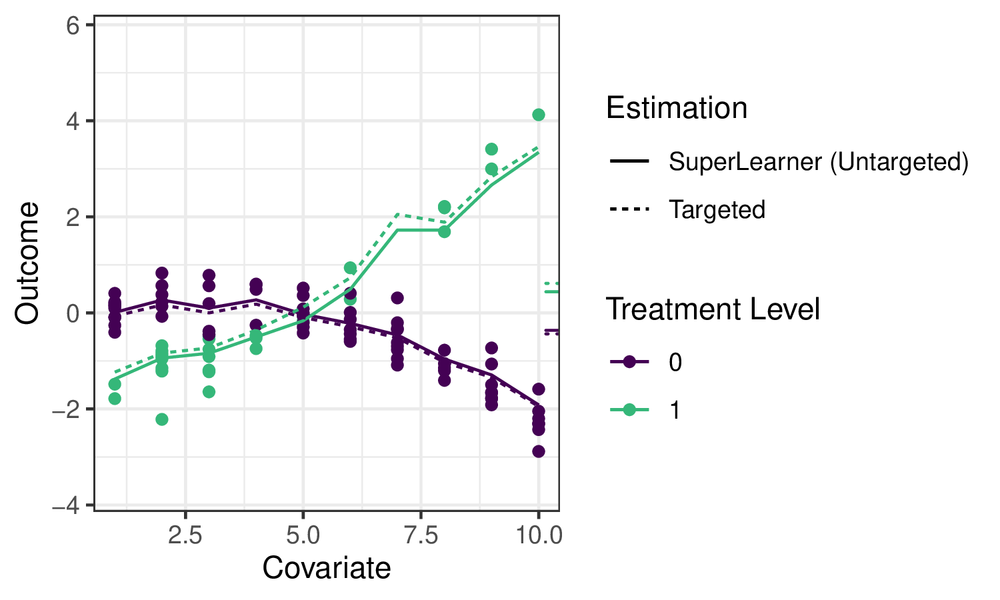
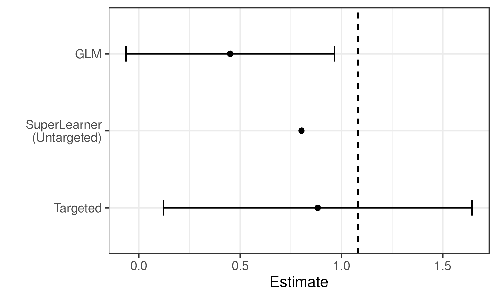

---
output:
  pdf_document: default
  html_document: default
---
<!-- TODO: notation and cleanup throughout -->
<!-- TODO: incorporate Mark/Alan feedback into this version -->

# The TMLE Framework {#tmle3}

## Introduction

<!-- TODO: maybe this or some part of this goes at the end of `sl3` instead -->
In the previous chapter, we saw that `sl3` can help us use ensemble machine learning to do the best job possible at learning a factor of the likelihood such as $Q(A,W) = E_{Y|A,W}[Y|A,W]$. Remember, that $Q(A,W)$ wasn't actually the target parameter we defined in the roadmap for our examples. Instead, we're interested in summaries of it, like ATEs: $\Psi_{0,\text{ATE}}=E_W[E_{Y|A,W}[Y|A=1,W]]- E_W[E_{Y|A,W}[Y|A=0,W]]$. It's ok if this isn't your target parameter, and you really only care about $Q(A,W)$. If so, you're done, you have the best estimate of $Q(A,W)$ we know how to generate for you. However, if you'd like to estimate something else there's some more work to be done to ``target'' our estimation to the parameters we care about, and obtain inference on our estimate. In order to do this targeting, we'll need to understand and use a procedure, called TMLE, that can target the parameter we care about. We'll see what that looks like in this chapter. Let's review the roadmap:

<!-- TODO: make the roadmap review a callout or similar. Probably don't need both numbers and checkboxes -->
1. [X] Data: Data as a random variable with a probability distribution, $O\sim P_0$
2. [X] Model: The statistical model $\mathcal{M}$ such that $P_0 \in \mathcal{M}$
3. [X] Parameter: The statistical target parameter $\Psi$ and estimand $\Psi(P_0)$.
4. [ ] **Estimation: The estimator $\hat{\Psi}$ and estimand $\hat{\Psi}(P_n)$.**
5. [ ] **Inference: A measure of uncertainty for the estimate $\hat{\Psi}(P_n)$**

We're making good progress on the estimation step. We'll wrap up the basics of it and inference in this chapter, before moving on to applying the roadmap to harder problems.

## Learning Objectives {#learn-tmle}

By the end of this chapter, you will be able to

1. Understand why we use TMLE for effect estimation.
2. Use `tmle3` to estimate an Average Treatment Effect (ATE).
3. Understand how to use `tmle3` "Specs" objects.
4. Fit `tmle3` for a custom set of target parameters.
5. Use the delta method to estimate transformations of target parameters.

## Setup

<!-- TODO: make it so we can just load tlverse instead of individual packages -->
```{r tmle3_setup}
library(sl3)
library(tmle3)
library(ggplot2)
```

## Schematic Example

We'll get started by reviewing where we're at with the schematic example. In the 
previous chapter, we saw how to load the data, and estimate $Q(A,W)$ using 
`sl3`.

<!-- JC: can we just squelch the code/output for this? they just saw it in the last chapter -->
We'll load the data like before:
```{r tmle3_schmatic_data}
data(schematic, package="tlverse")
```

We'll need some learners like before:
```{r tmle3_schematic_sl_Y}
gl <- make_learner(Lrnr_glm)
ml <- make_learner(Lrnr_mean)
gl_interaction <- make_learner(Lrnr_glm, 
                               formula = "~ A*W")
gl_poly2 <- make_learner(Lrnr_glm, 
                         formula = "~ A*(W + I(W^2))")
gl_poly4 <- make_learner(Lrnr_glm, 
                         formula = "~ A*(W + I(W^2) + I(W^3) + I (W^4))")

Y_learners <- list(linear = gl, 
                   interaction = gl_interaction, 
                   poly2 = gl_poly2,
                   poly4 = gl_poly4)
sl_Y <- make_learner(Lrnr_sl, Y_learners)
```


Applying `sl3` to estimate the outcome regression in our example, we can see
that the ensemble machine learning predictions fit the data quite well:

<!-- TODO: suppress tick marks/TMLE fit here -->

```{r tmle_fig2, results="asis", echo = FALSE}

```

The solid lines indicate the `sl3` estimate of the regression function, with the
dotted lines indicating the `tmle3` updates [(described below)](#tmle-updates).


## Substitution Estimators {#substitution-est}

With this estimate, we're very close an initial guess at an ATE!.

To construct an estimate of the ATE $\psi_n$, we need only "plug-in" the
estimates of $\overline{Q}_n(A,W)$, evaluated at the two intervention contrasts,
to the corresponding ATE "plug-in" formula:
$\psi_n = \frac{1}{n}\sum(\overline{Q}_n(1,W)-\overline{Q}_n(0,W))$. This kind
of estimator is called a _plug-in_ or _substitution_ estimator, since accurate
estimates $\psi_n$ of the parameter $\psi_0$ may be obtained by substituting
estimates $\overline{Q}_n(A,W)$ for the relevant regression functions
$\overline{Q}_0(A,W)$ themselves.

<!-- TODO: suppress TMLE fit here ? -->
```{r tmle_fig2_with_ticks, results="asis", echo = FALSE}

```

While substitution estimators are intuitive, naively using this approach with a
Super Learner estimate of $\overline{Q}_0(A,W)$ has several limitations. First,
Super Learner is selecting learner weights to minimize risk across the entire
regression function, instead of "targeting" the ATE parameter we hope to
estimate, leading to biased estimation. That is, `sl3` is trying to do well on
the full regression curve on the left, instead of focusing on the small ticks on
the right. What's more, the sampling distribution of this approach is not
asymptotically linear, and therefore inference is not possible.

We can see these limitations illustrated in the estimates generated for the
example data:

```{r tmle_fig3, results="asis", echo = FALSE}

```

We see that Super Learner, estimates the true parameter value (indicated by the
dashed vertical line) more accurately than GLM. We've omitted error bars (ie a 
95% confidence interval, a type of inference),
because it is not possible to obtain valid inference with such an estimator. 

<!-- TODO: how much do we want to say about why-->

We see that this new approach, TMLE, gets us a better estimate 
(our estimate is closer to the truth). If we can replicate this behavior on 
repeated sampling of the data, and on average we're closer to the truth, we say
that TMLE is a ``less biased'' estimator. We can also use statistical theory to
show that TMLE is the least biased estimator under certain conditions, as sample
size grows to infinity. This is called asymptotic statistics.

<!-- TODO: how much do we want to say about this here vs in intro vs point to refs-->

Another key benefit of TMLE is it allows us to have error bars again. 
Next, we'll try to understand what it's doing.

## Targeted Maximum Likelihood Estimation {#tmle}

TMLE takes an initial estimate $\overline{Q}_n(A,W)$ as well as an estimate of
the propensity score $g_n(A \mid W) = \mathbb{P}(A = 1 \mid W)$ and produces an
updated estimate $\overline{Q}^{\star}_n(A,W)$ that is "targeted" to the
parameter of interest. TMLE keeps the benefits of substitution estimators (it is
one), but augments the original, potentially erratic estimates to _correct for
bias_ while also resulting in an _asymptotically linear_ (and thus normally
distributed) estimator that accommodates inference via asymptotically consistent
Wald-style confidence intervals.

### TMLE Updates {#tmle-updates}

There are different types of TMLEs (and, sometimes, multiple for the same set of
target parameters) -- below, we give an example of the algorithm for TML
estimation of the ATE.  $\overline{Q}^{\star}_n(A,W)$ is the TMLE-augmented
estimate $f(\overline{Q}^{\star}_n(A,W)) = f(\overline{Q}_n(A,W)) + \epsilon
\cdot H_n(A,W)$, where $f(\cdot)$ is the appropriate link function (e.g.,
$\text{logit}(x) = \log(x / (1 - x))$), and an estimate $\epsilon_n$ of the
coefficient $\epsilon$ of the "clever covariate" $H_n(A,W)$ is computed. The
form of the covariate $H_n(A,W)$ differs across target parameters; in this case
of the ATE, it is $H_n(A,W) = \frac{A}{g_n(A \mid W)} - \frac{1-A}{1-g_n(A,
W)}$, with $g_n(A,W) = \mathbb{P}(A=1 \mid W)$ being the estimated propensity
score, so the estimator depends both on the initial fit (by `sl3`) of the
outcome regression ($\overline{Q}_n$) and of the propensity score ($g_n$).

There are several robust augmentations that are used across the `tlverse`,
including the use of an additional layer of cross-validation to avoid
over-fitting bias (i.e., CV-TMLE) as well as approaches for more consistently
estimating several parameters simultaneously (e.g., the points on a survival
curve).

## TMLE for the Schematic Example


```{r tmle3_schematic_learners}
A_learners <- list(mean = ml,
                   linear = gl)
sl_A <- make_learner(Lrnr_sl, A_learners)

learner_list <- list(A = sl_A, Y = sl_Y)
```

<!-- TODO: explain sl_A -->

<!-- TODO: make this spec return TSMs too (can have option to disable) -->
```{r tmle3_schematic_spec}
ate_spec <- tmle_ATE(treatment_level = 1,
                     control_level = 0)
```

<!-- TODO: explain node_list -->
<!-- TODO: check data type of node and learner lists in tmle3 -->
```{r tmle3_schematic_fit}
node_list <- list(W = "W", A = "A", Y = "Y")
tmle3_fit <- tmle3(ate_spec, schematic, node_list, learner_list)
```

```{r tmle3_schematic_output}
print(tmle3_fit)
```

```{r tmle_fig2_with_tmle, results="asis", echo = FALSE}

```

## Statistical Inference {#tmle-infer}

Since TMLE yields an **asymptotically linear** estimator, obtaining statistical
inference is very convenient. Each TML estimator has a corresponding
**(efficient) influence function** (often, "EIF", for short) that describes the
asymptotic distribution of the estimator. By using the estimated EIF, Wald-style
inference (asymptotically correct confidence intervals) can be constructed
simply by plugging into the form of the EIF our initial estimates
$\overline{Q}_n$ and $g_n$, then computing the sample standard error.

<!-- TODO: seems like if we're going to present the math, here's the spot, 
not in roadmap or intro-->

You've already seen `tmle3` applied to perform a TML estimation in the schematic 
example. Next, we'll show how to do the same for WASH-Benefits. After that, we'll 
break down how `tmle3` is structured. In designing `tmle3`, we
sought to replicate as closely as possible the very general estimation framework
of TMLE, and so each theoretical object relevant to TMLE is encoded in a
corresponding software object/method. 


## WASH-Benefits Example

We'll illustrate the most basic use of TMLE using the WASH Benefits data
introduced earlier and estimating an average treatment effect.

<!-- TODO: a lot of the words get moved up to the schematic section maybe?-->
<!-- TODO: and rewritten about that example -->

### Load the Data

We'll use the same WASH Benefits data as the earlier chapters:

```{r tmle3-load-data}
library(data.table)
library(dplyr)
library(tmle3)
library(sl3)
washb_data <- fread(
  paste0(
    "https://raw.githubusercontent.com/tlverse/tlverse-data/master/",
    "wash-benefits/washb_data.csv"
  ),
  stringsAsFactors = TRUE
)
```

### Define the variable roles

We'll use the common $W$ (covariates), $A$ (treatment/intervention), $Y$
(outcome) data structure. `tmle3` needs to know what variables in the dataset
correspond to each of these roles. We use a list of character vectors to tell
it. We call this a "Node List" as it corresponds to the nodes in a Directed
Acyclic Graph (DAG), a way of displaying causal relationships between variables.

```{r tmle3-node-list}
node_list <- list(
  W = c(
    "month", "aged", "sex", "momage", "momedu",
    "momheight", "hfiacat", "Nlt18", "Ncomp", "watmin",
    "elec", "floor", "walls", "roof", "asset_wardrobe",
    "asset_table", "asset_chair", "asset_khat",
    "asset_chouki", "asset_tv", "asset_refrig",
    "asset_bike", "asset_moto", "asset_sewmach",
    "asset_mobile"
  ),
  A = "tr",
  Y = "whz"
)
```

### Handle Missingness

Currently, missingness in `tmle3` is handled in a fairly simple way:

* Missing covariates are median- (for continuous) or mode- (for discrete)
  imputed, and additional covariates indicating imputation are generated, just
  as described in [the `sl3` chapter](#sl3).
* Missing treatment variables are excluded -- such observations are dropped.
* Missing outcomes are efficiently handled by the automatic calculation (and
  incorporation into estimators) of _inverse probability of censoring weights_
  (IPCW); this is also known as IPCW-TMLE and may be thought of as a joint
  intervention to remove missingness and is analogous to the procedure used with
  classical inverse probability weighted estimators.

These steps are implemented in the `process_missing` function in `tmle3`:

```{r tmle3-process_missing}
processed <- process_missing(washb_data, node_list)
washb_data <- processed$data
node_list <- processed$node_list
```

### Create a "Spec" Object

`tmle3` is general, and allows most components of the TMLE procedure to be
specified in a modular way. However, most users will not be interested in
manually specifying all of these components. Therefore, `tmle3` implements a
`tmle3_Spec` object that bundles a set of components into a _specification_
("Spec") that, with minimal additional detail, can be run to fit a TMLE.

We'll start with using one of the specs, and then work our way down into the
internals of `tmle3`.

```{r tmle3-ate-spec}
ate_spec <- tmle_ATE(
  treatment_level = "Nutrition + WSH",
  control_level = "Control"
)
```

### Define the learners

Currently, the only other thing a user must define are the `sl3` learners used
to estimate the relevant factors of the likelihood: Q and g.

This takes the form of a list of `sl3` learners, one for each likelihood factor
to be estimated with `sl3`:

```{r tmle3-learner-list}
# choose base learners
lrnr_mean <- make_learner(Lrnr_mean)
lrnr_rf <- make_learner(Lrnr_ranger)

# define metalearners appropriate to data types
ls_metalearner <- make_learner(Lrnr_nnls)
mn_metalearner <- make_learner(
  Lrnr_solnp, metalearner_linear_multinomial,
  loss_loglik_multinomial
)
sl_Y <- Lrnr_sl$new(
  learners = list(lrnr_mean, lrnr_rf),
  metalearner = ls_metalearner
)
sl_A <- Lrnr_sl$new(
  learners = list(lrnr_mean, lrnr_rf),
  metalearner = mn_metalearner
)
learner_list <- list(A = sl_A, Y = sl_Y)
```

Here, we use a Super Learner as defined in the previous chapter. In the future,
we plan to include reasonable defaults learners.

### Fit the TMLE

We now have everything we need to fit the tmle using `tmle3`:

```{r tmle3-spec-fit}
tmle_fit <- tmle3(ate_spec, washb_data, node_list, learner_list)
print(tmle_fit)
```

### Evaluate the Estimates

We can see the summary results by printing the fit object. Alternatively, we
can extra results from the summary by indexing into it:
```{r tmle3-spec-summary}
estimates <- tmle_fit$summary$psi_transformed
print(estimates)
```

## Understanding `tmle3`

<!-- TODO: maybe these words/ framework details are more appropriate for the dev book?-->


Now that we've successfully used a spec to obtain a TML estimate, let's look
under the hood at the components. The spec has a number of functions that
generate the objects necessary to define and fit a TMLE.

### `tmle3_task`

First is, a `tmle3_Task`, analogous to an `sl3_Task`, containing the data we're
fitting the TMLE to, as well as an NPSEM generated from the `node_list`
defined above, describing the variables and their relationships.

```{r tmle3-spec-task}
tmle_task <- ate_spec$make_tmle_task(washb_data, node_list)
```

```{r tmle3-spec-task-npsem}
tmle_task$npsem
```

### Initial Likelihood

Next, is an object representing the likelihood, factorized according to the
NPSEM described above:

```{r tmle3-spec-initial-likelihood}
initial_likelihood <- ate_spec$make_initial_likelihood(
  tmle_task,
  learner_list
)
print(initial_likelihood)
```

These components of the likelihood indicate how the factors were estimated: the
marginal distribution of $W$ was estimated using NP-MLE, and the conditional
distributions of $A$ and $Y$ were estimated using `sl3` fits (as defined with
the `learner_list`) above.

We can use this in tandem with the `tmle_task` object to obtain likelihood
estimates for each observation:
```{r tmle3-spec-initial-likelihood-estimates}
initial_likelihood$get_likelihoods(tmle_task)
```

<!-- TODO: make helper to get learners out of fit objects -->

### Targeted Likelihood (updater)

We also need to define a "Targeted Likelihood" object. This is a special type
of likelihood that is able to be updated using an `tmle3_Update` object. This
object defines the update strategy (e.g., submodel, loss function, CV-TMLE or
not).

```{r tmle3-spec-targeted-likelihood}
targeted_likelihood <- Targeted_Likelihood$new(initial_likelihood)
```

When constructing the targeted likelihood, you can specify different update
options. See the documentation for `tmle3_Update` for details of the different
options. For example, you can disable CV-TMLE (the default in `tmle3`) as
follows:

```{r tmle3-spec-targeted-likelihood-no-cv}
targeted_likelihood_no_cv <-
  Targeted_Likelihood$new(initial_likelihood,
    updater = list(cvtmle = FALSE)
  )
```

### Parameter Mapping

Finally, we need to define the parameters of interest. Here, the spec defines a
single parameter, the ATE. In the next section, we'll see how to add additional
parameters.

```{r tmle3-spec-params}
tmle_params <- ate_spec$make_params(tmle_task, targeted_likelihood)
print(tmle_params)
```

### Putting it all together

Having used the spec to manually generate all these components, we can now
manually fit a `tmle3`:

```{r tmle3-manual-fit}
tmle_fit_manual <- fit_tmle3(
  tmle_task, targeted_likelihood, tmle_params,
  targeted_likelihood$updater
)
print(tmle_fit_manual)
```

The result is equivalent to fitting using the `tmle3` function as above.

## Additional Features

<!-- put cartoon mark here -->

### Multiparameter TMLE

Fitting `tmle3` with multiple parameters

Above, we fit a `tmle3` with just one parameter. `tmle3` also supports fitting
multiple parameters simultaneously. To illustrate this, we'll use the
`tmle_TSM_all` spec:

```{r tmle3-tsm-all}
tsm_spec <- tmle_TSM_all()
targeted_likelihood <- Targeted_Likelihood$new(initial_likelihood)
all_tsm_params <- tsm_spec$make_params(tmle_task, targeted_likelihood)
print(all_tsm_params)
```

This spec generates a Treatment Specific Mean (TSM) for each level of the
exposure variable. Note that we must first generate a new targeted likelihood,
as the old one was targeted to the ATE. However, we can recycle the initial
likelihood we fit above, saving us a super learner step.

### Delta Method

We can also define parameters based on Delta Method Transformations of other
parameters. For instance, we can estimate a ATE using the delta method and two
of the above TSM parameters:

```{r tmle3-delta-method-param}
ate_param <- define_param(
  Param_delta, targeted_likelihood,
  delta_param_ATE,
  list(all_tsm_params[[1]], all_tsm_params[[4]])
)
print(ate_param)
```

This can similarly be used to estimate other derived parameters like Relative
Risks, and Population Attributable Risks

### Fit

We can now fit a TMLE simultaneously for all TSM parameters, as well as the
above defined ATE parameter

```{r tmle3-tsm-plus-delta}
all_params <- c(all_tsm_params, ate_param)

tmle_fit_multiparam <- fit_tmle3(
  tmle_task, targeted_likelihood, all_params,
  targeted_likelihood$updater
)

print(tmle_fit_multiparam)
```

## Exercises


### Estimation of the ATE with `tmle3` {#tmle3-ex1}

Follow the steps below to estimate an average treatment effect using data from
the Collaborative Perinatal Project (CPP), available in the `sl3` package. To
simplify this example, we define a binary intervention variable, `parity01` --
an indicator of having one or more children before the current child and a
binary outcome, `haz01` -- an indicator of having an above average height for
age.

```{r tmle-exercise-data}
# load the data set
data(cpp)
cpp <- cpp %>%
  as_tibble() %>%
  dplyr::filter(!is.na(haz)) %>%
  mutate(
    parity01 = as.numeric(parity > 0),
    haz01 = as.numeric(haz > 0)
  )
```
<!--
We're interested in using this simplified data to estimate an Average Treatment
Effect (ATE):
$\Psi(P_0)=\mathbb{E}_0(\mathbb{E}_0[Y \mid A=1,W]-\mathbb{E}_0[Y \mid A=0,W])$

The purely statistical (non-causal) parameter can be interpreted as the average
of the difference in means across the strata for $W$, and only requires the
positivity assumption, that the conditional treatment assignment probabilities
are positive for each possible $w$: $\mathbb{P}_0(A=1 \mid W=w) > 0$ and
$\mathbb{P}_0(A=0 \mid W=w) > 0$ for each possible $w$.

To interpret this parameter as causal, specifically the causal risk difference
$E_0Y_1-E_0Y_0$, then we would also need to make the randomization assumption
stating that $A$ is independent of the counterfactuals $(Y_0,Y_1)$ within
strata of $W$. This assumption might have been included in the original SCM
$\mathcal{M}^F$, but, if one knows there are unmeasured confounders, then the
model $\mathcal{M}^{F\*}$ would be more restrictive by enforcing this "known
to be wrong" randomization assumption. Still, this assumption does not change
the statistical model $\mathcal{M}$, and as a consequence, it does not affect
the estimation problem either. Thus, the theorem's that establish desirable
properties of the TMLE, still hold even when this non-testable randomization
assumption is violated.

We proceed with implementing a targeted minimum loss-based estimator (TMLE),
an efficient substitution estimator which is not only asymptotically
consistent, asymptotically normally distributed, and asymptotically efficient,
but also tailored to have robust finite sample performance.
-->

1. Define the variable roles $(W,A,Y)$ by creating a list of these nodes.
   Include the following baseline covariates in $W$: `apgar1`, `apgar5`,
   `gagebrth`, `mage`, `meducyrs`, `sexn`. Both $A$ and $Y$ are specified
   above. The missingness in the data (specifically, the missingness in the
   columns that are specified in the node list) will need to be taking care of.
   The `process_missing` function can be used to accomplish this, like the
   `washb_data` example above.
2. Define a `tmle3_Spec` object for the ATE, `tmle_ATE()`.
3. Using the same base learning libraries defined above, specify `sl3` base
   learners for estimation of $\overline{Q}_0 = \mathbb{E}_0(Y \mid A, W)$ and
   $g_0 = \mathbb{P}(A = 1 \mid W)$.
4. Define the metalearner like below.

```{r, metalrnr-exercise}
metalearner <- make_learner(
  Lrnr_solnp,
  loss_function = loss_loglik_binomial,
  learner_function = metalearner_logistic_binomial
)
```

5. Define one super learner for estimating $\overline{Q}_0$ and another for
   estimating $g_0$. Use the metalearner above for both super learners.
6. Create a list of the two super learners defined in the step above and call
   this object `learner_list`. The list names should be `A` (defining the super
   learner for estimation of $g_0$) and `Y` (defining the super learner for
   estimation of $\overline{Q}_0$).
7. Fit the TMLE with the `tmle3` function by specifying (1) the `tmle3_Spec`,
   which we defined in Step 2; (2) the data; (3) the list of nodes, which we
   specified in Step 1; and (4) the list of super learners for estimation of
   $g_0$ and $\overline{Q}_0$, which we defined in Step 6. *Note*: Like before,
   you will need to explicitly make a copy of the data (to work around
   `data.table` optimizations), e.g., (`cpp2 <- data.table::copy(cpp)`), then
   use the `cpp2` data going forward.

### Estimation of Strata-Specific ATEs with `tmle3` {#tmle3-ex2}

For this exercise, we will work with a random sample of 5,000 patients who
participated in the International Stroke Trial (IST). This data is described in
the [Chapter 3.2 of the `tlverse` handbook](#ist). We included the data below
and a summarized description that is relevant for this exercise.

The outcome, $Y$, indicates recurrent ischemic stroke within 14 days after
randomization (`DRSISC`); the treatment of interest, $A$, is the randomized
aspirin vs. no aspirin treatment allocation (`RXASP` in `ist`); and the
adjustment set, $W$, consists simply of other variables measured at baseline. In
this data, the outcome is occasionally missing, but there is no need to create a
variable indicating this missingness (such as $\Delta$) for analyses in the
`tlverse`, since the missingness is automatically detected when `NA` are present
in the outcome. Covariates with missing values (`RATRIAL`, `RASP3` and `RHEP24`)
have already been imputed. Additional covariates were created
(`MISSING_RATRIAL_RASP3` and `MISSING_RHEP24`), which indicate whether or not
the covariate was imputed. The missingness was identical for `RATRIAL` and
`RASP3`, which is why only one covariate indicating imputation for these two
covariates was created.

1. Estimate the average effect of randomized aspirin treatment (`RXASP` = 1) on
   recurrent ischemic stroke. Even though the missingness mechanism on $Y$,
   $\Delta$, does not need to be specified in the node list, it does still need
   to be accounted for in the TMLE. In other words, for this estimation problem,
   $\Delta$ is a relevant factor of the likelihood.  Thus, when defining the
   list of `sl3` learners for each likelihood factor, be sure to include a list
   of learners for estimation of $\Delta$, say `sl_Delta`, and specify this in
   the learner list, like so
   `learner_list <- list(A = sl_A, delta_Y = sl_Delta, Y = sl_Y)`.
2. Recall that this RCT was conducted internationally. Suppose there is concern
   that the dose of aspirin may have varied across geographical regions, and an
   average across all geographical regions may not be warranted. Calculate the
   strata specific ATEs according to geographical region (`REGION`).

```{r tmle3-ex2}
ist_data <- fread(
  paste0(
    "https://raw.githubusercontent.com/tlverse/deming2019-workshop/",
    "master/data/ist_sample.csv"
  )
)
```

## Summary

`tmle3` is a general purpose framework for generating TML estimates. The easiest
way to use it is to use a predefined spec, allowing you to just fill in the
blanks for the data, variable roles, and `sl3` learners. However, digging under
the hood allows users to specify a wide range of TMLEs. In the next sections,
we'll see how this framework can be used to estimate advanced parameters such as
optimal treatments and stochastic shift interventions.


