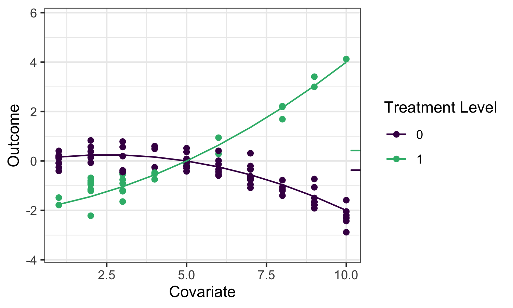
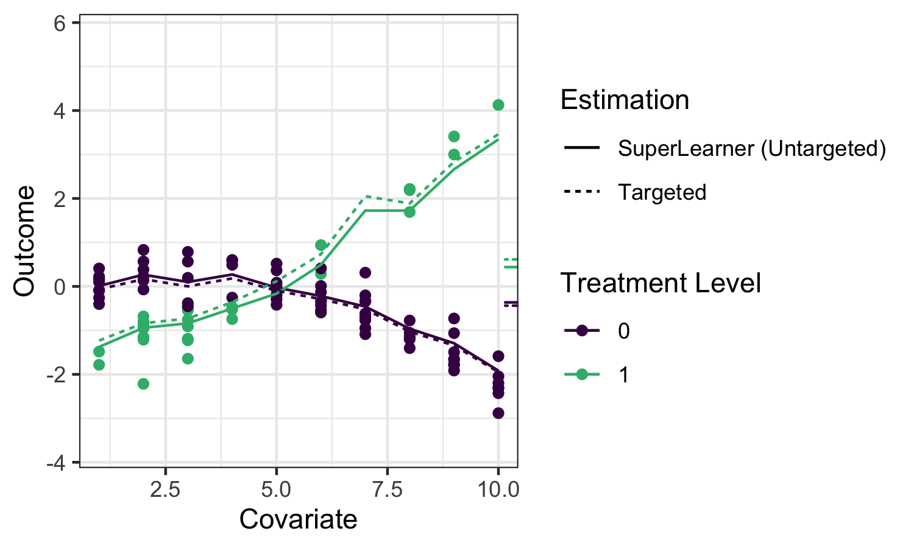
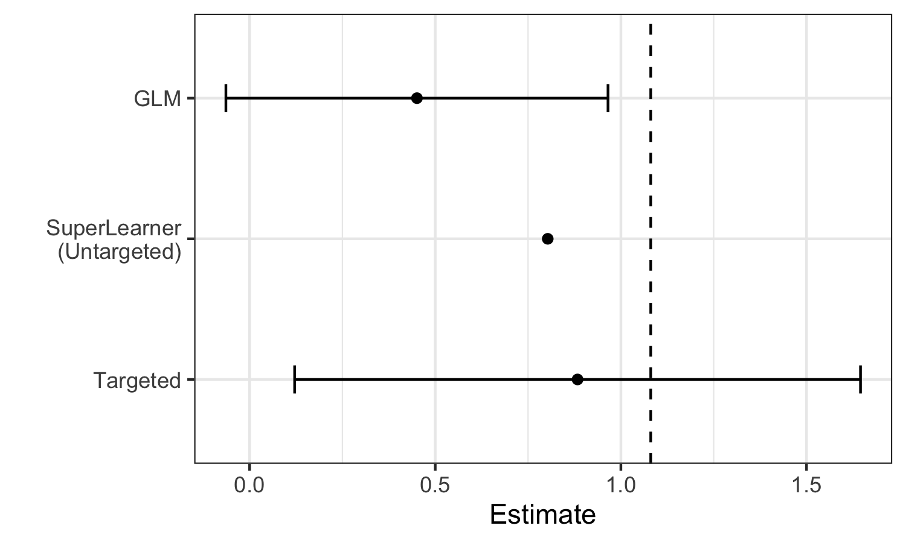

# The TMLE Framework {#tmle3}

_Jeremy Coyle_

Based on the [`tmle3` `R` package](https://github.com/tlverse/tmle3).

## Learning Objectives
1. Understand why we use TMLE for effect estimation
2. Use `tmle3` to estimate an Average Treatment Effect (ATE)
3. Understand `tmle3` "Specs"
4. Fit `tmle3` for a custom set of parameters
5. Use the delta method to estimate transformations of parameters

## Introduction

In the previous chapter on `sl3` we learned how to estimate a regression function like $E[Y|X]$ from data. That's an important first step in learning from data, but how can we use this predictive model to estimate statistical and causal effects?

Going back to the roadmap in Chapter 1, suppose we'd like to estimate the effect of a treatment variable $A$ on an outcome $Y$. As discussed, one potential parameter that characterizes that effect is the Average Treatment Effect ATE, defined as: $\psi_0=E_W[E[Y|A=1,W]-E[Y|A=0,W]]$ and interpreted as the difference in mean outcome under when treatment $A=1$ and $A=0$, averaging over the distribution of covariates $W$. We'll illustrate several potential estimators for this parameter, and motivate the use of TMLE, using the following example data:



The small ticks on the right indicate the mean outcomes (averaging over $W$) under $A=1$ and $A=0$ respectively, so their difference is the quantity we'd like to estimate.

While we hope to motivate the application of TMLE in this chapter, we refer the interested reader to the two Targeted Learning books and associated works for full technical details.

### Substitution Estimators

We can use `sl3` to fit a Super Learner or other regression model to estimate the function $E[Y|A,W]$. We refer to this function as $\bar{Q}_0(A,W)$ and our estimate of it as $\bar{Q}_n(A,W)$. We can then directly "plug-in" that estimate to obtain an estimate of the ATE:  $\hat{\psi}_n=\frac{1}{n}\sum(\bar{Q}_n(1,W)-\bar{Q}_n(0,W))$. This kind of estimator is called a plug-in or substitution estimator, as we substitute our estimate $Q_n(A,W)$ of the function $Q_0(A,W)$ for the function itself.


Applying `sl3` to estimate the outcome regression in our example, we can see that it fits the data quite well:



The solid lines indicate the `sl3` estimate of the regression function, with the dotted lines indicating the `tmle3` update described below.

While substitution estimators are intuitive, naively using this approach with a Super Learner estimate of $\bar{Q}_0(A,W)$ has several limitations. First, Super Learner is selecting learner weights to minimize risk across the entire regression function, instead of "targeting" the ATE parameter we hope to estimate, leading to biased estimation. That is, `sl3` is trying to do well on the full regression curve on the left, instead of focusing on the small ticks on the right. What's more, the sampling distribution of this approach is not asymptotically linear, and therefore inference is not possible.

We can see these limitations illustrated in the estimates generated for the example data: 



We see that Super Learner, estimates the true parameter value (indicated by the dashed vertical line) more accurately than GLM. However, it is still less accurate than TMLE, and valid inference is not possible. In contrast, TMLE achieves a less biased estimator and valid inference.

## TMLE

TMLE takes an initial estimate of $\bar{Q}_0(A,W)$ as well as an estimate of the propensity score $\bar{g}_0(A|W)=p(A|W)$ and produces an updated estimate $\bar{Q}^{\star}_0(A,W)$ that is "targeted" to the parameter of interest. TMLE keeps the benefits of substitution estimators (it is one), but augments the original estimates to correct for bias and also results in an asymptotically linear (and thus normally-distributed) estimator with consistent Wald-style confidence intervals.

There are different types of TMLE, sometimes for the same set of parameters, but below is an example of the algorithm for estimating the ATE. $\bar{Q}^{\star}_n(A,W)$ is the TMLE augmented estimate
$f(\bar{Q}^{\star}_n(A,W)) = f(\bar{Q}_n(A,W)) + \epsilon_n \cdot h_n(A,W)$,
where $f(\cdot)$ is the appropriate link function (e.g., logit), $\epsilon_n$
is an estimated coefficient and $h_n(A,W)$ is a "clever covariate". In this case, $h_n(A,W) = \frac{A}{g_n(W)}-\frac{1-A}{1-g_n(W)}$, with $g_n(W)
  = \mathbb{P}(A=1 \mid W)$ being the estimated (also by SL) propensity score,
  so the estimator depends both on initial SL fit of the outcome regression
  ($\bar{Q}_0$) and an SL fit of the propensity score ($g_n$).

There are further robust augmentations that are used in `tlverse`, such as an added layer of cross-validation to avoid over-fitting bias (CV-TMLE), and so called methods that can more robustly estimated several parameters simultaneously (e.g., the points on a survival curve).

### Inference

Because TMLE yields an **asymptotically linear**, estimator, obtaining inference is trivial. Each TMLE is associated with an **influence function** that describes its asymptotic distribution, and Wald-style inference can be obtained by plugging into this function our estimates $\bar{Q}^{\star}_n$ and $g_n$ and taking the sample standard error. 

The following sections describe both a simple and more detailed way of specifying and estimating a TMLE in the `tlverse`. In designing `tmle3`, we sought to replicate as closely as possible the very general estimation framework of TMLE, and so each theoretical object relevant to TMLE is encoded in a corresponding software object. First, we will present the simple application of `tmle3` to the WASH Benefits exaple, and then go on to describe the underlying objects in more detail.

## Easy-Bake Example: `tmle3` for ATE

We'll illustrate the most basic use of TMLE using the WASH Benefits data
introduced earlier and estimating an Average Treatment Effect (ATE).

### Load the Data

We'll use the same WASH Benefits data as the earlier chapters:


```r
library(data.table)
library(dplyr)
library(tmle3)
library(sl3)
washb_data <- fread(
  paste0(
    "https://raw.githubusercontent.com/tlverse/tlverse-data/master/",
    "wash-benefits/washb_data.csv"
  ),
  stringsAsFactors = TRUE
)
```

### Define the variable roles

We'll use the common $W$ (covariates), $A$ (treatment/intervention), $Y$
(outcome) data structure. `tmle3` needs to know what variables in the dataset
correspond to each of these roles. We use a list of character vectors to tell
it. We call this a "Node List" as it corresponds to the nodes in a Directed
Acyclic Graph (DAG), a way of displaying causal relationships between variables.


```r
node_list <- list(
  W = c(
    "month", "aged", "sex", "momage", "momedu",
    "momheight", "hfiacat", "Nlt18", "Ncomp", "watmin",
    "elec", "floor", "walls", "roof", "asset_wardrobe",
    "asset_table", "asset_chair", "asset_khat",
    "asset_chouki", "asset_tv", "asset_refrig",
    "asset_bike", "asset_moto", "asset_sewmach",
    "asset_mobile"
  ),
  A = "tr",
  Y = "whz"
)
```

### Handle Missingness

Currently, missingness in `tmle3` is handled in a fairly simple way:

* Missing covariates are median (for continuous) or mode (for discrete)
  imputed, and additional covariates indicating imputation are generated
* Observations missing either treatment or outcome variables are excluded.

We implemented IPCW-TMLE to more efficiently handle missingness in the outcome
variable, and we plan to implement an IPCW-TMLE to handle missingness in the
treatment variable as well.

These steps are implemented in the `process_missing` function in `tmle3`:


```r
processed <- process_missing(washb_data, node_list)
washb_data <- processed$data
node_list <- processed$node_list
```

### Create a "Spec" Object

`tmle3` is general, and allows most components of the TMLE procedure to be
specified in a modular way. However, most end-users will not be interested in
manually specifying all of these components. Therefore, `tmle3` implements a
`tmle3_Spec` object that bundles a set ofcomponents into a _specification_
that, with minimal additional detail, can be run by an end-user.

We'll start with using one of the specs, and then work our way down into the
internals of `tmle3`.


```r
ate_spec <- tmle_ATE(
  treatment_level = "Nutrition + WSH",
  control_level = "Control"
)
```

### Define the learners

Currently, the only other thing a user must define are the `sl3` learners used
to estimate the relevant factors of the likelihood: Q and g.

This takes the form of a list of `sl3` learners, one for each likelihood factor
to be estimated with `sl3`:


```r
# choose base learners
lrnr_mean <- make_learner(Lrnr_mean)
lrnr_xgb <- make_learner(Lrnr_xgboost)

# define metalearners appropriate to data types
ls_metalearner <- make_learner(Lrnr_nnls)
mn_metalearner <- make_learner(
  Lrnr_solnp, metalearner_linear_multinomial,
  loss_loglik_multinomial
)
sl_Y <- Lrnr_sl$new(
  learners = list(lrnr_mean, lrnr_xgb),
  metalearner = ls_metalearner
)
sl_A <- Lrnr_sl$new(
  learners = list(lrnr_mean, lrnr_xgb),
  metalearner = mn_metalearner
)
learner_list <- list(A = sl_A, Y = sl_Y)
```

Here, we use a Super Learner as defined in the previous chapter. In the future,
we plan to include reasonable defaults learners.

### Fit the TMLE

We now have everything we need to fit the tmle using `tmle3`:


```r
tmle_fit <- tmle3(ate_spec, washb_data, node_list, learner_list)
#> [19:37:26] WARNING: amalgamation/../src/learner.cc:1061: Starting in XGBoost 1.3.0, the default evaluation metric used with the objective 'multi:softprob' was changed from 'merror' to 'mlogloss'. Explicitly set eval_metric if you'd like to restore the old behavior.
#> [19:37:27] WARNING: amalgamation/../src/learner.cc:1061: Starting in XGBoost 1.3.0, the default evaluation metric used with the objective 'multi:softprob' was changed from 'merror' to 'mlogloss'. Explicitly set eval_metric if you'd like to restore the old behavior.
#> [19:37:27] WARNING: amalgamation/../src/learner.cc:1061: Starting in XGBoost 1.3.0, the default evaluation metric used with the objective 'multi:softprob' was changed from 'merror' to 'mlogloss'. Explicitly set eval_metric if you'd like to restore the old behavior.
#> [19:37:28] WARNING: amalgamation/../src/learner.cc:1061: Starting in XGBoost 1.3.0, the default evaluation metric used with the objective 'multi:softprob' was changed from 'merror' to 'mlogloss'. Explicitly set eval_metric if you'd like to restore the old behavior.
#> [19:37:29] WARNING: amalgamation/../src/learner.cc:1061: Starting in XGBoost 1.3.0, the default evaluation metric used with the objective 'multi:softprob' was changed from 'merror' to 'mlogloss'. Explicitly set eval_metric if you'd like to restore the old behavior.
#> [19:37:30] WARNING: amalgamation/../src/learner.cc:1061: Starting in XGBoost 1.3.0, the default evaluation metric used with the objective 'multi:softprob' was changed from 'merror' to 'mlogloss'. Explicitly set eval_metric if you'd like to restore the old behavior.
#> [19:37:32] WARNING: amalgamation/../src/learner.cc:1061: Starting in XGBoost 1.3.0, the default evaluation metric used with the objective 'multi:softprob' was changed from 'merror' to 'mlogloss'. Explicitly set eval_metric if you'd like to restore the old behavior.
#> [19:37:33] WARNING: amalgamation/../src/learner.cc:1061: Starting in XGBoost 1.3.0, the default evaluation metric used with the objective 'multi:softprob' was changed from 'merror' to 'mlogloss'. Explicitly set eval_metric if you'd like to restore the old behavior.
#> [19:37:34] WARNING: amalgamation/../src/learner.cc:1061: Starting in XGBoost 1.3.0, the default evaluation metric used with the objective 'multi:softprob' was changed from 'merror' to 'mlogloss'. Explicitly set eval_metric if you'd like to restore the old behavior.
#> [19:37:35] WARNING: amalgamation/../src/learner.cc:1061: Starting in XGBoost 1.3.0, the default evaluation metric used with the objective 'multi:softprob' was changed from 'merror' to 'mlogloss'. Explicitly set eval_metric if you'd like to restore the old behavior.
#> [19:37:36] WARNING: amalgamation/../src/learner.cc:1061: Starting in XGBoost 1.3.0, the default evaluation metric used with the objective 'multi:softprob' was changed from 'merror' to 'mlogloss'. Explicitly set eval_metric if you'd like to restore the old behavior.
print(tmle_fit)
#> A tmle3_Fit that took 1 step(s)
#>    type                                    param init_est    tmle_est       se
#> 1:  ATE ATE[Y_{A=Nutrition + WSH}-Y_{A=Control}] 0.002628 -0.00073865 0.050391
#>        lower    upper psi_transformed lower_transformed upper_transformed
#> 1: -0.099503 0.098026     -0.00073865         -0.099503          0.098026
```

### Evaluate the Estimates

We can see the summary results by printing the fit object. Alternatively, we
can extra results from the summary by indexing into it:

```r
estimates <- tmle_fit$summary$psi_transformed
print(estimates)
#> [1] -0.00073865
```

## `tmle3` Components

Now that we've successfully used a spec to obtain a TML estimate, let's look
under the hood at the components. The spec has a number of functions that
generate the objects necessary to define and fit a TMLE.

### `tmle3_task`

First is, a `tmle3_Task`, analogous to an `sl3_Task`, containing the data we're
fitting the TMLE to, as well as an NP-SEM generated from the `node_list`
defined above, describing the variables and their relationships.


```r
tmle_task <- ate_spec$make_tmle_task(washb_data, node_list)
```


```r
tmle_task$npsem
#> $W
#> tmle3_Node: W
#> 	Variables: month, aged, sex, momedu, hfiacat, Nlt18, Ncomp, watmin, elec, floor, walls, roof, asset_wardrobe, asset_table, asset_chair, asset_khat, asset_chouki, asset_tv, asset_refrig, asset_bike, asset_moto, asset_sewmach, asset_mobile, momage, momheight, delta_momage, delta_momheight
#> 	Parents: 
#> 
#> $A
#> tmle3_Node: A
#> 	Variables: tr
#> 	Parents: W
#> 
#> $Y
#> tmle3_Node: Y
#> 	Variables: whz
#> 	Parents: A, W
```

### Initial Likelihood

Next, is an object representing the likelihood, factorized according to the
NPSEM described above:


```r
initial_likelihood <- ate_spec$make_initial_likelihood(
  tmle_task,
  learner_list
)
#> [19:37:46] WARNING: amalgamation/../src/learner.cc:1061: Starting in XGBoost 1.3.0, the default evaluation metric used with the objective 'multi:softprob' was changed from 'merror' to 'mlogloss'. Explicitly set eval_metric if you'd like to restore the old behavior.
#> [19:37:47] WARNING: amalgamation/../src/learner.cc:1061: Starting in XGBoost 1.3.0, the default evaluation metric used with the objective 'multi:softprob' was changed from 'merror' to 'mlogloss'. Explicitly set eval_metric if you'd like to restore the old behavior.
#> [19:37:48] WARNING: amalgamation/../src/learner.cc:1061: Starting in XGBoost 1.3.0, the default evaluation metric used with the objective 'multi:softprob' was changed from 'merror' to 'mlogloss'. Explicitly set eval_metric if you'd like to restore the old behavior.
#> [19:37:49] WARNING: amalgamation/../src/learner.cc:1061: Starting in XGBoost 1.3.0, the default evaluation metric used with the objective 'multi:softprob' was changed from 'merror' to 'mlogloss'. Explicitly set eval_metric if you'd like to restore the old behavior.
#> [19:37:50] WARNING: amalgamation/../src/learner.cc:1061: Starting in XGBoost 1.3.0, the default evaluation metric used with the objective 'multi:softprob' was changed from 'merror' to 'mlogloss'. Explicitly set eval_metric if you'd like to restore the old behavior.
#> [19:37:51] WARNING: amalgamation/../src/learner.cc:1061: Starting in XGBoost 1.3.0, the default evaluation metric used with the objective 'multi:softprob' was changed from 'merror' to 'mlogloss'. Explicitly set eval_metric if you'd like to restore the old behavior.
#> [19:37:52] WARNING: amalgamation/../src/learner.cc:1061: Starting in XGBoost 1.3.0, the default evaluation metric used with the objective 'multi:softprob' was changed from 'merror' to 'mlogloss'. Explicitly set eval_metric if you'd like to restore the old behavior.
#> [19:37:53] WARNING: amalgamation/../src/learner.cc:1061: Starting in XGBoost 1.3.0, the default evaluation metric used with the objective 'multi:softprob' was changed from 'merror' to 'mlogloss'. Explicitly set eval_metric if you'd like to restore the old behavior.
#> [19:37:54] WARNING: amalgamation/../src/learner.cc:1061: Starting in XGBoost 1.3.0, the default evaluation metric used with the objective 'multi:softprob' was changed from 'merror' to 'mlogloss'. Explicitly set eval_metric if you'd like to restore the old behavior.
#> [19:37:55] WARNING: amalgamation/../src/learner.cc:1061: Starting in XGBoost 1.3.0, the default evaluation metric used with the objective 'multi:softprob' was changed from 'merror' to 'mlogloss'. Explicitly set eval_metric if you'd like to restore the old behavior.
#> [19:37:56] WARNING: amalgamation/../src/learner.cc:1061: Starting in XGBoost 1.3.0, the default evaluation metric used with the objective 'multi:softprob' was changed from 'merror' to 'mlogloss'. Explicitly set eval_metric if you'd like to restore the old behavior.
print(initial_likelihood)
#> W: Lf_emp
#> A: LF_fit
#> Y: LF_fit
```

These components of the likelihood indicate how the factors were estimated: the
marginal distribution of $W$ was estimated using NP-MLE, and the conditional
distributions of $A$ and $Y$ were estimated using `sl3` fits (as defined with
the `learner_list`) above.

We can use this in tandem with the `tmle_task` object to obtain likelihood
estimates for each observation:

```r
initial_likelihood$get_likelihoods(tmle_task)
#>                W       A        Y
#>    1: 0.00021299 0.24777 -0.66024
#>    2: 0.00021299 0.25473 -0.63282
#>    3: 0.00021299 0.25927 -0.62043
#>    4: 0.00021299 0.28067 -0.59987
#>    5: 0.00021299 0.25367 -0.54247
#>   ---                            
#> 4691: 0.00021299 0.13503 -0.46139
#> 4692: 0.00021299 0.12616 -0.48049
#> 4693: 0.00021299 0.12641 -0.56625
#> 4694: 0.00021299 0.17597 -0.81872
#> 4695: 0.00021299 0.12997 -0.53951
```

<!-- TODO: make helper to get learners out of fit objects -->

### Targeted Likelihood (updater)

We also need to define a "Targeted Likelihood" object. This is a special type
of likelihood that is able to be updated using an `tmle3_Update` object. This
object defines the update strategy (e.g. submodel, loss function, CV-TMLE or
not, etc).


```r
targeted_likelihood <- Targeted_Likelihood$new(initial_likelihood)
```

When constructing the targeted likelihood, you can specify different update
options. See the documentation for `tmle3_Update` for details of the different
options. For example, you can disable CV-TMLE (the default in `tmle3`) as
follows:


```r
targeted_likelihood_no_cv <-
  Targeted_Likelihood$new(initial_likelihood,
    updater = list(cvtmle = FALSE)
  )
```

### Parameter Mapping

Finally, we need to define the parameters of interest. Here, the spec defines a
single parameter, the ATE. In the next section, we'll see how to add additional
parameters.


```r
tmle_params <- ate_spec$make_params(tmle_task, targeted_likelihood)
print(tmle_params)
#> [[1]]
#> Param_ATE: ATE[Y_{A=Nutrition + WSH}-Y_{A=Control}]
```

### Putting it all together

Having used the spec to manually generate all these components, we can now
manually fit a `tmle3`:


```r
tmle_fit_manual <- fit_tmle3(
  tmle_task, targeted_likelihood, tmle_params,
  targeted_likelihood$updater
)
print(tmle_fit_manual)
#> A tmle3_Fit that took 1 step(s)
#>    type                                    param  init_est   tmle_est       se
#> 1:  ATE ATE[Y_{A=Nutrition + WSH}-Y_{A=Control}] 0.0024533 -0.0096405 0.050768
#>       lower    upper psi_transformed lower_transformed upper_transformed
#> 1: -0.10914 0.089864      -0.0096405          -0.10914          0.089864
```

The result is equivalent to fitting using the `tmle3` function as above.

## Fitting `tmle3` with multiple parameters

Above, we fit a `tmle3` with just one parameter. `tmle3` also supports fitting
multiple parameters simultaneously. To illustrate this, we'll use the
`tmle_TSM_all` spec:


```r
tsm_spec <- tmle_TSM_all()
targeted_likelihood <- Targeted_Likelihood$new(initial_likelihood)
all_tsm_params <- tsm_spec$make_params(tmle_task, targeted_likelihood)
print(all_tsm_params)
#> [[1]]
#> Param_TSM: E[Y_{A=Control}]
#> 
#> [[2]]
#> Param_TSM: E[Y_{A=Handwashing}]
#> 
#> [[3]]
#> Param_TSM: E[Y_{A=Nutrition}]
#> 
#> [[4]]
#> Param_TSM: E[Y_{A=Nutrition + WSH}]
#> 
#> [[5]]
#> Param_TSM: E[Y_{A=Sanitation}]
#> 
#> [[6]]
#> Param_TSM: E[Y_{A=WSH}]
#> 
#> [[7]]
#> Param_TSM: E[Y_{A=Water}]
```

This spec generates a Treatment Specific Mean (TSM) for each level of the
exposure variable. Note that we must first generate a new targeted likelihood,
as the old one was targeted to the ATE. However, we can recycle the initial
likelihood we fit above, saving us a super learner step.

### Delta Method

We can also define parameters based on Delta Method Transformations of other
parameters. For instance, we can estimate a ATE using the delta method and two
of the above TSM parameters:


```r
ate_param <- define_param(
  Param_delta, targeted_likelihood,
  delta_param_ATE,
  list(all_tsm_params[[1]], all_tsm_params[[4]])
)
print(ate_param)
#> Param_delta: E[Y_{A=Nutrition + WSH}] - E[Y_{A=Control}]
```

This can similarly be used to estimate other derived parameters like Relative
Risks, and Population Attributable Risks

### Fit

We can now fit a TMLE simultaneously for all TSM parameters, as well as the
above defined ATE parameter


```r
all_params <- c(all_tsm_params, ate_param)

tmle_fit_multiparam <- fit_tmle3(
  tmle_task, targeted_likelihood, all_params,
  targeted_likelihood$updater
)

print(tmle_fit_multiparam)
#> A tmle3_Fit that took 1 step(s)
#>    type                                       param   init_est  tmle_est
#> 1:  TSM                            E[Y_{A=Control}] -0.5937962 -0.613477
#> 2:  TSM                        E[Y_{A=Handwashing}] -0.6064124 -0.644888
#> 3:  TSM                          E[Y_{A=Nutrition}] -0.6019064 -0.615316
#> 4:  TSM                    E[Y_{A=Nutrition + WSH}] -0.5913428 -0.623089
#> 5:  TSM                         E[Y_{A=Sanitation}] -0.5871441 -0.585550
#> 6:  TSM                                E[Y_{A=WSH}] -0.5280048 -0.451937
#> 7:  TSM                              E[Y_{A=Water}] -0.5754032 -0.531406
#> 8:  ATE E[Y_{A=Nutrition + WSH}] - E[Y_{A=Control}]  0.0024533 -0.009612
#>          se    lower     upper psi_transformed lower_transformed
#> 1: 0.030006 -0.67229 -0.554667       -0.613477          -0.67229
#> 2: 0.042335 -0.72786 -0.561913       -0.644888          -0.72786
#> 3: 0.042543 -0.69870 -0.531934       -0.615316          -0.69870
#> 4: 0.041038 -0.70352 -0.542656       -0.623089          -0.70352
#> 5: 0.042212 -0.66828 -0.502817       -0.585550          -0.66828
#> 6: 0.044962 -0.54006 -0.363814       -0.451937          -0.54006
#> 7: 0.038728 -0.60731 -0.455499       -0.531406          -0.60731
#> 8: 0.050760 -0.10910  0.089876       -0.009612          -0.10910
#>    upper_transformed
#> 1:         -0.554667
#> 2:         -0.561913
#> 3:         -0.531934
#> 4:         -0.542656
#> 5:         -0.502817
#> 6:         -0.363814
#> 7:         -0.455499
#> 8:          0.089876
```

## Exercises

### Estimation of the ATE with `tmle3` {#tmle3-ex1}

Follow the steps below to estimate an average treatment effect using data from
the Collaborative Perinatal Project (CPP), available in the `sl3` package. To
simplify this example, we define a binary intervention variable, `parity01` --
an indicator of having one or more children before the current child and a
binary outcome, `haz01` -- an indicator of having an above average height for
age.


```r
# load the data set
data(cpp)
cpp <- cpp %>%
  as_tibble() %>%
  dplyr::filter(!is.na(haz)) %>%
  mutate(
    parity01 = as.numeric(parity > 0),
    haz01 = as.numeric(haz > 0)
  )
```
<!--
We're interested in using this simplified data to estimate an Average Treatment
Effect (ATE):

$$\Psi(P_0) = E_0(E_0[Y|A=1,W]-E_0[Y|A=0,W])$$


The purely statistical (non-causal) parameter can be interpreted as the average
of the difference in means across the strata for $W$, and only requires the
positivity assumption, that the conditional treatment assignment probabilities
are positive for each possible $w: P_0(A=1 \mid W=w) > 0$ and
$P_0(A=0 \mid W=w) > 0$ for each possible $w$.

To interpret this parameter as causal, specifically the causal risk difference
$E_0Y_1-E_0Y_0$, then we would also need to make the randomization assumption
stating that $A$ is independent of the counterfactuals $(Y_0,Y_1)$ within
strata of $W$. This assumption might have been included in the original SCM
$\mathcal{M}^F$, but, if one knows there are unmeasured confounders, then the
model $\mathcal{M}^{F\*}$ would be more restrictive by enforcing this "known
to be wrong" randomization assumption. Still, this assumption does not change
the statistical model $\mathcal{M}$, and as a consequence, it does not affect
the estimation problem either. Thus, the theorem's that establish desirable
properties of the TMLE, still hold even when this non-testable randomization
assumption is violated.

We proceed with implementing a targeted minimum loss-based estimator (TMLE),
an efficient substitution estimator which is not only asymptotically
consistent, asymptotically normally distributed, and asymptotically efficient,
but also tailored to have robust finite sample performance.
-->

1. Define the variable roles $(W,A,Y)$ by creating a list of these nodes.
   Include the following baseline covariates in $W$: `apgar1`, `apgar5`,
   `gagebrth`, `mage`, `meducyrs`, `sexn`. Both $A$ and $Y$ are specified
   above.
2. Define a `tmle3_Spec` object for the ATE, `tmle_ATE()`.
3. Using the same base learning libraries defined above, specify `sl3` base
   learners for estimation of $Q = E(Y \mid A,Y)$ and $g=P(A \mid W)$.
4. Define the metalearner like below.


```r
metalearner <- make_learner(
  Lrnr_solnp,
  loss_function = loss_loglik_binomial,
  learner_function = metalearner_logistic_binomial
)
```

5. Define one super learner for estimating $Q$ and another for estimating $g$.
   Use the metalearner above for both $Q$ and $g$ super learners.
6. Create a list of the two super learners defined in Step 5 and call this
   object `learner_list`. The list names should be `A` (defining the super
   learner for estimating $g$) and `Y` (defining the super learner for
   estimating $Q$).
7. Fit the tmle with the `tmle3` function by specifying (1) the `tmle3_Spec`,
   which we defined in Step 2; (2) the data; (3) the list of nodes, which we
   specified in Step 1; and (4) the list of super learners for estimating $g$
   and $Q$, which we defined in Step 6. *Note*: Like before, you will need to
   make a data copy to deal with `data.table` weirdness
   (`cpp2 <- data.table::copy(cpp)`) and use `cpp2` as the data.

### Estimation of Strata-Specific ATEs with `tmle3` {#tmle3-ex2}

For this exercise, we will work with a random sample of 5,000 patients who
participated in the International Stroke Trial (IST). This data is described in
the [Chapter 3.2 of the `tlverse` handbook](#ist). We included the data below
and a summarized description that is relevant for this exercise.

The outcome, $Y$, indicates recurrent ischemic stroke within 14 days after
randomization (`DRSISC`); the treatment of interest, $A$, is the randomized
aspirin vs. no aspirin treatment allocation (`RXASP` in `ist`); and the
adjustment set, $W$, consists simply of other variables measured at baseline. In
this data, the outcome is occasionally missing, but there is no need to create a
variable indicating this missingness (such as $\Delta$) for analyses in the
`tlverse`, since the missingness is automatically detected when `NA` are present
in the outcome. Covariates with missing values (`RATRIAL`, `RASP3` and `RHEP24`)
have already been imputed. Additional covariates were created
(`MISSING_RATRIAL_RASP3` and `MISSING_RHEP24`), which indicate whether or not
the covariate was imputed. The missingness was identical for `RATRIAL` and
`RASP3`, which is why only one covariate indicating imputation for these two
covariates was created.

1. Estimate the average effect of randomized asprin treatment (`RXASP` = 1) on
   recurrent ischemic stroke. Even though the missingness mechanism on $Y$,
   $\Delta$, does not need to be specified in the node list, it does still need
   to be accounted for in the TMLE. In other words, for this estimation problem,
   $\Delta$ is a relevant factor of the likelihood in addition to $Q$, $g$.
   Thus, when defining the list of `sl3` learners for each likelihood factor, be
   sure to include a list of learners for estimation of $\Delta$, say
   `sl_Delta`, and specify something like
   `learner_list <- list(A = sl_A, delta_Y = sl_Delta, Y = sl_Y)`.
2. Recall that this RCT was conducted internationally. Suposse there is concern
   that the dose of asprin may have varied across geographical regions, and an
   average across all geographical regions may not be warranted. Calculate the
   strata specific ATEs according to geographical region (`REGION`).


```r
ist_data <- fread(
  paste0(
    "https://raw.githubusercontent.com/tlverse/deming2019-workshop/",
    "master/data/ist_sample.csv"
  )
)
```

## Summary

`tmle3` is a general purpose framework for generating TML estimates. The
easiest way to use it is to use a predefined spec, allowing you to just fill in
the blanks for the data, variable roles, and `sl3` learners. However, digging
under the hood allows users to specify a wide range of TMLEs. In the next
sections, we'll see how this framework can be used to estimate advanced
parameters such as optimal treatments and shift interventions.
