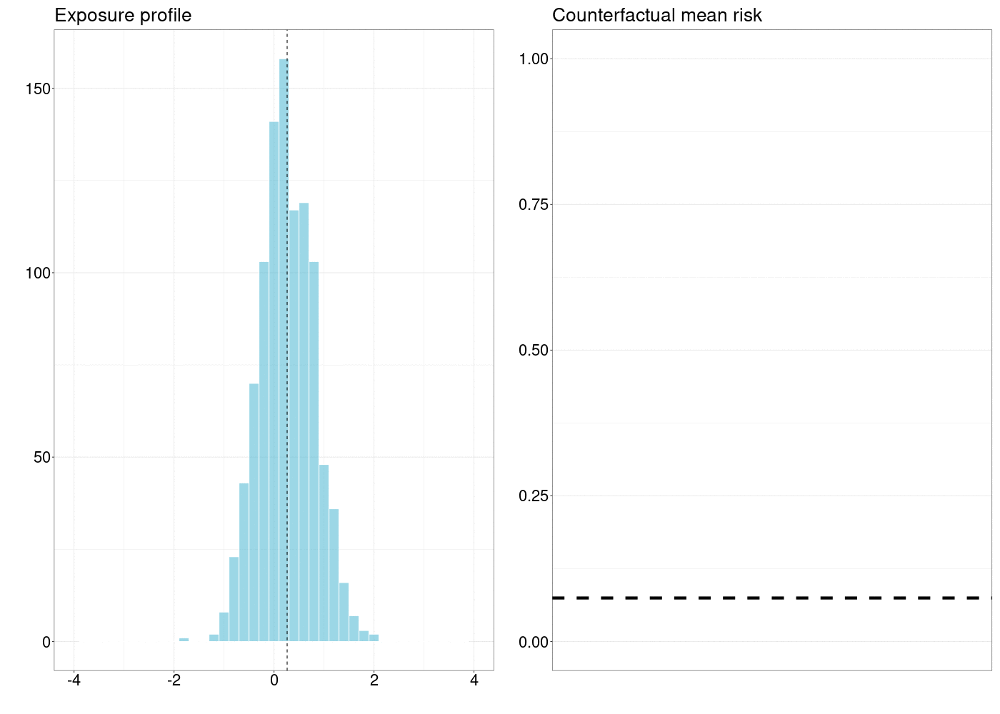

# Stochastic Treatment Regimes

_Nima Hejazi_

Based on the [`tmle3shift` `R` package](https://github.com/tlverse/tmle3shift)
by _Nima Hejazi, Jeremy Coyle, and Mark van der Laan_.

Updated: 2021-03-11

## Learning Objectives

1. Differentiate stochastic treatment regimes from static, dynamic, and optimal
   treatment regimes.
2. Describe how estimating causal effects of stochastic interventions informs a
   real-world data analysis.
3. Contrast a population level stochastic intervention policy from a modified
   treatment policy.
4. Estimate causal effects under stochastic treatment regimes with the
   `tmle3shift` `R` package.
6. Specify a grid of counterfactual shift interventions to be used for defining
   a set of stochastic intervention policies.
7. Interpret a set of effect estimates from a grid of counterfactual shift
   interventions.
5. Construct marginal structural models to measure variable importance in terms
   of stochastic interventions, using a grid of shift interventions.
8. Implement a shift intervention at the individual level, to facilitate
   shifting each individual to a value that's supported by the data.
9. Define novel shift intervention functions to extend the `tmle3shift` `R`
   package.

## Introduction to Stochastic Interventions

Stochastic treatment regimes present a relatively simple, yet extremely flexible
manner by which _realistic_ causal effects (and contrasts thereof) may be
defined. Importantly, stochastic treatment regimes may be applied to nearly
any manner of treatment variable -- continuous, ordinal, categorical, binary --
allowing for a rich set of causal effects to be defined through this formalism.
In this chapter, we examine a simple example of stochastic treatment regimes in
the context of a continuous treatment variable of interest, defining an
intuitive causal effect through which to examine stochastic interventions more
generally. In later sections, we introduce numerous extensions based on this
broad class of interventions -- from stochastic interventions on binary
treatment variables to stochastic mediation effects and data-adaptive inference
for stochastic intervention effects. As a first step to using stochastic
treatment regimes in practice, we present the [`tmle3shift` R
package](https://github.com/tlverse/tmle3shift), which features an
implementation of a recently developed algorithm for computing targeted minimum
loss-based estimates of a causal effect based on a stochastic treatment regime
that shifts the natural value of the treatment based on a shifting function
$d(A,W)$. For a comprehensive technical presentation of some of the material in
this chapter, the interested reader is invited to consult @diaz2018stochastic.
Additional background on the field of Targeted Learning, as well as prior work
on stochastic treatment regimes, is available in @vdl2011targeted,
@vdl2018targeted, and @diaz2012population.

While stochastic treatment regimes are arguably the most general of the
classes of interventions through which causal effects may be defined, such
interventions are conceptually simple.

## Data Structure and Notation

Consider $n$ observed units $O_1, \ldots, O_n$, where each random variable $O =
(W, A, Y)$ corresponds to a single observational unit. Let $W$ denote baseline
covariates (e.g., age, sex, education level), $A$ an intervention variable of
interest (e.g., nutritional supplements), and $Y$ an outcome of interest (e.g.,
disease status). Though it need not be the case, let $A$ be continuous-valued,
i.e. $A \in \mathbb{R}$. Let $O_i \sim \mathcal{P} \in \mathcal{M}$, where
$\mathcal{M}$ is the nonparametric statistical model defined as the set of
continuous densities on $O$ with respect to some dominating measure. To
formalize the definition of stochastic interventions and their corresponding
causal effects, we introduce a nonparametric structural equation model (NPSEM),
based on @pearl2009causality, to define how the system changes under posited
interventions:
\begin{align*}\label{eqn:npsem}
  W &= f_W(U_W) \\ A &= f_A(W, U_A) \\ Y &= f_Y(A, W, U_Y),
\end{align*}
where the set of structural equations provide a mechanistic model by which the
observed data $O$ is assumed to have been generated. There are several standard
assumptions embedded in the NPSEM -- specifically, a temporal ordering that
supposes that $Y$ occurs after $A$, which occurs after $W$; each variable
(i.e., $\{W, A, Y\}$) is assumed to have been generated from its corresponding
deterministic function (i.e., $\{f_W, f_A, f_Y\}$) of the observed variables
that precede it temporally, as well as an exogenous variable, denoted by $U$;
lastly, each exogenous variable is assumed to contain all unobserved causes of
the corresponding observed variable.

The likelihood of the data $O$ admits a factorization, wherein, for $p_0^O$,
the density of $O$ with respect to the product measure, the density evaluated
on a particular observation $o$ may be a written
\begin{equation*}\label{eqn:likelihood_factorization}
  p_0^O(x) = q^O_{0,Y}(y \mid A = a, W = w) q^O_{0,A}(a \mid W = w)
  q^O_{0,W}(w),
\end{equation*}
where $q_{0, Y}$ is the conditional density of $Y$ given $(A, W)$ with respect
to some dominating measure, $q_{0, A}$ is the conditional density of $A$ given
$W$ with respect to dominating measure $\mu$, and $q_{0, W}$ is the density of
$W$ with respect to dominating measure $\nu$. Further, for ease of notation,
let $Q(A, W) = \mathbb{E}[Y \mid A, W]$, $g(A \mid W) = \mathbb{P}(A \mid W)$,
and $q_W$ the marginal distribution of $W$. These components of the likelihood
will be essential in developing an understanding of the manner in which
stochastic treatment regimes pertrub a system and how a corresponding causal
effect may be evaluated. Importantly, the NPSEM parameterizes $p_0^O$ in terms
of the distribution of random variables $(O, U)$ modeled by the system of
equations. In turn, this implies a model for the distribution of counterfactual
random variables generated by interventions on the data-generating process.

## Defining the Causal Effect of a Stochastic Intervention

As causal effects are defined in terms of hypothetical interventions on the
NPSEM (\ref{eqn:npsem}), we may consider stochastic interventions in two
equivalent ways: (1) where the equation $f_A$, giving rise to $A$, is replaced
by a probabilistic mechanism $g_{\delta}(A \mid W)$ that differs from the
original $g(A \mid W)$, or (2) where the observed value $A$ is replaced by a
new value $A_{d(A,W)}$ based on applying a user-defined function $d(A,W)$ to
$A$. In the former case, the _stochastically modified_ value of the treatment
$A_{\delta}$ is drawn from a user-specified distribution $g_\delta(A \mid W)$,
which may depend on the original distribution $g(A \mid W)$ and is indexed by
a user-specified parameter $\delta$. In this case, the stochastically modified
value of the treatment $A_{\delta} \sim g_{\delta}(\cdot \mid W)$.
Alternatively, in the latter case, the stochastic treatment regime may be
viewed as an intervention in which $A$ is set equal to a value based on a
hypothetical regime $d(A, W)$, where regime $d$ depends on the treatment level
$A$ that would be assigned in the absence of the regime as well as the
covariates $W$. In either case, one may view the stochastic intervention as
generating a counterfactual random variable $Y_{d(A,W)} := f_Y(d(A,W), W, U_Y)
\equiv Y_{g_{\delta}} := f_Y(A_{\delta}, W, U_Y)$, where the counterfactual
outcome $Y_{d(A,W)} \sim \mathcal{P}_0^{\delta}$.

Stochastic interventions of this second variety may be referred to as depending
on the _natural value of treatment_ or as _modified treatment policies_.
@haneuse2013estimation and @young2014identification provide a discussion of the
critical differences and similarities in the identification and interpretation
of these two classes of stochastic intervention. In the sequel, we will
restrict our attention to a simple stochastic treatment regime that has been
characterized as a _modified treatment policy_ (MTP). Letting $A$ denote a
continuous-valued treatment, such as the taking of nutritional supplements
(e.g., number of vitamin pills) and assume that the distribution of $A$
conditional on $W = w$ has support in the interval $(l(w), u(w))$. That is, the
minimum observed number of pills taken $A$ for an individual with covariates
$W = w$ is $l(w)$; similarly, the maximum is $u(w)$. Then, a simple stochastic
intervention, based on a shift $\delta$, may be defined
\begin{equation}\label{eqn:shift}
  d(a, w) =
  \begin{cases}
    a - \delta & \text{if } a > l(w) + \delta \\
    a & \text{if } a \leq l(w) + \delta,
  \end{cases}
\end{equation}
where $0 \leq \delta \leq u(w)$ is an arbitrary pre-specified value that
defines the degree to which the observed value $A$ is to be shifted, where
possible. Such a stochastic treatment regime may be interpreted as the result
of a clinic policy that encourages individuals to consume $\delta$ more vitamin
pills than they would normally, i.e., based on their baseline characteristics.
The interpretation of this stochastic intervention may be made more interesting
by allowing the modification $\delta$ that it engenders to be a function of the
baseline covariates $W$, thereby allowing for the number of vitamin pills taken
to be a function of covariates such as age, sex, comorbidities, etc. This class
of stochastic interventions was first introduced by @diaz2012population and has
been further discussed in @haneuse2013estimation, @diaz2018stochastic, and
@hejazi2020efficient. Note that this intervention may be written in a manner
consistent with the first class of stochastic treatment regimes discussed as
well -- that is, as per @diaz2012population, $\mathbb{P}_{\delta}(g_0)(A = a
\mid W) = g_0(a - \delta(W) \mid W)$.

The goal of any causal analysis motivated by such a stochastic intervention is
to estimate a parameter defined as the counterfactual mean of the outcome with
respect to the stochastically modified intervention distribution. In
particular, the target causal estimand of our analysis is $\psi_{0, \delta} :=
\mathbb{E}_{P_0^{\delta}}\{Y_{d(A,W)}\}$, the mean of the counterfactual
outcome variable $Y_{d(A, W)}$. In prior work, @diaz2012population showed that
the causal quantity of interest $\mathbb{E}_0 \{Y_{d(A, W)}\}$ is identified by
a functional of the distribution of $O$:
\begin{align*}\label{eqn:identification2012}
  \psi_{0,d} = \int_{\mathcal{W}} \int_{\mathcal{A}} & \mathbb{E}_{P_0}
   \{Y \mid A = d(a, w), W = w\} \cdot \\ &q_{0, A}^O(a \mid W = w) \cdot
   q_{0, W}^O(w) d\mu(a)d\nu(w).
\end{align*}
If the identification conditions may be assumed to hold, then the statistical
parameter in \ref{eqn:identification2012} matches exactly the counterfactual
outcome $\psi_{0, \delta}$ under such an intervention, allowing for the causal
effect to be learned from the observed data $O$. @diaz2012population provide a
derivation based on the efficient influence function (EIF) in the nonparametric
model $\mathcal{M}$ and develop several estimators of this quantity, including
substitution, inverse probability weighted (IPW), augmented inverse probability
weighted (AIPW), and targeted maximum likelihood (TML) estimators, allowing for
semiparametric-efficient estimation and inference on the quantity of interest.
As per @diaz2018stochastic, the statistical target parameter may also be
denoted $\Psi(P_0) = \mathbb{E}_{P_0}{\overline{Q}(d(A, W), W)}$, where
$\overline{Q}(d(A, W), W)$ is the counterfactual outcome value of a given
individual under the stochastic intervention distribution.

Although the focus of this work is neither the establishment of identification
results nor the development of theoretical details, we review the necessary
identification details for the counterfactual mean under a stochastic
intervention here, in the interest of completeness. Paraphrasing from
@diaz2012population and @diaz2018stochastic, four standard assumptions are
necessary in order to establish identifiability of the causal parameter from
the observed data via the statistical functional -- these are

1. _Consistency_: $Y^{d(a_i, w_i)}_i = Y_i$ in the event $A_i = d(a_i, w_i)$,
   for $i = 1, \ldots, n$
2. _Stable unit value treatment assumption (SUTVA)_: $Y^{d(a_i, w_i)}_i$ does
   not depend on $d(a_j, w_j)$ for $i = 1, \ldots, n$ and $j \neq i$, or lack
   of interference [@rubin1978bayesian; @rubin1980randomization].
3. _Strong ignorability_: $A_i \indep Y^{d(a_i, w_i)}_i \mid W_i$, for $i = 1,
   \ldots, n$.
4. Positivity (or overlap)_: $a_i \in \mathcal{A} \implies d(a_i, w_i) \in
   \mathcal{A}$ for all $w \in \mathcal{W}$, where $\mathcal{A}$ denotes the
   support of $A \mid W = w_i \quad \forall i = 1, \ldots n$.

With the identification assumptions satisfied, @diaz2012population and
@diaz2018stochastic provide an efficient influence function with  respect to
the nonparametric model $\mathcal{M}$ as
\begin{equation*}\label{eqn:eif}
  D(P_0)(x) = H(a, w)({y - \overline{Q}(a, w)}) +
  \overline{Q}(d(a, w), w) - \Psi(P_0),
\end{equation*}
where the auxiliary covariate $H(a,w)$ may be expressed
\begin{equation*}\label{eqn:aux_covar_full}
  H(a,w) = \mathbb{I}(a + \delta < u(w)) \frac{g_0(a - \delta \mid w)}
  {g_0(a \mid w)} + \mathbb{I}(a + \delta \geq u(w)),
\end{equation*}
which may be reduced to
\begin{equation*}\label{eqn:aux_covar_simple}
  H(a,w) = \frac{g_0(a - \delta \mid w)}{g_0(a \mid w)} + 1
\end{equation*}
in the case that the treatment is within the limits that arise from conditioning
on $W$, i.e., for $A_i \in (u(w) - \delta, u(w))$.

The efficient influence function allows the construction of a
semiparametric-efficient estimators may be constructed. In the sequel, we focus
on a targeted maximum likelihood (TML) estimator, for which @diaz2018stochastic
give a recipe:

1. Construct initial estimators $g_n$ of $g_0(A, W)$ and $Q_n$ of
   $\overline{Q}_0(A, W)$, perhaps using data-adaptive regression techniques.
2. For each observation $i$, compute an estimate $H_n(a_i, w_i)$ of the
   auxiliary covariate $H(a_i,w_i)$.
3. Estimate the parameter $\epsilon$ in the logistic regression model
   $$ \text{logit}\overline{Q}_{\epsilon, n}(a, w) =
   \text{logit}\overline{Q}_n(a, w) + \epsilon H_n(a, w),$$
   or an alternative regression model incorporating weights.
4. Compute TML estimator $\Psi_n$ of the target parameter, defining update
   $\overline{Q}_n^{\star}$ of the initial estimate
   $\overline{Q}_{n, \epsilon_n}$:
   \begin{equation*}\label{eqn:tmle}
     \Psi_n = \Psi(P_n^{\star}) = \frac{1}{n} \sum_{i = 1}^n
     \overline{Q}_n^{\star}(d(A_i, W_i), W_i).
   \end{equation*}

## Interpreting the Causal Effect of a Stochastic Intervention

<div class="figure" style="text-align: center">

<p class="caption">(\#fig:unnamed-chunk-1)How a counterfactual outcome changes as the natural treatment distribution is shifted by a simple stochastic intervention</p>
</div>

## Evaluating the Causal Effect of a Stochastic Intervention

To start, let's load the packages we'll be using throughout our simple data example


```r
library(data.table)
library(haldensify)
library(sl3)
library(tmle3)
library(tmle3shift)
```

We need to estimate two components of the likelihood in order to construct a TML
estimator. The first of these components is the outcome regression, $\hat{Q}_n$,
which is a simple regression of the form $\mathbb{E}[Y \mid A,W]$.  An estimate
for such a quantity may be constructed using the Super Learner algorithm. We
construct the components of an `sl3`-style Super Learner for a regression below,
using a small variety of parametric and nonparametric regression techniques:


```r
# learners used for conditional mean of the outcome
mean_lrnr <- Lrnr_mean$new()
fglm_lrnr <- Lrnr_glm_fast$new()
rf_lrnr <- Lrnr_ranger$new()
hal_lrnr <- Lrnr_hal9001$new(max_degree = 3, n_folds = 3)

# SL for the outcome regression
sl_reg_lrnr <- Lrnr_sl$new(
  learners = list(mean_lrnr, fglm_lrnr, rf_lrnr, hal_lrnr),
  metalearner = Lrnr_nnls$new()
)
```

The second of these is an estimate of the treatment mechanism, $\hat{g}_n$,
i.e., the _propensity score_. In the case of a continuous intervention node $A$,
such a quantity takes the form $p(A \mid W)$, which is a conditional density.
Generally speaking, conditional density estimation is a challenging problem that
has received much attention in the literature. To estimate the treatment
mechanism, we must make use of learning algorithms specifically suited to
conditional density estimation; a list of such learners may be extracted from
`sl3` by using `sl3_list_learners()`:


```r
sl3_list_learners("density")
#> [1] "Lrnr_density_discretize"     "Lrnr_density_hse"           
#> [3] "Lrnr_density_semiparametric" "Lrnr_haldensify"            
#> [5] "Lrnr_solnp_density"
```

To proceed, we'll select two of the above learners, `Lrnr_haldensify` for using
the highly adaptive lasso for conditional density estimation, based on an
algorithm given by @diaz2011super and implemented in @hejazi2020haldensify, and
semiparametric location-scale conditional density estimators implemented in the
[`sl3` package](https://github.com/tlverse/sl3). A Super Learner may be
constructed by pooling estimates from each of these modified conditional density
regression techniques.


```r
# learners used for conditional densities (i.e., generalized propensity score)
haldensify_lrnr <- Lrnr_haldensify$new(
  n_bins = c(3, 5),
  lambda_seq = exp(seq(-1, -10, length = 200))
)
# semiparametric density estimator based on homoscedastic errors (HOSE)
hose_hal_lrnr <- make_learner(Lrnr_density_semiparametric,
  mean_learner = hal_lrnr
)
# semiparametric density estimator based on heteroscedastic errors (HESE)
hese_rf_glm_lrnr <- make_learner(Lrnr_density_semiparametric,
  mean_learner = rf_lrnr,
  var_learner = fglm_lrnr
)

# SL for the conditional treatment density
sl_dens_lrnr <- Lrnr_sl$new(
  learners = list(haldensify_lrnr, hose_hal_lrnr, hese_rf_glm_lrnr),
  metalearner = Lrnr_solnp_density$new()
)
```

Finally, we construct a `learner_list` object for use in constructing a TML
estimator of our target parameter of interest:


```r
learner_list <- list(Y = sl_reg_lrnr, A = sl_dens_lrnr)
```

The `learner_list` object above specifies the role that each of the ensemble
learners we have generated is to play in computing initial estimators to be
used in building a TMLE for the parameter of interest here. In particular, it
makes explicit the fact that our `Q_learner` is used in fitting the outcome
regression while our `g_learner` is used in estimating the treatment mechanism.

### Example with Simulated Data


```r
# simulate simple data for tmle-shift sketch
n_obs <- 400 # number of observations
tx_mult <- 2 # multiplier for the effect of W = 1 on the treatment

## baseline covariates -- simple, binary
W <- replicate(2, rbinom(n_obs, 1, 0.5))

## create treatment based on baseline W
A <- rnorm(n_obs, mean = tx_mult * W, sd = 1)

## create outcome as a linear function of A, W + white noise
Y <- rbinom(n_obs, 1, prob = plogis(A + W))

# organize data and nodes for tmle3
data <- data.table(W, A, Y)
setnames(data, c("W1", "W2", "A", "Y"))
node_list <- list(
  W = c("W1", "W2"),
  A = "A",
  Y = "Y"
)
head(data)
#>    W1 W2         A Y
#> 1:  1  1  0.271651 1
#> 2:  0  0 -0.663368 1
#> 3:  0  0  0.113366 0
#> 4:  0  1 -0.732558 0
#> 5:  1  1  0.388835 1
#> 6:  0  0  0.043986 0
```

The above composes our observed data structure $O = (W, A, Y)$. To formally
express this fact using the `tlverse` grammar introduced by the `tmle3` package,
we create a single data object and specify the functional relationships between
the nodes in the _directed acyclic graph_ (DAG) via _nonparametric structural
equation models_ (NPSEMs), reflected in the node list that we set up:

We now have an observed data structure (`data`) and a specification of the role
that each variable in the data set plays as the nodes in a DAG.

To start, we will initialize a specification for the TMLE of our parameter of
interest (called a `tmle3_Spec` in the `tlverse` nomenclature) simply by calling
`tmle_shift`. We specify the argument `shift_val = 0.5` when initializing the
`tmle3_Spec` object to communicate that we're interested in a shift of $0.5$ on
the scale of the treatment $A$ -- that is, we specify $\delta = 0.5$ (note that
this is an arbitrarily chosen value for this example).


```r
# initialize a tmle specification
tmle_spec <- tmle_shift(
  shift_val = 0.5,
  shift_fxn = shift_additive,
  shift_fxn_inv = shift_additive_inv
)
```

As seen above, the `tmle_shift` specification object (like all `tmle3_Spec`
objects) does _not_ store the data for our specific analysis of interest. Later,
we'll see that passing a data object directly to the `tmle3` wrapper function,
alongside the instantiated `tmle_spec`, will serve to construct a `tmle3_Task`
object internally (see the `tmle3` documentation for details).

### Targeted Estimation of Stochastic Interventions Effects


```r
tmle_fit <- tmle3(tmle_spec, data, node_list, learner_list)
#> 
#> Iter: 1 fn: 534.2313	 Pars:  0.43334 0.38683 0.17983
#> Iter: 2 fn: 534.2312	 Pars:  0.43334 0.38684 0.17982
#> solnp--> Completed in 2 iterations
tmle_fit
#> A tmle3_Fit that took 1 step(s)
#>    type         param init_est tmle_est       se   lower   upper
#> 1:  TSM E[Y_{A=NULL}]  0.76199  0.76263 0.021966 0.71958 0.80568
#>    psi_transformed lower_transformed upper_transformed
#> 1:         0.76263           0.71958           0.80568
```

The `print` method of the resultant `tmle_fit` object conveniently displays the
results from computing our TML estimator.

### Statistical Inference for Targeted Maximum Likelihood Estimates

Recall that the asymptotic distribution of TML estimators has been studied
thoroughly:
$$\psi_n - \psi_0 = (P_n - P_0) \cdot D(\bar{Q}_n^{\star}, g_n) +
R(\hat{P}^{\star}, P_0),$$
which, provided the following two conditions,

1. If $D(\bar{Q}_n^{\star}, g_n)$ converges to $D(P_0)$ in $L_2(P_0)$ norm, and
2. the size of the class of functions considered for estimation of
   $\bar{Q}_n^{\star}$ and $g_n$ is bounded (technically, $\exists \mathcal{F}$
   such that $D(\bar{Q}_n^{\star}, g_n) \in \mathcal{F}$ _whp_, where
   $\mathcal{F}$ is a Donsker class),
readily admits the conclusion that
$\psi_n - \psi_0 = (P_n - P_0) \cdot D(P_0) + R(\hat{P}^{\star}, P_0)$.

Under the additional condition that the remainder term $R(\hat{P}^{\star}, P_0)$
decays as $o_P \left( \frac{1}{\sqrt{n}} \right),$ we have that
$$\psi_n - \psi_0 = (P_n - P_0) \cdot D(P_0) + o_P \left( \frac{1}{\sqrt{n}}
\right),$$
which, by a central limit theorem, establishes a Gaussian limiting distribution
for the estimator:

$$\sqrt{n}(\psi_n - \psi) \to N(0, V(D(P_0))),$$
where $V(D(P_0))$ is the variance of the efficient influence curve (canonical
gradient) when $\psi$ admits an asymptotically linear representation.

The above implies that $\psi_n$ is a $\sqrt{n}$-consistent estimator of $\psi$,
that it is asymptotically normal (as given above), and that it is locally
efficient. This allows us to build Wald-type confidence intervals in a
straightforward manner:

$$\psi_n \pm z_{\alpha} \cdot \frac{\sigma_n}{\sqrt{n}},$$
where $\sigma_n^2$ is an estimator of $V(D(P_0))$. The estimator $\sigma_n^2$
may be obtained using the bootstrap or computed directly via the following

$$\sigma_n^2 = \frac{1}{n} \sum_{i = 1}^{n} D^2(\bar{Q}_n^*, g_n)(O_i)$$

Having now re-examined these facts, let's simply examine the results of
computing our TML estimator:

## Extensions: Variable Importance Analysis with Stochastic Interventions

### Defining a grid of counterfactual interventions

In order to specify a _grid_ of shifts $\delta$ to be used in defining a set of
stochastic intervention policies in an _a priori_ manner, let us consider an
arbitrary scalar $\delta$ that defines a counterfactual outcome $\psi_n =
Q_n(d(A, W), W)$, where, for simplicity, let $d(A, W) = A + \delta$. A
simplified expression of the auxiliary covariate for the TMLE of $\psi$ is
$H_n = \frac{g^{\star}(a \mid w)}{g(a \mid w)}$, where $g^{\star}(a \mid w)$
defines the treatment mechanism with the stochastic intervention implemented.
Then, to ascertain whether a given choice of the shift $\delta$ is admissable
(in the sense of avoiding violations of the positivity assumption), let there
be a bound $C(\delta) = \frac{g^{\star}(a \mid w)}{g(a \mid w)} < M$, where
$g^{\star}(a \mid w)$ is a function of $\delta$ in part, and $M$ is a potentially
user-specified upper bound of $C(\delta)$. Then, $C(\delta)$ is a measure of
the influence of a given observation, thereby providing a way to limit the
maximum influence of a given observation (by way of the bound $M$ placed on
$C(\delta)$) through a choice of the shift $\delta$.

We formalize and extend the procedure to determine an acceptable set of values
for the shift $\delta$ in the sequel. Specifically, let there be a shift $d(A,
W) = A + \delta(A, W)$, where the shift $\delta(A, W)$ is defined as
\begin{equation}
  \delta(a, w) =
    \begin{cases}
      \delta, & \delta_{\text{min}}(a,w) \leq \delta \leq
        \delta_{\text{max}}(a,w) \\
      \delta_{\text{max}}(a,w), & \delta \geq \delta_{\text{max}}(a,w) \\
      \delta_{\text{min}}(a,w), & \delta \leq \delta_{\text{min}}(a,w) \\
    \end{cases},
\end{equation}
where $$\delta_{\text{max}}(a, w) = \text{argmax}_{\left\{\delta \geq 0,
\frac{g(a - \delta \mid w)}{g(a \mid w)} \leq M \right\}} \frac{g(a - \delta
\mid w)}{g(a \mid w)}$$ and
$$\delta_{\text{min}}(a, w) = \text{argmin}_{\left\{\delta \leq 0,
\frac{g(a - \delta \mid w)}{g(a \mid w)} \leq M \right\}} \frac{g(a - \delta
\mid w)}{g(a \mid w)}.$$

The above provides a strategy for implementing a shift at the level of a given
observation $(a_i, w_i)$, thereby allowing for all observations to be shifted
to an appropriate value -- whether $\delta_{\text{min}}$, $\delta$, or
$\delta_{\text{max}}$.

For the purpose of using such a shift in practice, the present software
provides the functions `shift_additive_bounded` and
`shift_additive_bounded_inv`, which define a variation of this shift:
\begin{equation}
  \delta(a, w) =
    \begin{cases}
      \delta, & C(\delta) \leq M \\
      0, \text{otherwise} \\
    \end{cases},
\end{equation}
which corresponds to an intervention in which the natural value of treatment
of a given observational unit is shifted by a value $\delta$ in the case that
the ratio of the intervened density $g^{\star}(a \mid w)$ to the natural
density $g(a \mid w)$ (that is, $C(\delta)$) does not exceed a bound $M$. In
the case that the ratio $C(\delta)$ exceeds the bound $M$, the stochastic
intervention policy does not apply to the given unit and they remain at their
natural value of treatment $a$.

### Initializing `vimshift` through its `tmle3_Spec`

To start, we will initialize a specification for the TMLE of our parameter of
interest (called a `tmle3_Spec` in the `tlverse` nomenclature) simply by calling
`tmle_shift`. We specify the argument `shift_grid = seq(-1, 1, by = 1)`
when initializing the `tmle3_Spec` object to communicate that we're interested
in assessing the mean counterfactual outcome over a grid of shifts -1, 0, 1 on the scale of the treatment $A$ (note that the numerical
choice of shift is an arbitrarily chosen set of values for this example).


```r
# what's the grid of shifts we wish to consider?
delta_grid <- seq(-1, 1, 1)

# initialize a tmle specification
tmle_spec <- tmle_vimshift_delta(
  shift_grid = delta_grid,
  max_shifted_ratio = 2
)
```

As seen above, the `tmle_vimshift` specification object (like all `tmle3_Spec`
objects) does _not_ store the data for our specific analysis of interest. Later,
we'll see that passing a data object directly to the `tmle3` wrapper function,
alongside the instantiated `tmle_spec`, will serve to construct a `tmle3_Task`
object internally (see the `tmle3` documentation for details).

### Targeted Estimation of Stochastic Interventions Effects

One may walk through the step-by-step procedure for  fitting the TML estimator
of the mean counterfactual outcome under each shift in the grid, using the
machinery exposed by the [`tmle3` R package](https://tmle3.tlverse.org/).

One may invoke the `tmle3` wrapper function (a user-facing convenience utility)
to fit the series of TML estimators (one for each parameter defined by the grid
delta) in a single function call:


```r
tmle_fit <- tmle3(tmle_spec, data, node_list, learner_list)
#> 
#> Iter: 1 fn: 534.0196	 Pars:  0.40786 0.35781 0.23432
#> Iter: 2 fn: 534.0196	 Pars:  0.40783 0.35787 0.23430
#> solnp--> Completed in 2 iterations
tmle_fit
#> A tmle3_Fit that took 1 step(s)
#>          type          param init_est tmle_est        se   lower   upper
#> 1:        TSM  E[Y_{A=NULL}]  0.55351  0.56184 0.0226250 0.51749 0.60618
#> 2:        TSM  E[Y_{A=NULL}]  0.69755  0.69748 0.0229975 0.65240 0.74255
#> 3:        TSM  E[Y_{A=NULL}]  0.82085  0.80029 0.0183487 0.76433 0.83625
#> 4: MSM_linear MSM(intercept)  0.69063  0.68654 0.0198658 0.64760 0.72547
#> 5: MSM_linear     MSM(slope)  0.13367  0.11923 0.0091122 0.10137 0.13709
#>    psi_transformed lower_transformed upper_transformed
#> 1:         0.56184           0.51749           0.60618
#> 2:         0.69748           0.65240           0.74255
#> 3:         0.80029           0.76433           0.83625
#> 4:         0.68654           0.64760           0.72547
#> 5:         0.11923           0.10137           0.13709
```

_Remark_: The `print` method of the resultant `tmle_fit` object conveniently
displays the results from computing our TML estimator.

### Inference with Marginal Structural Models

Since we consider estimating the mean counterfactual outcome $\psi_n$ under
several values of the intervention $\delta$, taken from the aforementioned
$\delta$-grid, one approach for obtaining inference on a single summary measure
of these estimated quantities involves leveraging working marginal structural
models (MSMs). Summarizing the estimates $\psi_n$ through a working MSM allows
for inference on the _trend_ imposed by a $\delta$-grid to be evaluated via a
simple hypothesis test on a parameter of this working MSM. Letting
$\psi_{\delta}(P_0)$ be the mean outcome under a shift $\delta$ of the
treatment, we have $\vec{\psi}_{\delta} = (\psi_{\delta}: \delta)$ with
corresponding estimators $\vec{\psi}_{n, \delta} = (\psi_{n, \delta}: \delta)$.
Further, let $\beta(\vec{\psi}_{\delta}) = \phi((\psi_{\delta}: \delta))$.

For a given MSM $m_{\beta}(\delta)$, we have that
$$\beta_0 = \text{argmin}_{\beta} \sum_{\delta}(\psi_{\delta}(P_0) -
m_{\beta}(\delta))^2 h(\delta),$$
which is the solution to
$$u(\beta, (\psi_{\delta}: \delta)) = \sum_{\delta}h(\delta)
\left(\psi_{\delta}(P_0) - m_{\beta}(\delta) \right) \frac{d}{d\beta}
m_{\beta}(\delta) = 0.$$
This then leads to the following expansion
$$\beta(\vec{\psi}_n) - \beta(\vec{\psi}_0) \approx -\frac{d}{d\beta}
  u(\beta_0, \vec{\psi}_0)^{-1} \frac{d}{d\psi} u(\beta_0, \psi_0)
  (\vec{\psi}_n - \vec{\psi}_0),$$
where we have
$$\frac{d}{d\beta} u(\beta, \psi) = -\sum_{\delta} h(\delta) \frac{d}{d\beta}
m_{\beta}(\delta)^t \frac{d}{d\beta} m_{\beta}(\delta)
-\sum_{\delta} h(\delta) m_{\beta}(\delta) \frac{d^2}{d\beta^2}
m_{\beta}(\delta),$$
which, in the case of an MSM that is a linear model (since
$\frac{d^2}{d\beta^2} m_{\beta}(\delta) = 0$), reduces simply to
$$\frac{d}{d\beta} u(\beta, \psi) = -\sum_{\delta} h(\delta) \frac{d}{d\beta}
m_{\beta}(\delta)^t \frac{d}{d\beta} m_{\beta}(\delta),$$
and
$$\frac{d}{d\psi}u(\beta, \psi)(\psi_n - \psi_0) = \sum_{\delta} h(\delta)
\frac{d}{d\beta} m_{\beta}(\delta) (\psi_n - \psi_0)(\delta),$$
which we may write in terms of the efficient influence function (EIF) of $\psi$
by using the first order approximation $(\psi_n - \psi_0)(\delta) =
\frac{1}{n}\sum_{i = 1}^n \text{EIF}_{\psi_{\delta}}(O_i)$,
where $\text{EIF}_{\psi_{\delta}}$ is the efficient influence function (EIF) of
$\vec{\psi}$.

Now, say, $\vec{\psi} = (\psi(\delta): \delta)$ is d-dimensional, then we may
write the efficient influence function of the MSM parameter $\beta$ as follows
$$\text{EIF}_{\beta}(O) = \left(\sum_{\delta} h(\delta) \frac{d}{d\beta}
m_{\beta}(\delta) \frac{d}{d\beta} m_{\beta}(\delta)^t \right)^{-1} \cdot
\sum_{\delta} h(\delta) \frac{d}{d\beta} m_{\beta}(\delta)
\text{EIF}_{\psi_{\delta}}(O),$$ where the first term is of dimension
$d \times d$ and the second term is of dimension $d \times 1$. In the above, we
assume a linear working MSM; however, an analogous procedure may be applied for
working MSMs based on GLMs.

Inference for a parameter of an MSM may be obtained by straightforward
application of the delta method (discussed previously) -- that is, we may
write the efficient influence function of the MSM parameter $\beta$ in terms of
the EIFs of each of the corresponding point estimates. Based on this, inference
from a working MSM is rather straightforward. To wit, the limiting distribution
for $m_{\beta}(\delta)$ may be expressed $$\sqrt{n}(\beta_n - \beta_0) \to N(0,
\Sigma),$$ where $\Sigma$ is the empirical covariance matrix of
$\text{EIF}_{\beta}(O)$.


```r
tmle_fit$summary[4:5, ]
#>          type          param init_est tmle_est        se   lower   upper
#> 1: MSM_linear MSM(intercept)  0.69063  0.68654 0.0198658 0.64760 0.72547
#> 2: MSM_linear     MSM(slope)  0.13367  0.11923 0.0091122 0.10137 0.13709
#>    psi_transformed lower_transformed upper_transformed
#> 1:         0.68654           0.64760           0.72547
#> 2:         0.11923           0.10137           0.13709
```

#### Directly Targeting the MSM Parameter $\beta$

Note that in the above, a working MSM is fit to the individual TML estimates of
the mean counterfactual outcome under a given value of the shift $\delta$ in the
supplied grid. The parameter of interest $\beta$ of the MSM is asymptotically
linear (and, in fact, a TML estimator) as a consequence of its construction from
individual TML estimators. In smaller samples, it may be prudent to perform a
TML estimation procedure that targets the parameter $\beta$ directly, as opposed
to constructing it from several independently targeted TML estimates. An
approach for constructing such an estimator is proposed in the sequel.

Suppose a simple working MSM $\mathbb{E}Y_{g^0_{\delta}} = \beta_0 + \beta_1
\delta$, then a TML estimator targeting $\beta_0$ and $\beta_1$ may be
constructed as
$$\overline{Q}_{n, \epsilon}(A,W) = \overline{Q}_n(A,W) + \epsilon (H_1(g),
H_2(g),$$ for all $\delta$, where $H_1(g)$ is the auxiliary covariate for
$\beta_0$ and $H_2(g)$ is the auxiliary covariate for $\beta_1$.

To construct a targeted maximum likelihood estimator that directly targets the
parameters of the working marginal structural model, we may use the
`tmle_vimshift_msm` Spec (instead of the `tmle_vimshift_delta` Spec that
appears above):


```r
# initialize a tmle specification
tmle_msm_spec <- tmle_vimshift_msm(
  shift_grid = delta_grid,
  max_shifted_ratio = 2
)

# fit the TML estimator and examine the results
tmle_msm_fit <- tmle3(tmle_msm_spec, data, node_list, learner_list)
#> 
#> Iter: 1 fn: 533.0247	 Pars:  0.42823 0.44441 0.12736
#> Iter: 2 fn: 533.0247	 Pars:  0.42823 0.44441 0.12736
#> solnp--> Completed in 2 iterations
tmle_msm_fit
#> A tmle3_Fit that took 1 step(s)
#>          type          param init_est tmle_est       se   lower   upper
#> 1: MSM_linear MSM(intercept)  0.69052  0.69085 0.020071 0.65151 0.73019
#> 2: MSM_linear     MSM(slope)  0.13300  0.13291 0.008957 0.11536 0.15047
#>    psi_transformed lower_transformed upper_transformed
#> 1:         0.69085           0.65151           0.73019
#> 2:         0.13291           0.11536           0.15047
```

### Example with the WASH Benefits Data

To complete our walk through, let's turn to using stochastic interventions to
investigate the data from the WASH Benefits trial. To start, let's load the
data, convert all columns to be of class `numeric`, and take a quick look at it


```r
washb_data <- fread(
  paste0(
    "https://raw.githubusercontent.com/tlverse/tlverse-data/master/",
    "wash-benefits/washb_data.csv"
  ),
  stringsAsFactors = TRUE
)
washb_data <- washb_data[!is.na(momage), lapply(.SD, as.numeric)]
head(washb_data, 3)
#>      whz tr fracode month aged sex momage momedu momheight hfiacat Nlt18 Ncomp
#> 1:  0.00  1       4     9  268   2     30      2    146.40       1     3    11
#> 2: -1.16  1       4     9  286   2     25      2    148.75       3     2     4
#> 3: -1.05  1      20     9  264   2     25      2    152.15       1     1    10
#>    watmin elec floor walls roof asset_wardrobe asset_table asset_chair
#> 1:      0    1     0     1    1              0           1           1
#> 2:      0    1     0     1    1              0           1           0
#> 3:      0    0     0     1    1              0           0           1
#>    asset_khat asset_chouki asset_tv asset_refrig asset_bike asset_moto
#> 1:          1            0        1            0          0          0
#> 2:          1            1        0            0          0          0
#> 3:          0            1        0            0          0          0
#>    asset_sewmach asset_mobile
#> 1:             0            1
#> 2:             0            1
#> 3:             0            1
```

Next, we specify our NPSEM via the `node_list` object. For our example analysis,
we'll consider the outcome to be the weight-for-height Z-score (as in previous
chapters), the intervention of interest to be the mother's age at time of
child's birth, and take all other covariates to be potential confounders.


```r
node_list <- list(
  W = names(washb_data)[!(names(washb_data) %in%
    c("whz", "momage"))],
  A = "momage",
  Y = "whz"
)
```

Were we to consider the counterfactual weight-for-height Z-score under shifts in
the age of the mother at child's birth, how would we interpret estimates of our
parameter? To simplify our interpretation, consider a shift of just a year in
the mother's age (i.e., $\delta = 1$); in this setting, a stochastic
intervention would correspond to a policy advocating that potential mothers
defer having a child for a single calendar year, possibly implemented through an
encouragement design deployed in a clinical setting.

For this example, we'll use the variable importance strategy of considering a
grid of stochastic interventions to evaluate the weight-for-height Z-score under
a shift in the mother's age down by two years ($\delta = -2$) or up by two years
($\delta = 2$). To do this, we simply initialize a `Spec` `tmle_vimshift_delta`
just as we did in a previous example:


```r
# initialize a tmle specification for the variable importance parameter
washb_vim_spec <- tmle_vimshift_delta(
  shift_grid = c(-2, 2),
  max_shifted_ratio = 2
)
```

Prior to running our analysis, we'll modify the `learner_list` object we had
created such that the density estimation procedure we rely on will be only the
location-scale conditional density estimation procedure, as the nonparametric
conditional density approach based on the highly adaptive lasso [@diaz2011super;
@benkeser2016hal; @coyle2020hal9001; @hejazi2020hal9001; @hejazi2020haldensify]
is currently unable to accommodate larger datasets.


```r
# we need to turn on cross-validation for the HOSE learner
cv_hose_hal_lrnr <- Lrnr_cv$new(
  learner = hose_hal_lrnr,
  full_fit = TRUE
)

# modify learner list, using existing SL for Q fit
learner_list <- list(Y = sl_reg_lrnr, A = cv_hose_hal_lrnr)
```

Having made the above preparations, we're now ready to estimate the
counterfactual mean of the weight-for-height Z-score under a small grid of
shifts in the mother's age at child's birth. Just as before, we do this through
a simple call to our `tmle3` wrapper function:


```r
washb_tmle_fit <- tmle3(washb_vim_spec, washb_data, node_list, learner_list)
washb_tmle_fit
```

---

## Exercises

### The Ideas in Action

1. Set the `sl3` library of algorithms for the Super Learner to a simple,
   interpretable library and use this new library to estimate the counterfactual
   mean of mother's age at child's birth (`momage`) under a shift $\delta = 0$.
   What does this counterfactual mean equate to in terms of the observed data?

2. Using a grid of values of the shift parameter $\delta$ (e.g., $\{-1, 0,
   +1\}$), repeat the analysis on the variable chosen in the preceding question,
   summarizing the trend for this sequence of shifts using a marginal structural
   model.

3. Repeat the preceding analysis, using the same grid of shifts, but instead
   directly targeting the parameters of the marginal structural model. Interpret
   the results -- that is, what does the slope of the marginal structural model
   tell us about the trend across the chosen sequence of shifts?

### Review of Key Concepts

1. Describe two (equivalent) ways in which the causal effects of stochastic
   interventions may be interpreted.

2. How does the marginal structural model we used to summarize the trend along
   the sequence of shifts previously help to contextualize the estimated effect
   for a single shift? That is, how does access to estimates across several
   shifts and the marginal structural model parameters allow us to more richly
   interpret our findings?

3. What advantages, if any, are there to targeting directly the parameters of a
   marginal structural model?

<!--
- @haneuse2013estimation characterization of stochastic interventions as
  \textit{modified treatment policies} (MTPs).
- Assumption of \textit{piecewise smooth invertibility} allows for the
  intervention distribution of any MTP to be recovered:
  \begin{equation*}
    g_{0, \delta}(a \mid w) = \sum_{j = 1}^{J(w)} I_{\delta, j} \{h_j(a, w),
    w\} g_0\{h_j(a, w) \mid w\} h^{\prime}_j(a,w)
  \end{equation*}
- Such intervention policies account for the natural value of the
  intervention $A$ directly yet are interpretable as the imposition of an
  altered intervention mechanism.
- Piecewise smooth invertibility: This assumption ensures that we can
  use the change of variable formula when computing integrals over $A$ and
  it is useful to study the estimators that we propose in this paper.

- __Asymptotic linearity:__
  \begin{equation*}
    \Psi(P_n^{\star}) - \Psi(P_0) = \frac{1}{n} \sum_{i = 1}^{n} D(P_0)(X_i) +
    o_P\left(\frac{1}{\sqrt{n}}\right)
  \end{equation*}
- Gaussian limiting distribution:
  \begin{equation*}
    \sqrt{n}(\Psi(P_n^{\star}) - \Psi(P_0)) \to N(0, Var(D(P_0)(O)))
  \end{equation*}
- Statistical inference:
  \begin{equation*}
    \text{Wald-type CI}: \Psi(P_n^{\star}) \pm z_{\alpha} \cdot
    \frac{\sigma_n}{\sqrt{n}},
  \end{equation*}
  where $\sigma_n^2$ is computed directly via
  $\sigma_n^2 = \frac{1}{n} \sum_{i = 1}^{n} D^2(\cdot)(O_i)$.

Under the additional condition that the remainder term $R(\hat{P}^*, P_0)$
decays as $o_P \left( \frac{1}{\sqrt{n}} \right),$ we have that
$\Psi_n - \Psi_0 = (P_n - P_0) \cdot D(P_0) + o_P
\left( \frac{1}{\sqrt{n}} \right),$ which, by a central limit theorem,
establishes a Gaussian limiting distribution for the estimator, with variance
$V(D(P_0))$, the variance of the efficient influence function
when $\Psi$ admits an asymptotically linear representation.

The above implies that $\Psi_n$ is a $\sqrt{n}$-consistent estimator of $\Psi$,
that it is asymptotically normal (as given above), and that it is locally
efficient. This allows us to build Wald-type confidence intervals, where
$\sigma_n^2$ is an estimator of $V(D(P_0))$. The estimator $\sigma_n^2$
may be obtained using the bootstrap or computed directly via
$\sigma_n^2 = \frac{1}{n} \sum_{i = 1}^{n} D^2(\bar{Q}_n^*, g_n)(O_i)$

We obtain semiparametric-efficient estimation and robust inference in the
nonparametric model $\M$ by solving the efficient influence function.

1. If $D(\bar{Q}_n^*, g_n)$ converges to $D(P_0)$ in $L_2(P_0)$ norm.
2. The size of the class of functions $\bar{Q}_n^*$ and $g_n$ is bounded
   (technically, $\exists \mathcal{F}$ st
   $D(\bar{Q}_n^*, g_n) \in \mathcal{F}$ whp, where $\mathcal{F}$ is a
   Donsker class)
-->
