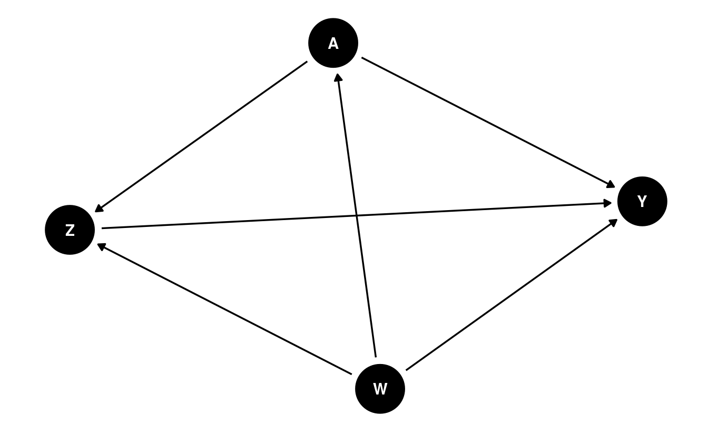

# Causal Mediation Analysis

_Nima Hejazi_

Featuring the [`tmle3mediate` `R`
package](https://github.com/tlverse/tmle3mediate).

:::: {.infobox .tlverse data-latex=""}
:::{.center data-latex=""}
**Learning Objectives**
:::

1. Examine how the presence of post-treatment mediating variables can complicate
   a causal analysis, and how direct and indirect effects can be defined to
   resolve these complications.
2. Describe the essential similarities and differences between direct and
   indirect causal effects, including their definition in terms of stochastic
   interventions.
3. Differentiate the joint interventions required to define direct and indirect
   effects from the static, dynamic, and stochastic interventions that yield
   _total_ causal effects.
4. Describe the assumptions needed for identification of the natural direct and
   indirect effects, as well as the limitations of these effect definitions.
5. Estimate the natural direct and indirect effects for a binary treatment using
   the `tmle3mediate` `R` package.
6. Differentiate the population intervention direct and indirect effects of
   stochastic interventions from the natural direct and indirect effects,
   including differences in the assumptions required for their identification.
7. Estimate the population intervention direct effect of a binary treatment
   using the `tmle3mediate` `R` package.
::::

## Causal Mediation Analysis

In applications ranging from biology and epidemiology to economics and
psychology, scientific inquires are often concerned with ascertaining the effect
of a treatment on an outcome variable only through particular pathways between
the two. In the presence of post-treatment intermediate variables affected by
exposure (that is, _mediators_), path-specific effects allow for such complex,
mechanistic relationships to be teased apart. These causal effects are of such
wide interest that their definition and identification has been the object of
study in statistics for nearly a century -- indeed, the earliest examples of
modern causal mediation analysis can be traced back to work on path analysis
[@wright1934method]. In recent decades, renewed interest has resulted in the
formulation of novel direct and indirect effects within both the potential
outcomes and nonparametric structural equation modeling frameworks
[@robins1986new; @pearl1995causal; @pearl2009causality; @spirtes2000causation;
@dawid2000causal]. Generally, the indirect effect (IE) is the portion of the
total effect found to work _through_ mediating variables, while the direct
effect (DE) encompasses _all other components_ of the total effect, including
both the effect of the treatment directly on the outcome _and_ its effect
through all paths not explicitly involving the mediators. The mechanistic
knowledge conveyed by the direct and indirect effects can be used to improve
understanding of both _why_ and _how_ treatments may be efficacious.

Modern approaches to causal inference have allowed for significant advances over
the methodology of traditional path analysis, overcoming significant
restrictions imposed by the use of parametric modeling approaches
[@vanderweele2015explanation]. Using distinct frameworks,
@robins1992identifiability and @pearl2001direct provided equivalent
nonparametric decompositions of the average treatment effect into the _natural_
direct and indirect effects. @vanderweele2015explanation provides a
comprehensive overview of classical causal mediation analysis. We provide an
alternative perspective, focusing instead on the construction of efficient
estimators of these quantities, which have appeared  only recently
[@tchetgen2012semiparametric; @zheng2012targeted], as well as on more flexible
direct and indirect definitions based upon stochastic interventions
[@diaz2020causal].

## Data Structure and Notation

Let us return to our familiar sample of $n$ units $O_1, \ldots, O_n$, where we
now consider a slightly more complex data structure $O = (W, A, Z, Y)$ for any
given observational unit. As before, $W$ represents a vector of observed
covariates, $A$ a binary or continuous treatment, and $Y$ a binary or continuous
outcome; the new post-treatment variable $Z$ represents a (possibly
multivariate) set of mediators. Avoiding assumptions unsupported by background
scientific knowledge, we assume only that $O \sim P_0 \in \M$, where $\M$ is the
nonparametric statistical model that places no assumptions on the form of the
data-generating distribution $P_0$.

As in preceding chapters, a structural causal model (SCM) [@pearl2009causality]
helps to formalize the definition of our counterfactual variables:
\begin{align}
  W &= f_W(U_W) \\ \nonumber
  A &= f_A(W, U_A) \\ \nonumber
  Z &= f_Z(W, A, U_Z) \\ \nonumber
  Y &= f_Y(W, A, Z, U_Y).
  (\#eq:npsem-mediate)
\end{align}
This set of equations
constitutes a mechanistic model generating the observed data $O$; furthermore,
the SCM encodes several fundamental assumptions. Firstly, there is an implicit
temporal ordering: $W$ occurs first, depending only on exogenous factors $U_W$;
$A$ happens next, based on both $W$ and exogenous factors $U_A$; then come the
mediators $Z$, which depend on $A$, $W$, and another set of exogenous factors
$U_Z$; and finally appears the outcome $Y$. We assume neither access to the set
of exogenous factors $\{U_W, U_A, U_Z, U_Y\}$ nor knowledge of the forms of the
deterministic generating functions $\{f_W, f_A, f_Z, f_Y\}$. In practice, any
available knowledge about the data-generating experiment should be incorporated
into this model -- for example, if the data from a randomized controlled trial
(RCT), the form of $f_A$ may be known. The SCM corresponds to the following DAG:



By factorizing the likelihood of the data $O$, we can express $p_0$, the
density of $O$ with respect to the product measure, when evaluated on a
particular observation $o$, in terms of several orthogonal components:
\begin{align}
  p_0(o) = &q_{0,Y}(y \mid Z = z, A = a, W = w) \\ \nonumber
    &q_{0,Z}(z \mid A = a, W = w) \\ \nonumber
    &g_{0,A}(a \mid W = w) \\ \nonumber
    &q_{0,W}(w).\\ \nonumber
  (\#eq:likelihood-factorization-mediate)
\end{align}
In Equation \@ref(eq:likelihood-factorization-mediate), $q_{0, Y}$ is the
conditional density of $Y$ given $\{Z, A, W\}$, $q_{0, Z}$ is the conditional
density of $Z$ given $\{A, W\}$, $g_{0, A}$ is the conditional density of $A$
given $W$, and $q_{0, W}$ is the marginal density of $W$. For convenience and
consistency of notation, we will define $\overline{Q}_Y(Z, A, W) := \E[Y \mid Z,
A, W]$ and $g(A \mid W) := \P(A \mid W)$ (i.e., the propensity score).

We have explicitly excluded potential confounders of the mediator-outcome
relationship affected by exposure (i.e., variables affected by $A$ and affecting
both $Z$ and $Y$). Mediation analysis in the presence of such variables is
challenging [@avin2005identifiability]; thus, most efforts to develop
definitions of causal direct and indirect effects explicitly assume the absence
of such confounders.  Without further assumptions, common mediation parameters
(the natural direct and indirect effects) cannot be identified in the presence
of such confounding, though @tchetgen2014identification discuss a monotonicity
assumption that may be useful when justified by available scientific knowledge
about the system under study.  The interested reader may wish to consult recent
advances in the vast and quickly growing literature on causal mediation
analysis, including _interventional_ direct and indirect effects
[@didelez2006direct; @vanderweele2014effect; @lok2016defining;
@vansteelandt2017interventional; @rudolph2017robust; @nguyen2019clarifying],
whose identification is robust to this complex form of post-treatment
confounding. Within this thread of the literature, @diaz2020nonparametric and
@benkeser2020nonparametric provide considerations of nonparametric effect
decompositions and efficiency theory, while @hejazi2021nonparametric formulate a
novel class of effects utilizing stochastic interventions.

<!--
Mark notes,
"are you saying these methods allow that Z is subject to unmeaured confounding?
dont think so. it is all about a joint intervention on (A,Z) so yes we normally
use A,Z is randomized conditional on W. In recent note with Phil and Nima I
suggest a method taht appears to have someextra robustness but that is not
scope of this chapter"

Nima: "no, these approaches do not address _unmeasured_ confounding, they only
accommodate the presence of a measured intermediate confounder, which the
effects that we describe below cannot handle. the data structure required by
the introduction of these measured confounders brings us one step closer to the
standard longitudinal data structure"
-->

## Defining the Natural Direct and Indirect Effects

### Decomposing the Average Treatment Effect

The natural direct and indirect effects arise from a decomposition of the ATE:
\begin{align*}
  \E[Y(1) - Y(0)] =
    &\underbrace{\E[Y(1, Z(0)) - Y(0, Z(0))]}_{\text{NDE}} \\ &+
    \underbrace{\E[Y(1, Z(1)) - Y(1, Z(0))]}_{\text{NIE}}.
\end{align*}
In particular, the natural indirect effect (NIE) measures the effect of the
treatment $A \in \{0, 1\}$ on the outcome $Y$ through the mediators $Z$, while
the natural direct effect (NDE) measures the effect of the treatment on the
outcome _through all other pathways_. Identification of the natural direct and
indirect effects requires the following non-testable causal assumptions. Note
that the standard assumptions of consistency and no interference (i.e., SUTVA
[@rubin1978bayesian; @rubin1980randomization]) hold owing to the fact that (1)
the SCM we consider is restricted so as to give rise only to independent and
identically distributed (iid) units; and (2) consistency is an implied property
of the SCM, as counterfactuals are derived quantities (as opposed to primitive
quantities in the potential outcomes framework); @pearl2010brief provides an
illuminating discussion on this latter point.

::: {.definition name="Exchangeability"}
$Y(a, z) \indep (A, Z) \mid W$, which further implies that $\E\{Y(a, z) \mid
A=a, W=w, Z=z\} \equiv \E\{Y(a, z) \mid W=w\}$. This is a special, more
restrictive case of the standard assumption of no unmeasured counfounding in the
presence of mediators. The analogous randomization assumption is simply the
standard randomization assumption applied to a joint intervention on both the
treatment $A$ and mediators $Z$.
:::
<!-- TODO: explain this-->

::: {.definition name="Treatment Positivity"}
For any $a \in \mathcal{A}$ and $w \in \mathcal{W}$, the conditional probability
of treatment $g(a \mid w)$ is bounded away from the limits of the unit interval
by a small factor $\xi > 0$. More precisely, $\xi < g(a \mid w) < 1 - \xi$. This
mirrors the standard positivity assumption required for static interventions,
[discussed previously](#tmle3).
:::
<!-- TODO: explain this-->

::: {.definition name="Mediator Positivity"}
For any $z \in \mathcal{Z}$, $a \in \mathcal{A}$, and $w \in \mathcal{W}$, the
conditional mediator density must be bounded away from zero by a small factor
$\epsilon > 0$, specifically, $\epsilon < q_{0,Z}(z \mid a, w)$. Essentially,
this requires that the conditional mediator density be bounded away from zero
for all $\{z, a, w\}$ in their joint support $\mathcal{Z} \times \mathcal{A}
\times \mathcal{W}$, which is to say that it must be possible to observe any
given mediator value across all strata defined by both treatment $A$ and
baseline covariates $W$. A less restrictive form of this assumption is also
possible -- specifically, that the ratio of the mediator densities under both
treatment contrasts be bounded for the two realizations of the mediator density
under differing treatment contrasts.
:::
<!-- TODO: explain this-->

::: {.definition name="Cross-world Counterfactual Independence"}
For all $a \neq a'$, where $a, a' \in \mathcal{A}$, and $z \in \mathcal{Z}$,
$Y(a', z)$ must be independent of $Z(a)$, given $W$. That is, the counterfactual
outcome under the treatment contrast $a' \in \mathcal{A}$ and the counterfactual
mediator value $Z(a) \in \mathcal{Z}$ (under the alternative contrast $a \in
\mathcal{A}$) must both be _observable_. The term "cross-world" refers to the two
counterfactuals $Z(a)$ and $Y(a', z)$ existing under two differing treatment
contrasts. Though their joint distribution is well-defined, these
counterfactuals can never be jointly realized.
:::
<!-- TODO: explain this-->

While the first three assumptions may be familiar based on their analogs in
simpler settings, the cross-world independence requirement is unique to
identification of the natural direct and indirect effects.  This assumption
resolves a challenging complication to the identification of these path-specific
effects, which has been termed the "recanting witness" by
@avin2005identifiability, who introduce a graphical resolution equivalent to
this assumption. This independence of counterfactuals indexed by distinct
interventions is, in fact, a serious limitation to the scientific relevance of
these effect definitions, as it results in the NDE and NIE being unidentifiable
in randomized trials [@robins2010alternative], implying that corresponding
scientific claims cannot be falsified through experimentation [@popper1934logic;
@dawid2000causal] and, consequently, directly contradicting a foundational
pillar of the scientific method.

While many attempts have been made to weaken this last assumption
[@petersen2006estimation; @imai2010identification; @vansteelandt2012imputation;
@vansteelandt2012natural], these results either impose stringent modeling
assumptions, propose alternative interpretations of the natural effects, or
provide a limited degree of additional flexibility by developing conditions that
may more easily be satisfied. For example, @petersen2006estimation weaken this
assumption by requiring it only for conditional means (rather than distinct
counterfactuals) and adopt a view of the natural direct effect as a weighted
average of another type of direct effect, the controlled direct effect. The
motivated reader may wish to further examine these details independently. We
next review estimation of the NDE and NIE, which remain widely used in modern
applications of causal mediation analysis.

### Estimating the Natural Direct Effect

The NDE is defined as
\begin{align*}
  \psi_{\text{NDE}} =&~\E[Y(1, Z(0)) - Y(0, Z(0))] \\
  =& \sum_w \sum_z
  [\underbrace{\E(Y \mid A = 1, z, w)}_{\overline{Q}_Y(A = 1, z, w)} -
  \underbrace{\E(Y \mid A = 0, z, w)}_{\overline{Q}_Y(A = 0, z, w)}] \\
  &\times \underbrace{p(z \mid A = 0, w)}_{q_Z(Z \mid 0, w))}
  \underbrace{p(w)}_{q_W},
\end{align*}
where the likelihood factors arise from a factorization of the joint
likelihood:
\begin{equation*}
  p(w, a, z, y) = \underbrace{p(y \mid w, a, z)}_{q_Y(A, W, Z)}
  \underbrace{p(z \mid w, a)}_{q_Z(Z \mid A, W)}
  \underbrace{p(a \mid w)}_{g(A \mid W)}
  \underbrace{p(w)}_{q_W}.
\end{equation*}

The process of estimating the NDE begins by constructing $\overline{Q}_{Y, n}$,
an estimate of the conditional mean of the outcome, given $Z$, $A$, and $W$.
With an estimate of this conditional mean in hand, predictions of the
quantities $\overline{Q}_Y(Z, 1, W)$ (setting $A = 1$) and,
likewise, $\overline{Q}_Y(Z, 0, W)$ (setting $A = 0$) are readily obtained. We
denote the difference of these conditional means $\overline{Q}_{\text{diff}} =
\overline{Q}_Y(Z, 1, W) - \overline{Q}_Y(Z, 0, W)$, which is itself only a
functional parameter of the data distribution. $\overline{Q}_{\text{diff}}$
captures differences in the conditional mean of $Y$ across contrasts of $A$.

A procedure for constructing a targeted maximum likelihood (TML) estimator of
the NDE treats $\overline{Q}_{\text{diff}}$ itself as a nuisance parameter,
regressing its estimate $\overline{Q}_{\text{diff}, n}$ on baseline covariates
$W$, among observations in the control condition only (i.e., those for whom
$A = 0$ is observed); the goal of this step is to remove part of the marginal
impact of $Z$ on $\overline{Q}_{\text{diff}}$, since the covariates $W$ precede
the mediators $Z$ in time. Regressing this difference on $W$ among the controls
recovers the expected $\overline{Q}_{\text{diff}}$, under the setting in which
all individuals are treated as falling in the control condition $A = 0$. Any
residual additive effect of $Z$ on $\overline{Q}_{\text{diff}}$ is removed
during the TML estimation step using the auxiliary (or "clever") covariate,
which accounts for the mediators $Z$. This auxiliary covariate takes the form

\begin{equation*}
  C_Y(q_Z, g)(O) = \Bigg\{\frac{\mathbb{I}(A = 1)}{g(1 \mid W)}
  \frac{q_Z(Z \mid 0, W)}{q_Z(Z \mid 1, W)} -
  \frac{\mathbb{I}(A = 0)}{g(0 \mid W)} \Bigg\} \ .
\end{equation*}
Breaking this down, $\mathbb{I}(A = 1) / g(1 \mid W)$ is the inverse propensity
score weight for $A = 1$ and, likewise, $\mathbb{I}(A = 0) / g(0 \mid W)$ is the
inverse propensity score weight for $A = 0$. The middle term is the ratio of the
conditional densities of the mediator under the control ($A = 0$) and treatment
($A = 1$) conditions (n.b., recall the mediator positivity condition above).

This subtle appearance of a ratio of conditional densities is concerning --
tools to estimate such quantities are sparse in the statistics literature
[@diaz2011super; @hejazi2020haldensify], unfortunately, and the problem is still
more complicated (and computationally taxing) when $Z$ is high-dimensional. As
only the ratio of these conditional densities is required, a convenient
re-parametrization may be achieved, that is,
\begin{equation*}
  \frac{p(A = 0 \mid Z, W)}{g(0 \mid W)}
  \frac{g(1 \mid W)}{p(A = 1 \mid Z, W)} \ .
\end{equation*}
Going forward, we will denote this re-parameterized conditional probability
functional $e(A \mid Z, W) := p(A \mid Z, W)$. The same re-parameterization
technique has been used by @zheng2012targeted, @tchetgen2013inverse,
@diaz2020causal, @diaz2020nonparametric, and @hejazi2021nonparametric in similar
contexts. This reformulation is particularly useful for the fact that it reduces
the estimation problem to one requiring only the estimation of conditional
means, opening the door to the use of a [wide range of machine learning
algorithms, as discussed previously](#sl3).

Underneath the hood, the mean outcome difference $\overline{Q}_{\text{diff}}$
and $e(A \mid Z, W)$, the conditional probability of $A$ given $Z$ and $W$, are
used in constructing the auxiliary covariate for TML estimation. These nuisance
parameters play an important role in the bias-correcting update step of the TML
estimation procedure.

### Estimating the Natural Indirect Effect

Derivation and estimation of the NIE is analogous to that of the NDE. Recall
that the NIE is the effect of $A$ on $Y$ _only through the mediator $Z$_.
This counterfactual quantity, which may be expressed $\E(Y(Z(1), 1) -
\E(Y(Z(0), 1)$, corresponds to the difference of the conditional mean of $Y$
given $A = 1$ and $Z(1)$ (the values the mediator would take under $A = 1$) and
the conditional expectation of $Y$ given $A = 1$ and $Z(0)$ (the values the
mediator would take under $A = 0$).

As with the NDE, re-parameterization can be used to replace $q_Z(Z \mid A, W)$
with $e(A \mid Z, W)$ in the estimation process, avoiding estimation of a
possibly multivariate conditional density.  However, in this case, the mediated
mean outcome difference, previously computed by regressing
$\overline{Q}_{\text{diff}}$ on $W$ among the control units (for whom $A = 0$ is
observed) is instead replaced by a two-step process.  First, $\overline{Q}_Y(Z,
1, W)$, the conditional mean of $Y$ given $Z$ and $W$ when $A = 1$, is regressed
on $W$, among only the treated units (i.e., for whom $A = 1$ is observed). Then,
the same quantity, $\overline{Q}_Y(Z, 1, W)$ is again regressed on $W$, but this
time among only the control units (i.e., for whom $A = 0$ is observed). The mean
difference of these two functionals of the data distribution is a valid
estimator of the NIE.  It can be thought of as the additive marginal effect of
treatment on the conditional mean of $Y$ given $(W, A = 1, Z)$ through its
effect on $Z$. So, in the case of the NIE, while our estimand
$\psi_{\text{NIE}}$ is different, the same estimation techniques useful for
constructing efficient estimators of the NDE come into play.

## The Population Intervention Direct and Indirect Effects

At times, the natural direct and indirect effects may prove too limiting, as
these effect definitions are based on _static interventions_ (i.e., setting
$A = 0$ or $A = 1$), which may be unrealistic for real-world interventions. In
such cases, one may turn instead to the population intervention direct effect
(PIDE) and the population intervention indirect effect (PIIE), which are based
on decomposing the effect of the population intervention effect (PIE) of
flexible stochastic interventions [@diaz2020causal].

We previously discussed stochastic interventions when considering [how to
intervene on continuous-valued treatments](#shift); however, these intervention
schemes may be applied to all manner of treatment variables.
A particular type of stochastic intervention well-suited to working with binary
treatments is the _incremental propensity score intervention_ (IPSI), first
proposed by @kennedy2019nonparametric. Such interventions do not
deterministically set the treatment level of an observed unit to a fixed
quantity (i.e., setting $A = 1$), but instead _alter the odds of receiving the
treatment_ by a fixed amount ($0 \leq \delta \leq \infty$) for each individual.
In particular, this intervention takes the form
\begin{equation*}
  g_{\delta}(1 \mid w) = \frac{\delta g(1 \mid w)}{\delta g(1 \mid w) + 1
  - g(1\mid w)},
\end{equation*}
where the scalar $0 < \delta < \infty$ specifies a _change in the odds of
receiving treatment_. As described by @diaz2020causal in the context of causal
mediation analysis, the identification assumptions required for the PIDE and the
PIIE are significantly more lax than those required for the NDE and NIE. These
identification assumptions include the following. Importantly, the assumption of
cross-world counterfactual independence is not at all required.

::: {.definition name="Conditional Exchangeability of Treatment and Mediators"}
Assume that $\E\{Y(a, z) \mid Z, A, W\} = \E\{Y(a, z) \mid Z,
W\}~\forall~(a, z) \in \mathcal{A} \times \mathcal{Z}W$. This assumption is
stronger than and implied by the assumption $Y(a, z) \indep (A,Z) \mid W$,
originally proposed by @vansteelandt2012natural for identification of mediated
effects among the treated. In introducing this assumption @diaz2020causal state
that "This assumption would be satisfied for any pre-exposure $W$ in a
randomized experiment in which exposure and mediators are randomized. Thus, the
direct effect for a population intervention corresponds to contrasts between
treatment regimes of a randomized experiment via interventions on $A$ and $Z$,
unlike the natural direct effect for the average treatment effect
[@robins2010alternative]."
:::
<!-- TODO: explain this-->

::: {.definition name="Common Support of Treatment and Mediators"}
Assume that $\text{supp}\{g_{\delta}(\cdot \mid w)\} \subseteq
\text{supp}\{g(\cdot \mid w)\}~\forall~w \in \mathcal{W}$. This assumption is
standard and requires only that the post-intervention value of $A$ be supported
in the data. Note that this is significantly weaker than the treatment and
mediator positivity conditions required for the natural direct and indirect
effects, and it is a direct consequence of using stochastic (rather than static)
interventions.
:::
<!-- TODO: explain this-->

<!--
Mark notes,
"where do we say that we can throw out the cross world independence assumption?
that point has been made by use from early on Petersen, vdL natural direct
effect models IJB paper and so on. So lets make that clear right away and now
full data quantiy is $EY_{1,g*_Z}-EY_{0,g*_Z}$, just joint stochastic
intervention on $A,Z$. So, now we only need randomization assumption and
positivity assumption.  Changing $1$ and $0$ by a $g*_{A,1}$ and $g*_{A,0}$
does not change the causal identification assumptions but only changes the
positivity assumption. You make it sound as if we weaken the causal
assumptions, no we don't."

Nima: "I respectfully disagree -- vdL + Petersen did not actually resolve the
cross-world independence assumption for _all_ causal parameters that arise in
mediation analysis. in Diaz + Hejazi, we formulate an entirely different set of
effects, which in no way whatsoever require this independence assumption. the
results of vdL + Petersen change the interpretation of the NDE, viewing it as
a weighted average of CDEs across different possible values of the mediators,
which is (1) not the original definition of the effects, even if it leads to
the same statistical functional, and (2) works around this requirement by
replacing the static intervention on the mediators with a stochastic draw from
a particular conditional distribution, which limits their interpretation."
-->

### Decomposing the Population Intervention Effect

We may decompose the population intervention effect (PIE) in terms of the
_population intervention direct effect_ (PIDE) and the _population
intervention indirect effect_ (PIIE):
\begin{equation*}
  \mathbb{E}\{Y(A_\delta)\} - \mathbb{E}Y =
    \overbrace{\mathbb{E}\{Y(A_\delta, Z(A_\delta))
      - Y(A_\delta, Z)\}}^{\text{PIIE}} +
    \overbrace{\mathbb{E}\{Y(A_\delta, Z) - Y(A, Z)\}}^{\text{PIDE}}.
\end{equation*}

This decomposition of the PIE as the sum of the population intervention direct
and indirect effects has an interpretation analogous to the corresponding
standard decomposition of the average treatment effect. In the sequel, we will
compute each of the components of the direct and indirect effects above using
appropriate estimators as follows

* For $\E\{Y(A, Z)\}$, the sample mean $\frac{1}{n}\sum_{i=1}^n Y_i$ is
  consistent;
* for $\E\{Y(A_{\delta}, Z)\}$, a TML estimator for the effect of a joint
  intervention altering the treatment mechanism but not the mediation mechanism,
  based on the proposal in @diaz2020causal; and,
* for $\E\{Y(A_{\delta}, Z_{A_{\delta}})\}$, an efficient estimator for the
  effect of a joint intervention on both the treatment and mediation mechanisms,
  as per @kennedy2019nonparametric.

### Estimating the Effect Decomposition Term

As described by @diaz2020causal, the statistical functional identifying the
decomposition term that appears in both the PIDE and PIIE $\E\{Y(A_{\delta},
Z)\}$, which corresponds to altering the treatment mechanism while keeping the
mediation mechanism fixed, is
\begin{equation*}
  \psi_0(\delta) = \int \overline{Q}_{0,Y}(a, z, w)
    g_{0,\delta}(a \mid w) p_0(z, w) d\nu(a, z, w),
\end{equation*}
for which a TML estimator is available. In the case of $A \in \{0, 1\}$, the
_efficient influence function_ (EIF) with respect to the nonparametric
statistical model $\mathcal{M}$ is $D_{\delta}(o) = D^Y_{\delta}(o)
+ D^A_{\delta}(o) + D^{Z,W}_{\delta}(o) - \psi(\delta)$, where the
orthogonal components of the EIF are defined as follows:

* $D^Y_{\delta}(o) = \{g_{\delta}(a \mid w) / e(a \mid z, w)\} \{y -
  \overline{Q}_{Y}(z,a,w)\}$,
* $D^A_{\delta}(o) = \{\delta\phi(w) (a - g(1 \mid w))\} /
  \{(\delta g(1 \mid w) + g(0 \mid w))^2\}$, and where $\phi(w) :=
  \E\{\overline{Q}_{Y}(1, Z, W) - \overline{Q}_{Y}(0, Z, W) \mid W = w\}$,
* $D^{Z,W}_{\delta}(o) = \int_{\mathcal{A}} \overline{Q}_{Y}(z, a, w)
  g_{\delta}(a \mid w) d\kappa(a)$.

The TML estimator may be computed by fluctuating initial estimates of the
nuisance parameters so as to solve the EIF estimating equation. The resultant
TML estimator is
\begin{equation*}
  \psi_{n}^{\star}(\delta) = \int_{\mathcal{A}} \frac{1}{n} \sum_{i=1}^n
  \overline{Q}_{Y,n}^{\star}(Z_i, a, W_i)
  g_{\delta, n}^{\star}(a \mid W_i) d\kappa(a),
\end{equation*}
where $g_{\delta,n}^{\star}(a \mid w)$ and $\overline{Q}_{Y,n}^{\star}(z,a,w)$
are generated by \textit{targeting} regressions that fluctuate (or tilt) initial
nuisance parameter estimates towards solutions of the score equations $n^{-1}
\sum_{i=1}^n D^A_{\delta}(O_i) = 0$ and $n^{-1} \sum_{i=1}^n D^Y_{\delta}(O_i)
= 0$, respectively. This TML estimator $\psi_{n}^{\star}(\delta)$ is implemented
in `tmle3mediate` package. We demonstrate the use of `tmle3mediate` to obtain
$\E\{Y(A_{\delta}, Z)\}$ via its TML estimator in the following worked code
examples.

## Evaluating the Direct and Indirect Effects

We now turn to estimating the natural direct and indirect effects, as well as
the population intervention direct effect, using the WASH Benefits data,
introduced in earlier chapters. Let's first load the data:


```r
library(data.table)
library(sl3)
library(tmle3)
library(tmle3mediate)

# download data
washb_data <- fread(
  paste0(
    "https://raw.githubusercontent.com/tlverse/tlverse-data/master/",
    "wash-benefits/washb_data.csv"
  ),
  stringsAsFactors = TRUE
)

# make intervention node binary and subsample
washb_data <- washb_data[sample(.N, 600), ]
washb_data[, tr := as.numeric(tr != "Control")]
```

We'll next define the baseline covariates $W$, treatment $A$, mediators $Z$,
and outcome $Y$ nodes of the NPSEM via a "Node List" object:


```r
node_list <- list(
  W = c(
    "momage", "momedu", "momheight", "hfiacat", "Nlt18", "Ncomp", "watmin",
    "elec", "floor", "walls", "roof"
  ),
  A = "tr",
  Z = c("sex", "month", "aged"),
  Y = "whz"
)
```

Here, the `node_list` encodes the parents of each node -- for example, $Z$ (the
mediators) have parents $A$ (the treatment) and $W$ (the baseline confounders),
and $Y$ (the outcome) has parents $Z$, $A$, and $W$. We'll also handle any
missingness in the data by invoking `process_missing`:


```r
processed <- process_missing(washb_data, node_list)
washb_data <- processed$data
node_list <- processed$node_list
```

We'll now construct an ensemble learner using a handful of popular machine
learning algorithms:


```r
# SL learners used for continuous data (the nuisance parameter Z)
enet_contin_learner <- Lrnr_glmnet$new(
  alpha = 0.5, family = "gaussian", nfolds = 3
)
lasso_contin_learner <- Lrnr_glmnet$new(
  alpha = 1, family = "gaussian", nfolds = 3
)
fglm_contin_learner <- Lrnr_glm_fast$new(family = gaussian())
mean_learner <- Lrnr_mean$new()
contin_learner_lib <- Stack$new(
  enet_contin_learner, lasso_contin_learner, fglm_contin_learner, mean_learner
)
sl_contin_learner <- Lrnr_sl$new(learners = contin_learner_lib)

# SL learners used for binary data (nuisance parameters G and E in this case)
enet_binary_learner <- Lrnr_glmnet$new(
  alpha = 0.5, family = "binomial", nfolds = 3
)
lasso_binary_learner <- Lrnr_glmnet$new(
  alpha = 1, family = "binomial", nfolds = 3
)
fglm_binary_learner <- Lrnr_glm_fast$new(family = binomial())
binary_learner_lib <- Stack$new(
  enet_binary_learner, lasso_binary_learner, fglm_binary_learner, mean_learner
)
sl_binary_learner <- Lrnr_sl$new(learners = binary_learner_lib)

# create list for treatment and outcome mechanism regressions
learner_list <- list(
  Y = sl_contin_learner,
  A = sl_binary_learner
)
```

### Targeted Estimation of the Natural Indirect Effect

We demonstrate calculation of the NIE below, starting by instantiating a "Spec"
object that encodes exactly which learners to use for the nuisance parameters
$e(A \mid Z, W)$ and $\psi_Z$. We then pass our Spec object to the `tmle3`
function, alongside the data, the node list (created above), and a learner list
indicating which machine learning algorithms to use for estimating the nuisance
parameters based on $A$ and $Y$.


```r
tmle_spec_NIE <- tmle_NIE(
  e_learners = Lrnr_cv$new(lasso_binary_learner, full_fit = TRUE),
  psi_Z_learners = Lrnr_cv$new(lasso_contin_learner, full_fit = TRUE),
  max_iter = 1
)
washb_NIE <- tmle3(
  tmle_spec_NIE, washb_data, node_list, learner_list
)
washb_NIE
A tmle3_Fit that took 1 step(s)
   type                  param init_est tmle_est      se    lower   upper
1:  NIE NIE[Y_{A=1} - Y_{A=0}] 0.002419 0.003376 0.04342 -0.08173 0.08848
   psi_transformed lower_transformed upper_transformed
1:        0.003376          -0.08173           0.08848
```

Based on the output, we conclude that the indirect effect of the treatment
through the mediators (sex, month, aged) is
0.0034.

### Targeted Estimation of the Natural Direct Effect

An analogous procedure applies for estimation of the NDE, only replacing the
Spec object for the NIE with `tmle_spec_NDE` to define learners for the NDE
nuisance parameters:


```r
tmle_spec_NDE <- tmle_NDE(
  e_learners = Lrnr_cv$new(lasso_binary_learner, full_fit = TRUE),
  psi_Z_learners = Lrnr_cv$new(lasso_contin_learner, full_fit = TRUE),
  max_iter = 1
)
washb_NDE <- tmle3(
  tmle_spec_NDE, washb_data, node_list, learner_list
)
washb_NDE
A tmle3_Fit that took 1 step(s)
   type                  param init_est tmle_est      se   lower  upper
1:  NDE NDE[Y_{A=1} - Y_{A=0}]  0.01524  0.01524 0.08572 -0.1528 0.1833
   psi_transformed lower_transformed upper_transformed
1:         0.01524           -0.1528            0.1833
```

From this, we can draw the conclusion that the direct effect of the treatment
(through all paths not involving the mediators (sex, month, aged)) is
0.0152. Note that, together, the estimates of
the natural direct and indirect effects approximately recover the _average
treatment effect_, that is, based on these estimates of the NDE and NIE, the
ATE is roughly
0.0186.

### Targeted Estimation of the Population Intervention Direct Effect

As previously noted, the assumptions underlying the natural direct and indirect
effects may be challenging to justify; moreover, the effect definitions
themselves depend on the application of a static intervention to the treatment,
sharply limiting their flexibility. When considering binary treatments,
incremental propensity score shifts provide an alternative class of flexible,
stochastic interventions. We'll now consider estimating the PIDE with an IPSI
that modulates the odds of receiving treatment by $\delta = 3$.  Such an
intervention may be interpreted (hypothetically) as the effect of a design that
encourages study participants to opt in to receiving the treatment, thus
increasing their relative odds of receiving said treatment. To exemplify our
approach, we postulate a motivational intervention that _triples the odds_
(i.e., $\delta = 3$) of receiving the treatment for each individual:


```r
# set the IPSI multiplicative shift
delta_ipsi <- 3

# instantiate tmle3 spec for stochastic mediation
tmle_spec_pie_decomp <- tmle_medshift(
  delta = delta_ipsi,
  e_learners = Lrnr_cv$new(lasso_binary_learner, full_fit = TRUE),
  phi_learners = Lrnr_cv$new(lasso_contin_learner, full_fit = TRUE)
)

# compute the TML estimate
washb_pie_decomp <- tmle3(
  tmle_spec_pie_decomp, washb_data, node_list, learner_list
)
washb_pie_decomp

# get the PIDE
washb_pie_decomp$summary$tmle_est - mean(washb_data[, get(node_list$Y)])
```

Recall that, based on the decomposition outlined previously, the PIDE may be
denoted $\beta_{0,\text{PIDE}}(\delta) = \psi_0(\delta) - \E Y$. Thus,
a TML estimator of the PIDE, $\beta_{n,\text{PIDE}}(\delta)$ may be expressed
as a composition of estimators of its constituent parameters:
\begin{equation*}
  \beta_{n,\text{PIDE}}({\delta}) = \psi^{\star}_{n}(\delta) -
  \frac{1}{n} \sum_{i = 1}^n Y_i.
\end{equation*}

<!--
Based on the above, we may construct an estimator of the PIDE using the already
estimated decomposition term and the empirical (marginal) mean of the outcome.
Note that this is a straightforward application of the delta method and could
equivalently be performed using the functionality exposed in the [`tmle3`
package](https://github.com/tlverse/tmle3).
-->

<!--

```r
tmle_task <- tmle_spec_pie_decomp$make_tmle_task(
  weight_behavior_complete, node_list
)
initial_likelihood <- tmle_spec_pie_decomp$make_initial_likelihood(
  tmle_task, learner_list
)
```
-->

## Exercises

### Review of Key Concepts

::: {.exercise}
Examine the WASH Benefits dataset and choose a different set of potential
mediators of the effect of the treatment on weight-for-height Z-score. Using
this newly chosen set of mediators (or single mediator), estimate the natural
direct and indirect effects. Provide an interpretation of these estimates.
:::

::: {.solution}
Forthcoming
:::

::: {.exercise}
Assess whether additivity of the natural direct and indirect effects holds.
Using the natural direct and indirect effects estimated above, does their sum
recover the ATE?
:::

::: {.solution}
Forthcoming
:::

::: {.exercise}
Evaluate whether the assumptions required for identification of the natural
direct and indirect effects are plausible in the WASH Benefits example. In
particular, position this evaluation in terms of empirical diagnostics of
treatment and mediator positivity.
:::

::: {.solution}
Forthcoming
:::

### The Ideas in Action

::: {.exercise}
Forthcoming
:::

::: {.solution}
Forthcoming
:::

::: {.exercise}
Forthcoming
:::

::: {.solution}
Forthcoming
:::

<!--
1. Incremental propensity score interventions.

2. TODO

3. TODO
-->

<!--
## Appendix

### Exercise solutions
-->
